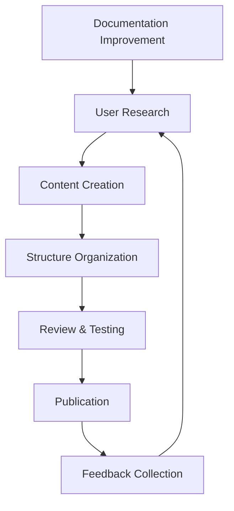

## Documentation Improvement Proposal

**Documentation Type**: [e.g., API Reference, User Guide, Tutorial, Technical Specification]
**Target Audience**: [e.g., Developers, End Users, System Administrators, Researchers]
**Improvement Type**: [e.g., New Content, Content Update, Reorganization, Examples]
**Priority**: [High/Medium/Low]

## Current Documentation State

**Existing Documentation**
- **Location**: [e.g., docs/users/quick-start.md, README.md, API docstrings]
- **Last Updated**: [Date or commit reference]
- **Current Quality**: [Brief assessment of current state]

**Identified Issues**
- [ ] Missing information or incomplete coverage
- [ ] Outdated examples or deprecated features
- [ ] Unclear explanations or confusing structure
- [ ] Lack of code examples or practical demonstrations
- [ ] Missing performance optimization guidelines
- [ ] Insufficient troubleshooting information
- [ ] Poor organization or navigation
- [ ] Technical inaccuracies or errors

**User Feedback**
```
# Include relevant user feedback, questions, or confusion points
"I couldn't figure out how to optimize database connections for my use case"
"The ML model configuration is unclear - need more examples"
"Performance tuning section needs practical benchmarks"
```

## Proposed Improvements

### Content Enhancements

**New Sections to Add**
- [ ] **Database Optimization Guide**: Performance tuning and connection pool configuration
- [ ] **ML Model Configuration**: Advanced model setup and customization
- [ ] **Performance Benchmarking**: How to measure and optimize system performance
- [ ] **Troubleshooting Guide**: Common issues and solutions
- [ ] **Advanced Use Cases**: Real-world implementation examples
- [ ] **Research Collaboration**: How to contribute to optimization research

**Content Updates Needed**
- [ ] Update API examples with latest syntax and features
- [ ] Refresh configuration examples with current best practices
- [ ] Add performance benchmarks showcasing 50.9% latency reduction
- [ ] Include database optimization research findings
- [ ] Update dependency versions and compatibility information

### Structure Improvements

**Current Structure Issues**
```
# Example of current confusing organization
docs/
├── users/
│   ├── quick-start.md (overlaps with README)
│   ├── advanced-cli-interface.md (missing examples)
│   └── troubleshooting.md (incomplete)
├── developers/
│   ├── api-reference.md (outdated)
│   └── architecture.md (missing diagrams)
```

**Proposed Structure**
```
# Improved organization with clear navigation
docs/
├── getting-started/
│   ├── quick-start.md (streamlined setup)
│   ├── basic-configuration.md (essential settings)
│   └── first-scrape.md (hands-on tutorial)
├── user-guides/
│   ├── web-scraping.md (comprehensive scraping guide)
│   ├── search-optimization.md (performance tuning)
│   ├── ml-model-configuration.md (AI/ML setup)
│   └── troubleshooting.md (common issues + solutions)
├── advanced/
│   ├── database-optimization.md (performance research)
│   ├── custom-integrations.md (extending the system)
│   ├── research-collaboration.md (contributing to research)
│   └── benchmarking-guide.md (performance measurement)
├── reference/
│   ├── api-reference.md (comprehensive API docs)
│   ├── configuration-schema.md (all config options)
│   ├── cli-commands.md (command reference)
│   └── performance-metrics.md (benchmark data)
```

### Specific Content Proposals

#### Database Optimization Documentation
```markdown
# Proposed content structure
## Database Performance Optimization

### Connection Pool Configuration
- Optimal pool sizing strategies
- ML-based scaling algorithms
- Performance monitoring setup
- Troubleshooting connection issues

### Research Findings
- 50.9% latency reduction techniques
- 887.9% throughput improvement methods
- Benchmarking methodologies
- Contributing to optimization research

### Practical Examples
```python
# Example configuration for high-performance setup
database_config = {
    "connection_pool": {
        "min_size": 5,
        "max_size": 50,
        "enable_ml_scaling": True,
        "scaling_algorithm": "adaptive_lstm"
    },
    "performance_monitoring": {
        "enable_metrics": True,
        "alert_thresholds": {
            "latency_ms": 100,
            "connection_usage": 0.8
        }
    }
}
```
```

#### ML Model Configuration Guide
```markdown
# Proposed advanced ML documentation
## Machine Learning Model Configuration

### Load Prediction Models
- Model selection criteria
- Training data requirements
- Hyperparameter optimization
- Performance evaluation metrics

### Custom Model Implementation
- Extending prediction algorithms
- Feature engineering strategies
- Model deployment and monitoring
- A/B testing frameworks

### Research Integration
- Contributing new models
- Sharing benchmark results
- Collaborative model development
```

### Code Examples and Tutorials

**Missing Code Examples**
- [ ] Complete setup walkthrough with real data
- [ ] Performance optimization step-by-step tutorial
- [ ] Database connection pool configuration examples
- [ ] ML model training and deployment examples
- [ ] Integration with popular frameworks (FastAPI, Django, etc.)
- [ ] Troubleshooting scenarios with solutions

**Interactive Examples**
```python
# Example: Complete performance optimization tutorial
import asyncio
from ai_docs_scraper import ScrapingConfig, PerformanceOptimizer

async def optimize_performance_tutorial():
    """
    Complete tutorial showing how to achieve 50%+ performance improvements
    using database optimization and ML-based scaling.
    """
    # Step 1: Configure optimal database settings
    config = ScrapingConfig(
        database={
            "connection_pool": {
                "min_size": 5,
                "max_size": 30,
                "enable_ml_scaling": True
            }
        }
    )
    
    # Step 2: Set up performance monitoring
    optimizer = PerformanceOptimizer(config)
    await optimizer.initialize_monitoring()
    
    # Step 3: Run benchmark comparison
    baseline_metrics = await optimizer.run_baseline_benchmark()
    optimized_metrics = await optimizer.run_optimized_benchmark()
    
    # Step 4: Analyze performance improvements
    improvement = optimizer.calculate_improvement(baseline_metrics, optimized_metrics)
    print(f"Latency reduction: {improvement.latency_reduction:.1%}")
    print(f"Throughput increase: {improvement.throughput_increase:.1%}")

# Run the tutorial
asyncio.run(optimize_performance_tutorial())
```

## Target Audience Analysis

### Primary Audiences

**Developers**
- **Needs**: Technical implementation details, API reference, code examples
- **Current Gaps**: Missing advanced configuration examples, performance optimization guides
- **Proposed Content**: Comprehensive API docs, integration tutorials, optimization guides

**System Administrators**
- **Needs**: Deployment guides, monitoring setup, troubleshooting information
- **Current Gaps**: Limited operational guidance, missing monitoring configuration
- **Proposed Content**: Operations manual, monitoring dashboards, troubleshooting playbook

**Researchers and Contributors**
- **Needs**: Research collaboration guides, benchmarking methodologies, contribution guidelines
- **Current Gaps**: No research collaboration documentation, limited performance analysis guides
- **Proposed Content**: Research contribution guide, benchmarking tutorials, optimization research documentation

**End Users**
- **Needs**: Quick start guides, common use cases, practical examples
- **Current Gaps**: Missing real-world examples, incomplete troubleshooting
- **Proposed Content**: Use case tutorials, troubleshooting guide, FAQ section

### Success Metrics

**User Experience Metrics**
- Time to first successful setup: Target <15 minutes
- Common questions resolution: 90% answered in documentation
- User onboarding completion rate: >85%
- Documentation search success rate: >90%

**Content Quality Metrics**
- Documentation coverage: All features documented
- Code example coverage: 100% of APIs have working examples
- Accuracy: Zero reported technical errors
- Freshness: All content updated within last 3 months

## Implementation Plan

### Phase 1: Content Audit and Planning (1 week)
- [ ] Complete audit of existing documentation
- [ ] Identify content gaps and user pain points
- [ ] Create detailed content outline and structure
- [ ] Prioritize content creation based on user needs

### Phase 2: High-Priority Content Creation (2-3 weeks)
- [ ] Write database optimization and performance guides
- [ ] Create ML model configuration documentation
- [ ] Develop comprehensive troubleshooting guide
- [ ] Add code examples for all major features

### Phase 3: Structure Reorganization (1 week)
- [ ] Implement new documentation structure
- [ ] Update navigation and cross-references
- [ ] Migrate existing content to new organization
- [ ] Test documentation website and links

### Phase 4: Advanced Content and Examples (2 weeks)
- [ ] Create advanced use case tutorials
- [ ] Develop research collaboration guides
- [ ] Add interactive examples and demos
- [ ] Write integration guides for popular frameworks

### Phase 5: Review and Polish (1 week)
- [ ] Technical review by domain experts
- [ ] User testing with target audiences
- [ ] Copy editing and style consistency
- [ ] Final testing of all examples and links

## Content Standards

### Writing Guidelines

**Style and Tone**
- Clear, concise, and professional
- Action-oriented with specific steps
- Include context and rationale for recommendations
- Use consistent terminology throughout

**Code Examples**
- All examples must be tested and working
- Include complete context (imports, setup, etc.)
- Provide both basic and advanced examples
- Add comments explaining key concepts

**Visual Elements**


### Quality Assurance

**Review Process**
- [ ] Technical accuracy review by maintainers
- [ ] User experience testing with target audiences
- [ ] Copy editing for clarity and consistency
- [ ] Link validation and example testing

**Maintenance Plan**
- Regular content audits every 3 months
- Automated link checking and example testing
- User feedback integration and response
- Version control for documentation changes

## Community Collaboration

### Contribution Guidelines

**Community Content Creation**
- [ ] Guidelines for community-contributed tutorials
- [ ] Review process for external contributions
- [ ] Recognition system for documentation contributors
- [ ] Templates for consistent content creation

**Feedback Integration**
- [ ] User feedback collection system
- [ ] Regular documentation surveys
- [ ] Issue tracking for documentation improvements
- [ ] Community discussion forums for documentation

### Localization and Accessibility

**Internationalization**
- [ ] Consider translation for major languages
- [ ] Cultural adaptation of examples and use cases
- [ ] International deployment and configuration guides

**Accessibility**
- [ ] Screen reader compatibility
- [ ] Clear heading structure and navigation
- [ ] Alt text for images and diagrams
- [ ] High contrast and readable formatting

## Success Measurement

### Quantitative Metrics

**Usage Analytics**
- Page views and time on page
- Search query success rates
- Documentation bounce rates
- User flow completion rates

**Support Impact**
- Reduction in support tickets for documented topics
- Self-service resolution rates
- Time to resolution for common issues

### Qualitative Feedback

**User Satisfaction**
- Documentation usefulness ratings
- Clarity and completeness feedback
- Specific improvement suggestions
- Overall user experience assessment

**Content Quality**
- Technical accuracy validation
- Code example success rates
- Tutorial completion rates
- Expert review feedback

## Additional Context

**Related Issues**
- #[issue-number]: [Related documentation issue]
- #[issue-number]: [User feedback or feature request]

**Supporting Evidence**
- User feedback: [Links to feedback or surveys]
- Usage analytics: [Current documentation metrics]
- Support data: [Common questions or issues]

**Resource Requirements**
- **Time**: Estimated 7-8 weeks for complete documentation overhaul
- **Skills**: Technical writing, domain expertise, user experience design
- **Tools**: Documentation platform, example testing framework, analytics tools

---

**For Contributors:**
- [ ] Review proposed documentation improvements
- [ ] Suggest additional content areas or improvements
- [ ] Volunteer to help with writing or review
- [ ] Provide feedback on structure and organization

**For Maintainers:**
- [ ] Evaluate documentation improvement proposal
- [ ] Assess resource requirements and timeline
- [ ] Approve for development or request modifications
- [ ] Assign to appropriate technical writers and reviewers