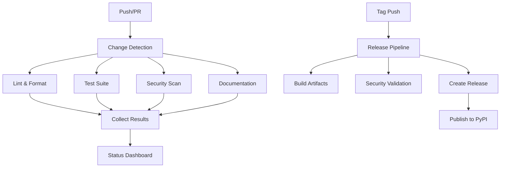

# 🚀 CI/CD Infrastructure

This directory contains the comprehensive GitHub Actions CI/CD pipelines for the AI Docs Vector DB Hybrid Scraper project.

## 📋 Workflows Overview

### Core CI/CD Pipelines

| Workflow | Purpose | Triggers |
|----------|---------|----------|
| **[ci.yml](workflows/ci.yml)** | Main CI pipeline with comprehensive testing | Push, PR to main/develop |
| **[security.yml](workflows/security.yml)** | Security scanning and vulnerability detection | Push, PR, daily schedule |
| **[docs.yml](workflows/docs.yml)** | Documentation validation and generation | Push/PR affecting docs |
| **[release.yml](workflows/release.yml)** | Automated release management | Version tags, manual dispatch |

### Automation & Maintenance

| Workflow | Purpose | Triggers |
|----------|---------|----------|
| **[labeler.yml](workflows/labeler.yml)** | Auto-label PRs and issues | PR/issue creation |
| **[stale.yml](workflows/stale.yml)** | Mark stale issues/PRs | Daily schedule |
| **[status-dashboard.yml](workflows/status-dashboard.yml)** | Update project status dashboard | Schedule, workflow completion |
| **[claude.yml](workflows/claude.yml)** | Claude Code integration | Issue/PR comments with @claude |

## 🔧 Configuration Files

### Core Configuration
- **[dependabot.yml](dependabot.yml)** - Automated dependency updates
- **[labeler.yml](labeler.yml)** - Auto-labeling rules for PRs
- **[markdown-link-check-config.json](markdown-link-check-config.json)** - Link validation settings

### Security
- **[../.gitleaks.toml](../.gitleaks.toml)** - GitLeaks secret detection configuration
- **[../.pre-commit-config.yaml](../.pre-commit-config.yaml)** - Pre-commit hooks setup

### Issue Templates
- **[ISSUE_TEMPLATE/ci-cd-issue.md](ISSUE_TEMPLATE/ci-cd-issue.md)** - Template for CI/CD related issues

## 🎯 CI Pipeline Features

### Main CI Pipeline (`ci.yml`)
- **Matrix Testing**: Python 3.11, 3.12, 3.13 across Ubuntu, Windows, macOS
- **Intelligent Change Detection**: Only runs relevant jobs based on file changes
- **Code Quality**: Ruff linting and formatting checks
- **Comprehensive Testing**: Unit and integration tests with coverage reporting
- **Dependency Caching**: Optimized with uv and GitHub Actions cache
- **Parallel Execution**: Jobs run concurrently for faster feedback
- **Coverage Thresholds**: Enforces minimum 80% code coverage

### Security Pipeline (`security.yml`)
- **Dependency Scanning**: pip-audit, Safety checks
- **Secret Detection**: TruffleHog, GitLeaks integration
- **SAST**: CodeQL static analysis
- **License Compliance**: Automated license checking
- **Container Security**: Trivy and Hadolint for Docker images

### Documentation Pipeline (`docs.yml`)
- **Markdown Validation**: Link checking and formatting
- **API Documentation**: Auto-generated API docs
- **Naming Conventions**: Kebab-case enforcement
- **Spell Checking**: Automated spell checking
- **Documentation Coverage**: Docstring coverage reporting

### Release Pipeline (`release.yml`)
- **Automated Versioning**: Semantic version management
- **Multi-format Builds**: Python packages and Docker images
- **Security Scanning**: Pre-release security validation
- **Changelog Generation**: Automated release notes
- **PyPI Publishing**: Automated package publishing
- **GitHub Releases**: Rich release creation with artifacts

## 🏷️ Auto-Labeling System

The labeler automatically applies labels based on:

- **File Paths**: Different areas of the codebase
- **PR Size**: xs, s, m, l, xl based on lines changed
- **Content Analysis**: Keywords in titles and descriptions
- **Conventional Commits**: feat, fix, docs, etc.

## 🔒 Branch Protection

Recommended branch protection rules for `main`:

```yaml
Required status checks:
  - lint-and-format
  - test (ubuntu-latest, 3.13)
  - build-test
  
Require branches to be up to date: true
Require review from code owners: true
Dismiss stale reviews: true
Require status checks to pass: true
Restrict pushes to matching branches: true
```

## 📊 Monitoring & Observability

- **Status Dashboard**: Real-time pipeline status in `.github/STATUS.md`
- **Coverage Badges**: Auto-updated coverage visualization
- **Artifact Management**: 30-day retention for build artifacts
- **Workflow Cleanup**: Automatic cleanup of old workflow runs

## 🚀 Getting Started

### For Contributors

1. **Install Pre-commit Hooks**:
   ```bash
   uv tool install pre-commit
   pre-commit install
   ```

2. **Run Tests Locally**:
   ```bash
   uv run pytest --cov=src
   ```

3. **Lint Code**:
   ```bash
   ruff check . --fix
   ruff format .
   ```

### For Maintainers

1. **Configure Secrets**:
   - `ANTHROPIC_API_KEY` - Claude Code integration
   - `PYPI_API_TOKEN` - PyPI publishing
   - `CODECOV_TOKEN` - Coverage reporting

2. **Enable Workflows**:
   - All workflows are enabled by default
   - Adjust schedules in workflow files as needed

3. **Branch Protection**:
   - Configure branch protection rules in repository settings
   - Require status checks from CI pipeline

## 🔄 Workflow Dependencies



## 📈 Performance Optimizations

- **Conditional Execution**: Jobs only run when relevant files change
- **Dependency Caching**: uv and pip caches for faster installs
- **Parallel Jobs**: Matrix builds run concurrently
- **Artifact Reuse**: Build once, test everywhere
- **Smart Scheduling**: Stale cleanup and status updates run off-peak

## 🤝 Contributing to CI/CD

When modifying workflows:

1. **Test Locally**: Use `act` or similar tools to test changes
2. **Small Changes**: Make incremental improvements
3. **Documentation**: Update this README for significant changes
4. **Validation**: Ensure YAML syntax is valid
5. **Security**: Review for secret exposure risks

## 📚 Additional Resources

- [GitHub Actions Documentation](https://docs.github.com/en/actions)
- [Conventional Commits](https://www.conventionalcommits.org/)
- [UV Documentation](https://docs.astral.sh/uv/)
- [Ruff Documentation](https://docs.astral.sh/ruff/)

---

*This CI/CD infrastructure follows enterprise-grade practices for reliability, security, and maintainability.*