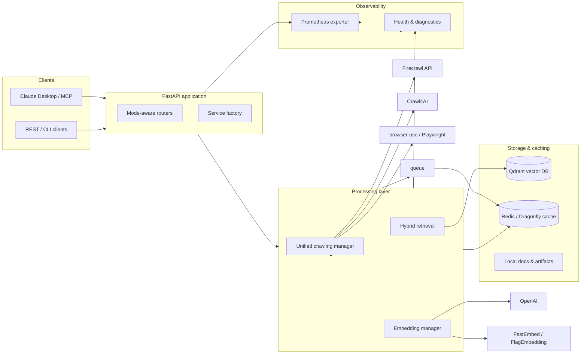

# AI Documentation Vector Database Hybrid Scraper


AI-focused documentation ingestion and retrieval stack that combines Firecrawl and
Crawl4AI powered scraping with a Qdrant vector database. The project exposes both
FastAPI and MCP interfaces, offers mode-aware configuration (solo developer vs
enterprise feature sets), and ships with tooling for embeddings, hybrid search,
retrieval-augmented generation (RAG) workflows, and operational monitoring.

## Overview

The system ingests documentation sources, generates dense and sparse embeddings,
stores them in Qdrant, and serves hybrid search and RAG building blocks. It is
built for AI engineers who need reliable documentation ingestion pipelines,
reproducible retrieval quality, and integration points for agents or
applications.

## Highlights

- Multi-tier crawling orchestration (`src/services/browser/unified_manager.py`)
  covering lightweight HTTP, Crawl4AI, browser-use, Playwright, and Firecrawl,
  plus a resumable bulk embedder CLI (`src/crawl4ai_bulk_embedder.py`).
- Hybrid retrieval stack leveraging OpenAI and FastEmbed embeddings, SPLADE
  sparse vectors, reranking, and HyDE augmentation through the modular Qdrant
  service (`src/services/vector_db/` and `src/services/hyde/`).
- Dual interfaces: REST endpoints in FastAPI (`src/api/routers/simple/`) and a
  FastMCP server (`src/unified_mcp_server.py`) that registers search, document
  management, analytics, and content intelligence tools for Claude Desktop /
  Code.
- Built-in API hardening with SlowAPI-powered global rate limiting configured
  through the `SecurityConfig` model and middleware stack.
- Observability built in: OpenTelemetry tracing, structured logging, health
  checks, optional Dragonfly cache, and `/metrics` exposure via
  `prometheus-fastapi-instrumentator` (`src/services/observability/`).
- Developer ergonomics with uv-managed environments, dependency-injector driven
  service wiring, Ruff + pytest quality gates, and a unified developer CLI
  (`scripts/dev.py`).

## Table of Contents

- [Overview](#overview)
- [Highlights](#highlights)
- [Architecture](#architecture)
- [Core Components](#core-components)
- [Quick Start](#quick-start)
  - [Prerequisites](#prerequisites)
  - [Environment variables](#environment-variables)
  - [Clone & Install](#clone--install)
  - [Run the FastAPI application](#run-the-fastapi-application)
  - [Run the MCP server](#run-the-mcp-server)
  - [Bulk ingestion CLI](#bulk-ingestion-cli)
  - [Docker Compose](#docker-compose)
- [Configuration](#configuration)
- [Testing & Quality](#testing--quality)
- [Documentation & Resources](#documentation--resources)
- [Contributing](#contributing)
- [License](#license)

## Architecture



## Core Components

### Infrastructure Orchestration

- `ApplicationContainer` (`src/infrastructure/container.py`) is the single source
  of truth for wiring clients (OpenAI, Qdrant, Redis, Firecrawl), caches, vector
  storage, crawling, embeddings, monitoring, and RAG helpers. Runtime surfaces pull
  dependencies from the container using `dependency-injector` providers rather than
  instantiating bespoke managers.
- Service initialization is coordinated through container lifecycle hooks with
  deterministic startup/shutdown ordering, ensuring shared resources (HTTP sessions,
  vector stores, MCP sessions, monitoring tasks) are initialised once and cleaned up
  safely.

### Crawling & Ingestion

- UnifiedBrowserManager selects the right automation tier and tracks quality metrics.
- Firecrawl and Crawl4AI adapters plus browser-use / Playwright integrations cover static and dynamic sites.
- `src/crawl4ai_bulk_embedder.py` streams bulk ingestion, chunking, and embedding into Qdrant with resumable state and progress reporting.
- `docs/users/web-scraping.md` and `docs/users/examples-and-recipes.md` include tier selection guidance and code samples.

### Vector Search & Retrieval

- `src/services/vector_db/` wraps collection management, hybrid search orchestration, adaptive fusion, and payload indexing.
- Dense embeddings via OpenAI or FastEmbed, optional sparse vectors via SPLADE, and reranking hooks are configurable through Pydantic models (`src/config/models.py`).
- HyDE augmentation and caching live under `src/services/hyde/`, enabling query expansion for RAG pipelines.
- Search responses return timing, scoring metadata, and diagnostics suitable for observability dashboards.

### Caching

- The unified `CacheManager` (`src/services/cache/manager.py`) fronts all L1/L2 storage, hashing keys and enforcing TTL policies for Dragonfly/Redis and the local persistent tier.
- Specialized helpers such as the HyDE cache now depend on `CacheManager`, ensuring a single entry point for embeddings, search results, and warm-up flows.
- Configure cache URLs, prefixes, and TTLs via the cache models in `src/config/models.py`; the manager automatically wires Prometheus metrics when enabled.

### Interfaces & Tooling

- FastAPI routes (`/api/v1/search`, `/api/v1/documents`, `/api/v1/collections`) expose the core ingestion and retrieval capabilities.
- The FastMCP server (`src/unified_mcp_server.py`) registers search, document, embedding, scraping, analytics, cache, and content intelligence tool modules (`src/mcp_tools/`).
- Developer CLI (`scripts/dev.py`) manages services, testing profiles, benchmarks, linting, and type checking.
- Example notebooks and scripts under `examples/` demonstrate agentic RAG flows and advanced search orchestration.

### Observability & Operations

- `/metrics` endpoints are exposed through
  `prometheus-fastapi-instrumentator`, while OpenTelemetry spans capture
  embedding, cache, and RAG pipeline telemetry; see
  `docs/observability/embeddings_telemetry.md` and
  `docs/operators/monitoring.md` for configuration details.
- Health probes for system resources, Qdrant, Redis, and external services are centrally coordinated by the `HealthCheckManager` (`src/services/health/manager.py`), ensuring MCP tools and FastAPI dependencies share the same health state.
- Optional Dragonfly cache, PostgreSQL, ARQ workers, and Grafana dashboards are provisioned via `docker-compose.yml` profiles.
- Structured logging and SlowAPI-based rate limiting are configured through the middleware manager (`src/services/fastapi/middleware/manager.py`) and security helpers (`src/services/fastapi/middleware/security.py`).

#### AI Telemetry Quickstart

1. Enable OTLP export (set in `.env` or deployment secrets):
   ```bash
   export OTEL_EXPORTER_OTLP_ENDPOINT="http://localhost:4317"
   export OTEL_EXPORTER_OTLP_HEADERS="Authorization=Bearer <token>"
   ```
2. Run an OpenTelemetry Collector that forwards spans/metrics to your backend:
   ```yaml
   receivers:
     otlp:
       protocols:
         grpc:
         http:
   processors:
     batch: {}
   exporters:
     prometheus:
       endpoint: "0.0.0.0:9464"
     otlp:
       endpoint: "https://observability.example.com:4317"
       headers:
         authorization: "Bearer ${OBSERVABILITY_API_TOKEN}"
   service:
     pipelines:
       metrics:
         receivers: [otlp]
         processors: [batch]
         exporters: [prometheus, otlp]
       traces:
         receivers: [otlp]
         processors: [batch]
         exporters: [otlp]
   ```
3. Scrape `/metrics` with Prometheus (the collector exposes the OTLP pipeline
   to Prometheus in the example above). Helpful PromQL snippets:
   ```promql
   sum by (model) (rate(ai_operation_tokens{operation="embedding"}[5m]))
   sum by (operation) (increase(ai_operation_cost[1h]))
   histogram_quantile(
     0.95,
     sum by (le) (rate(ai_operation_duration_bucket{operation="embedding"}[5m]))
   )
   ```
4. Trace dashboards can group spans with `gen_ai.operation.name`,
   `gen_ai.request.model`, and `gen_ai.usage.*` attributes to visualize
   synchronous embeds versus asynchronous batch jobs.

### Security & Validation

- `src/security/ml_security.py` provides the consolidated `MLSecurityValidator` for URL, query, and filename validation alongside dependency and container scanning hooks.
- FastAPI and MCP flows use the shared validator via dependency helpers, ensuring a single source of truth for sanitization and auditing logic.
- Rate limiting defaults (`default_rate_limit`, `rate_limit_window`, optional Redis storage) are controlled through `SecurityConfig` and applied via the global SlowAPI limiter.

## Quick Start

### Prerequisites

- Python 3.11 (or 3.12) and [uv](https://github.com/astral-sh/uv) for dependency management.
- A running Qdrant instance (local Docker welcome: `docker compose --profile simple up -d qdrant`).
- API keys for the providers you plan to use (e.g., `OPENAI_API_KEY`, `AI_DOCS__FIRECRAWL__API_KEY`).

### Environment variables

| Variable | Purpose | Example |
| --- | --- | --- |
| `AI_DOCS__MODE` | Selects simple or enterprise service wiring. | `AI_DOCS__MODE=enterprise` |
| `AI_DOCS__QDRANT__URL` | Points services at your Qdrant instance. | `http://localhost:6333` |
| `OPENAI_API_KEY` | Enables OpenAI embeddings and HyDE prompts. | `sk-...` |
| `AI_DOCS__FIRECRAWL__API_KEY` | Authenticates Firecrawl API usage. | `fc-...` |
| `AI_DOCS__CACHE__REDIS_URL` | Enables Dragonfly/Redis caching layers. | `redis://localhost:6379` |
| `FASTMCP_TRANSPORT` | Chooses MCP transport (`streamable-http` or `stdio`). | `streamable-http` |
| `FASTMCP_HOST` / `FASTMCP_PORT` | Hostname and port for MCP HTTP transport. | `0.0.0.0` / `8001` |
| `FASTMCP_BUFFER_SIZE` | Tunes MCP stream buffer size (bytes). | `8192` |

Store secrets in a `.env` file or your secrets manager and export them before
running the services.

### Clone & Install

```bash
git clone https://github.com/BjornMelin/ai-docs-vector-db-hybrid-scraper
cd ai-docs-vector-db-hybrid-scraper
uv sync --dev
```

### Run the FastAPI application

```bash
# Ensure Qdrant is reachable at http://localhost:6333
export OPENAI_API_KEY="sk-..."                 # optional if using OpenAI
export AI_DOCS__FIRECRAWL__API_KEY="fc-..."    # optional but recommended
uv run python -m src.api.main
```

Visit `http://localhost:8000/docs` for interactive OpenAPI docs. Default mode is `simple`; set `AI_DOCS__MODE=enterprise` to enable the enterprise service stack.

### Run the MCP server

```bash
uv run python src/unified_mcp_server.py
```

The server validates configuration on startup and registers the available MCP tools. Configure Claude Desktop / Code with the generated transport details (see `config/claude-mcp-config.example.json`).
1. Copy `config/claude-mcp-config.example.json` to your Claude settings directory
   and update the `command` field if you use a virtual environment wrapper.
2. If you prefer HTTP transport, export `FASTMCP_TRANSPORT=streamable-http` and
   set `FASTMCP_HOST`/`FASTMCP_PORT` to match the values referenced in the
   Claude config.
3. Restart Claude Desktop / Code so it reloads the MCP manifest and tool list.

### Bulk ingestion CLI

```bash
uv run python src/crawl4ai_bulk_embedder.py --help
```

Use CSV/JSON/TXT URL lists to scrape, chunk, embed, and upsert into Qdrant with resumable checkpoints.

### Docker Compose

- Simple profile (API + Qdrant): `docker compose --profile simple up -d`
- Enterprise profile (adds Dragonfly, PostgreSQL, worker, Prometheus, Grafana): `docker compose --profile enterprise up -d`

Stop with `docker compose down` when finished.

## Configuration

- Configuration is defined with Pydantic models in `src/config/models.py` and can be overridden via environment variables (`AI_DOCS__*`) or YAML files in `config/templates/`.
- Mode-aware settings enable or disable services such as advanced caching, A/B testing, and observability.
- Detailed configuration guidance lives in `docs/developers/setup-and-configuration.md` and operator runbooks under `docs/operators/`.

## Testing & Quality

```bash
# Quick unit + fast integration tests
python scripts/dev.py test --profile quick

# Full suite with coverage (mirrors CI)
python scripts/dev.py test --profile ci

# Lint, format, type-check, and tests in one pass
python scripts/dev.py quality
```

Performance and benchmark suites are available via `python scripts/dev.py benchmark`, and chaos-focused stress suites live under `tests/` with dedicated markers.

## Documentation & Resources

- User guides: `docs/users/` (quick start, search, scraping recipes, troubleshooting).
- Developer deep dives: `docs/developers/` (API reference, integration, architecture).
- Operator handbook: `docs/operators/` (deployment, monitoring, security).
- Research notes and experiments: `docs/research/`.

Publishable MkDocs output is generated under `site/` when running the documentation pipeline.

## Contributing

Contributions are welcome. Read the [CONTRIBUTING.md](CONTRIBUTING.md) guide for
development workflow, coding standards, and review expectations. Please include
tests and documentation updates with feature changes. If this stack accelerates
your RAG pipelines, consider starring the repository so other developers can
discover it.

## License

Released under the [MIT License](LICENSE).
