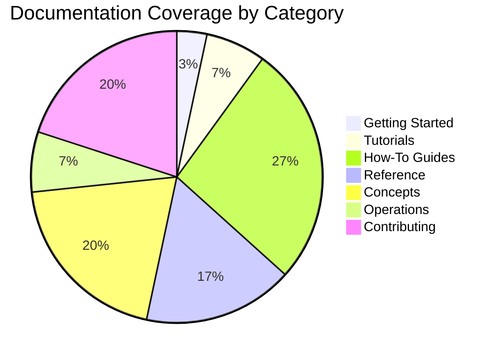

# AI Documentation Vector DB - Documentation Hub

> **Navigation Guide**: Find exactly what you need with our organized documentation structure  
> **Status**: ✅ Complete V1 implementation with comprehensive guides  
> **Last Updated**: 2025-01-09

## 🎯 Quick Navigation

### 🚀 Get Started in 5 Minutes
- [**Quick Start Guide**](./getting-started/quick-start.md) - Installation, setup, and first steps
- [**Project Overview**](../README.md) - Features, architecture, and capabilities

### 📖 Learning Path

Choose your learning approach based on the Diátaxis framework:

#### 📚 **Tutorials** (Learning-Oriented)
Start here if you're new to the project:
- [Quick Start](./getting-started/quick-start.md) - Your first AI documentation vector DB
- [Browser Automation Tutorial](./tutorials/browser-automation.md) - Master the 5-tier system
- [Crawl4AI Tutorial](./tutorials/crawl4ai-setup.md) - Web scraping with Crawl4AI

#### 🛠️ **How-To Guides** (Task-Oriented)
Solve specific problems:

**Implement Search**:
- [Advanced Search](./how-to-guides/implement-search/advanced-search.md) - Multi-stage hybrid search
- [HyDE Enhancement](./how-to-guides/implement-search/hyde-enhancement.md) - Query expansion
- [Add Reranking](./how-to-guides/implement-search/add-reranking.md) - BGE reranking

**Process Documents**:
- [Chunking Guide](./how-to-guides/process-documents/chunking-guide.md) - Smart document splitting
- [Embedding Models](./how-to-guides/process-documents/embedding-models.md) - Multi-model support

**Optimize Performance**:
- [Vector DB Tuning](./how-to-guides/optimize-performance/vector-db-tuning.md) - Qdrant optimization
- [Performance Guide](./how-to-guides/optimize-performance/performance-guide.md) - System optimization
- [Monitoring](./how-to-guides/optimize-performance/monitoring.md) - Metrics and observability

**Deploy & Scale**:
- [Canary Deployment](./how-to-guides/deploy/canary-deployment.md) - Safe rollouts
- [Deployment Options](./how-to-guides/deploy/deployment-options.md) - Production configurations

#### 📋 **Reference** (Information-Oriented)
Look up specific details:

**API Documentation**:
- [REST API](./reference/api/rest-api.md) - Complete API documentation
- [Browser API](./reference/api/browser-api.md) - Automation endpoints

**Configuration**:
- [Config Schema](./reference/configuration/config-schema.md) - All config options

**MCP Tools**:
- [MCP Overview](./reference/mcp-tools/README.md) - Model Context Protocol server
- [Setup Guide](./reference/mcp-tools/setup.md) - Configuration and deployment
- [Migration Guide](./reference/mcp-tools/migration-guide.md) - Upgrading to unified server

#### 🧠 **Concepts** (Understanding-Oriented)
Understand the why and how:

**Architecture**:
- [System Overview](./concepts/architecture/system-overview.md) - High-level architecture
- [V1 Architecture](./concepts/architecture/v1-architecture.md) - Component synergy
- [Browser Architecture](./concepts/architecture/browser-architecture.md) - 5-tier scraping system
- [Scraping Architecture](./concepts/architecture/scraping-architecture.md) - Scraping patterns
- [Client Management](./concepts/architecture/client-management.md) - Singleton patterns

**Features**:
- [Chunking Theory](./concepts/features/chunking-theory.md) - AST-based chunking deep dive

## 📚 Directory Structure

```
docs/
├── getting-started/        # New user onboarding
├── tutorials/             # Hands-on learning
├── how-to-guides/         # Task-oriented solutions
│   ├── implement-search/  # Search implementation
│   ├── process-documents/ # Document processing
│   ├── optimize-performance/ # Performance tuning
│   └── deploy/           # Deployment guides
├── reference/            # Information lookup
│   ├── api/             # API documentation
│   ├── configuration/   # Config reference
│   └── mcp-tools/      # MCP server docs
├── concepts/            # Understanding-oriented
│   ├── architecture/   # System design
│   └── features/      # Feature concepts
├── operations/         # Ops & maintenance
│   ├── monitoring/    # Monitoring & troubleshooting
│   └── maintenance/   # Maintenance tasks
├── contributing/      # For contributors
└── archive/          # Historical documentation
```

## 🎯 Quick Links by Goal

### "I want to..."

#### 🚀 **Get Started**
- Install the project → [Quick Start](./getting-started/quick-start.md)
- Understand the architecture → [System Overview](./concepts/architecture/system-overview.md)
- See what's possible → [MCP Tools Overview](./reference/mcp-tools/README.md)

#### 🛠️ **Build Something**
- Add search to my app → [Advanced Search](./how-to-guides/implement-search/advanced-search.md)
- Scrape websites → [Browser Automation](./tutorials/browser-automation.md)
- Process documents → [Chunking Guide](./how-to-guides/process-documents/chunking-guide.md)

#### 🔧 **Optimize & Deploy**
- Improve performance → [Performance Guide](./how-to-guides/optimize-performance/performance-guide.md)
- Deploy safely → [Canary Deployment](./how-to-guides/deploy/canary-deployment.md)
- Monitor production → [Monitoring](./how-to-guides/optimize-performance/monitoring.md)

#### 🐛 **Debug & Fix**
- Troubleshoot errors → [Troubleshooting](./operations/monitoring/troubleshooting.md)
- Understand logs → [Monitoring](./how-to-guides/optimize-performance/monitoring.md)
- Test thoroughly → [Testing Guide](./contributing/testing-guide.md)

## 📊 Documentation Coverage



## 🗂️ Archive

Historical and research documentation:

- [**`archive/consolidated/`**](archive/consolidated/) - Pre-V1 documentation
- [**`archive/research-v1/`**](archive/research-v1/) - V1 research and analysis
- [**`archive/refactor-v1/`**](archive/refactor-v1/) - V1 refactor planning docs
- [**`archive/sprint-2025-05/`**](archive/sprint-2025-05/) - Completed sprint docs
- [**`archive/mcp-legacy/`**](archive/mcp-legacy/) - Pre-unified MCP docs

## 📝 Documentation Standards

All docs follow these conventions:

```markdown
# Document Title

> **Status**: Current/Planning/Deprecated  
> **Last Updated**: YYYY-MM-DD  
> **Related**: [Links to related docs]

## Overview
Brief description of what this document covers...
```

## 🔄 Recent Updates

- **2025-01-09**: Complete documentation restructuring with audience-based organization
- **2025-01-09**: Implemented kebab-case naming convention across all files
- **2025-06-06**: Documentation reorganization and cleanup
- **2025-06-06**: V1 implementation complete with all features

## 🤝 Contributing

To improve documentation:

1. Follow the [file naming guidelines](./file-naming-guidelines.md)
2. Use the [document template](./document-template.md)
3. Update the appropriate category
4. Add cross-references to related docs
5. Update this index if adding new directories

---

**Need help?** Check [Troubleshooting](./operations/monitoring/troubleshooting.md) or open an [issue](https://github.com/BjornMelin/ai-docs-vector-db-hybrid-scraper/issues).