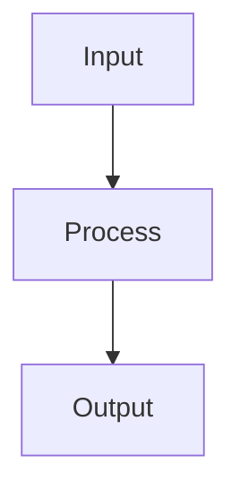

# Document Template

> **Status**: Template  
> **Last Updated**: 2025-01-09  
> **Purpose**: Standardized template for all documentation

## Document Header Template

Every documentation file should start with this header:

```markdown
# Document Title

> **Status**: Current/Planning/Deprecated  
> **Last Updated**: YYYY-MM-DD  
> **Purpose**: Brief description of document purpose  
> **Audience**: Target audience (e.g., "Developers", "System administrators")  
> **Related**: [Links to related documents]

## Overview
Brief description of what this document covers...
```

## Document Type Templates

### 📚 Tutorial Template
For learning-oriented documentation:

```markdown
# Tutorial Title

> **Status**: Current  
> **Last Updated**: YYYY-MM-DD  
> **Purpose**: Learn X by building Y  
> **Audience**: Users who learn by doing  
> **Difficulty**: Beginner/Intermediate/Advanced  
> **Time**: Estimated completion time

## Prerequisites
- Required knowledge
- Tools needed
- System requirements

## What You'll Build
Clear description of the end result

## Step-by-Step Instructions

### Step 1: Setup
Detailed instructions...

### Step 2: Implementation
Detailed instructions...

### Step 3: Testing
Verification steps...

## Expected Outcome
What users should have accomplished

## Next Steps
- [Related Tutorial](link)
- [How-to Guide](link)
- [Reference](link)

## Troubleshooting
Common issues and solutions
```

### 🛠️ How-To Guide Template
For task-oriented documentation:

```markdown
# How to Accomplish X

> **Status**: Current  
> **Last Updated**: YYYY-MM-DD  
> **Purpose**: Solve specific problem X  
> **Audience**: Developers with specific goals  
> **Difficulty**: Beginner/Intermediate/Advanced

## Problem
Clear description of what this solves

## Solution Overview
Brief summary of the approach

## Prerequisites
- Required knowledge
- System requirements
- Dependencies needed

## Step-by-Step Instructions

### Step 1: [Action]
Specific instructions...

**Example:**
```code
example code here
```

### Step 2: [Action]
Specific instructions...

## Verification
How to confirm it worked

## Troubleshooting
Common issues and solutions

## Related Documentation
- 🧠 [Concepts](../concepts/) - Understanding the why
- 📋 [Reference](../reference/) - Technical details
- 🚀 [Tutorials](../tutorials/) - Learning guides
```

### 📋 Reference Template
For information-oriented documentation:

```markdown
# Reference Title

> **Status**: Current  
> **Last Updated**: YYYY-MM-DD  
> **Purpose**: Complete reference for X  
> **Audience**: Developers needing specific details

## Overview
Brief description of what this reference covers

## API/Configuration/Function Reference

### Function/Endpoint Name

**Description**: What it does

**Parameters**:
- `param1` (type): Description
- `param2` (type, optional): Description

**Returns**: Description of return value

**Example**:
```code
example usage
```

**Error Codes**:
- `ERROR_CODE`: Description

## Related Documentation
- 🛠️ [How-to Guides](../how-to-guides/) - Implementation examples
- 🧠 [Concepts](../concepts/) - Understanding concepts
```

### 🧠 Concept Template
For understanding-oriented documentation:

```markdown
# Concept Title

> **Status**: Current  
> **Last Updated**: YYYY-MM-DD  
> **Purpose**: Explain the concept of X  
> **Audience**: Developers wanting to understand the why

## Overview
What this concept is and why it matters

## The Problem
What problem does this concept solve?

## The Solution
How does this concept address the problem?

## Key Principles
1. **Principle 1**: Explanation
2. **Principle 2**: Explanation
3. **Principle 3**: Explanation

## How It Works
Detailed explanation with diagrams where helpful



## Design Decisions
Why was it designed this way?

## Trade-offs
Benefits and limitations

## Examples
Real-world usage examples

## Related Documentation
- 🛠️ [Implementation](../how-to-guides/) - How to use this concept
- 📋 [Reference](../reference/) - Technical specifications
```

## File Naming Conventions

- Use **kebab-case** for all files: `advanced-search-implementation.md`
- Be descriptive but concise: `browser-automation-tutorial.md`
- Include document type in name when helpful: `api-reference.md`

## Content Guidelines

### Writing Style
- **Clear and concise** - Avoid unnecessary words
- **Action-oriented** - Use active voice
- **Scannable** - Use headers, bullets, and short paragraphs
- **Consistent** - Follow established patterns

### Code Examples
- Include working code examples
- Test all code before publishing
- Use syntax highlighting
- Provide context and explanation

### Links and References
- Use descriptive link text
- Include emoji icons for document types (🚀📋🧠🛠️)
- Cross-reference related documentation
- Keep links relative within docs

## Quality Standards

### Before Publishing
- [ ] Header template complete
- [ ] Content follows appropriate template
- [ ] All links tested and working
- [ ] Code examples tested
- [ ] Spelling and grammar checked
- [ ] Status and date updated

### Review Checklist
- [ ] Purpose and audience clear
- [ ] Content matches document type
- [ ] Examples are practical and tested
- [ ] Cross-references helpful and accurate
- [ ] Follows naming conventions