# 5-Tier Browser Automation & Web Scraping Architecture

> **Status**: Active - Core Architecture  
> **Last Updated**: 2025-01-25  
> **Purpose**: Documents the complete 5-tier browser automation system  
> **Audience**: Developers, architects, and contributors

This document provides comprehensive documentation of the 5-tier browser automation and web scraping architecture that forms the backbone of the AI Documentation Vector DB system.

## 🏗️ Architecture Overview

The system implements an intelligent 5-tier hierarchy for browser automation and web scraping, automatically selecting the optimal approach based on content complexity, requirements, and performance characteristics.

```mermaid
flowchart TD
    A["🌐 URL Request"] --> B["🎯 AutomationRouter"]
    B --> C{"Intelligent Tier Selection"}

    C -->|Tier 0| D1["⚡ Lightweight HTTP<br/>httpx + BeautifulSoup<br/>5-10x faster for static content<br/>$0 cost"]
    C -->|Tier 1| D2["🕷️ Crawl4AI Basic<br/>Standard browser automation<br/>Dynamic content handling<br/>$0 cost"]
    C -->|Tier 2| D3["🔧 Crawl4AI Enhanced<br/>Custom JavaScript execution<br/>Interactive content<br/>$0 cost"]
    C -->|Tier 3| D4["🤖 Browser-use AI<br/>Multi-LLM reasoning<br/>Complex interactions<br/>API usage cost"]
    C -->|Tier 4| D5["🎭 Playwright + Firecrawl<br/>Maximum control<br/>Auth + complex workflows<br/>API usage cost"]

    D1 --> E["📄 Unified Content Output"]
    D2 --> E
    D3 --> E
    D4 --> E
    D5 --> E

    classDef tier0 fill:#e8f5e8,stroke:#2e7d32,stroke-width:3px
    classDef tier1 fill:#e3f2fd,stroke:#1565c0,stroke-width:3px
    classDef tier2 fill:#fff3e0,stroke:#f57c00,stroke-width:3px
    classDef tier3 fill:#f3e5f5,stroke:#7b1fa2,stroke-width:3px
    classDef tier4 fill:#ffebee,stroke:#c62828,stroke-width:3px

    class D1 tier0
    class D2 tier1
    class D3 tier2
    class D4 tier3
    class D5 tier4
```



## 🎯 Tier-by-Tier Breakdown

### Tier 0: Lightweight HTTP Scraper
**Implementation**: `src/services/browser/lightweight_scraper.py`

**Purpose**: Ultra-fast scraping for static content with minimal overhead

**Characteristics**:
- **Speed**: 5-10x faster than browser automation
- **Cost**: $0 (no external APIs)
- **Best For**: Static HTML, documentation sites, simple content
- **Technology**: httpx + BeautifulSoup + readability

**Selection Criteria**:
```python
# Auto-selected for:
- Static file extensions (.md, .txt, .json, .xml, .csv)
- Simple documentation sites
- Content without JavaScript requirements
- When interaction_required=False
```

**Performance**:
- Average response time: 0.2-0.8s
- Memory usage: Very low
- Concurrency: High (100+ simultaneous requests)

### Tier 1: Crawl4AI Basic
**Implementation**: `src/services/browser/crawl4ai_adapter.py`

**Purpose**: Standard browser automation for dynamic content

**Characteristics**:
- **Speed**: 4-6x faster than traditional automation
- **Cost**: $0 (no external APIs)
- **Best For**: 90% of modern websites, dynamic content
- **Technology**: Crawl4AI with Playwright backend

**Selection Criteria**:
```python
# Default tier for most content when:
- Dynamic content detected
- JavaScript execution needed
- Standard web applications
- No complex interactions required
```

**Performance**:
- Average response time: 2-5s
- Memory usage: Moderate
- Concurrency: Medium (5-15 simultaneous sessions)

### Tier 2: Crawl4AI Enhanced
**Implementation**: `src/services/browser/crawl4ai_adapter.py` (enhanced mode)

**Purpose**: Interactive content with custom JavaScript execution

**Characteristics**:
- **Speed**: 3-4x faster than manual automation
- **Cost**: $0 (no external APIs)
- **Best For**: Interactive elements, complex SPAs, expandable content
- **Technology**: Crawl4AI with advanced JavaScript

**Selection Criteria**:
```python
# Selected for:
- URLs with SPA patterns (react, vue, angular, app)
- Interactive requirements detected
- Expandable/collapsible content
- Tab-based interfaces
```

**Enhanced Features**:
```javascript
// Automated lazy loading handling
// Dynamic content expansion
// Tab content extraction
// Accordion/collapsible handling
// Advanced scroll patterns
```

### Tier 3: Browser-use AI
**Implementation**: `src/services/browser/browser_use_adapter.py`

**Purpose**: AI-powered automation for complex interactions

**Characteristics**:
- **Speed**: Variable (1-10s depending on task complexity)
- **Cost**: API usage-based (OpenAI, Anthropic, Gemini)
- **Best For**: Complex interactions, reasoning required, adaptive behavior
- **Technology**: Browser-use with multi-LLM support

**Selection Criteria**:
```python
# Selected for:
- Sites requiring complex reasoning
- Authentication workflows
- Multi-step interactions
- Error recovery scenarios
- Natural language task descriptions
```

**AI Capabilities**:
- Self-correcting behavior
- Adaptive interaction strategies
- Natural language task processing
- Multi-LLM provider support (OpenAI, Anthropic, Gemini)

### Tier 4: Playwright + Firecrawl
**Implementation**: `src/services/browser/playwright_adapter.py` + Firecrawl integration

**Purpose**: Maximum control for complex workflows and API fallback

**Characteristics**:
- **Speed**: Variable (2-15s for complex workflows)
- **Cost**: API usage for Firecrawl
- **Best For**: Authentication, complex workflows, API fallback
- **Technology**: Native Playwright + Firecrawl API

**Selection Criteria**:
```python
# Selected for:
- Authentication required
- Complex multi-page workflows
- Maximum control needed
- Firecrawl API fallback scenarios
```

## 🧠 Intelligent Routing Logic

### AutomationRouter Selection Algorithm


### Domain-Specific Rules

```python
# Configuration: config/browser-routing-rules.json
{
  "routing_rules": {
    "browser_use": [
      "vercel.com", "clerk.com", "supabase.com",
      "react.dev", "nextjs.org", "docs.anthropic.com"
    ],
    "playwright": [
      "github.com", "stackoverflow.com", "discord.com",
      "notion.so", "app.posthog.com"
    ]
  }
}
```

### Performance-Based Learning

```python
class AutomationRouter:
    def get_recommended_tool(self, url: str) -> str:
        """Performance-based tool recommendation."""
        base_tool = await self._select_tool(url, False, None)
        metrics = self.get_metrics()
        
        # Switch if success rate < 80%
        if metrics[base_tool]["success_rate"] < 0.8:
            return self._find_best_performing_tool()
        
        return base_tool
```

## 🔄 Fallback Strategy

### Automatic Tier Escalation


### Fallback Order Matrix

```python
FALLBACK_MATRIX = {
    "lightweight": ["crawl4ai", "browser_use", "playwright"],
    "crawl4ai": ["crawl4ai_enhanced", "browser_use", "playwright"],
    "crawl4ai_enhanced": ["browser_use", "playwright"],
    "browser_use": ["playwright", "crawl4ai_enhanced"],
    "playwright": ["browser_use", "crawl4ai"]
}
```

## 📊 Integration with Vector Pipeline

### Content Processing Flow


### Unified Content Format

```python
class UnifiedScrapingResponse(BaseModel):
    success: bool
    content: str
    url: str
    title: str
    metadata: Dict[str, Any]
    
    # Tier execution details
    tier_used: str
    execution_time_ms: float
    fallback_attempted: bool
    quality_score: float
    
    # Error handling
    error: Optional[str]
    failed_tiers: List[str]
```

## 🏗️ Key Implementation Files

### Core Router
- **`src/services/browser/automation_router.py`**: Main routing logic and tier selection
- **`src/services/browser/unified_manager.py`**: Unified interface and orchestration

### Tier Implementations
- **`src/services/browser/lightweight_scraper.py`**: Tier 0 - HTTP scraping
- **`src/services/browser/crawl4ai_adapter.py`**: Tier 1 & 2 - Browser automation
- **`src/services/browser/browser_use_adapter.py`**: Tier 3 - AI automation
- **`src/services/browser/playwright_adapter.py`**: Tier 4 - Maximum control

### Supporting Infrastructure
- **`src/services/browser/monitoring.py`**: Performance monitoring
- **`src/services/cache/browser_cache.py`**: Intelligent caching
- **`src/infrastructure/client_manager.py`**: Service orchestration

## 🚀 Performance Characteristics

### Speed Comparison

| Tier | Tool | Avg Time | Best For | Cost |
|------|------|----------|----------|------|
| 0 | Lightweight | 0.2-0.8s | Static content | $0 |
| 1 | Crawl4AI Basic | 2-5s | Dynamic content | $0 |
| 2 | Crawl4AI Enhanced | 3-6s | Interactive content | $0 |
| 3 | Browser-use AI | 3-10s | Complex interactions | API usage |
| 4 | Playwright + Firecrawl | 5-15s | Maximum control | API usage |

### Success Rates by Content Type

```
Static Documentation:    Tier 0: 95% | Tier 1: 98%
Dynamic SPAs:           Tier 1: 85% | Tier 2: 92%
Interactive Content:    Tier 2: 88% | Tier 3: 94%
Complex Workflows:      Tier 3: 89% | Tier 4: 96%
```

## 🔧 Configuration & Customization

### Tier-Specific Configuration

```python
# config/core.py
class BrowserConfig(BaseModel):
    # Tier routing preferences
    prefer_lightweight: bool = True
    enable_ai_fallback: bool = True
    max_fallback_attempts: int = 3
    
    # Performance tuning
    lightweight_timeout: int = 10
    crawl4ai_timeout: int = 30
    browser_use_timeout: int = 60
    playwright_timeout: int = 90
```

### Custom Routing Rules

```json
{
  "routing_rules": {
    "browser_use": ["complex-spa.com", "interactive-docs.com"],
    "playwright": ["auth-required.com", "complex-workflow.com"],
    "lightweight": ["static-docs.com", "simple-api.com"]
  },
  "performance_thresholds": {
    "success_rate_minimum": 0.8,
    "avg_time_maximum_ms": 10000,
    "fallback_trigger_threshold": 0.7
  }
}
```

## 📈 Monitoring & Observability

### Tier Performance Metrics

```python
class TierMetrics(BaseModel):
    tier_name: str
    total_requests: int = 0
    successful_requests: int = 0
    average_response_time_ms: float = 0.0
    success_rate: float = 0.0
    fallback_frequency: float = 0.0
```

### Real-time Monitoring

- **Performance tracking**: Response times, success rates per tier
- **Automatic optimization**: Performance-based tier selection
- **Health monitoring**: Individual tier health checks
- **Cost tracking**: API usage for Tier 3 & 4 tools

## 🔐 Security & Reliability

### Anti-Detection Features
- **Tier 0**: Standard HTTP headers, user agent rotation
- **Tier 1-2**: Crawl4AI built-in stealth features
- **Tier 3**: AI-powered adaptive behavior
- **Tier 4**: Maximum control with custom stealth

### Error Handling
- **Graceful degradation**: Automatic tier fallback
- **Retry logic**: Exponential backoff with limits
- **Circuit breaker**: Tier isolation on persistent failures
- **Recovery mechanisms**: Automatic tier re-enablement

## 🎯 Usage Examples

### Simple Scraping
```python
# Automatic tier selection
response = await unified_manager.scrape(url="https://docs.example.com")
# Likely uses Tier 0 or 1
```

### Interactive Content
```python
# Force enhanced mode
response = await unified_manager.scrape(
    url="https://interactive-docs.com",
    tier="crawl4ai_enhanced"
)
```

### Complex AI Automation
```python
# AI-powered interaction
response = await unified_manager.scrape(
    url="https://complex-spa.com",
    interaction_required=True,
    tier="browser_use"
)
```

### Maximum Control
```python
# Custom actions with Playwright
response = await unified_manager.scrape(
    url="https://auth-site.com",
    custom_actions=[
        {"type": "click", "selector": ".login-btn"},
        {"type": "type", "selector": "#username", "text": "user"},
        {"type": "wait", "timeout": 2000}
    ],
    tier="playwright"
)
```

## 🔄 Data Flow Architecture

### Request Processing Pipeline


### Content Quality Pipeline


## 🎛️ Advanced Features

### Dynamic Tier Selection
- **Learning algorithms**: Performance-based optimization
- **Content analysis**: URL pattern recognition
- **Resource management**: Load balancing across tiers
- **Cost optimization**: Minimize API usage

### Browser-use AI Integration (Tier 3)
- **Multi-LLM support**: OpenAI, Anthropic, Gemini
- **Natural language tasks**: Human-like interaction descriptions
- **Self-correcting behavior**: Adaptive error recovery
- **Context awareness**: Previous interaction memory

### Enhanced JavaScript Execution (Tier 2)
- **Lazy loading**: Automatic scroll-based content loading
- **Dynamic expansion**: Accordion, tabs, dropdowns
- **Interactive elements**: Button clicks, form filling
- **Content waiting**: Smart timeout and retry logic

## 🔮 Future Enhancements

### Planned Improvements
1. **Machine Learning**: Tier selection based on historical data
2. **Custom Scripts**: User-defined JavaScript execution
3. **Authentication Flows**: Automated login handling
4. **Content Validation**: Quality scoring and re-scraping
5. **API Integrations**: Additional tier options (Apify, Scrapfly)

### Performance Targets
- **Tier 0**: < 1s average response time
- **Tier 1**: < 3s average response time  
- **Overall Success Rate**: > 95% across all tiers
- **Cost Efficiency**: < $0.01 per successful scrape

---

This 5-tier architecture provides a robust, scalable, and cost-effective solution for web scraping and browser automation, automatically adapting to content complexity while maintaining high performance and reliability standards.