# Browser Automation Integration Roadmap

## Executive Summary

The browser automation system is **fully implemented** but exists as a **parallel system** disconnected from the main crawling flow. This roadmap outlines the integration strategy to create a unified 5-tier scraping architecture.

## Current State Assessment

### ✅ What's Working

- Complete browser automation system in `src/services/browser/`
- AutomationRouter with intelligent site-specific routing
- BrowserUseAdapter with multi-LLM support (OpenAI, Anthropic, Gemini)
- Comprehensive configuration and error handling
- Performance metrics and fallback chains

### ❌ Critical Gap

```mermaid
graph LR
    subgraph "🔧 Current: CrawlManager System"
        direction TB
        CM[CrawlManager]
        CM --> LS[LightweightScraper]
        CM --> C4P[Crawl4AIProvider]
        CM --> FP[FirecrawlProvider]
    end
    
    subgraph "🤖 Unused: AutomationRouter System"
        direction TB
        AR[AutomationRouter]
        AR --> C4A[Crawl4AIAdapter]
        AR --> BUA[BrowserUseAdapter]
        AR --> PA[PlaywrightAdapter]
    end
    
    Gap["❌ NO INTEGRATION<br/>PARALLEL SYSTEMS<br/>🔥 Wasted AI Capabilities"]
    
    CM -.->|"No Connection"| AR
    
    %% Styling
    classDef current fill:#e3f2fd,stroke:#1976d2,stroke-width:2px,color:#000
    classDef unused fill:#ffebee,stroke:#d32f2f,stroke-width:2px,color:#000
    classDef gap fill:#fff3e0,stroke:#f57c00,stroke-width:3px,color:#000
    
    class CM,LS,C4P,FP current
    class AR,C4A,BUA,PA unused
    class Gap gap
```



### 💡 Opportunity

The hard work is done - we have sophisticated browser automation that just needs architectural integration to unlock:

- AI-powered browser automation for complex sites
- 5-10x performance improvements for static content  
- Site-specific optimizations with intelligent routing
- Cost optimization (free tools first, paid only when needed)

## Integration Strategy

### Phase 1: Quick Fixes (Immediate) 🔥

**Timeline**: 1-2 days  
**Priority**: CRITICAL - Fix broken components

#### Tasks

1. **Fix ClientManager Import Error**

   ```python
   # In src/infrastructure/client_manager.py:579
   # WRONG: from src.services.browser.automation_router import BrowserAutomationRouter
   # CORRECT: from src.services.browser.automation_router import AutomationRouter
   ```

2. **Implement Missing get_task_queue_manager Method**

   ```python
   # In ClientManager class, add:
   async def get_task_queue_manager(self):
       if not hasattr(self, '_task_queue_manager'):
           from src.services.task_queue.manager import TaskQueueManager
           self._task_queue_manager = TaskQueueManager(self.config.task_queue)
           await self._task_queue_manager.initialize()
       return self._task_queue_manager
   ```

3. **Add Browser Automation to MCP Server**

   ```python
   # In unified_mcp_server.py, register browser automation tools
   await browser_automation.register_tools(mcp, client_manager)
   ```

4. **Create Integration Tests**
   - Test AutomationRouter initialization
   - Test browser-use adapter functionality
   - Test tier selection logic

### Phase 2: Unified Interface Design (High Priority) ⚡

**Timeline**: 3-5 days  
**Priority**: HIGH - Create unified architecture

#### UnifiedScrapingManager Design

```python
class UnifiedScrapingManager:
    """
    Unified interface combining all scraping tiers:
    - Tier 0: Lightweight HTTP
    - Tier 1: Crawl4AI Basic  
    - Tier 2: Crawl4AI Enhanced
    - Tier 3: Browser-use AI
    - Tier 4: Playwright + Firecrawl
    """
    
    async def scrape(self, url: str, **kwargs) -> ScrapingResult:
        tier = self._select_tier(url, kwargs)
        return await self._execute_tier(tier, url, **kwargs)
```

#### Integration Points

1. **Replace CrawlManager.scrape_url()**
   - Migrate to UnifiedScrapingManager
   - Maintain backward compatibility
   - Add tier selection logic

2. **Update MCP Tools**
   - Migrate `search_documents` to use unified interface
   - Update `add_url` to leverage tier selection
   - Add new `scrape_with_tier` tool

3. **Configuration Integration**

   ```yaml
   scraping:
     default_tier: "auto"
     fallback_enabled: true
     
     tiers:
       tier_0: { enabled: true, timeout: 5 }
       tier_1: { enabled: true, js_enabled: true }
       tier_2: { enabled: true, custom_js: true }
       tier_3: { enabled: true, llm_provider: "openai" }
       tier_4: { enabled: true, api_fallback: true }
   ```

### Phase 3: Intelligent Routing (Medium Priority) 🎯

**Timeline**: 5-7 days  
**Priority**: MEDIUM - Optimize performance

#### Content Complexity Analysis

```python
def analyze_content_complexity(url: str) -> str:
    """
    Analyze URL to determine optimal tier.
    Returns: 'static', 'basic_dynamic', 'interactive', 'complex'
    """
    # URL pattern analysis
    if matches_static_patterns(url):
        return 'static'
    
    # Site-specific rules
    domain = extract_domain(url)
    if domain in COMPLEX_SITES:
        return 'complex'
    
    # HEAD request analysis (if enabled)
    if use_head_analysis:
        return await analyze_with_head_request(url)
    
    return 'basic_dynamic'
```

#### Performance-Based Learning

```python
class PerformanceTracker:
    """Track success rates and response times per tier and domain."""
    
    def update_metrics(self, tier: int, domain: str, success: bool, time_ms: float):
        # Update rolling averages
        # Adjust routing recommendations
        # Log performance patterns
```

#### Site-Specific Optimizations

- Expand `config/browser-routing-rules.json`
- Add domain-specific configurations
- Implement learning from failures

### Phase 4: Resource Optimization (Low Priority) 🔧

**Timeline**: 7-10 days  
**Priority**: LOW - Performance improvements

#### Session Pooling

```python
class SessionManager:
    """Manage browser sessions across requests for efficiency."""
    
    async def get_session(self, tier: int, requirements: dict):
        # Reuse existing sessions when possible
        # Create new sessions for specific requirements
        # Handle session cleanup and recycling
```

#### Memory-Adaptive Dispatching

- Integration with existing Memory-Adaptive Dispatcher
- Dynamic concurrency limits based on tier
- Resource usage monitoring

#### Cost Optimization

- Track API usage and costs per tier
- Implement budget-aware routing
- Add cost reporting and alerts

### Phase 5: Migration & Cleanup (Medium Priority) 🧹

**Timeline**: 3-5 days  
**Priority**: MEDIUM - Clean up architecture

#### Deprecation Strategy

1. **Mark Old Interfaces as Deprecated**

   ```python
   @deprecated("Use UnifiedScrapingManager instead")
   class CrawlManager:
       pass
   ```

2. **Migrate Calling Code**
   - Update all references to use unified interface
   - Remove duplicate Crawl4AI implementations
   - Consolidate configuration management

3. **Documentation Updates**
   - Update API documentation
   - Add migration guides
   - Update architectural diagrams

## Implementation Timeline

```mermaid
gantt
    title Browser Automation Integration Timeline
    dateFormat  YYYY-MM-DD
    section Week 1: Foundation
    Analysis & Documentation    :done, analysis, 2024-01-01, 3d
    Phase 1: Quick Fixes        :active, fixes, 2024-01-04, 2d
    Begin Unified Interface     :design, after fixes, 2d
    
    section Week 2: Integration  
    Complete Unified Interface  :unified, after design, 3d
    Basic Routing Logic         :routing, after unified, 2d
    Integration Testing         :test1, after routing, 2d
    
    section Week 3: Optimization
    Intelligent Routing         :smart, after test1, 3d
    Session Pooling             :pooling, after smart, 2d
    Performance Testing         :test2, after pooling, 2d
    
    section Week 4: Cleanup
    Migration & Deprecation     :migrate, after test2, 3d
    Documentation Updates       :docs, after migrate, 2d
    Final Testing               :final, after docs, 2d
```

### Week 1: Foundation

- ✅ Analysis and documentation (COMPLETE)
- 🔄 Phase 1: Quick fixes
- 📋 Phase 2: Begin unified interface design

### Week 2: Integration

- 📋 Phase 2: Complete unified interface
- 📋 Phase 3: Basic routing implementation
- 📋 Integration testing

### Week 3: Optimization

- 📋 Phase 3: Complete intelligent routing
- 📋 Phase 4: Session pooling
- 📋 Performance testing

### Week 4: Cleanup

- 📋 Phase 5: Migration and deprecation
- 📋 Documentation updates
- 📋 Final testing and validation

## Success Metrics

### Performance Targets

- **Tier 0**: 5-10x faster than browser automation for static content
- **Overall Success Rate**: Maintain 97%+ with tier fallbacks
- **Response Time**: <50ms P95 for cached content
- **Cost Reduction**: 80%+ reduction through free-tier optimization

### Integration Targets

- **API Compatibility**: 100% backward compatibility during migration
- **Test Coverage**: 90%+ coverage for unified interface
- **Documentation**: Complete API documentation and migration guides
- **Deployment**: Zero-downtime migration strategy

## Risk Mitigation

### Technical Risks

1. **Integration Complexity**
   - Mitigation: Phased approach with extensive testing
   - Rollback: Maintain parallel systems during migration

2. **Performance Regression**
   - Mitigation: Comprehensive benchmarking
   - Monitoring: Real-time performance metrics

3. **Configuration Conflicts**
   - Mitigation: Unified configuration validation
   - Testing: Configuration compatibility tests

### Operational Risks

1. **Deployment Issues**
   - Mitigation: Staged rollout with feature flags
   - Monitoring: Health checks and alerting

2. **API Breaking Changes**
   - Mitigation: Versioned API with deprecation warnings
   - Communication: Clear migration timeline

## Expected Benefits

```mermaid
timeline
    title Integration Benefits Timeline
    
    section Phase 1-2: Immediate
        Fix Broken Access      : Fix import errors and missing methods
                              : Enable browser automation in MCP tools
        
        Enable AI Scraping     : Unlock browser-use AI capabilities
                              : Access complex site automation
        
        Unified Interface      : Single API for all scraping tiers
                              : Consistent result format
    
    section Phase 3-4: Medium-term
        Performance Boost      : 5-10x faster static content scraping
                              : Intelligent tier selection
        
        Cost Optimization     : 80% reduction through free-tier priority
                              : Site-specific configuration
        
        Smart Routing          : Performance-based learning
                              : Adaptive failure handling
    
    section Phase 5+: Long-term
        Clean Architecture     : Remove parallel systems
                              : Consolidated configuration
        
        Advanced Learning      : Performance pattern recognition
                              : Predictive tier selection
        
        Easy Extension         : Plugin architecture for new tools
                              : Standardized integration patterns
```

### Immediate (Phase 1-2)

- ✅ Fix broken browser automation access
- ✅ Enable AI-powered scraping for complex sites
- ✅ Unified interface for all scraping needs

### Medium-term (Phase 3-4)

- 🚀 5-10x performance improvement for static content
- 💰 Significant cost reduction through tier optimization
- 🎯 Intelligent routing with site-specific optimizations

### Long-term (Phase 5+)

- 🏗️ Clean, maintainable architecture
- 📈 Performance-based learning and adaptation
- 🔧 Easy extensibility for new scraping tools

## Next Steps

1. **Immediate Action**: Execute Phase 1 quick fixes
2. **Design Review**: Validate UnifiedScrapingManager interface
3. **Stakeholder Alignment**: Confirm integration timeline
4. **Resource Allocation**: Assign development resources
5. **Testing Strategy**: Define comprehensive test plan

## Conclusion

The browser automation integration represents a **low-risk, high-reward** opportunity. The sophisticated automation system is already implemented - we just need to connect it to the main application flow to unlock significant performance and capability improvements.

**Key Message**: This is not about building new functionality, but about integrating existing high-quality components to create a unified, powerful scraping architecture.
