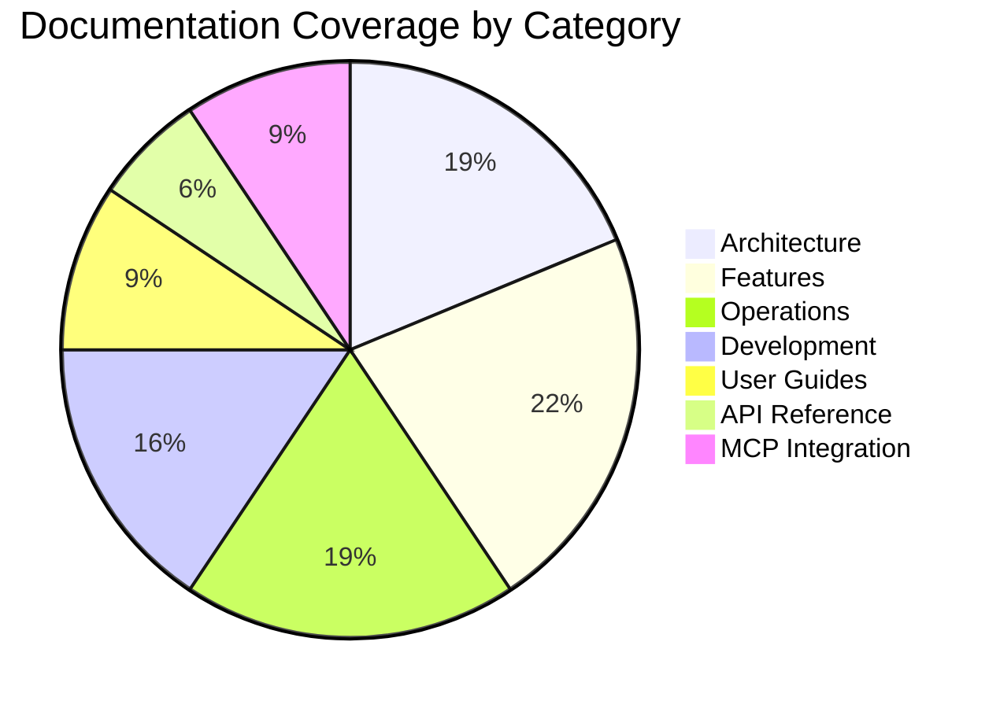

# AI Documentation Vector DB - Documentation Hub

> **Navigation Guide**: Find exactly what you need with our organized documentation structure  
> **Status**: ✅ Complete V1 implementation with comprehensive guides  
> **Last Updated**: 2025-06-06

## 🎯 Quick Navigation

### 🚀 Get Started in 5 Minutes
- [**Quick Start Guide**](./QUICK_START.md) - Installation, setup, and first steps
- [**Project Overview**](../README.md) - Features, architecture, and capabilities

### 📖 Learning Path

Choose your learning approach based on the Diátaxis framework:

#### 📚 **Tutorials** (Learning-Oriented)
Start here if you're new to the project:
- [Quick Start](./QUICK_START.md) - Your first AI documentation vector DB
- [Browser Automation Tutorial](./user-guides/browser-automation.md) - Master the 5-tier system
- [Crawl4AI Tutorial](./user-guides/crawl4ai.md) - Web scraping with Crawl4AI

#### 🛠️ **How-To Guides** (Task-Oriented)
Solve specific problems:
- [Implement Advanced Search](./features/ADVANCED_SEARCH_IMPLEMENTATION.md)
- [Configure Embeddings](./features/EMBEDDING_MODEL_INTEGRATION.md)
- [Optimize Performance](./operations/PERFORMANCE_GUIDE.md)
- [Deploy with Canary](./deployment/CANARY_DEPLOYMENT_GUIDE.md)
- [Troubleshoot Issues](./operations/TROUBLESHOOTING.md)

#### 📋 **Reference** (Information-Oriented)
Look up specific details:
- [API Reference](./api/API_REFERENCE.md) - Complete API documentation
- [Browser Automation API](./api/browser_automation_api.md) - Automation endpoints
- [Configuration Schema](./architecture/UNIFIED_CONFIGURATION.md) - All config options
- [MCP Tools Reference](./mcp/README.md) - MCP server capabilities

#### 🧠 **Explanation** (Understanding-Oriented)
Understand the why and how:
- [System Architecture](./architecture/SYSTEM_OVERVIEW.md) - Overall design
- [Integrated V1 Architecture](./architecture/INTEGRATED_V1_ARCHITECTURE.md) - Component synergy
- [Browser Automation Architecture](./architecture/BROWSER_AUTOMATION_ARCHITECTURE.md) - Tiered design
- [Vector DB Best Practices](./features/VECTOR_DB_BEST_PRACTICES.md) - Design decisions

## 📚 Documentation by Category

### 🏗️ Architecture & Design
- [**System Overview**](./architecture/SYSTEM_OVERVIEW.md) - High-level architecture with diagrams
- [**Integrated V1 Architecture**](./architecture/INTEGRATED_V1_ARCHITECTURE.md) - How components work together
- [**Browser Automation Architecture**](./architecture/BROWSER_AUTOMATION_ARCHITECTURE.md) - 5-tier scraping system
- [**Unified Scraping Architecture**](./architecture/UNIFIED_SCRAPING_ARCHITECTURE.md) - Scraping patterns
- [**Unified Configuration**](./architecture/UNIFIED_CONFIGURATION.md) - Centralized config management
- [**Client Management**](./architecture/CENTRALIZED_CLIENT_MANAGEMENT.md) - Singleton patterns

### ✨ Features & Capabilities
- [**Features Overview**](./features/README.md) - All features at a glance
- [**Advanced Search**](./features/ADVANCED_SEARCH_IMPLEMENTATION.md) - Hybrid search with reranking
- [**HyDE Query Enhancement**](./features/HYDE_QUERY_ENHANCEMENT.md) - Query expansion
- [**Enhanced Chunking**](./features/ENHANCED_CHUNKING_GUIDE.md) - Smart document splitting
- [**Chunking Research**](./features/chunking/CHUNKING_RESEARCH.md) - AST-based chunking deep dive
- [**Embedding Models**](./features/EMBEDDING_MODEL_INTEGRATION.md) - Multi-model support
- [**Reranking Guide**](./features/RERANKING_GUIDE.md) - BGE-reranker integration

### 🔧 Operations & Deployment
- [**Performance Guide**](./operations/PERFORMANCE_GUIDE.md) - Optimization strategies
- [**Monitoring**](./operations/MONITORING.md) - Metrics and observability
- [**Troubleshooting**](./operations/TROUBLESHOOTING.md) - Common issues and solutions
- [**Task Queue**](./operations/TASK_QUEUE.md) - Background job management
- [**Canary Deployment**](./deployment/CANARY_DEPLOYMENT_GUIDE.md) - Safe rollouts
- [**Migration Guide**](./operations/MINIMAL_COST_TO_PERSONAL_USE_MIGRATION.md) - Deployment options

### 💻 Development & Testing
- [**V1 Implementation Plan**](./development/V1_IMPLEMENTATION_PLAN.md) - ✅ COMPLETE
- [**Development Workflow**](./development/DEVELOPMENT_WORKFLOW.md) - Best practices
- [**Testing Documentation**](./development/TESTING_DOCUMENTATION.md) - Test strategies
- [**Testing Quality**](./development/TESTING_QUALITY_ENHANCEMENTS.md) - 95%+ coverage
- [**Architecture Improvements**](./development/ARCHITECTURE_IMPROVEMENTS.md) - Future plans

### 🔌 MCP Integration
- [**MCP Overview**](./mcp/README.md) - Model Context Protocol server
- [**Setup Guide**](./mcp/SETUP.md) - Configuration and deployment
- [**Migration Guide**](./mcp/MIGRATION_GUIDE.md) - Upgrading to unified server

### 📊 Performance & Optimization
- [**Payload Indexing Performance**](./PAYLOAD_INDEXING_PERFORMANCE.md) - 10-100x filtering gains
- [**Collection Aliases**](./COLLECTION_ALIASES.md) - Zero-downtime updates
- [**Browser Automation Roadmap**](./BROWSER_AUTOMATION_INTEGRATION_ROADMAP.md) - Future enhancements

## 🎯 Quick Links by Goal

### "I want to..."

#### 🚀 **Get Started**
- Install the project → [Quick Start](./QUICK_START.md)
- Understand the architecture → [System Overview](./architecture/SYSTEM_OVERVIEW.md)
- See what's possible → [Features Overview](./features/README.md)

#### 🛠️ **Build Something**
- Add search to my app → [Advanced Search](./features/ADVANCED_SEARCH_IMPLEMENTATION.md)
- Scrape websites → [Browser Automation](./user-guides/browser-automation.md)
- Process documents → [Enhanced Chunking](./features/ENHANCED_CHUNKING_GUIDE.md)

#### 🔧 **Optimize & Deploy**
- Improve performance → [Performance Guide](./operations/PERFORMANCE_GUIDE.md)
- Deploy safely → [Canary Deployment](./deployment/CANARY_DEPLOYMENT_GUIDE.md)
- Monitor production → [Monitoring](./operations/MONITORING.md)

#### 🐛 **Debug & Fix**
- Troubleshoot errors → [Troubleshooting](./operations/TROUBLESHOOTING.md)
- Understand logs → [Monitoring](./operations/MONITORING.md)
- Test thoroughly → [Testing Documentation](./development/TESTING_DOCUMENTATION.md)

## 📊 Documentation Coverage



## 🗂️ Archive

Historical and research documentation:

- [**`archive/consolidated/`**](./archive/consolidated/) - Pre-V1 documentation
- [**`archive/research-v1/`**](./archive/research-v1/) - V1 research and analysis
- [**`archive/refactor-v1/`**](./archive/refactor-v1/) - V1 refactor planning docs
- [**`archive/sprint-2025-05/`**](./archive/sprint-2025-05/) - Completed sprint docs
- [**`archive/mcp-legacy/`**](./archive/mcp-legacy/) - Pre-unified MCP docs

## 📝 Documentation Standards

All docs follow these conventions:

```markdown
# Document Title

> **Status**: Current/Planning/Deprecated  
> **Last Updated**: YYYY-MM-DD  
> **Related**: [Links to related docs]

## Overview
Brief description of what this document covers...
```

## 🔄 Recent Updates

- **2025-06-06**: Documentation reorganization and cleanup
- **2025-06-06**: V1 implementation complete with all features
- **2025-05-26**: Major architectural improvements
- **2025-05-25**: Unified configuration implementation

## 🤝 Contributing

To improve documentation:
1. Follow the [documentation standards](#-documentation-standards)
2. Update the appropriate category
3. Add cross-references to related docs
4. Update this index if adding new files

---

**Need help?** Check [Troubleshooting](./operations/TROUBLESHOOTING.md) or open an [issue](https://github.com/BjornMelin/ai-docs-vector-db-hybrid-scraper/issues).
