# Unified Scraping Architecture

## Overview

The unified scraping architecture combines lightweight HTTP scraping, browser automation, and AI-powered tools into a cohesive 5-tier system that automatically selects the optimal approach for each scraping task.

## Architecture Principles

### Performance-First Design

- **Tier 0**: Lightweight HTTP for maximum speed (5-10x faster)
- **Progressive Enhancement**: Escalate complexity only when needed
- **Cost Optimization**: Use free tools first, paid tools only when necessary

### Intelligent Routing

- **Content Analysis**: Automatic detection of page complexity
- **Site-Specific Rules**: Optimized configurations for known domains
- **Performance Learning**: Adaptive routing based on success metrics

### Unified Interface

- **Single Entry Point**: One API for all scraping needs
- **Consistent Results**: Standardized output format across all tiers
- **Graceful Fallbacks**: Automatic escalation when tools fail

## 5-Tier Scraping Hierarchy


### Tier 0: Lightweight HTTP Scraping

**Technology**: httpx + BeautifulSoup  
**Use Cases**: Static HTML, documentation, raw files  
**Performance**: 5-10x faster than browser automation  
**Cost**: $0  

**Optimal for**:

- GitHub raw content (*.md,*.txt, *.json)
- Documentation sites with simple HTML
- API endpoints returning JSON/XML
- Static content without JavaScript

**Implementation**: `LightweightScraper` class

### Tier 1: Crawl4AI Basic

**Technology**: Crawl4AI with Chromium browser  
**Use Cases**: Standard dynamic content, basic JavaScript  
**Performance**: 4-6x faster than complex automation  
**Cost**: $0  

**Optimal for**:

- Standard documentation with basic JavaScript
- Sites with AJAX content loading
- Simple single-page applications
- Basic interactive elements

**Implementation**: `Crawl4AIAdapter` (basic mode)

### Tier 2: Crawl4AI Enhanced

**Technology**: Crawl4AI + Custom JavaScript execution  
**Use Cases**: Interactive content, form submissions  
**Performance**: 2-4x faster than AI automation  
**Cost**: $0  

**Optimal for**:

- Forms requiring input
- Expandable content sections
- Tab-based interfaces
- Custom JavaScript interactions

**Implementation**: `Crawl4AIAdapter` (enhanced mode)

### Tier 3: Browser-use AI

**Technology**: Multi-LLM browser automation (OpenAI, Anthropic, Gemini)  
**Use Cases**: Complex interactions requiring reasoning  
**Performance**: AI-guided automation  
**Cost**: $0.001-0.01 per request  

**Optimal for**:

- Complex navigation workflows
- Dynamic content that changes based on context
- Multi-step interactions
- Sites requiring human-like behavior

**Implementation**: `BrowserUseAdapter`

### Tier 4: Playwright + Firecrawl

**Technology**: Direct browser control + API fallback  
**Use Cases**: Maximum control scenarios  
**Performance**: Full programmatic control  
**Cost**: $0.002-0.01 per request  

**Optimal for**:

- Authentication-required content
- Complex multi-page workflows
- Sites with anti-automation measures
- API-based content extraction

**Implementation**: `PlaywrightAdapter` + `FirecrawlProvider`

## Routing Logic

### Automatic Tier Selection

```python
def select_tier(url: str, requirements: dict) -> int:
    """
    Intelligent tier selection based on URL analysis and requirements.
    """
    
    # Force specific tier if requested
    if requirements.get('force_tier'):
        return requirements['force_tier']
    
    # URL pattern analysis
    if matches_static_patterns(url):
        return 0  # Lightweight HTTP
        
    # Site-specific rules
    domain = extract_domain(url)
    if domain in BROWSER_USE_SITES:
        return 3  # Browser-use AI
    elif domain in PLAYWRIGHT_SITES:
        return 4  # Playwright
        
    # Content complexity analysis
    complexity = analyze_content_complexity(url)
    if complexity == 'static':
        return 0
    elif complexity == 'basic_dynamic':
        return 1
    elif complexity == 'interactive':
        return 2
    else:
        return 3  # Default to AI for unknown complexity
```

### Site-Specific Configuration

```yaml
routing_rules:
  lightweight_patterns:
    - ".*\\.md$"
    - ".*/raw/.*"
    - ".*\\.(txt|json|xml)$"
    
  browser_use_sites:
    - "vercel.com"
    - "clerk.com" 
    - "supabase.com"
    - "react.dev"
    - "docs.anthropic.com"
    
  playwright_sites:
    - "github.com"
    - "stackoverflow.com"
    - "discord.com"
    - "slack.com"
    - "notion.so"
```

### Performance-Based Learning

The system tracks metrics for each tier and domain:

```python
metrics = {
    "tier_0": {
        "success_rate": 0.95,
        "avg_response_time": 250,  # ms
        "cost_per_request": 0.0
    },
    "tier_3": {
        "success_rate": 0.88,
        "avg_response_time": 15000,  # ms
        "cost_per_request": 0.005
    }
}
```

## Integration Architecture

### Current State vs Target State

```mermaid
graph TD
    subgraph "❌ Current State - Broken Architecture"
        direction TB
        
        subgraph "CrawlManager System"
            CM[CrawlManager]
            CM --> LS1[LightweightScraper]
            CM --> C4P1[Crawl4AIProvider]
            CM --> FP1[FirecrawlProvider]
        end
        
        subgraph "AutomationRouter System"
            AR[AutomationRouter]
            AR --> C4A1[Crawl4AIAdapter]
            AR --> BUA1[BrowserUseAdapter]
            AR --> PA1[PlaywrightAdapter]
        end
        
        Warning1["🔥 No Integration<br/>Parallel Systems<br/>Duplicated Code"]
    end
    
    subgraph "✅ Target State - Unified Architecture"
        direction TB
        
        USM[UnifiedScrapingManager]
        USM --> T0["🏎️ Tier 0: LightweightScraper<br/>HTTP + BeautifulSoup"]
        USM --> T1["🔧 Tier 1: Crawl4AI Basic<br/>Standard Dynamic Content"]
        USM --> T2["🎯 Tier 2: Crawl4AI Enhanced<br/>Interactive Elements"]
        USM --> T3["🧠 Tier 3: BrowserUse AI<br/>Complex Reasoning"]
        USM --> T4["🎭 Tier 4: Playwright + Firecrawl<br/>Maximum Control"]
        
        Success["✨ Single Entry Point<br/>Intelligent Routing<br/>Graceful Fallbacks"]
    end
    
    %% Migration Arrow
    CM -.->|"Migrate to"| USM
    AR -.->|"Integrate with"| USM
    
    %% Styling
    classDef broken fill:#ffebee,stroke:#c62828,stroke-width:2px,color:#000
    classDef unified fill:#e8f5e8,stroke:#2e7d32,stroke-width:3px,color:#000
    classDef tier0 fill:#e1f5fe,stroke:#01579b,stroke-width:2px,color:#000
    classDef tier1 fill:#f3e5f5,stroke:#4a148c,stroke-width:2px,color:#000
    classDef tier2 fill:#e8f5e8,stroke:#1b5e20,stroke-width:2px,color:#000
    classDef tier3 fill:#fff3e0,stroke:#e65100,stroke-width:2px,color:#000
    classDef tier4 fill:#ffebee,stroke:#b71c1c,stroke-width:2px,color:#000
    classDef status fill:#f5f5f5,stroke:#424242,stroke-width:2px,color:#000
    
    class CM,AR,LS1,C4P1,FP1,C4A1,BUA1,PA1 broken
    class USM unified
    class T0 tier0
    class T1 tier1
    class T2 tier2
    class T3 tier3
    class T4 tier4
    class Warning1,Success status
```



### Implementation Strategy

#### Phase 1: Create Unified Interface

```python
class UnifiedScrapingManager:
    def __init__(self, config: UnifiedConfig):
        self.lightweight = LightweightScraper(config.lightweight_scraper)
        self.automation_router = AutomationRouter(config)
        self.firecrawl = FirecrawlProvider(config.firecrawl)
        
    async def scrape(self, url: str, **kwargs) -> ScrapingResult:
        tier = self._select_tier(url, kwargs)
        return await self._execute_tier(tier, url, **kwargs)
```

#### Phase 2: Migrate Existing Code

- Update `CrawlManager` to use `UnifiedScrapingManager`
- Migrate MCP tools to unified interface
- Update configuration management
- Add comprehensive testing

#### Phase 3: Optimize Performance

- Implement session pooling across tiers
- Add intelligent caching
- Optimize resource usage
- Add performance monitoring

## API Design

### Unified Scraping Interface

```python
@dataclass
class ScrapingRequest:
    url: str
    formats: List[str] = field(default_factory=lambda: ["markdown"])
    tier: Optional[int] = None  # Force specific tier
    interaction_required: bool = False
    custom_actions: Optional[List[dict]] = None
    timeout: int = 30000
    cache_enabled: bool = True

@dataclass 
class ScrapingResult:
    success: bool
    url: str
    content: Dict[str, str]  # Format -> content mapping
    metadata: Dict[str, Any]
    performance: Dict[str, Any]
    tier_used: int
    provider: str
    error: Optional[str] = None
```

### Usage Examples

```python
# Automatic tier selection
result = await scraper.scrape("https://docs.python.org/tutorial")

# Force specific tier
result = await scraper.scrape(
    "https://complex-spa.com",
    tier=3,  # Force browser-use AI
    interaction_required=True
)

# Custom actions
result = await scraper.scrape(
    "https://interactive-site.com",
    custom_actions=[
        {"type": "click", "selector": ".expand-button"},
        {"type": "wait", "timeout": 2000},
        {"type": "extract", "selector": ".content"}
    ]
)
```

## Performance Characteristics

### Tier Comparison

```mermaid
graph LR
    subgraph "🏆 Performance Metrics"
        direction TB
        
        subgraph "Speed Comparison"
            S0["⚡ Tier 0: 5-10x Speed<br/>HTTP + BeautifulSoup"]
            S1["🔧 Tier 1: 4-6x Speed<br/>Crawl4AI Basic"]
            S2["🎯 Tier 2: 2-4x Speed<br/>Crawl4AI Enhanced"]
            S3["🧠 Tier 3: 1x Speed<br/>Browser-use AI"]
            S4["🎭 Tier 4: Variable<br/>Playwright/Firecrawl"]
            
            S0 -.-> S1 -.-> S2 -.-> S3 -.-> S4
        end
        
        subgraph "Cost Structure"
            C0["🎆 $0.000<br/>Free Tier"]
            C3["💰 $0.001-0.01<br/>AI Tier"]
            C4["💵 $0.002-0.01<br/>Premium Tier"]
            
            C0 -.-> C3 -.-> C4
        end
        
        subgraph "Success Rates"
            SR0["✅ 95%+ Static HTML"]
            SR1["✅ 90%+ Basic JS"]
            SR2["✅ 85%+ Interactive"]
            SR3["✅ 80%+ AI Reasoning"]
            SR4["✅ 95%+ Max Control"]
        end
    end
    
    %% Styling
    classDef tier0 fill:#e1f5fe,stroke:#01579b,stroke-width:2px,color:#000
    classDef tier1 fill:#f3e5f5,stroke:#4a148c,stroke-width:2px,color:#000
    classDef tier2 fill:#e8f5e8,stroke:#1b5e20,stroke-width:2px,color:#000
    classDef tier3 fill:#fff3e0,stroke:#e65100,stroke-width:2px,color:#000
    classDef tier4 fill:#ffebee,stroke:#b71c1c,stroke-width:2px,color:#000
    classDef cost fill:#f5f5f5,stroke:#424242,stroke-width:2px,color:#000
    
    class S0,SR0 tier0
    class S1,SR1 tier1
    class S2,SR2 tier2
    class S3,SR3 tier3
    class S4,SR4 tier4
    class C0,C3,C4 cost
```




| Tier | Technology | Speed | Cost | Capability | Success Rate |
|------|------------|--------|------|------------|--------------|
| 0 | HTTP + BeautifulSoup | 5-10x | $0 | Static HTML | 95%+ |
| 1 | Crawl4AI Basic | 4-6x | $0 | Basic JS | 90%+ |
| 2 | Crawl4AI Enhanced | 2-4x | $0 | Interactive | 85%+ |
| 3 | Browser-use AI | 1x | $0.001-0.01 | AI Reasoning | 80%+ |
| 4 | Playwright/Firecrawl | Variable | $0.002-0.01 | Max Control | 95%+ |

### Optimization Strategies

1. **Smart Caching**
   - Cache successful results by URL and tier
   - Invalidate based on content freshness
   - Share cache across tiers for escalation

2. **Session Reuse**
   - Maintain browser sessions across requests
   - Pool connections for HTTP scraping
   - Optimize resource allocation

3. **Predictive Routing**
   - Learn from historical performance
   - Predict optimal tier for new URLs
   - Adapt to site changes over time

## Configuration Management

### Environment-Based Configuration

```yaml
# development.yaml
scraping:
  default_tier: "auto"
  fallback_enabled: true
  session_pooling: true
  cache_ttl: 300
  
  tiers:
    tier_0:
      enabled: true
      timeout: 5
      max_concurrent: 50
      
    tier_3:
      enabled: true
      llm_provider: "openai"
      model: "gpt-4o-mini"
      api_key: "${OPENAI_API_KEY}"
```

### Site-Specific Overrides

```yaml
# site_configs.yaml
overrides:
  "docs.anthropic.com":
    tier: 3
    llm_provider: "anthropic"
    
  "github.com":
    tier: 4
    require_auth: true
    
  "*.githubusercontent.com":
    tier: 0
    cache_ttl: 3600
```

## Monitoring and Observability

### Key Metrics

- **Performance**: Response times per tier and domain
- **Success Rates**: Success percentage by tier
- **Cost Tracking**: API usage and costs
- **Escalation Patterns**: When and why tiers escalate
- **Resource Usage**: Memory, CPU, and network utilization

### Health Checks

```python
async def health_check() -> Dict[str, Any]:
    return {
        "tiers": {
            "tier_0": await lightweight_scraper.health_check(),
            "tier_1": await crawl4ai_adapter.health_check(),
            "tier_3": await browser_use_adapter.health_check(),
            "tier_4": await playwright_adapter.health_check()
        },
        "performance": get_performance_metrics(),
        "resource_usage": get_resource_metrics()
    }
```

## Migration Strategy

```mermaid
graph LR
    subgraph "🎯 Migration Progress"
        direction TB
        
        Step1["✅ Step 1: Assessment<br/>📋 Analyzed architecture<br/>📋 Identified gaps<br/>📋 Documented state"]
        Step2["🔄 Step 2: Quick Fixes<br/>🔧 Fix import errors<br/>🔧 Implement methods<br/>🔧 Integration tests"]
        Step3["📋 Step 3: Unified Interface<br/>🏗️ Create UnifiedScrapingManager<br/>🎯 Tier selection logic<br/>⚙️ Configuration system"]
        Step4["📋 Step 4: Migration<br/>🔄 Update calling code<br/>🛠️ Migrate MCP tools<br/>📚 Update docs<br/>📊 Add monitoring"]
        Step5["📋 Step 5: Optimization<br/>🏊 Session pooling<br/>🧠 Predictive routing<br/>⚡ Resource optimization<br/>💾 Advanced caching"]
        
        Step1 --> Step2
        Step2 --> Step3  
        Step3 --> Step4
        Step4 --> Step5
    end
    
    %% Styling
    classDef complete fill:#e8f5e8,stroke:#2e7d32,stroke-width:3px,color:#000
    classDef active fill:#fff3e0,stroke:#ef6c00,stroke-width:3px,color:#000
    classDef planned fill:#f5f5f5,stroke:#616161,stroke-width:2px,color:#000
    
    class Step1 complete
    class Step2 active
    class Step3,Step4,Step5 planned
```




### Step 1: Assessment (Complete)

- ✅ Analyzed existing architecture
- ✅ Identified integration gaps
- ✅ Documented current state

### Step 2: Quick Fixes (In Progress)

- [ ] Fix class import errors
- [ ] Implement missing methods
- [ ] Add basic integration tests

### Step 3: Unified Interface (Next)

- [ ] Create `UnifiedScrapingManager`
- [ ] Implement tier selection logic
- [ ] Add configuration management

### Step 4: Migration (Future)

- [ ] Update calling code
- [ ] Migrate MCP tools
- [ ] Update documentation
- [ ] Add monitoring

### Step 5: Optimization (Future)

- [ ] Implement session pooling
- [ ] Add predictive routing
- [ ] Optimize resource usage
- [ ] Add advanced caching

## Benefits of Unified Architecture

1. **Performance**: 5-10x speed improvement for simple content
2. **Cost Efficiency**: Use free tools first, paid only when needed
3. **Reliability**: Graceful fallbacks when tools fail
4. **Simplicity**: Single API for all scraping needs
5. **Intelligence**: Automatic tool selection based on content
6. **Scalability**: Resource pooling and optimization
7. **Maintainability**: Single codebase instead of parallel systems
