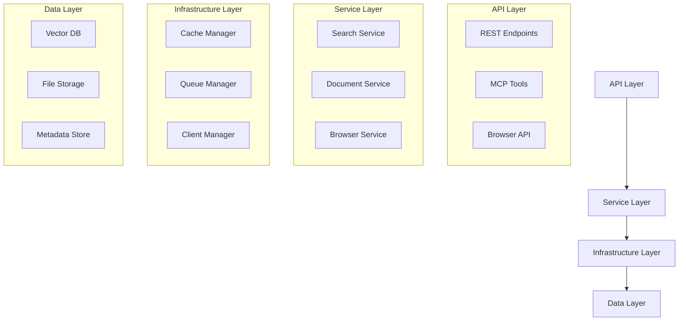

# Architecture Concepts

> **Purpose**: System design and component relationships  
> **Audience**: Developers and architects

## Architecture Documentation

### System Design
- [**System Overview**](../concepts/architecture/system-overview.md) - High-level architecture, data flow, and component interaction
- [**V1 Architecture**](../concepts/architecture/v1-architecture.md) - Detailed component synergy and design patterns

### Specialized Architectures
- [**Browser Architecture**](../concepts/architecture/browser-architecture.md) - 5-tier scraping system with intelligent routing
- [**Scraping Architecture**](../concepts/architecture/scraping-architecture.md) - Web scraping patterns and strategies
- [**Client Management**](../concepts/architecture/client-management.md) - Singleton patterns and resource lifecycle

## Architectural Principles

### Core Design Philosophy

1. **Modularity** - Loosely coupled, highly cohesive components
2. **Scalability** - Horizontal and vertical scaling support
3. **Performance** - Sub-100ms response times for core operations
4. **Reliability** - Graceful degradation and fault tolerance

### Key Patterns

- **Dependency Injection** - Testable, configurable components
- **Singleton Management** - Resource sharing and lifecycle control
- **Factory Patterns** - Dynamic component creation
- **Observer Pattern** - Event-driven updates

## System Layers

## Component Interactions

### Request Flow
1. **API Reception** - FastAPI receives and validates requests
2. **Service Orchestration** - Business logic coordination
3. **Resource Management** - Singleton client management
4. **Data Operations** - Vector and document processing
5. **Response Assembly** - Result formatting and return

## Related Documentation

- 🛠️ [Implementation Guides](../../how-to-guides/) - Build on these concepts
- 📋 [API Reference](../../reference/api/) - Technical specifications
- 🧠 [Features](../features/) - Functional concepts