# Centralized Client Management

> **Status**: Current  
> **Last Updated**: 2025-06-09  
> **Purpose**: Client Management concept explanation  
> **Audience**: Developers wanting to understand design

> **Status:** Implemented  
> **Version:** 1.0.0  
> **Created:** 2025-05-24

## Overview

The Centralized Client Management system provides a unified approach to managing all external API clients in the application. It implements the Singleton pattern for efficient resource usage, includes health checks and auto-reconnection logic, and provides Circuit Breaker pattern for fault tolerance.

## Key Features

- **Singleton Pattern**: Ensures only one instance of each client exists
- **Connection Pooling**: Efficient resource management for database connections
- **Parallel Health Checks**: Background monitoring runs health checks concurrently for optimal performance
- **Circuit Breaker**: Prevents cascading failures with automatic recovery
- **Automatic Client Recreation**: Failed clients are automatically recreated when services recover
- **Async Context Managers**: Proper resource lifecycle management
- **Strict Configuration Validation**: Pydantic-based validation with error handling for config changes
- **Retry Logic**: Built-in exponential backoff for transient failures
- **Metrics & Monitoring**: Health status reporting for all clients

## Architecture

### Component Structure

```mermaid
graph LR
    A["📁 src/infrastructure/"] --> B["📄 __init__.py"]
    A --> C["🔧 client_manager.py<br/><small>Main ClientManager implementation</small>"]
    
    style A fill:#e1f5fe,stroke:#0277bd,stroke-width:2px
    style B fill:#f3e5f5,stroke:#7b1fa2,stroke-width:1px
    style C fill:#e8f5e8,stroke:#2e7d32,stroke-width:2px
```



### Class Hierarchy


## Usage Examples

### Basic Usage

```python
from src.infrastructure import ClientManager
from src.infrastructure.client_manager import ClientManagerConfig

# Create configuration
config = ClientManagerConfig(
    qdrant_url="http://localhost:6333",
    openai_api_key="sk-...",
    redis_url="redis://localhost:6379"
)

# Get manager instance (singleton)
manager = ClientManager(config)

# Initialize and use
async with manager:
    # Get clients
    qdrant = await manager.get_qdrant_client()
    openai = await manager.get_openai_client()
    
    # Use clients
    collections = await qdrant.get_collections()
    embeddings = await openai.embeddings.create(...)
```

### Using Context Managers

```python
# Automatic lifecycle management
async with manager.managed_client("qdrant") as client:
    await client.upsert(...)

# Multiple clients
async with manager:
    async with manager.managed_client("redis") as redis_client:
        await redis_client.set("key", "value")
```

### Health Status Monitoring

```python
# Get health status of all clients
health_status = await manager.get_health_status()
print(health_status)
# Output:
# {
#     "qdrant": {
#         "state": "healthy",
#         "last_check": 1706123456.789,
#         "consecutive_failures": 0,
#         "circuit_breaker_state": "healthy"
#     },
#     "redis": {
#         "state": "degraded",
#         "last_check": 1706123456.789,
#         "last_error": "Connection timeout",
#         "consecutive_failures": 2,
#         "circuit_breaker_state": "degraded"
#     }
# }
```

## Configuration

### ClientManagerConfig

All configuration is validated using Pydantic V2:

```python
from src.infrastructure.client_manager import ClientManagerConfig

config = ClientManagerConfig(
    # Qdrant settings
    qdrant_url="http://localhost:6333",
    qdrant_api_key=None,  # Optional
    qdrant_timeout=30.0,
    qdrant_prefer_grpc=False,
    
    # OpenAI settings
    openai_api_key="sk-...",
    openai_timeout=30.0,
    openai_max_retries=3,
    
    # Firecrawl settings
    firecrawl_api_key="fc-...",
    firecrawl_timeout=60.0,
    
    # Redis settings
    redis_url="redis://localhost:6379",
    redis_max_connections=10,
    redis_decode_responses=True,
    
    # Health check settings
    health_check_interval=30.0,
    health_check_timeout=5.0,
    max_consecutive_failures=3,
    
    # Circuit breaker settings
    circuit_breaker_failure_threshold=5,
    circuit_breaker_recovery_timeout=60.0,
    circuit_breaker_half_open_requests=1
)
```

### Environment Variables

The system can also load configuration from environment variables:

```bash
export QDRANT_URL="http://localhost:6333"
export OPENAI_API_KEY="sk-..."
export REDIS_URL="redis://localhost:6379"
```

## Circuit Breaker Pattern

The Circuit Breaker prevents cascading failures and provides automatic recovery:

### States

1. **Closed (Healthy)**: Normal operation, requests pass through
2. **Open (Failed)**: Circuit is tripped, requests fail immediately
3. **Half-Open (Degraded)**: Testing if service has recovered

### Configuration (2025)

- `failure_threshold`: Number of failures before opening circuit (default: 5)
- `recovery_timeout`: Seconds before attempting recovery (default: 60)
- `half_open_requests`: Test requests in half-open state (default: 1)

### State Transition Flow


## Health Monitoring

### Automatic Health Checks

Background task runs every `health_check_interval` seconds:

1. Checks each initialized client
2. Updates health status
3. Triggers circuit breaker if needed
4. Logs health changes

### Health Check Methods

- **Qdrant**: `get_collections()` call
- **OpenAI**: `models.list()` call  
- **Redis**: `ping()` call
- **Firecrawl**: Presence check (no health endpoint)

### Failure Handling

- Consecutive failures tracked per client
- State transitions: Healthy → Degraded → Failed
- Automatic recovery attempts
- Detailed error logging

## Integration with Services

### Example: Updated QdrantService

```python
from src.infrastructure import ClientManager
from src.services.base import BaseService

class QdrantService(BaseService):
    def __init__(self, client_manager: ClientManager):
        self.client_manager = client_manager
        self._client = None
    
    async def initialize(self):
        # Client manager handles creation and health
        self._client = await self.client_manager.get_qdrant_client()
    
    async def create_collection(self, name: str, vector_size: int):
        # Circuit breaker protects against failures
        return await self._client.create_collection(...)
```

### Example: Updated EmbeddingManager

```python
class EmbeddingManager:
    def __init__(self, client_manager: ClientManager):
        self.client_manager = client_manager
    
    async def generate_embeddings(self, texts: List[str]):
        # Get client with automatic health checks
        openai = await self.client_manager.get_openai_client()
        if not openai:
            # Fallback to local embeddings
            return await self._use_local_embeddings(texts)
        
        # Use OpenAI with circuit breaker protection
        return await openai.embeddings.create(...)
```

## Testing

### Unit Tests

Comprehensive test suite in `tests/test_client_manager.py`:

```python
# Test singleton pattern
def test_singleton_pattern():
    manager1 = ClientManager(config)
    manager2 = ClientManager(config)
    assert manager1 is manager2

# Test circuit breaker
async def test_circuit_breaker():
    breaker = CircuitBreaker(failure_threshold=3)
    # Test failure threshold
    # Test recovery timeout
    # Test half-open state

# Test health monitoring
async def test_health_monitoring():
    # Mock failing clients
    # Verify health status updates
    # Test automatic recovery
```

### Integration Tests

```python
# Test with real services
@pytest.mark.integration
async def test_real_qdrant_connection():
    async with ClientManager() as manager:
        client = await manager.get_qdrant_client()
        collections = await client.get_collections()
        assert isinstance(collections, list)
```

## Performance Considerations

### Connection Pooling

- Redis: Configurable max connections (default: 10)
- Qdrant: HTTP/2 multiplexing or gRPC connection reuse
- OpenAI: Built-in connection pooling in SDK

### Resource Usage

- Single instance per client type (Singleton)
- Lazy initialization (clients created on first use)
- Proper cleanup on shutdown
- Minimal memory footprint for health tracking

### Concurrency

- Thread-safe singleton implementation
- Async locks prevent race conditions
- Concurrent health checks for all clients
- Non-blocking circuit breaker checks

## Monitoring & Observability

### Logging

Structured logging throughout:

```python
logger.info(f"Created {name} client")
logger.warning(f"{name} health check failed: {e}")
logger.error(f"Circuit breaker opened after {failures} failures")
```

### Metrics

Health status provides metrics:

- Client state (healthy/degraded/failed)
- Last check timestamp
- Consecutive failure count
- Circuit breaker state
- Last error message

### Alerts

Can integrate with monitoring systems:

```python
# Example: Prometheus metrics
from prometheus_client import Gauge

client_health = Gauge(
    'api_client_health',
    'API client health status',
    ['client_name']
)

# Update in health check loop
client_health.labels(client_name='qdrant').set(
    1 if health.state == ClientState.HEALTHY else 0
)
```

## Migration Guide

### From Direct Client Creation

Before:

```python
# Scattered client creation
client = AsyncQdrantClient(url="...", api_key="...")
openai = AsyncOpenAI(api_key="...")
```

After:

```python
# Centralized management
async with ClientManager(config) as manager:
    client = await manager.get_qdrant_client()
    openai = await manager.get_openai_client()
```

### From Service-Specific Clients

Before:

```python
class QdrantService:
    def __init__(self, config):
        self._client = AsyncQdrantClient(...)
```

After:

```python
class QdrantService:
    def __init__(self, client_manager: ClientManager):
        self.client_manager = client_manager
    
    async def initialize(self):
        self._client = await self.client_manager.get_qdrant_client()
```

## Best Practices

1. **Always use context managers** for automatic cleanup
2. **Check health status** before critical operations
3. **Handle None returns** for optional clients (OpenAI, Firecrawl)
4. **Configure appropriate timeouts** based on your use case
5. **Monitor circuit breaker trips** as early warning signs
6. **Use lazy initialization** - don't create clients until needed
7. **Implement fallbacks** for when clients are unavailable

## Troubleshooting

### Common Issues

1. **"Circuit breaker is open"**
   - Check service availability
   - Review recent errors in logs
   - Wait for recovery timeout or restart

2. **"Client not initialized"**
   - Ensure `manager.initialize()` called or use context manager
   - Check if API keys are configured

3. **Health check timeouts**
   - Increase `health_check_timeout` if needed
   - Check network connectivity
   - Verify service endpoints

### Debug Mode

Enable detailed logging:

```python
import logging
logging.getLogger("src.infrastructure").setLevel(logging.DEBUG)
```

## Future Enhancements

1. **Dynamic Client Registration**: Add new client types at runtime
2. **Metric Exporters**: Prometheus, StatsD, CloudWatch integration  
3. **Distributed Circuit Breakers**: Share state across instances
4. **Adaptive Timeouts**: Adjust based on response times
5. **Client Pools**: Multiple instances for load balancing
6. **Webhook Notifications**: Alert on state changes
7. **Configuration Hot-Reload**: Update settings without restart

## References

- [Circuit Breaker Pattern - Martin Fowler](https://martinfowler.com/bliki/CircuitBreaker.html)
- [Clean Architecture - Uncle Bob](https://blog.cleancoder.com/uncle-bob/2012/08/13/the-clean-architecture.html)
- [Python AsyncIO Documentation](https://docs.python.org/3/library/asyncio.html)
- [Pydantic V2 Documentation](https://docs.pydantic.dev/latest/)
