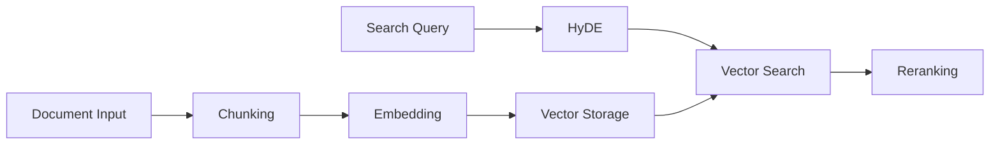

# Feature Concepts

> **Purpose**: Deep understanding of core functionality  
> **Audience**: Developers implementing or extending features

## Feature Documentation

### Document Processing
- [**Chunking Theory**](../concepts/features/chunking-theory.md) - AST-based document splitting and semantic preservation

## Core Features Overview

### Document Processing Pipeline

The system implements intelligent document processing through several key features:

1. **AST-Based Chunking** - Preserves code structure and semantic meaning
2. **Multi-Model Embeddings** - Support for FastEmbed, OpenAI, and custom models
3. **Semantic Chunking** - Content-aware splitting for better search results

### Search Capabilities

Advanced search features provide powerful query capabilities:

1. **Hybrid Search** - Combines semantic and keyword search
2. **HyDE Enhancement** - Query expansion for improved relevance
3. **BGE Reranking** - Post-search result refinement
4. **Smart Filtering** - Metadata-based result filtering

### Web Scraping Features

5-tier automation system provides flexible content extraction:

1. **Lightweight Scraping** - Fast, minimal resource usage
2. **Medium Automation** - JavaScript support with caching
3. **Heavy Automation** - Full browser automation
4. **Intelligent Routing** - Automatic tier selection
5. **Rate Limiting** - Per-tier request management

## Feature Design Philosophy

### Performance-First Design
- **Lazy Loading** - Load resources only when needed
- **Intelligent Caching** - Multi-layer caching strategy
- **Resource Pooling** - Shared browser instances
- **Batch Processing** - Efficient bulk operations

### Extensibility
- **Plugin Architecture** - Custom embedding providers
- **Configurable Pipelines** - Flexible processing chains
- **Hook System** - Custom processing steps
- **Model Abstraction** - Provider-agnostic interfaces

## Feature Interactions

## Related Documentation

- 🛠️ [Implementation Guides](../../how-to-guides/) - Build these features
- 🏗️ [Architecture](../architecture/) - System design context
- 📋 [Reference](../../reference/) - Technical specifications