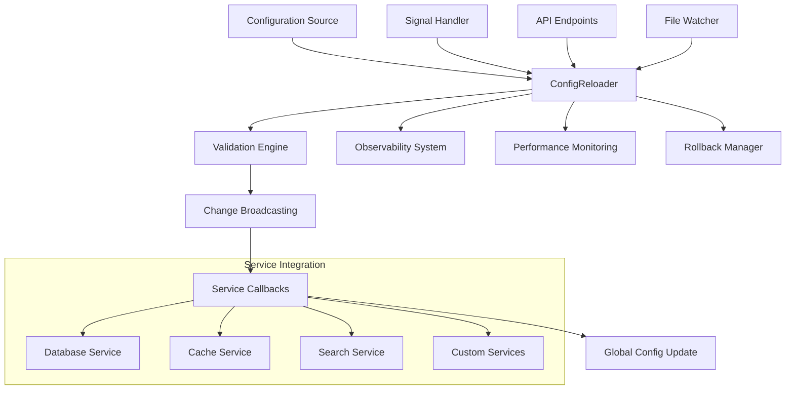

# Zero-Downtime Configuration Reloading

This document describes the zero-downtime configuration reloading system integrated with the AI Docs Vector DB Hybrid Scraper application.

## Overview

The configuration reloading system provides the ability to update application configuration without restarting the service, ensuring zero downtime for production deployments. The system includes comprehensive validation, rollback capabilities, and observability integration.

## Key Features

- **Zero-Downtime Reloading**: Configuration changes are applied without service interruption
- **Signal-Based Triggers**: Use SIGHUP signal to trigger configuration reload
- **API Management**: HTTP endpoints for triggering reloads and monitoring status
- **Configuration Validation**: Comprehensive validation before applying changes
- **Automatic Rollback**: Rollback to previous configuration on validation failures
- **Observability Integration**: Full OpenTelemetry tracing and metrics collection
- **File Watching**: Automatic reload when configuration files change
- **Service Notifications**: Broadcast configuration changes to registered services

## Architecture



## Getting Started

### Basic Setup

The configuration reloading system is automatically initialized when the FastAPI application starts:

```python
from fastapi import FastAPI
from src.config.lifecycle import setup_configuration_lifecycle

app = FastAPI()

# This automatically sets up configuration reloading
lifecycle_manager = setup_configuration_lifecycle(app)
```

### Manual Configuration Reload

```python
from src.config.reload import get_config_reloader, ReloadTrigger

# Get the global reloader instance
reloader = get_config_reloader()

# Trigger a manual reload
operation = await reloader.reload_config(
    trigger=ReloadTrigger.MANUAL,
    force=True  # Force reload even if no changes detected
)

# Check results
if operation.success:
    print(f"Reload successful in {operation.total_duration_ms:.1f}ms")
else:
    print(f"Reload failed: {operation.error_message}")
```

### Service Integration

Register your service to receive configuration change notifications:

```python
from src.config.lifecycle import register_config_callback

def my_service_config_update(old_config: Config, new_config: Config) -> bool:
    """Handle configuration changes for your service.
    
    Args:
        old_config: Previous configuration
        new_config: New configuration
        
    Returns:
        True if update successful, False otherwise
    """
    try:
        # Update your service with new configuration
        if old_config.database.database_url != new_config.database.database_url:
            # Reconfigure database connection
            update_database_connection(new_config.database)
        
        if old_config.cache != new_config.cache:
            # Reconfigure cache settings
            update_cache_settings(new_config.cache)
        
        return True
    except Exception as e:
        logger.error(f"Failed to update service configuration: {e}")
        return False

# Register the callback
register_config_callback(
    name="my_service",
    callback=my_service_config_update,
    priority=50,  # Higher priority = called earlier
    async_callback=False,
)
```

## API Endpoints

The system provides HTTP endpoints for configuration management:

### Reload Configuration

```http
POST /api/v1/config/reload
Content-Type: application/json

{
    "force": true,
    "config_source": "/path/to/config.json"
}
```

Response:
```json
{
    "operation_id": "550e8400-e29b-41d4-a716-446655440000",
    "status": "success",
    "success": true,
    "total_duration_ms": 150.5,
    "validation_duration_ms": 45.2,
    "apply_duration_ms": 105.3,
    "services_notified": ["database_config:success", "cache_config:success"],
    "validation_warnings": []
}
```

### Rollback Configuration

```http
POST /api/v1/config/rollback
Content-Type: application/json

{
    "target_hash": "abc123def456"  // Optional: specific backup to rollback to
}
```

### Get Reload History

```http
GET /api/v1/config/history?limit=20
```

### Get Reload Statistics

```http
GET /api/v1/config/stats
```

Response:
```json
{
    "total_operations": 15,
    "successful_operations": 14,
    "failed_operations": 1,
    "success_rate": 0.933,
    "average_duration_ms": 125.8,
    "listeners_registered": 5,
    "backups_available": 3,
    "current_config_hash": "def456abc789"
}
```

### Get Configuration Status

```http
GET /api/v1/config/status
```

### Enable/Disable File Watching

```http
POST /api/v1/config/file-watch/enable?poll_interval=1.0
POST /api/v1/config/file-watch/disable
```

## Signal-Based Reloading

The system automatically registers a signal handler for SIGHUP (if available):

```bash
# Trigger configuration reload via signal
kill -HUP <pid>

# Or using systemd
systemctl reload your-service
```

## File Watching

Enable automatic configuration reload when files change:

```python
reloader = get_config_reloader()

# Enable file watching (polls every 1 second)
await reloader.enable_file_watching(poll_interval=1.0)

# Disable file watching
await reloader.disable_file_watching()
```

## Configuration Validation

The system performs comprehensive validation before applying changes:

### Built-in Validations

- **Pydantic Model Validation**: Ensures all required fields are present and types are correct
- **Provider Dependencies**: Validates that required API keys are present for selected providers
- **Performance Checks**: Warns about potentially problematic settings
- **Cross-field Validation**: Ensures consistent configuration across related settings

### Custom Validation

Add custom validation logic by extending the validation process:

```python
async def custom_config_validator(config: Config) -> Dict[str, List[str]]:
    """Custom configuration validation.
    
    Returns:
        Dictionary with 'errors' and 'warnings' lists
    """
    errors = []
    warnings = []
    
    # Custom validation logic
    if config.performance.max_concurrent_requests > 100:
        warnings.append("High concurrent request limit may impact performance")
    
    if not config.security.api_key_header:
        errors.append("API key header must be specified for security")
    
    return {"errors": errors, "warnings": warnings}
```

## Observability Integration

The configuration reloading system is fully integrated with the Task 20 observability system:

### Tracing

All configuration operations are traced with OpenTelemetry:

- **Operation Spans**: Each reload operation creates a detailed span
- **Service Callbacks**: Individual service update callbacks are traced
- **Validation Steps**: Configuration validation is tracked separately
- **Performance Metrics**: Timing information is captured for all phases

### Metrics

Key metrics are collected:

- `config_operations_total`: Total number of configuration operations
- `config_operation_errors_total`: Number of failed operations
- `config_operation_duration_seconds`: Operation duration histogram
- `config_validation_duration_seconds`: Validation duration histogram
- `config_services_detected`: Number of services detected during auto-detection

### Performance Monitoring

Detailed performance monitoring includes:

- **Operation Timing**: Load, validation, and apply phase durations
- **Service Callback Performance**: Individual callback execution times
- **Error Tracking**: Failed operations with error categorization
- **Slow Operation Detection**: Automatic identification of slow operations

## Rollback and Recovery

### Automatic Rollback

If configuration validation fails or service callbacks report errors, the system can automatically rollback:

```python
# Configure automatic rollback on failure
reloader = ConfigReloader(
    enable_automatic_rollback=True,
    rollback_threshold=0.5  # Rollback if <50% of services succeed
)
```

### Manual Rollback

Rollback to any previous configuration:

```python
# Rollback to previous configuration
operation = await reloader.rollback_config()

# Rollback to specific configuration
operation = await reloader.rollback_config(target_hash="abc123")
```

### Configuration Backups

The system automatically maintains configuration backups:

- **Backup Count**: Configurable number of backups to maintain (default: 5)
- **Backup Storage**: In-memory storage with optional persistence
- **Backup Metadata**: Timestamps and configuration hashes for each backup

## Best Practices

### Service Callback Design

1. **Idempotent Operations**: Ensure callbacks can be safely called multiple times
2. **Fast Execution**: Keep callback execution time under 1 second when possible
3. **Error Handling**: Return `False` on failure to indicate unsuccessful update
4. **Logging**: Log configuration changes for debugging and audit purposes

```python
def good_service_callback(old_config: Config, new_config: Config) -> bool:
    """Example of a well-designed service callback."""
    try:
        # Check if relevant configuration changed
        if old_config.database == new_config.database:
            return True  # No changes needed
        
        # Apply changes atomically
        with database_transaction():
            update_connection_pool(new_config.database)
            validate_connection()
        
        logger.info("Database configuration updated successfully")
        return True
        
    except Exception as e:
        logger.error(f"Database configuration update failed: {e}")
        return False
```

### Configuration File Management

1. **Atomic Updates**: Use atomic file operations to prevent partial reads
2. **Validation**: Validate configuration files before deployment
3. **Versioning**: Include version information in configuration files
4. **Monitoring**: Monitor configuration file changes in production

### Production Deployment

1. **Testing**: Test configuration changes in staging environment first
2. **Gradual Rollout**: Consider gradual rollout for critical configuration changes
3. **Monitoring**: Monitor application metrics during and after configuration changes
4. **Rollback Plan**: Have a rollback plan ready for critical configuration changes

## Troubleshooting

### Common Issues

#### Configuration Reload Fails

1. **Check Validation Errors**: Review validation error messages in the operation result
2. **Verify File Permissions**: Ensure the application can read configuration files
3. **Check Service Callbacks**: Review service callback logs for failures

#### Service Not Receiving Updates

1. **Verify Registration**: Ensure the service callback is properly registered
2. **Check Callback Logic**: Verify the callback function is implemented correctly
3. **Review Timeout Settings**: Ensure callback timeout is sufficient

#### Performance Issues

1. **Review Callback Performance**: Check for slow service callbacks
2. **Optimize Validation**: Reduce complex validation logic if possible
3. **Monitor Resource Usage**: Check CPU and memory usage during reloads

### Debugging Tools

#### Enable Debug Logging

```python
import logging

logging.getLogger("src.config.reload").setLevel(logging.DEBUG)
```

#### Check Reload History

```python
reloader = get_config_reloader()
history = reloader.get_reload_history(limit=10)

for operation in history:
    print(f"Operation {operation.operation_id}:")
    print(f"  Status: {operation.status.value}")
    print(f"  Duration: {operation.total_duration_ms:.1f}ms")
    print(f"  Services: {operation.services_notified}")
```

#### Monitor Performance

```python
stats = reloader.get_reload_stats()
print(f"Success rate: {stats['success_rate']:.2%}")
print(f"Average duration: {stats['average_duration_ms']:.1f}ms")

# Get slow operations
slow_ops = reloader.get_slow_operations(threshold_ms=1000.0)
for op in slow_ops:
    print(f"Slow operation: {op.operation_id} ({op.duration_ms:.1f}ms)")
```

## Security Considerations

1. **API Access Control**: Secure configuration management endpoints with appropriate authentication
2. **Configuration File Security**: Protect configuration files with proper file permissions
3. **Audit Logging**: Log all configuration changes for security auditing
4. **Validation**: Validate configuration inputs to prevent injection attacks

## Migration Guide

### From Manual Configuration Management

1. **Identify Services**: List all services that need configuration updates
2. **Create Callbacks**: Implement configuration update callbacks for each service
3. **Register Callbacks**: Register callbacks with the configuration reloader
4. **Test Thoroughly**: Test configuration changes in development environment
5. **Deploy Gradually**: Roll out to production with monitoring

### Integration with Existing Systems

1. **Configuration Sources**: Adapt existing configuration loading to use the reloader
2. **Service Dependencies**: Update service initialization to use configuration callbacks
3. **Monitoring Integration**: Connect to existing monitoring and alerting systems
4. **Documentation**: Update operational procedures to use new reload mechanisms

## Examples

See the `examples/config_reload_example.py` file for comprehensive usage examples and the `tests/test_config_reload.py` file for detailed test cases demonstrating all features of the configuration reloading system.