# Canary Deployment Guide

This guide covers the production-grade canary deployment system for gradual rollout of new Qdrant collections with real-time traffic shifting and metrics collection.

## Overview

The canary deployment system provides:
- **Application-level traffic routing** without infrastructure dependencies
- **Real-time metrics collection** for latency and error tracking
- **Sticky sessions** for consistent user experience
- **Automatic rollback** on threshold violations
- **Persistent state management** across service restarts

## Architecture

### Components

1. **CanaryDeployment Service** (`src/services/deployment/canary.py`)
   - Orchestrates canary deployment lifecycle
   - Monitors metrics and health thresholds
   - Manages automatic rollback

2. **CanaryRouter** (`src/services/deployment/canary_router.py`)
   - Implements consistent hashing for traffic distribution
   - Manages sticky sessions for users
   - Collects and aggregates metrics

3. **SearchInterceptor** (`src/services/vector_db/search_interceptor.py`)
   - Intercepts search requests
   - Routes traffic based on canary configuration
   - Records request metrics

4. **QdrantService Integration**
   - Automatically uses canary routing when available
   - Falls back to direct search if Redis unavailable

## Traffic Shifting Strategy

### Application-Level Routing

The system implements application-level traffic routing that works independently of infrastructure:

```mermaid
flowchart TD
    A["🚀 Search Request"] --> B{SearchInterceptor}
    B -->|Check| C{Active Canary?}
    
    C -->|No| D["📦 Direct to Primary<br/>Collection"]
    C -->|Yes| E[CanaryRouter]
    
    E --> F{"Routing Decision<br/>🎯 User ID Hash<br/>📈 Canary %<br/>🔄 Consistent Hash"}
    
    F -->|Primary| G["🟦 Route to<br/>Primary Collection"]
    F -->|Canary| H["🟨 Route to<br/>Canary Collection"]
    
    G --> I["📈 Record Metrics<br/>Latency & Errors"]
    H --> I
    D --> I
    
    I --> J["✅ Return Results"]
    
    %% Styling
    classDef request fill:#e3f2fd,stroke:#1976d2,stroke-width:2px,color:#000
    classDef decision fill:#fff3e0,stroke:#f57c00,stroke-width:2px,color:#000
    classDef primary fill:#e8f5e8,stroke:#388e3c,stroke-width:2px,color:#000
    classDef canary fill:#fce4ec,stroke:#c2185b,stroke-width:2px,color:#000
    classDef metrics fill:#f3e5f5,stroke:#7b1fa2,stroke-width:2px,color:#000
    classDef result fill:#e0f2f1,stroke:#00695c,stroke-width:2px,color:#000
    
    class A request
    class B,C,F decision
    class D,G primary
    class H canary
    class E,I metrics
    class J result
```



### Consistent Hashing Algorithm

Traffic distribution uses MD5-based consistent hashing:

```mermaid
flowchart TD
    A["🚀 User Request<br/>routing_key: 'user_123'"] --> B["🔢 MD5 Hash<br/>hashlib.md5('user_123')"]
    
    B --> C["🎲 Extract 8 chars<br/>.hexdigest()[:8]"]
    C --> D["🔢 Convert to Int<br/>int(hash, 16) % 100"]
    
    D --> E{"key_value < canary_%?"}
    
    E -->|"Yes<br/>key_value: 15<br/>canary: 25%"| F["🟨 Route to<br/>Canary Collection"]
    E -->|"No<br/>key_value: 85<br/>canary: 25%"| G["🟦 Route to<br/>Primary Collection"]
    
    F --> H["📋 Store Session<br/>Redis: 24h TTL"]
    G --> H
    
    %% Example calculations
    I["📊 Hash Examples:<br/>user_123 → 42 → Primary<br/>user_456 → 18 → Canary<br/>user_789 → 67 → Primary"]
    
    %% Styling
    classDef input fill:#e3f2fd,stroke:#1976d2,stroke-width:2px,color:#000
    classDef process fill:#fff3e0,stroke:#f57c00,stroke-width:2px,color:#000
    classDef decision fill:#fce4ec,stroke:#c2185b,stroke-width:2px,color:#000
    classDef canary fill:#ffebee,stroke:#d32f2f,stroke-width:2px,color:#000
    classDef primary fill:#e8f5e8,stroke:#388e3c,stroke-width:2px,color:#000
    classDef storage fill:#f3e5f5,stroke:#7b1fa2,stroke-width:2px,color:#000
    classDef example fill:#f5f5f5,stroke:#616161,stroke-width:1px,color:#000
    
    class A input
    class B,C,D process
    class E decision
    class F canary
    class G primary
    class H storage
    class I example
```



```python
def _make_routing_decision(routing_key: str, percentage: float) -> str:
    # Convert routing key to number in range [0, 100)
    key_value = int(hashlib.md5(routing_key.encode()).hexdigest()[:8], 16) % 100
    
    # Route based on percentage threshold
    if key_value < percentage:
        return new_collection
    else:
        return old_collection
```

### Sticky Sessions

Users are consistently routed to the same collection during a canary deployment:
- Session stored in Redis with 24-hour TTL
- Ensures consistent experience for returning users
- Can be disabled per-request if needed

## Usage

### Starting a Canary Deployment

```python
from src.infrastructure.client_manager import ClientManager

# Initialize services
client_manager = ClientManager.from_unified_config()
canary_service = await client_manager.get_canary_deployment()

# Start canary deployment with custom stages
deployment_id = await canary_service.start_canary(
    alias_name="search_v2",
    new_collection="products_2024_01",
    stages=[
        {"percentage": 5, "duration_minutes": 30},    # 5% for 30 minutes
        {"percentage": 25, "duration_minutes": 60},   # 25% for 1 hour
        {"percentage": 50, "duration_minutes": 120},  # 50% for 2 hours
        {"percentage": 100, "duration_minutes": 0},   # 100% (complete)
    ],
    auto_rollback=True  # Automatically rollback on failures
)
```

### Monitoring Deployment Status

```python
# Get deployment status
status = await canary_service.get_deployment_status(deployment_id)
print(f"Current stage: {status['current_stage']} of {status['total_stages']}")
print(f"Traffic percentage: {status['current_percentage']}%")
print(f"Average latency: {status.get('avg_latency', 0)}ms")
print(f"Error rate: {status.get('avg_error_rate', 0) * 100}%")

# List active deployments
active = canary_service.get_active_deployments()
for deployment in active:
    print(f"{deployment['id']}: {deployment['alias']} at {deployment['current_percentage']}%")
```

### Manual Control

```python
# Pause deployment
await canary_service.pause_deployment(deployment_id)

# Resume deployment
await canary_service.resume_deployment(deployment_id)

# Manual rollback
await canary_service._rollback_canary(deployment_id)
```

### Search with Canary Routing

When canary deployment is active, all search methods automatically use routing:

```python
# Search automatically routes based on canary configuration
qdrant_service = await client_manager.get_qdrant_service()

results = await qdrant_service.hybrid_search(
    collection_name="search_v2",  # Alias with active canary
    query_vector=embedding,
    limit=10,
    user_id="user_123",  # Used for sticky sessions
    request_id="req_456"  # Used for metrics tracking
)
```

## Metrics Collection

### Real-Time Metrics

The system collects:
- **Request latency** (p95 percentile)
- **Error rate** (errors / total requests)
- **Request volume** per collection

Metrics are stored in Redis with 2-hour retention in 1-minute buckets.

### Metric Thresholds

Default thresholds per stage:
- **Error rate**: 5% (0.05)
- **Latency**: 200ms

Customize thresholds per stage:

```python
stages = [
    {
        "percentage": 25,
        "duration_minutes": 60,
        "error_threshold": 0.03,     # 3% error rate
        "latency_threshold": 150     # 150ms latency
    }
]
```

## Configuration

### Prerequisites

- Redis/DragonflyDB for routing state and metrics
- Qdrant collections prepared (old and new)
- Alias configured for the collections

### Environment Configuration

```yaml
# config/production.json
{
  "cache": {
    "dragonfly_url": "redis://localhost:6379",
    "enable_dragonfly_cache": true
  },
  "performance": {
    "enable_canary_metrics": true,
    "health_check_interval": 30
  }
}
```

### Canary-Specific Settings

Configure in UnifiedConfig:

```python
# Metrics collection
performance.enable_canary_metrics = True  # Enable/disable metrics

# Sticky session TTL (hardcoded for now)
STICKY_TTL = 86400  # 24 hours

# Route cache TTL
ROUTE_TTL = 3600  # 1 hour
```

## Best Practices

### 1. Progressive Rollout

Start with small percentages and increase gradually:
- 1-5% initial canary
- 25% after validation
- 50% for broader testing
- 100% for completion

### 2. Monitor Key Metrics

Watch for:
- Sudden latency spikes
- Error rate increases
- Resource utilization changes

### 3. Test Rollback Procedures

Before production use:
- Test manual rollback
- Verify automatic rollback triggers
- Ensure alias switches correctly

### 4. Use Meaningful Deployment IDs

The system generates IDs like `canary_1234567890`. Consider adding context:

```python
deployment_id = f"canary_v2_migration_{int(time.time())}"
```

### 5. Handle Failures Gracefully

The system degrades gracefully:
- No Redis → No canary routing (uses alias directly)
- Metrics failure → Continues with simulated metrics
- Router failure → Falls back to original collection

## Troubleshooting

### Common Issues

1. **"Canary router not available" warning**
   - Ensure Redis/DragonflyDB is running
   - Check Redis connection in config

2. **Metrics show 0 requests**
   - Verify traffic is actually flowing
   - Check Redis key expiration isn't too aggressive

3. **Uneven traffic distribution**
   - Normal variance is ±5% for smaller sample sizes
   - Check sticky sessions aren't skewing results

### Debug Commands

```python
# Check Redis routing state
redis-cli get "canary:routes:your_alias"

# View sticky sessions
redis-cli keys "canary:sticky:your_alias:*"

# Check metrics
redis-cli keys "canary:metrics:deployment_id:*"
```

## Integration with Other Services

### Blue-Green Deployment

Canary can be used after blue-green for extra safety:

```python
# 1. Blue-green deployment
await blue_green.prepare_green("v1", "v2")
await blue_green.switch_to_green("v1", "v2")

# 2. Canary rollout of green
await canary.start_canary("v2", "v2_optimized")
```

### A/B Testing

Combine with A/B tests for feature validation:

```python
# Route canary traffic to A/B test
if route_decision.is_canary:
    ab_variant = await ab_testing.get_variant(user_id)
    collection_name = f"{route_decision.collection_name}_{ab_variant}"
```

## Advanced Usage

### Custom Routing Logic

Extend CanaryRouter for custom routing:

```python
class CustomCanaryRouter(CanaryRouter):
    def _make_routing_decision(self, routing_key, percentage, old, new):
        # Custom logic (e.g., geographic routing)
        if self._is_european_user(routing_key):
            return new if percentage > 10 else old
        return super()._make_routing_decision(routing_key, percentage, old, new)
```

### External Metrics Integration

Replace simulated metrics with real APM data:

```python
async def _collect_metrics(self, deployment):
    # Query Datadog/Prometheus/CloudWatch
    metrics = await self.apm_client.query({
        "metric": "qdrant.search.latency",
        "tags": f"collection:{deployment.new_collection}",
        "aggregation": "p95",
        "period": "5m"
    })
    
    return {
        "latency": metrics.value,
        "error_rate": metrics.error_rate,
        "timestamp": time.time()
    }
```

## Future Enhancements

Planned improvements:
1. **Weighted routing** - Route based on user segments
2. **Geographic routing** - Different percentages by region  
3. **Time-based routing** - Increase percentage during off-peak
4. **Automated progression** - ML-based stage advancement
5. **Multi-collection canary** - Deploy multiple collections together