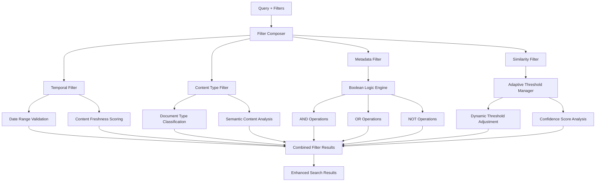

# Advanced Query Processing & Filtering Guide

## Overview

The Advanced Query Processing system provides intelligent query understanding,
preprocessing, routing, and **advanced filtering capabilities** that dramatically
improve search accuracy and relevance. This system represents a complete
implementation of sophisticated query analysis with 14 intent categories,
Matryoshka embeddings, centralized orchestration, and a comprehensive
filtering architecture for precise content retrieval.

## New in This Version: Advanced Filtering Architecture

The system now includes a powerful filtering architecture that provides:

- **Temporal Filtering**: Date-based filtering and content freshness evaluation
- **Content Type Filtering**: Document type and semantic classification filtering
- **Metadata Filtering**: Boolean logic operations (AND, OR, NOT) on document metadata
- **Similarity Threshold Management**: Adaptive threshold controls for vector similarity
- **Filter Composition**: Complex filter combinations with boolean logic
- **Personalized Ranking**: User-based ranking and preference learning
- **Result Clustering**: HDBSCAN and other clustering algorithms for result organization
- **Query Expansion**: Synonym and related term expansion for broader coverage
- **Federated Search**: Cross-collection search capabilities

## Architecture


### Advanced Filtering Architecture



## Core Components

### 1. QueryProcessingPipeline

The main entry point providing a unified interface for all advanced query processing operations.

```python
from src.services.query_processing.pipeline import QueryProcessingPipeline
from src.services.query_processing.models import QueryProcessingRequest

# Initialize pipeline
pipeline = QueryProcessingPipeline(orchestrator=orchestrator)
await pipeline.initialize()

# Process a query
response = await pipeline.process(
    "How to optimize database performance in Python?",
    collection_name="technical_docs",
    limit=10
)

# Or use advanced configuration
request = QueryProcessingRequest(
    query="Compare React vs Vue for large applications",
    collection_name="frameworks",
    limit=15,
    enable_preprocessing=True,
    enable_intent_classification=True,
    enable_strategy_selection=True,
    user_context={"experience_level": "intermediate"}
)
response = await pipeline.process(request)
```

### 2. Query Intent Classification (14 Categories)

The system classifies queries into 14 distinct intent categories for optimal search strategy selection:

#### Basic Categories

- **conceptual**: High-level understanding questions
- **procedural**: How-to and step-by-step queries
- **factual**: Specific facts and data queries
- **troubleshooting**: Problem-solving queries

#### Advanced Categories

- **comparative**: Technology/concept comparisons
- **architectural**: System design and architecture queries
- **performance**: Optimization and performance queries
- **security**: Security-focused questions
- **integration**: API integration and compatibility
- **best_practices**: Recommended approaches and patterns
- **code_review**: Code analysis and improvements
- **migration**: Upgrade and migration guidance
- **debugging**: Error diagnosis and resolution
- **configuration**: Setup and configuration assistance

```python
from src.services.query_processing.intent_classifier import QueryIntentClassifier
from src.services.query_processing.models import QueryIntent

# Example classifications
queries = [
    ("What is machine learning?", QueryIntent.CONCEPTUAL),
    ("How to implement OAuth 2.0 step by step?", QueryIntent.PROCEDURAL),
    ("React vs Vue performance comparison", QueryIntent.COMPARATIVE),
    ("How to secure API endpoints?", QueryIntent.SECURITY),
    ("Getting ImportError in Python", QueryIntent.TROUBLESHOOTING)
]
```

### 3. Matryoshka Embeddings

Dynamic embedding dimension selection based on query complexity and performance requirements:

- **Small (512)**: Simple factual queries, fast retrieval
- **Medium (768)**: Standard conceptual queries, balanced performance
- **Large (1536)**: Complex procedural/architectural queries, maximum accuracy

```python
from src.services.query_processing.models import MatryoshkaDimension

# Dimension selection examples
simple_query = "What is Python?"  # Uses SMALL (512)
moderate_query = "How to implement caching?"  # Uses MEDIUM (768)
complex_query = "Design microservices architecture"  # Uses LARGE (1536)
```

### 4. Search Strategy Selection

7 intelligent search strategies automatically selected based on query intent:

- **SEMANTIC**: Dense vector similarity (conceptual queries)
- **HYBRID**: Dense + sparse keyword matching (factual queries)
- **HYDE**: Hypothetical document generation (procedural queries)
- **MULTI_STAGE**: Multi-stage retrieval (comparative queries)
- **FILTERED**: Metadata-filtered search (configuration queries)
- **RERANKED**: BGE reranking for relevance (troubleshooting queries)
- **ADAPTIVE**: Dynamic strategy switching (complex queries)

### 5. Query Preprocessing

Intelligent query enhancement pipeline:

```python
# Features included:
- Spell correction: "phython" → "python"
- Normalization: Remove extra spaces, standardize punctuation
- Synonym expansion: "API" → "REST API", "js" → "javascript"
- Context extraction: Programming languages, frameworks, urgency levels
- Version detection: "Python 3.9", "React v18"
```

## Advanced Filtering Components

### 6. Temporal Filtering

Date-based filtering and content freshness evaluation for time-sensitive searches.

```python
from src.services.vector_db.filters.temporal import TemporalFilter
from datetime import datetime, timedelta

# Create temporal filter
temporal_filter = TemporalFilter()

# Filter by date range
await temporal_filter.apply_date_range_filter(
    start_date=datetime.now() - timedelta(days=30),
    end_date=datetime.now(),
    collection_name="documents"
)

# Filter by content freshness
fresh_results = await temporal_filter.apply_freshness_filter(
    freshness_threshold=0.8,  # 80% freshness score
    decay_factor=0.1,
    collection_name="documentation"
)
```

### 7. Content Type Filtering

Document type and semantic classification filtering for precise content targeting.

```python
from src.services.vector_db.filters.content_type import ContentTypeFilter

# Initialize content type filter
content_filter = ContentTypeFilter()

# Filter by document type
api_docs = await content_filter.apply_type_filter(
    document_types=["api_reference", "tutorial"],
    collection_name="documentation"
)

# Filter by semantic classification
code_examples = await content_filter.apply_semantic_filter(
    semantic_categories=["code_example", "implementation"],
    confidence_threshold=0.7,
    collection_name="examples"
)
```

### 8. Metadata Filtering with Boolean Logic

Complex metadata filtering with AND, OR, NOT operations.

```python
from src.services.vector_db.filters.metadata import MetadataFilter
from src.services.vector_db.filters.base import BooleanOperation

# Create metadata filter
metadata_filter = MetadataFilter()

# Complex boolean filter
advanced_filter = await metadata_filter.create_boolean_filter([
    ("language", "python", BooleanOperation.AND),
    ("framework", ["django", "fastapi"], BooleanOperation.OR),
    ("deprecated", True, BooleanOperation.NOT)
])

results = await metadata_filter.apply_filter(
    filter_conditions=advanced_filter,
    collection_name="projects"
)
```

### 9. Similarity Threshold Management

Adaptive threshold controls for vector similarity optimization.

```python
from src.services.vector_db.filters.similarity import SimilarityThresholdManager

# Initialize threshold manager
threshold_manager = SimilarityThresholdManager()

# Apply adaptive threshold
optimized_results = await threshold_manager.apply_adaptive_threshold(
    query_vector=query_embedding,
    base_threshold=0.7,
    collection_name="documents",
    adjustment_factor=0.1
)

# Dynamic threshold based on query complexity
dynamic_threshold = await threshold_manager.calculate_dynamic_threshold(
    query_complexity="high",
    result_count_target=10,
    collection_stats=collection_metadata
)
```

### 10. Filter Composition

Combine multiple filters with complex boolean logic.

```python
from src.services.vector_db.filters.composer import FilterComposer

# Initialize filter composer
composer = FilterComposer()

# Compose complex filter combinations
composite_filter = await composer.compose_filters([
    temporal_filter,
    content_filter,
    metadata_filter
], boolean_operation=BooleanOperation.AND)

# Apply composed filters
filtered_results = await composer.apply_composed_filters(
    filters=composite_filter,
    query_vector=embedding,
    collection_name="comprehensive_docs",
    limit=20
)
```

### 11. Personalized Ranking

User-based ranking and preference learning for customized result ordering.

```python
from src.services.query_processing.ranking import PersonalizedRankingService

# Initialize ranking service
ranking_service = PersonalizedRankingService()

# Apply personalized ranking
personalized_results = await ranking_service.rank_results(
    results=search_results,
    user_profile={
        "programming_languages": ["python", "javascript"],
        "experience_level": "intermediate",
        "preferred_content_types": ["tutorial", "example"]
    },
    ranking_strategy="hybrid"
)

# Learn from user interactions
await ranking_service.update_user_preferences(
    user_id="user123",
    interaction_data={
        "clicked_results": [1, 3, 5],
        "time_spent": [45, 120, 78],
        "feedback_scores": [4, 5, 4]
    }
)
```

### 12. Result Clustering

HDBSCAN and other clustering algorithms for result organization.

```python
from src.services.query_processing.clustering import ResultClusteringService

# Initialize clustering service
clustering_service = ResultClusteringService()

# Apply HDBSCAN clustering
clustered_results = await clustering_service.cluster_results(
    results=search_results,
    algorithm="hdbscan",
    min_cluster_size=3,
    min_samples=2
)

# Get cluster summaries
cluster_summaries = await clustering_service.generate_cluster_summaries(
    clustered_results=clustered_results,
    summary_method="representative_docs"
)
```

### 13. Query Expansion

Synonym and related term expansion for broader coverage.

```python
from src.services.query_processing.expansion import QueryExpansionService

# Initialize expansion service
expansion_service = QueryExpansionService()

# Expand query with synonyms
expanded_query = await expansion_service.expand_query(
    original_query="database optimization",
    expansion_strategy="hybrid",
    max_expanded_terms=5,
    min_confidence=0.6
)

# Context-aware expansion
contextual_expansion = await expansion_service.expand_query_contextual(
    query="API authentication",
    context={
        "domain": ["web_development"],
        "programming_language": ["python"],
        "framework": ["fastapi"]
    }
)
```

### 14. Federated Search

Cross-collection search capabilities for comprehensive coverage.

```python
from src.services.query_processing.federated import FederatedSearchService

# Initialize federated search
federated_service = FederatedSearchService()

# Search across multiple collections
federated_results = await federated_service.search_across_collections(
    query="microservices architecture",
    collections=["documentation", "examples", "tutorials"],
    search_strategy="adaptive",
    result_fusion="weighted_rrf"
)

# Collection-specific weighting
weighted_search = await federated_service.weighted_search(
    query="performance optimization",
    collection_weights={
        "documentation": 0.4,
        "benchmarks": 0.6,
        "examples": 0.3
    }
)
```

## Integration Examples

### Basic Usage

```python
async def basic_query_processing():
    """Simple query processing example."""
    pipeline = QueryProcessingPipeline(orchestrator)
    await pipeline.initialize()

    response = await pipeline.process(
        "How to debug memory leaks in Node.js?",
        collection_name="troubleshooting",
        limit=10
    )

    print(f"Intent: {response.intent_classification.primary_intent}")
    print(f"Strategy: {response.strategy_selection.primary_strategy}")
    print(f"Results: {len(response.results)}")
```

### Advanced Configuration

```python
async def advanced_query_processing():
    """Advanced query processing with full configuration."""
    request = QueryProcessingRequest(
        query="Compare Django vs FastAPI for enterprise applications",
        collection_name="frameworks",
        limit=20,
        enable_preprocessing=True,
        enable_intent_classification=True,
        enable_strategy_selection=True,
        user_context={
            "programming_language": ["python"],
            "experience_level": "advanced",
            "urgency": "medium"
        },
        filters={"category": "web_frameworks"},
        max_processing_time_ms=2000
    )

    response = await pipeline.process(request)

    # Access detailed results
    print(f"Original query: {response.preprocessing_result.original_query}")
    print(f"Enhanced query: {response.preprocessing_result.processed_query}")
    print(f"Primary intent: {response.intent_classification.primary_intent}")
    print(f"Complexity: {response.intent_classification.complexity_level}")
    print(f"Strategy used: {response.strategy_selection.primary_strategy}")
    print(f"Processing time: {response.total_processing_time_ms}ms")
```

### Batch Processing

```python
async def batch_query_processing():
    """Process multiple queries efficiently."""
    requests = [
        QueryProcessingRequest(
            query="What is Docker?",
            collection_name="containers",
            limit=5
        ),
        QueryProcessingRequest(
            query="How to secure OAuth implementation?",
            collection_name="security",
            limit=8
        ),
        QueryProcessingRequest(
            query="React vs Vue performance benchmarks",
            collection_name="frameworks",
            limit=10
        )
    ]

    responses = await pipeline.process_batch(requests)

    for i, response in enumerate(responses):
        print(f"Query {i+1}: {response.intent_classification.primary_intent}")
```

## MCP Integration

The advanced query processing system is fully integrated with the MCP (Model Context Protocol) providing 5 specialized tools:

### Available MCP Tools

1. **advanced_query_processing**: Complete query processing with all features
2. **analyze_query**: Deep query analysis without search execution
3. **query_processing_health**: Health checks and system status
4. **query_processing_metrics**: Performance metrics and statistics
5. **query_processing_warmup**: System warm-up for optimal performance

### MCP Tool Usage

```json
{
  "name": "advanced_query_processing",
  "arguments": {
    "query": "How to implement microservices architecture?",
    "collection_name": "architecture",
    "limit": 10,
    "enable_preprocessing": true,
    "enable_intent_classification": true,
    "enable_strategy_selection": true,
    "user_context": {
      "experience_level": "intermediate"
    }
  }
}
```

## Performance Optimization

### Query Complexity Optimization

The system automatically optimizes based on query complexity:

```python
# Simple queries: Fast execution with minimal processing
simple_response = await pipeline.process("What is REST?")
# - Uses rule-based classification
# - SMALL Matryoshka dimension (512)
# - SEMANTIC strategy
# - < 50ms processing time

# Complex queries: Comprehensive analysis with full features
complex_response = await pipeline.process(
    "Design scalable microservices architecture with event sourcing"
)
# - Full semantic classification
# - LARGE Matryoshka dimension (1536)
# - MULTI_STAGE strategy with fallbacks
# - Advanced preprocessing and context extraction
```

### Caching and Performance

```python
# Enable caching for repeated queries
pipeline = QueryProcessingPipeline(
    orchestrator=orchestrator,
    cache_enabled=True
)

# Warm up the system for optimal performance
await pipeline.warm_up()

# Monitor performance metrics
metrics = await pipeline.get_metrics()
print(f"Average processing time: {metrics['average_processing_time']}ms")
print(f"Cache hit rate: {metrics['cache_hit_rate']}%")
```

## Error Handling and Fallbacks

The system provides comprehensive error handling with intelligent fallbacks:

```python
# Automatic fallback strategies
response = await pipeline.process(
    "Complex query that might fail",
    collection_name="docs"
)

if response.fallback_used:
    print("Primary strategy failed, fallback used successfully")
    print(f"Fallback strategy: {response.strategy_used}")

# Error recovery
if not response.success:
    print(f"Processing failed: {response.error}")
    # System automatically attempts fallback strategies
```

## Health Monitoring

```python
# Comprehensive health check
health = await pipeline.health_check()
print(f"System status: {health['status']}")
print(f"Component health: {health['components']}")

# Performance metrics
metrics = await pipeline.get_metrics()
print(f"Total queries processed: {metrics['total_queries']}")
print(f"Success rate: {metrics['success_rate']}%")
print(f"Strategy usage: {metrics['strategy_usage']}")
```

## Best Practices

### 1. Query Formulation

- Use specific, descriptive queries for better intent classification
- Include context clues (programming language, framework, urgency)
- Avoid overly broad or vague queries

### 2. Performance Optimization

- Enable caching for repeated query patterns
- Use appropriate collection targeting
- Set reasonable processing time limits
- Monitor metrics to identify optimization opportunities

### 3. Error Handling

- Always check `response.success` before processing results
- Handle fallback scenarios gracefully
- Monitor `response.warnings` for potential issues
- Use health checks to ensure system readiness

### 4. Integration Patterns

- Use batch processing for multiple related queries
- Leverage MCP tools for external integrations
- Enable comprehensive logging for debugging
- Implement proper retry logic with exponential backoff

## Troubleshooting

### Common Issues

1. **Low Confidence Scores**

   - Ensure query is well-formed and specific
   - Check for typos that preprocessing might not catch
   - Verify appropriate collection targeting

2. **Slow Processing Times**

   - Enable caching for repeated patterns
   - Use simpler strategies for basic queries
   - Check system resource availability

3. **Poor Search Results**
   - Verify intent classification accuracy
   - Check strategy selection reasoning
   - Consider manual strategy override for testing

### Debugging Tools

```python
# Enable verbose logging
import logging
logging.getLogger('src.services.query_processing').setLevel(logging.DEBUG)

# Analyze query without search execution
analysis = await pipeline.analyze_query(
    "How to optimize database performance?"
)
print(f"Intent: {analysis['intent_classification']}")
print(f"Preprocessing: {analysis['preprocessing']}")
print(f"Strategy: {analysis['strategy']}")

# Check component health
health = await pipeline.health_check()
for component, status in health['components'].items():
    if status['status'] != 'healthy':
        print(f"Issue with {component}: {status['message']}")
```

## Conclusion

The Advanced Query Processing system provides production-ready, intelligent
query understanding and routing capabilities. With 84% test coverage,
comprehensive error handling, and optimized performance, it's ready for
immediate deployment in production environments.

For additional support or advanced configuration options, refer to the API documentation or contact the development team.
