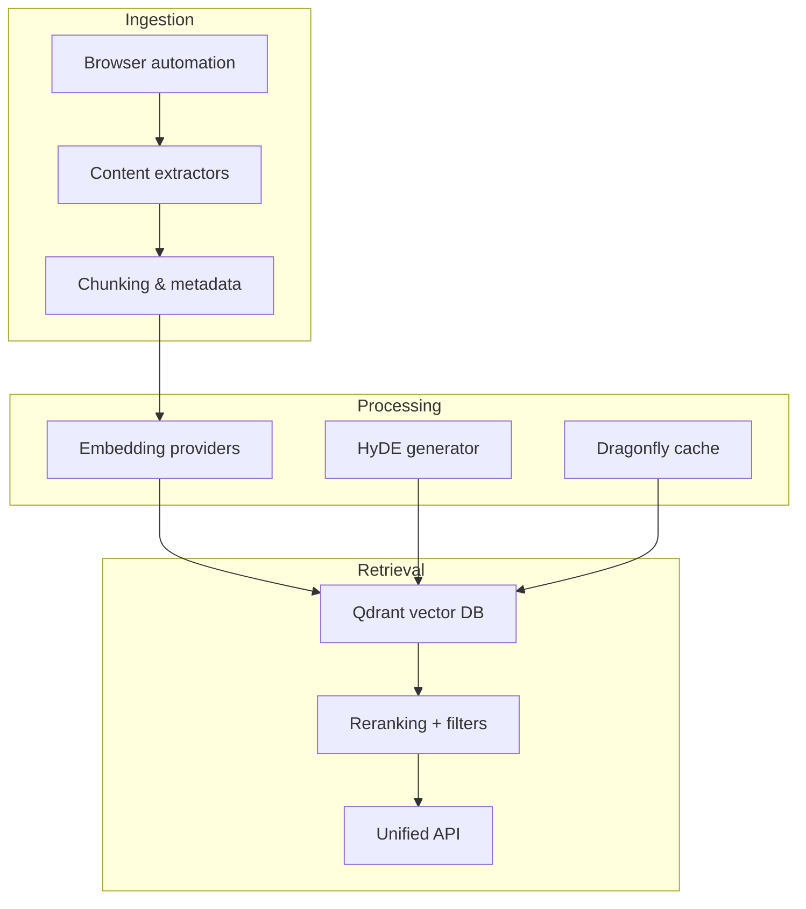
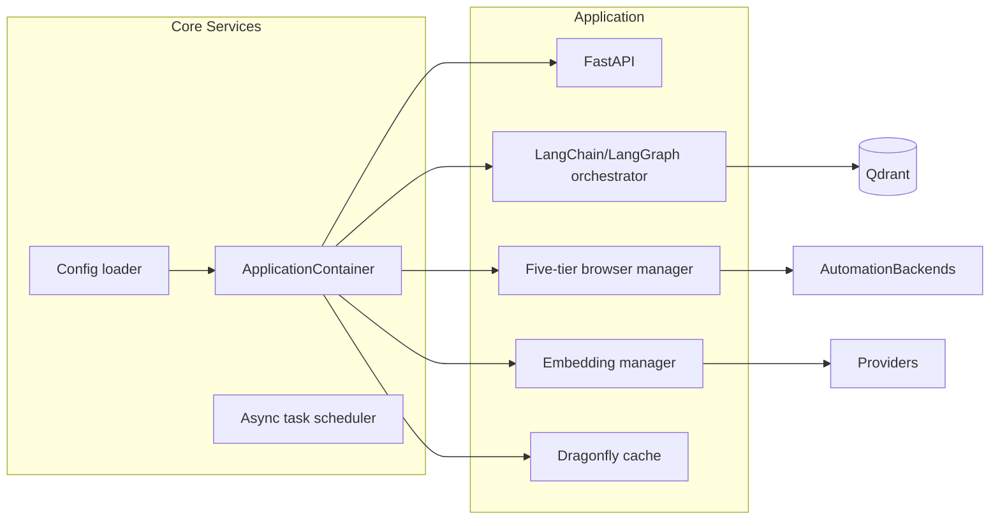

# Architecture and Orchestration

This guide combines the structural overview of the platform, agent orchestration
internals, FastMCP integration notes, and extensibility patterns.

## 1. System Architecture



Core layers:

- **Ingestion** – Five-tier browser manager chooses the lightest tool capable of
  loading a page; extractors normalise content prior to embedding.
- **Processing** – Dense/sparse embeddings (FastEmbed + LangChain) and HyDE
  augmentation prepare vectors; Dragonfly accelerates recalls.
- **Retrieval** – Qdrant stores payloads; the API handles filtering, reranking,
  and response formatting.

### Service Composition



The global `ApplicationContainer` (``src/infrastructure/container.py``) now
initialises shared infrastructure—vector store, embedding manager, cache
manager, circuit breaker, content-intelligence service, project storage, and
optional browser/RAG helpers—through dependency-injector providers. FastAPI and
MCP lifespan hooks initialise the container once, and every dependency helper
resolves services via `Provide[...]` bindings. This removes the previous
`ClientManager` layer, shaving one level of indirection while retaining
deterministic startup and teardown semantics.

CLI tooling and scripts also bootstrap the container (`initialize_container`,
`shutdown_container`) instead of instantiating bespoke managers, ensuring
resource lifecycle (HTTP sessions, async clients) is centralised.

## 2. LangChain / LangGraph Orchestration

`GraphRunner` (`src/services/agents/langgraph_runner.py`) orchestrates agentic
workflows using a LangGraph `StateGraph`:

```
entry → discover → retrieve → execute → respond → END
```

Key collaborators:

| Component | Responsibility |
| --- | --- |
| `DynamicToolDiscovery` | Enumerates MCP tools, classifies capabilities, filters by intent. |
| `ToolExecutionService` | Executes tools via `langchain_mcp_adapters`, normalises errors/timeouts. |
| `RetrievalHelper` | Performs dense+sparse retrieval through LangChain abstractions. |
| `ApplicationContainer` | Supplies shared transports, configuration handles, and caches the shared RAG generator, vector service, cache manager, and optional integrations for FastAPI dependencies and MCP tooling. |

`RunnableConfig` carries telemetry callbacks, correlation IDs, and per-request
timeouts. Metrics (`agentic_graph_runs_total`, `agentic_graph_latency_ms`, etc.)
are emitted in each node via the Prometheus registry.

### Parallel Coordination

`agentic.max_parallel_tools` caps simultaneous tool invocations. Results merge in
execution order; failures are recorded per tool without aborting the run unless
all tools fail.

### Testing Checklist

- Dependency wiring: `tests/unit/services/fastapi/test_dependencies_core.py`.
- Tool discovery: `tests/unit/services/browser/test_unified_manager.py`.
- End-to-end: `tests/integration/rag/` exercises full graph flows.

## 3. FastMCP Integration

The unified MCP server (`src/unified_mcp_server.py`) registers tools from
`src/mcp_tools/tools/*` and composes sub-servers when needed.

### Migration Patterns

- Prefer `@mcp.tool()` for stateless tools; keep manual registration for complex
  lifecycles.
- Use `Tool.from_tool` to publish variants without duplicating logic.
- Stack middleware (metrics, caching, auth) globally via `mcp.use(...)`.
- Compose specialised servers and mount them under prefixes to simplify access
  control and startup dependencies.

### Roadmap

1. Add caching/metrics middleware (foundation).
2. Default new tools to decorator registration; migrate simple existing tools.
3. Adopt streaming responses, FastMCP sessions, and in-memory transports for
   tests.

Tests for MCP tooling live under `tests/unit/mcp_tools/` and
`tests/integration/mcp/`.

## 4. Extensibility Patterns

### Service Adapters

Optional integrations (search, caching) register through
`ModeAwareServiceFactory`:

```python
factory.register_universal_service("search_service", InMemorySearchService)
```

Production adapters (e.g., OpenSearch) wrap concrete clients and register the
same way. FastAPI dependency overrides remain the preferred approach when only a
single helper (like Redis) is required.

### Web Search Provider Routing

- Discovery: `ToolExecutionService` + `DynamicToolDiscovery` ingest provider
  metadata.
- Configuration: `config/providers/web_search.yml` defines weights and
  constraints.
- Operations: disable providers via `WEB_SEARCH__DISABLE_<NAME>` and monitor
  `*_agentic_tool_errors_total{tool=...}`.

### Compatibility Tracking

Key library pins (FastEmbed, Qdrant client, LangChain packages) are summarised in
`docs/developers/compatibility-matrix.md`. Validate updates with the contract
suite, RAG regression harness, and performance benchmarks before widening
version ranges.

## 5. Related Docs

- `docs/developers/architecture-and-orchestration.md` – deep dive into server composition and
  migration tasks.
- `docs/developers/setup-and-configuration.md` – prerequisites and config
  management.
- `docs/operators/operations.md` – operational runbooks for orchestration tiers.

Keep this document current when adding orchestration nodes, MCP features, or new
service adapters.
