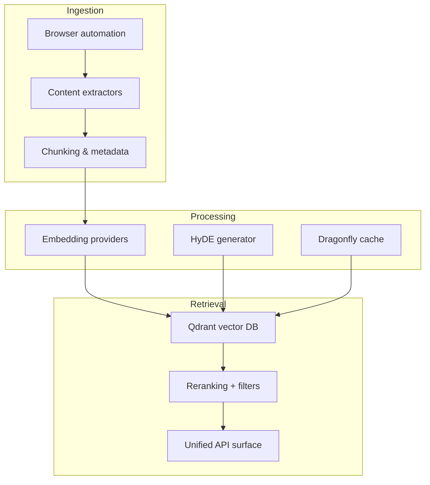
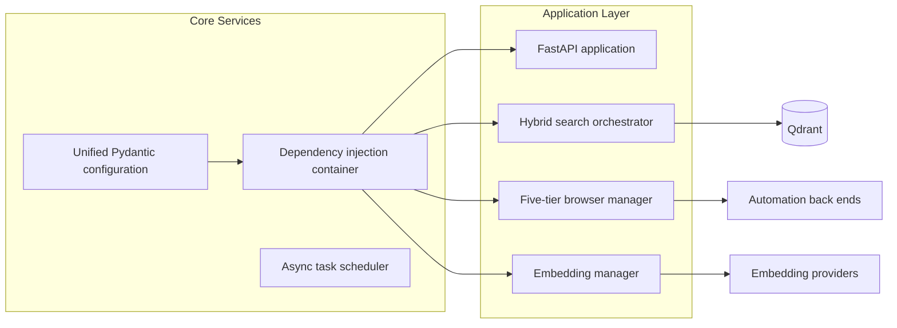

# System Architecture

## Runtime Modes

The platform supports two deployment tiers that share the same core components:

- **Simple mode** – minimal service footprint for local development and lightweight pilots
- **Enterprise mode** – enables full observability, advanced browser automation, and hybrid search tuning for production-scale workloads

Both modes are assembled from the same configuration package and dependency injection container, allowing features to be toggled without branching code.

## High-Level View

- **Ingestion layer** – Browser automation chooses the lightest tool capable of loading a page. Extractors clean the content and the chunker normalises metadata before it reaches embedding jobs.
- **Processing layer** – Embedding providers (dense and sparse) and HyDE synthesis prepare vectors. Dragonfly cache accelerates repeat lookups and reranking candidates.
- **Retrieval layer** – Qdrant stores hybrid vectors; the query pipeline performs filtering, reranking, and scoring before returning responses via the unified API.

## Service Composition

- **Unified configuration** – A single Pydantic settings module exposes environment-specific values (API credentials, provider toggles, rate limits)
- **Dependency injection container** – Registers services with explicit lifetimes, preventing circular dependencies and simplifying overrides in tests
- **Hybrid search orchestrator** – Coordinates dense, sparse, and reranking stages; supports budget controls and fallback strategies
- **Browser manager** – Routes requests through lightweight HTTP fetchers, Crawl4AI tiers, browser-use, or Playwright depending on page complexity

## Data Stores and Caches

- **Qdrant** – Primary vector store for dense + sparse embeddings, payload metadata, and filtering
- **DragonflyDB** – Near in-memory cache for hot query results and embeddings
- **Object storage** (optional) – Retains scraped artefacts for reprocessing

## Operational Considerations

- **Observability** – Prometheus metrics and structured logs are emitted by each service
- **Security** – Requests flow through middleware enforcing authentication, rate limiting, and content validation
- **Extensibility** – New embedding providers or automation tiers can be registered via the DI container without modifying callers