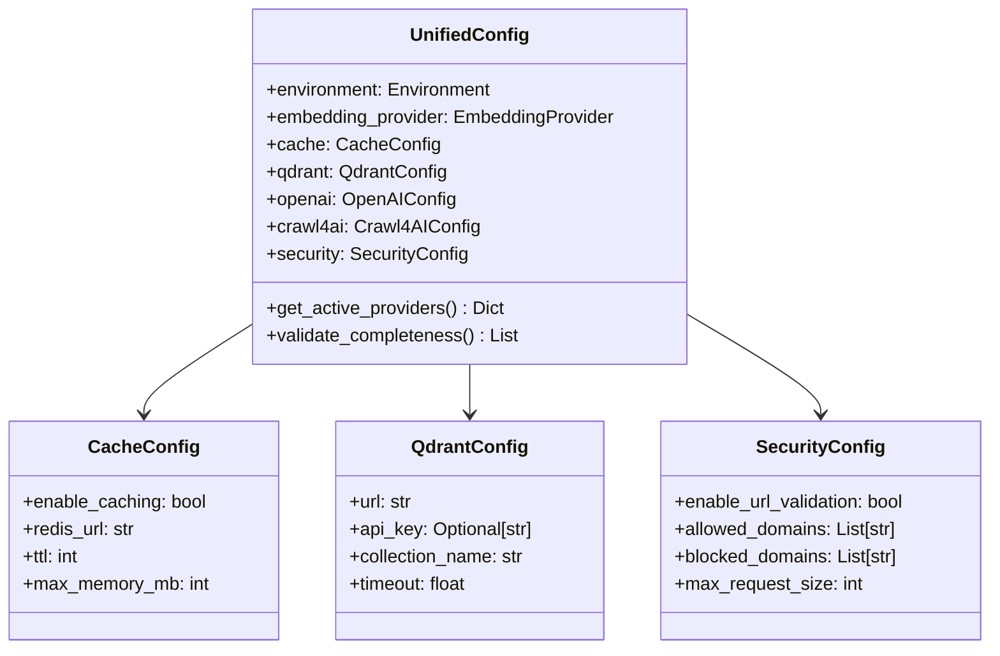

# Configuration Guide

> **Status**: Active  
> **Last Updated**: 2025-01-09  
> **Purpose**: Complete configuration system documentation  
> **Audience**: Developers configuring and deploying the system

This comprehensive guide covers the unified configuration system, environment setup, provider configuration, and deployment patterns for the AI Documentation Vector DB system.

## 🚀 Quick Configuration Start

### Essential Environment Setup

```bash
# Required API keys
export OPENAI_API_KEY="sk-..."
export ANTHROPIC_API_KEY="sk-ant-..."

# Optional services
export QDRANT_URL="http://localhost:6333"
export REDIS_URL="redis://localhost:6379"
export FIRECRAWL_API_KEY="fc-..."

# Environment
export AI_DOCS__ENVIRONMENT="development"
export AI_DOCS__DEBUG="true"
```

### Basic Configuration File

```json
{
  "environment": "development",
  "embedding_provider": "openai",
  "openai": {
    "api_key": "${OPENAI_API_KEY}",
    "model": "text-embedding-3-small"
  },
  "qdrant": {
    "url": "http://localhost:6333"
  }
}
```

## 🏗️ Unified Configuration System

### Architecture Overview

The system uses a comprehensive unified configuration model built with Pydantic v2 that consolidates all application settings into a single, well-structured configuration with complete validation and type safety.



### Configuration Structure

#### Root Configuration Properties

```python
class UnifiedConfig(BaseSettings):
    # Environment settings
    environment: Environment  # development, testing, production
    debug: bool = False
    log_level: LogLevel = LogLevel.INFO
    
    # Application metadata
    app_name: str = "AI Documentation Vector DB"
    version: str = "1.0.0"
    
    # Provider selection
    embedding_provider: EmbeddingProvider  # openai, fastembed
    crawl_provider: CrawlProvider = CrawlProvider.CRAWL4AI
    
    # Component configurations
    cache: CacheConfig = Field(default_factory=CacheConfig)
    qdrant: QdrantConfig = Field(default_factory=QdrantConfig)
    openai: OpenAIConfig = Field(default_factory=OpenAIConfig)
    crawl4ai: Crawl4AIConfig = Field(default_factory=Crawl4AIConfig)
    security: SecurityConfig = Field(default_factory=SecurityConfig)
    performance: PerformanceConfig = Field(default_factory=PerformanceConfig)
    
    # File paths
    data_dir: Path = Path("./data")
    cache_dir: Path = Path("./cache")
    logs_dir: Path = Path("./logs")
```

## 🔧 Component Configuration

### Cache Configuration

#### Redis/DragonflyDB Cache Setup

```python
class CacheConfig(BaseModel):
    enable_caching: bool = True
    enable_redis_cache: bool = True
    redis_url: str = "redis://localhost:6379"
    redis_db: int = 0
    redis_max_connections: int = 20
    
    # TTL settings
    default_ttl: int = 3600  # 1 hour
    search_cache_ttl: int = 1800  # 30 minutes
    embedding_cache_ttl: int = 86400  # 24 hours
    
    # Memory limits
    max_memory_mb: int = 1024
    max_cache_size: int = 10000  # Max cached items
```

#### Cache Usage Example

```python
from src.config import get_config
from src.services.cache import CacheManager

config = get_config()
cache_manager = CacheManager(config.cache)

# Use cache with automatic TTL
result = await cache_manager.get_or_compute(
    key="embeddings:hello_world",
    compute_fn=lambda: generate_embeddings(["Hello world"]),
    ttl=config.cache.embedding_cache_ttl
)
```

### Vector Database Configuration

#### Qdrant Setup

```python
class QdrantConfig(BaseModel):
    url: str = "http://localhost:6333"
    api_key: Optional[str] = None
    collection_name: str = "documents"
    timeout: float = 30.0
    max_retries: int = 3
    
    # Vector settings
    vector_size: int = 1536  # OpenAI ada-002 dimensions
    distance_metric: str = "Cosine"
    
    # Performance optimization
    enable_quantization: bool = True
    hnsw_config: HNSWConfig = Field(default_factory=HNSWConfig)
    
    # Collection aliases for zero-downtime updates
    enable_aliases: bool = True
    alias_prefix: str = "current"
```

#### HNSW Optimization

```python
class HNSWConfig(BaseModel):
    m: int = 16  # Number of connections per layer
    ef_construct: int = 200  # Search width during construction
    ef: int = 100  # Search width during search
    max_indexing_threads: int = 0  # Auto-detect
```

#### Advanced Qdrant Configuration

```python
# Production-optimized Qdrant setup
production_qdrant_config = QdrantConfig(
    url="http://qdrant-cluster:6333",
    api_key="${QDRANT_API_KEY}",
    collection_name="prod_documents",
    timeout=60.0,
    max_retries=5,
    
    # High-performance HNSW
    hnsw_config=HNSWConfig(
        m=32,  # Higher connectivity for better recall
        ef_construct=400,  # More thorough indexing
        ef=200,  # Higher search quality
    ),
    
    # Enable quantization for memory efficiency
    enable_quantization=True,
    enable_aliases=True
)
```

### Embedding Provider Configuration

#### OpenAI Configuration

```python
class OpenAIConfig(BaseModel):
    api_key: str = Field(..., min_length=1)
    model: EmbeddingModel = EmbeddingModel.TEXT_EMBEDDING_3_SMALL
    batch_size: int = 100
    timeout: float = 30.0
    max_retries: int = 3
    
    # Cost optimization
    enable_batch_processing: bool = True
    max_tokens_per_minute: int = 1000000
    
    # Quality settings
    dimensions: Optional[int] = None  # Use model default
    encoding_format: str = "float"
```

#### FastEmbed Configuration

```python
class FastEmbedConfig(BaseModel):
    model_name: str = "BAAI/bge-small-en-v1.5"
    cache_dir: Path = Path("./models")
    max_length: int = 512
    batch_size: int = 32
    
    # Performance settings
    device: str = "cpu"  # or "cuda" for GPU
    threads: int = 4
    enable_parallel_processing: bool = True
```

#### Provider Selection Logic

```python
# Automatic provider configuration
config = UnifiedConfig(
    embedding_provider="openai",  # Primary provider
    
    # Provider-specific configurations
    openai=OpenAIConfig(
        api_key="${OPENAI_API_KEY}",
        model="text-embedding-3-small"
    ),
    
    fastembed=FastEmbedConfig(
        model_name="BAAI/bge-small-en-v1.5",
        device="cpu"
    )
)

# Get active provider config
providers = config.get_active_providers()
embedding_config = providers["embedding"]  # Returns OpenAIConfig
```

### Web Scraping Configuration

#### Crawl4AI Configuration

```python
class Crawl4AIConfig(BaseModel):
    # Memory-Adaptive Dispatcher (recommended)
    enable_memory_adaptive_dispatcher: bool = True
    memory_threshold_percent: float = 70.0
    max_session_permit: int = 15
    dispatcher_check_interval: float = 1.0
    
    # Browser settings
    browser_type: str = "chromium"
    headless: bool = True
    viewport: dict = {"width": 1920, "height": 1080}
    page_timeout: float = 30.0
    
    # Performance settings
    max_concurrent_crawls: int = 10  # Fallback if dispatcher disabled
    enable_streaming: bool = True
    
    # Rate limiting with exponential backoff
    rate_limit_base_delay_min: float = 1.0
    rate_limit_base_delay_max: float = 2.0
    rate_limit_max_delay: float = 30.0
    rate_limit_max_retries: int = 2
```

#### Environment-Specific Crawl4AI Configurations

#### **High-Memory Systems (16GB+ RAM)**

```python
high_memory_config = Crawl4AIConfig(
    enable_memory_adaptive_dispatcher=True,
    memory_threshold_percent=80.0,      # Higher threshold
    max_session_permit=50,              # More concurrent sessions
    dispatcher_check_interval=0.5,      # Faster checks
    enable_streaming=True,
    
    # Aggressive rate limiting for high throughput
    rate_limit_base_delay_min=0.1,
    rate_limit_base_delay_max=0.5,
    rate_limit_max_delay=10.0,
    rate_limit_max_retries=3
)
```

#### **Memory-Constrained Systems (8GB or less)**

```python
low_memory_config = Crawl4AIConfig(
    enable_memory_adaptive_dispatcher=True,
    memory_threshold_percent=60.0,      # Conservative threshold
    max_session_permit=5,               # Limited sessions
    dispatcher_check_interval=2.0,      # Less frequent checks
    enable_streaming=False,             # Save memory
    
    # Conservative rate limiting
    rate_limit_base_delay_min=2.0,
    rate_limit_base_delay_max=5.0,
    rate_limit_max_delay=60.0,
    rate_limit_max_retries=1
)
```

#### **Streaming Mode Configuration**

```python
streaming_config = Crawl4AIConfig(
    enable_memory_adaptive_dispatcher=True,
    enable_streaming=True,
    memory_threshold_percent=75.0,
    max_session_permit=20,
    dispatcher_check_interval=0.5,
    
    # Optimized for streaming
    page_timeout=15.0,                  # Faster timeouts
    viewport={"width": 1280, "height": 720}  # Smaller viewport
)
```

#### Site-Specific Configurations

##### **React/Angular Documentation**

```python
spa_config = {
    "max_concurrent": 5,
    "page_timeout": 60.0,
    "wait_for": ".doc-content",
    "js_code": """
        // Wait for React hydration
        await new Promise(resolve => {
            if (document.querySelector('[data-hydrated="true"]')) {
                resolve();
            } else {
                const observer = new MutationObserver((mutations, obs) => {
                    if (document.querySelector('[data-hydrated="true"]')) {
                        obs.disconnect();
                        resolve();
                    }
                });
                observer.observe(document.body, {
                    attributes: true,
                    childList: true,
                    subtree: true
                });
            }
        });
    """
}
```

##### **API Documentation**

```python
api_docs_config = {
    "wait_for": ".api-endpoint",
    "extraction_type": "structured",
    "js_code": """
        // Expand all collapsible sections
        document.querySelectorAll('.expand-toggle').forEach(toggle => {
            if (!toggle.checked) toggle.click();
        });
    """
}
```

### Security Configuration

#### Security Validation Setup

```python
class SecurityConfig(BaseModel):
    enable_url_validation: bool = True
    enable_content_filtering: bool = True
    enable_rate_limiting: bool = True
    
    # URL validation
    allowed_domains: List[str] = []  # Empty = allow all
    blocked_domains: List[str] = [
        "localhost", "127.0.0.1", "0.0.0.0",
        "169.254.169.254"  # AWS metadata
    ]
    
    # Content limits
    max_request_size: int = 10 * 1024 * 1024  # 10MB
    max_query_length: int = 1000
    max_results_per_request: int = 100
    
    # Rate limiting
    requests_per_minute: int = 60
    burst_limit: int = 10
```

#### Security Usage

```python
from src.services.security import SecurityValidator

validator = SecurityValidator(config.security)

# Validate URL
validated_url = await validator.validate_url("https://docs.example.com")

# Validate search request
validated_request = await validator.validate_search_request(search_request)
```

### Performance Configuration

#### Performance Optimization Settings

```python
class PerformanceConfig(BaseModel):
    # Connection pooling
    max_connections: int = 100
    max_connections_per_host: int = 30
    connection_timeout: float = 10.0
    
    # Batch processing
    enable_batch_processing: bool = True
    batch_size: int = 32
    max_concurrent_batches: int = 5
    
    # Memory management
    max_memory_mb: int = 2048
    gc_threshold: int = 1000  # Objects before garbage collection
    
    # Timeouts
    request_timeout: float = 30.0
    embedding_timeout: float = 60.0
    search_timeout: float = 10.0
    
    # Monitoring
    enable_monitoring: bool = True
    enable_rate_limiting: bool = True
    metrics_collection_interval: int = 60  # seconds
```

## 🔄 Configuration Sources and Loading

### Configuration Priority Order

1. **Environment Variables** (highest priority)
2. **Configuration Files** (JSON, YAML, TOML)
3. **`.env` Files**
4. **Default Values** (lowest priority)

### Environment Variables

All settings can be overridden using environment variables with the `AI_DOCS__` prefix:

```bash
# Simple values
export AI_DOCS__ENVIRONMENT=production
export AI_DOCS__DEBUG=false

# Nested values (use double underscore)
export AI_DOCS__OPENAI__API_KEY=sk-your-api-key
export AI_DOCS__CACHE__REDIS_URL=redis://localhost:6379

# Arrays (as JSON)
export AI_DOCS__SECURITY__ALLOWED_DOMAINS='["example.com", "docs.example.com"]'

# Boolean values
export AI_DOCS__CACHE__ENABLE_CACHING=true
export AI_DOCS__PERFORMANCE__ENABLE_BATCH_PROCESSING=false
```

### Configuration Files

#### JSON Configuration

```json
{
  "environment": "production",
  "embedding_provider": "openai",
  "debug": false,
  "openai": {
    "api_key": "${OPENAI_API_KEY}",
    "model": "text-embedding-3-small",
    "batch_size": 100
  },
  "qdrant": {
    "url": "http://localhost:6333",
    "collection_name": "documents",
    "enable_quantization": true
  },
  "cache": {
    "enable_caching": true,
    "redis_url": "redis://localhost:6379",
    "default_ttl": 3600
  },
  "security": {
    "enable_url_validation": true,
    "blocked_domains": ["localhost", "127.0.0.1"]
  }
}
```

#### YAML Configuration

```yaml
environment: production
embedding_provider: openai
debug: false

openai:
  api_key: ${OPENAI_API_KEY}
  model: text-embedding-3-small
  batch_size: 100

qdrant:
  url: http://localhost:6333
  collection_name: documents
  enable_quantization: true

cache:
  enable_caching: true
  redis_url: redis://localhost:6379
  default_ttl: 3600

security:
  enable_url_validation: true
  blocked_domains:
    - localhost
    - 127.0.0.1
```

### Configuration Loading

#### Basic Loading

```python
from src.config import get_config, UnifiedConfig

# Load default configuration
config = get_config()

# Load from specific file
config = UnifiedConfig.from_file("config.json")

# Load with environment variables
config = UnifiedConfig.from_env()
```

#### Advanced Loading

```python
from src.config.loader import ConfigLoader

# Load from multiple sources
config = ConfigLoader.load_config(
    config_file="config.json",
    env_file=".env",
    include_env=True,
    override_values={
        "debug": True,
        "cache.enable_caching": False
    }
)

# Validate configuration
is_valid, issues = ConfigLoader.validate_config(config)
if not is_valid:
    for issue in issues:
        print(f"Configuration issue: {issue}")
```

## 📋 Configuration Templates

### Available Templates

Pre-configured templates are available in `config/templates/`:

#### 1. Production Template

```json
{
  "environment": "production",
  "debug": false,
  "log_level": "INFO",
  "embedding_provider": "openai",
  
  "openai": {
    "api_key": "${OPENAI_API_KEY}",
    "model": "text-embedding-3-small",
    "batch_size": 100,
    "timeout": 60.0
  },
  
  "qdrant": {
    "url": "${QDRANT_URL}",
    "timeout": 60.0,
    "max_retries": 5,
    "enable_quantization": true,
    "hnsw_config": {
      "m": 32,
      "ef_construct": 400,
      "ef": 200
    }
  },
  
  "cache": {
    "enable_caching": true,
    "redis_url": "${REDIS_URL}",
    "default_ttl": 3600,
    "max_memory_mb": 2048
  },
  
  "crawl4ai": {
    "enable_memory_adaptive_dispatcher": true,
    "memory_threshold_percent": 75.0,
    "max_session_permit": 30,
    "enable_streaming": true
  },
  
  "security": {
    "enable_url_validation": true,
    "enable_rate_limiting": true,
    "requests_per_minute": 100
  },
  
  "performance": {
    "max_connections": 200,
    "enable_batch_processing": true,
    "enable_monitoring": true
  }
}
```

#### 2. Development Template

```json
{
  "environment": "development",
  "debug": true,
  "log_level": "DEBUG",
  "embedding_provider": "openai",
  
  "openai": {
    "api_key": "${OPENAI_API_KEY}",
    "model": "text-embedding-3-small",
    "batch_size": 10
  },
  
  "qdrant": {
    "url": "http://localhost:6333",
    "timeout": 30.0
  },
  
  "cache": {
    "enable_caching": true,
    "redis_url": "redis://localhost:6379",
    "default_ttl": 300
  },
  
  "crawl4ai": {
    "enable_memory_adaptive_dispatcher": true,
    "memory_threshold_percent": 60.0,
    "max_session_permit": 5,
    "headless": false
  },
  
  "security": {
    "enable_url_validation": false,
    "enable_rate_limiting": false
  },
  
  "performance": {
    "max_connections": 50,
    "enable_monitoring": true
  }
}
```

#### 3. Testing Template

```json
{
  "environment": "testing",
  "debug": false,
  "log_level": "WARNING",
  "embedding_provider": "fastembed",
  
  "fastembed": {
    "model_name": "BAAI/bge-small-en-v1.5",
    "device": "cpu",
    "batch_size": 16
  },
  
  "qdrant": {
    "url": "http://localhost:6333",
    "collection_name": "test_documents",
    "timeout": 10.0
  },
  
  "cache": {
    "enable_caching": false
  },
  
  "crawl4ai": {
    "enable_memory_adaptive_dispatcher": false,
    "max_concurrent_crawls": 2,
    "page_timeout": 5.0
  },
  
  "security": {
    "enable_url_validation": false,
    "enable_rate_limiting": false
  }
}
```

### Using Templates

```bash
# Copy a template
cp config/templates/production.json config.json

# Set environment-specific values
export AI_DOCS__OPENAI__API_KEY=sk-your-api-key
export AI_DOCS__QDRANT_URL=http://your-qdrant:6333

# Validate configuration
python -m src.config.cli validate -c config.json
```

## 🔄 Configuration Management CLI

### Available Commands

The system includes a comprehensive CLI for configuration management:

```bash
# Create example configuration
python -m src.config.cli create-example -o config.json

# Create .env template
python -m src.config.cli create-env-template

# Validate configuration
python -m src.config.cli validate -c config.json

# Convert between formats
python -m src.config.cli convert config.json config.yaml --to-format yaml

# Show active providers
python -m src.config.cli show-providers

# Check service connections
python -m src.config.cli check-connections

# Generate schema
python -m src.config.cli generate-schema -o schema/

# Show schema in terminal
python -m src.config.cli show-schema
```

### CLI Usage Examples

#### Validate Configuration

```bash
$ python -m src.config.cli validate -c config.json --show-config
✓ Configuration is valid!

Active Providers:
- Embedding: openai (text-embedding-3-small)
- Crawling: crawl4ai (Memory-Adaptive Dispatcher)
- Cache: redis (localhost:6379)

Configuration Summary:
- Environment: production
- Debug: false
- Security: enabled
- Monitoring: enabled
```

#### Check Service Connections

```bash
$ python -m src.config.cli check-connections
Checking Service Connections...

🔍 Checking Qdrant...
✓ Qdrant connected (3 collections)
  - documents: 1500 points
  - test_docs: 250 points
  - archives: 800 points

🔍 Checking Redis...
✓ Redis connected
  - Memory usage: 45MB
  - Connected clients: 2

🔍 Checking OpenAI...
✓ OpenAI connected
  - Model: text-embedding-3-small
  - Rate limit: 3000 RPM
```

## 🚀 Deployment Configuration Patterns

### Docker Configuration

#### Docker Compose Environment

```yaml
# docker-compose.yml
version: '3.8'

services:
  ai-docs-vector-db:
    build: .
    environment:
      - AI_DOCS__ENVIRONMENT=production
      - AI_DOCS__OPENAI__API_KEY=${OPENAI_API_KEY}
      - AI_DOCS__QDRANT__URL=http://qdrant:6333
      - AI_DOCS__CACHE__REDIS_URL=redis://redis:6379
      - AI_DOCS__DEBUG=false
    volumes:
      - ./config:/app/config:ro
      - ./logs:/app/logs
    depends_on:
      - qdrant
      - redis

  qdrant:
    image: qdrant/qdrant:latest
    volumes:
      - qdrant_data:/qdrant/storage

  redis:
    image: dragonflydb/dragonfly:latest
    volumes:
      - redis_data:/data
```

#### Kubernetes Configuration

```yaml
# k8s-configmap.yaml
apiVersion: v1
kind: ConfigMap
metadata:
  name: ai-docs-config
data:
  config.json: |
    {
      "environment": "production",
      "embedding_provider": "openai",
      "qdrant": {
        "url": "http://qdrant-service:6333"
      },
      "cache": {
        "redis_url": "redis://redis-service:6379"
      }
    }

---
apiVersion: v1
kind: Secret
metadata:
  name: ai-docs-secrets
type: Opaque
data:
  openai-api-key: # base64 encoded key
  anthropic-api-key: # base64 encoded key
```

### Environment-Specific Configurations

#### Production Deployment

```bash
# Production environment setup
export AI_DOCS__ENVIRONMENT=production
export AI_DOCS__DEBUG=false
export AI_DOCS__LOG_LEVEL=INFO

# High-performance settings
export AI_DOCS__PERFORMANCE__MAX_CONNECTIONS=200
export AI_DOCS__PERFORMANCE__ENABLE_BATCH_PROCESSING=true
export AI_DOCS__CACHE__MAX_MEMORY_MB=4096

# Security hardening
export AI_DOCS__SECURITY__ENABLE_URL_VALIDATION=true
export AI_DOCS__SECURITY__ENABLE_RATE_LIMITING=true
export AI_DOCS__SECURITY__REQUESTS_PER_MINUTE=100

# Monitoring and observability
export AI_DOCS__PERFORMANCE__ENABLE_MONITORING=true
export AI_DOCS__LOG_LEVEL=INFO
```

#### Staging Environment

```bash
# Staging environment setup
export AI_DOCS__ENVIRONMENT=staging
export AI_DOCS__DEBUG=false
export AI_DOCS__LOG_LEVEL=DEBUG

# Moderate performance settings
export AI_DOCS__PERFORMANCE__MAX_CONNECTIONS=100
export AI_DOCS__CACHE__MAX_MEMORY_MB=2048

# Relaxed security for testing
export AI_DOCS__SECURITY__REQUESTS_PER_MINUTE=200
export AI_DOCS__SECURITY__ENABLE_URL_VALIDATION=false
```

## 🔍 Monitoring and Validation

### Configuration Validation

#### Automatic Validation

```python
from src.config import get_config
from src.config.validator import ConfigValidator

# Load and validate configuration
config = get_config()

# Check for missing required settings
issues = config.validate_completeness()
if issues:
    for issue in issues:
        logger.error(f"Configuration issue: {issue}")

# Validate service connections
connection_results = await ConfigValidator.validate_connections(config)
for service, result in connection_results.items():
    if result["success"]:
        logger.info(f"✓ {service} connected")
    else:
        logger.error(f"✗ {service} failed: {result['error']}")
```

#### Manual Validation

```bash
# Comprehensive validation
python -m src.config.cli validate --comprehensive

# Check specific service
python -m src.config.cli check-service --service qdrant

# Generate validation report
python -m src.config.cli validate --report-file validation-report.json
```

### Runtime Configuration Monitoring

#### Configuration Change Detection

```python
import asyncio
from src.config.watcher import ConfigWatcher

async def monitor_config_changes():
    """Monitor configuration file changes and reload automatically."""
    watcher = ConfigWatcher("config.json")
    
    async def on_config_change(new_config):
        logger.info("Configuration changed, reloading...")
        # Validate new configuration
        is_valid, issues = ConfigValidator.validate_config(new_config)
        
        if is_valid:
            # Apply new configuration
            set_config(new_config)
            logger.info("Configuration reloaded successfully")
        else:
            logger.error(f"Invalid configuration: {issues}")
    
    watcher.add_change_handler(on_config_change)
    await watcher.start_monitoring()

# Start monitoring in background
asyncio.create_task(monitor_config_changes())
```

#### Health Checks

```python
from src.config.health import ConfigHealthChecker

async def periodic_health_check():
    """Perform periodic configuration health checks."""
    checker = ConfigHealthChecker(config)
    
    health_report = await checker.check_all()
    
    if health_report["overall_status"] == "healthy":
        logger.info("All configuration services healthy")
    else:
        logger.warning("Configuration health issues detected:")
        for issue in health_report["issues"]:
            logger.warning(f"  - {issue}")

# Run health check every 5 minutes
asyncio.create_task(
    schedule_periodic(periodic_health_check, interval=300)
)
```

## 📊 Configuration Best Practices

### 1. Environment-Specific Configuration

```bash
# Use different configurations for each environment
# Development
cp config/templates/development.json config.dev.json
export CONFIG_FILE=config.dev.json

# Production
cp config/templates/production.json config.prod.json
export CONFIG_FILE=config.prod.json
```

### 2. Secrets Management

```bash
# Never commit secrets to version control
echo ".env" >> .gitignore
echo "config.json" >> .gitignore
echo "*.secret" >> .gitignore

# Use environment variables for secrets
export AI_DOCS__OPENAI__API_KEY=${OPENAI_API_KEY}
export AI_DOCS__ANTHROPIC__API_KEY=${ANTHROPIC_API_KEY}
```

### 3. Configuration Validation

```python
# Always validate configuration at startup
def startup_validation():
    config = get_config()
    
    # Check required API keys
    if config.embedding_provider == "openai" and not config.openai.api_key:
        raise ConfigurationError("OpenAI API key required")
    
    # Validate service connections
    issues = asyncio.run(validate_service_connections(config))
    if issues:
        raise ConfigurationError(f"Service connection issues: {issues}")
    
    logger.info("Configuration validation successful")

startup_validation()
```

### 4. Performance Tuning

```python
# Adjust configuration based on system resources
import psutil

def optimize_config_for_system():
    config = get_config()
    
    # Adjust based on available memory
    available_memory_gb = psutil.virtual_memory().total / (1024**3)
    
    if available_memory_gb >= 16:
        # High-memory system
        config.crawl4ai.memory_threshold_percent = 80.0
        config.crawl4ai.max_session_permit = 50
        config.cache.max_memory_mb = 4096
    elif available_memory_gb >= 8:
        # Medium-memory system
        config.crawl4ai.memory_threshold_percent = 70.0
        config.crawl4ai.max_session_permit = 20
        config.cache.max_memory_mb = 2048
    else:
        # Low-memory system
        config.crawl4ai.memory_threshold_percent = 60.0
        config.crawl4ai.max_session_permit = 5
        config.cache.max_memory_mb = 1024
    
    return config
```

### 5. Configuration as Code

```python
# Track configuration in version control
def create_deployment_config():
    """Create configuration for deployment."""
    base_config = UnifiedConfig.from_template("production")
    
    # Environment-specific overrides
    deployment_overrides = {
        "qdrant.url": os.getenv("QDRANT_URL"),
        "cache.redis_url": os.getenv("REDIS_URL"),
        "performance.max_connections": int(os.getenv("MAX_CONNECTIONS", "200"))
    }
    
    # Apply overrides
    for key, value in deployment_overrides.items():
        set_nested_value(base_config, key, value)
    
    # Validate final configuration
    base_config.validate()
    
    return base_config
```

### 6. Testing Configuration

```python
# Test different configuration scenarios
@pytest.mark.parametrize("config_name", [
    "development", "testing", "production", "minimal"
])
def test_template_configuration(config_name):
    """Test that all template configurations are valid."""
    config = UnifiedConfig.from_template(config_name)
    
    # Basic validation
    assert config.environment is not None
    assert config.embedding_provider is not None
    
    # Provider-specific validation
    if config.embedding_provider == "openai":
        assert hasattr(config, "openai")
    elif config.embedding_provider == "fastembed":
        assert hasattr(config, "fastembed")
    
    # Service availability validation
    if config.cache.enable_caching:
        assert config.cache.redis_url is not None
```

## 🔧 Troubleshooting

### Common Configuration Issues

#### 1. Missing API Keys

```bash
Error: OpenAI API key required when using OpenAI embedding provider
Solution: Set AI_DOCS__OPENAI__API_KEY environment variable
```

#### 2. Invalid Environment Variables

```bash
Error: AI_DOCS__DEBUG: Invalid boolean value 'yes'
Solution: Use true/false, 1/0, on/off for boolean values
```

#### 3. Connection Failures

```bash
Error: Qdrant connection failed: Connection refused
Solution: Ensure Qdrant is running on the configured URL
```

#### 4. Memory Issues

```bash
Error: Memory threshold exceeded during crawling
Solution: Reduce memory_threshold_percent or max_session_permit in Crawl4AI config
```

### Debug Mode

Enable debug mode for detailed configuration information:

```bash
export AI_DOCS__DEBUG=true
export AI_DOCS__LOG_LEVEL=DEBUG

# Run with debug logging
python -m src.unified_mcp_server
```

### Configuration Diagnostics

```bash
# Run comprehensive diagnostics
python -m src.config.cli diagnose

# Output example:
Configuration Diagnostics Report
===============================

✓ Configuration file loaded successfully
✓ Environment variables validated
✓ All required settings present
✓ Service connections established

Warnings:
⚠ Cache memory limit (1GB) may be insufficient for production
⚠ Crawl4AI concurrency (50) high for 8GB system

Recommendations:
- Increase cache memory limit to 2GB
- Reduce max_session_permit to 20 for current system
- Enable quantization for Qdrant to save memory
```

This comprehensive configuration guide provides everything needed to properly configure, deploy, and monitor the AI Documentation Vector DB system across different environments and use cases.

---

*⚙️ Proper configuration is crucial for optimal performance and reliability. Follow the patterns and best practices outlined in this guide for successful deployments.*
