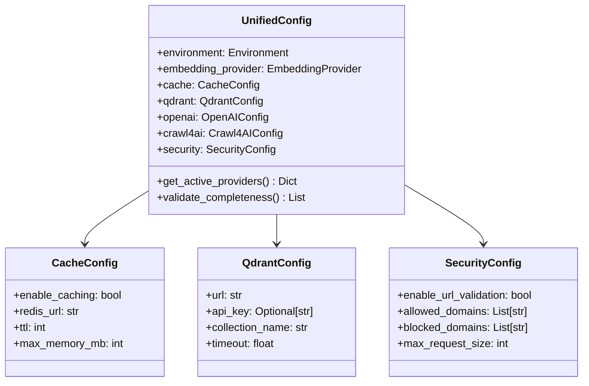

# Configuration Guide

> **Status**: Active  
> **Last Updated**: 2025-01-09  
> **Purpose**: Complete configuration system documentation  
> **Audience**: Developers configuring and deploying the system

This comprehensive guide covers the unified configuration system, environment setup,
provider configuration, and deployment patterns for the AI Documentation Vector DB system.

## 🚀 Quick Configuration Start

### Essential Environment Setup

```bash
# Required API keys
export OPENAI_API_KEY="sk-..."
export ANTHROPIC_API_KEY="sk-ant-..."

# Optional services
export QDRANT_URL="http://localhost:6333"
export REDIS_URL="redis://localhost:6379"
export FIRECRAWL_API_KEY="fc-..."

# Environment
export AI_DOCS__ENVIRONMENT="development"
export AI_DOCS__DEBUG="true"
```

### Basic Configuration File

```json
{
  "environment": "development",
  "embedding_provider": "openai",
  "openai": {
    "api_key": "${OPENAI_API_KEY}",
    "model": "text-embedding-3-small"
  },
  "qdrant": {
    "url": "http://localhost:6333"
  }
}
```

## 🏗️ Unified Configuration System

### Architecture Overview

The system uses a comprehensive unified configuration model built with Pydantic v2 that
consolidates all application settings into a single, well-structured configuration with
complete validation and type safety.



### Configuration Structure

#### Root Configuration Properties

```python
class UnifiedConfig(BaseSettings):
    # Environment settings
    environment: Environment  # development, testing, production
    debug: bool = False
    log_level: LogLevel = LogLevel.INFO

    # Application metadata
    app_name: str = "AI Documentation Vector DB"
    version: str = "1.0.0"

    # Provider selection
    embedding_provider: EmbeddingProvider  # openai, fastembed
    crawl_provider: CrawlProvider = CrawlProvider.CRAWL4AI

    # Component configurations
    cache: CacheConfig = Field(default_factory=CacheConfig)
    qdrant: QdrantConfig = Field(default_factory=QdrantConfig)
    openai: OpenAIConfig = Field(default_factory=OpenAIConfig)
    crawl4ai: Crawl4AIConfig = Field(default_factory=Crawl4AIConfig)
    security: SecurityConfig = Field(default_factory=SecurityConfig)
    performance: PerformanceConfig = Field(default_factory=PerformanceConfig)

    # File paths
    data_dir: Path = Path("./data")
    cache_dir: Path = Path("./cache")
    logs_dir: Path = Path("./logs")
```

## 🧙‍♂️ Advanced Configuration Management (BJO-87)

The system includes a comprehensive configuration management framework with interactive wizards, templates, backup/restore capabilities, and migration tools for safe configuration evolution.

### Configuration Wizard System

#### Interactive Setup Wizard

```python
from src.config.wizard import ConfigurationWizard

# Initialize wizard
wizard = ConfigurationWizard(base_dir=Path("config"))

# Run complete setup wizard
config_path = wizard.run_setup_wizard()

# Run specific wizard functions
wizard.run_validation_wizard(config_path)
backup_id = wizard.run_backup_wizard(config_path)
wizard.run_restore_wizard()
```

#### Wizard Modes

The configuration wizard supports four setup modes:

```python
# 1. Template-based setup
config_path = wizard._template_based_setup(
    config_path=None  # Auto-generated path
)

# 2. Interactive step-by-step setup
config_path = wizard._interactive_setup(
    config_path=Path("custom_config.json")
)

# 3. Migration setup
config_path = wizard._migration_setup(
    config_path=Path("existing_config.json")
)

# 4. Import setup
config_path = wizard._import_setup(
    config_path=Path("imported_config.json")
)
```

### Configuration Templates System

#### Template Management

```python
from src.config.templates import ConfigurationTemplates

# Initialize template manager
templates = ConfigurationTemplates()

# List available templates
available = templates.list_available_templates()
print(available)  # ['development', 'production', 'high_performance', ...]

# Get specific template
template = templates.get_template("production")
print(template.metadata.description)
print(template.configuration)

# Apply template to create configuration
config_data = templates.apply_template_to_config(
    template_name="production",
    base_config=existing_config,
    environment_overrides="staging"
)
```

#### Template Structure

```python
from src.config.templates import ConfigurationTemplate, TemplateMetadata

# Define custom template
custom_template = ConfigurationTemplate(
    metadata=TemplateMetadata(
        name="custom_api_server",
        description="API server optimized for high-throughput",
        use_case="REST API with heavy embedding workload",
        environment="production",
        tags=["api", "high-throughput", "embedding-optimized"]
    ),
    configuration={
        "environment": "production",
        "embedding_provider": "openai",
        "performance": {
            "max_concurrent_requests": 500,
            "enable_batch_processing": True,
            "batch_size": 100
        },
        "cache": {
            "enable_caching": True,
            "cache_ttl_seconds": {
                "embeddings": 172800,  # 48 hours
                "search": 7200        # 2 hours
            }
        }
    },
    overrides={
        "development": {
            "debug": True,
            "performance.max_concurrent_requests": 50
        },
        "staging": {
            "performance.max_concurrent_requests": 200
        }
    }
)

# Save custom template
templates.save_template(custom_template, "custom_api_server")
```

#### Predefined Templates

##### Development Template
- **Purpose**: Local development and testing
- **Features**: Debug logging, local database, fast iteration
- **Resource Usage**: Conservative (5-20 connections, 500MB memory)

##### Production Template  
- **Purpose**: Production deployment with security hardening
- **Features**: Security validation, performance optimization, monitoring
- **Resource Usage**: Optimized (20-50 connections, 2GB memory)

##### High Performance Template
- **Purpose**: Maximum throughput for high-traffic applications
- **Features**: Aggressive caching, large connection pools, minimal logging
- **Resource Usage**: Intensive (50-100 connections, 4GB memory)

##### Memory Optimized Template
- **Purpose**: Resource-constrained environments
- **Features**: Minimal memory usage, conservative settings
- **Resource Usage**: Minimal (3-15 connections, 256MB memory)

##### Distributed Template
- **Purpose**: Multi-node cluster deployments
- **Features**: Cluster configuration, load balancing, distributed caching
- **Resource Usage**: Scalable (30-75 connections, variable memory)

### Configuration Backup and Restore System

#### Backup Management

```python
from src.config.backup_restore import ConfigBackupManager

# Initialize backup manager
backup_manager = ConfigBackupManager(base_dir=Path("config"))

# Create backup
backup_id = backup_manager.create_backup(
    config_path=Path("config.json"),
    description="Pre-deployment backup",
    tags=["deployment", "production"],
    compress=True,
    incremental=False
)

print(f"Backup created: {backup_id}")
```

#### Backup Features

```python
# List backups with filtering
backups = backup_manager.list_backups(
    config_name="production",
    environment="production", 
    tags=["deployment"],
    limit=10
)

# Get backup metadata
metadata = backup_manager.get_backup_metadata(backup_id)
print(f"Created: {metadata.created_at}")
print(f"Size: {metadata.file_size} bytes")
print(f"Compressed: {metadata.compressed}")

# Export backup
success = backup_manager.export_backup(
    backup_id=backup_id,
    export_path=Path("backups/exported_config.json.gz")
)

# Import external backup
imported_id = backup_manager.import_backup(
    backup_path=Path("external_backup.json"),
    metadata_path=Path("external_backup.metadata.json")
)
```

#### Restore Operations

```python
# Restore backup
result = backup_manager.restore_backup(
    backup_id=backup_id,
    target_path=Path("restored_config.json"),
    create_pre_restore_backup=True,
    force=False
)

if result.success:
    print(f"Restored to: {result.config_path}")
    if result.pre_restore_backup:
        print(f"Pre-restore backup: {result.pre_restore_backup}")
else:
    print("Restore failed:")
    for warning in result.warnings:
        print(f"  Warning: {warning}")
    for conflict in result.conflicts:
        print(f"  Conflict: {conflict}")
```

#### Backup Cleanup and Maintenance

```python
# Cleanup old backups
deleted_backups = backup_manager.cleanup_old_backups(
    config_name="production",
    keep_count=10,      # Keep 10 most recent
    keep_days=30        # Keep backups from last 30 days
)

print(f"Deleted {len(deleted_backups)} old backups")

# Delete specific backup
success = backup_manager.delete_backup(
    backup_id=backup_id,
    remove_file=True
)
```

### Configuration Migration System

#### Migration Management

```python
from src.config.migrations import ConfigMigrationManager

# Initialize migration manager
migration_manager = ConfigMigrationManager(base_dir=Path("config"))

# Check current version
current_version = migration_manager.get_current_version(
    config_path=Path("config.json")
)
print(f"Current version: {current_version}")

# Create migration plan
plan = migration_manager.create_migration_plan(
    current_version="1.0.0",
    target_version="2.0.0"
)

if plan:
    print(f"Migration path: {current_version} → {plan.target_version}")
    print(f"Steps: {len(plan.migrations)}")
    print(f"Estimated duration: {plan.estimated_duration}")
    print(f"Requires downtime: {plan.requires_downtime}")
```

#### Applying Migrations

```python
# Apply migration plan
results = migration_manager.apply_migration_plan(
    plan=plan,
    config_path=Path("config.json"),
    dry_run=False,
    force=False
)

# Check results
for result in results:
    if result.success:
        print(f"✅ {result.migration_id}")
        if result.backup_id:
            print(f"   Backup: {result.backup_id}")
        for change in result.changes_made:
            print(f"   • {change}")
    else:
        print(f"❌ {result.migration_id}")
        for error in result.errors:
            print(f"   Error: {error}")
```

#### Custom Migrations

```python
# Register custom migration
@migration_manager.register_migration(
    from_version="1.0.0",
    to_version="1.1.0", 
    description="Add new caching configuration",
    requires_backup=True,
    tags=["cache", "performance"]
)
def add_cache_config(config: dict[str, Any]) -> tuple[dict[str, Any], list[str]]:
    """Add enhanced cache configuration structure."""
    changes = []
    
    if "cache" not in config:
        config["cache"] = {}
        changes.append("Added cache configuration section")
    
    cache_config = config["cache"]
    
    if "enable_warming" not in cache_config:
        cache_config["enable_warming"] = True
        changes.append("Enabled cache warming")
    
    if "cache_key_patterns" not in cache_config:
        cache_config["cache_key_patterns"] = {
            "embeddings": "embeddings:{model}:{hash}",
            "search": "search:{query_hash}"
        }
        changes.append("Added cache key patterns")
    
    return config, changes

# Register rollback function
@migration_manager.register_rollback("1.0.0_to_1.1.0")
def rollback_cache_config(config: dict[str, Any]) -> tuple[dict[str, Any], list[str]]:
    """Remove enhanced cache configuration."""
    changes = []
    
    if "cache" in config:
        cache_config = config["cache"]
        
        if "enable_warming" in cache_config:
            del cache_config["enable_warming"]
            changes.append("Removed cache warming setting")
        
        if "cache_key_patterns" in cache_config:
            del cache_config["cache_key_patterns"] 
            changes.append("Removed cache key patterns")
    
    return config, changes
```

#### Migration Rollback

```python
# Rollback specific migration
result = migration_manager.rollback_migration(
    migration_id="1.0.0_to_1.1.0",
    config_path=Path("config.json"),
    dry_run=False
)

if result.success:
    print(f"✅ Rollback successful: {result.migration_id}")
    print(f"Version: {result.from_version} → {result.to_version}")
    for change in result.changes_made:
        print(f"  • {change}")
else:
    print(f"❌ Rollback failed: {result.migration_id}")
    for error in result.errors:
        print(f"  Error: {error}")
```

### Enhanced Configuration Validation

#### Validation System

```python
from src.config.enhanced_validators import ConfigurationValidator

# Initialize validator
validator = ConfigurationValidator(environment="production")

# Validate configuration
report = validator.validate_configuration(config)

# Check validation results
if report.is_valid:
    print("✅ Configuration is valid")
else:
    print("❌ Configuration has issues:")
    
    for error in report.errors:
        print(f"  Error: {error}")
        if error.suggestion:
            print(f"    💡 {error.suggestion}")
        if error.fix_command:
            print(f"    🔧 {error.fix_command}")
    
    for warning in report.warnings:
        print(f"  Warning: {warning}")
```

#### Custom Validation Rules

```python
from src.config.enhanced_validators import ValidationIssue, ValidationSeverity

class CustomConfigValidator(ConfigurationValidator):
    """Custom validator with additional business rules."""
    
    def validate_api_consistency(self, config) -> list[ValidationIssue]:
        """Validate API provider consistency."""
        issues = []
        
        # Check if OpenAI provider has API key
        if (config.embedding_provider == "openai" and 
            not config.openai.api_key):
            issues.append(ValidationIssue(
                field_path="openai.api_key",
                message="OpenAI API key required when using OpenAI provider",
                severity=ValidationSeverity.ERROR,
                category="provider_config",
                suggestion="Set OPENAI_API_KEY environment variable",
                fix_command="export AI_DOCS__OPENAI__API_KEY=sk-your-key"
            ))
        
        return issues
    
    def validate_performance_settings(self, config) -> list[ValidationIssue]:
        """Validate performance configuration."""
        issues = []
        
        # Check memory settings
        if (config.performance.max_memory_mb > 8192 and 
            config.environment == "development"):
            issues.append(ValidationIssue(
                field_path="performance.max_memory_mb",
                message="High memory limit for development environment",
                severity=ValidationSeverity.WARNING,
                category="performance",
                suggestion="Consider reducing to 2048MB for development"
            ))
        
        return issues
```

### Configuration Utilities

#### Path Management

```python
from src.config.utils import ConfigPathManager

# Initialize path manager
path_manager = ConfigPathManager(base_dir=Path("config"))

# Ensure required directories exist
path_manager.ensure_directories()

# Get standardized paths
config_path = path_manager.get_config_path("production")
template_path = path_manager.get_template_path("custom_template")
backup_path = path_manager.get_backup_path("backup_20250111")

# Directory properties
print(f"Config dir: {path_manager.config_dir}")
print(f"Templates dir: {path_manager.templates_dir}")
print(f"Backups dir: {path_manager.backups_dir}")
print(f"Migrations dir: {path_manager.migrations_dir}")
```

#### Configuration Versioning

```python
from src.config.utils import ConfigVersioning

# Generate configuration hash
config_hash = ConfigVersioning.generate_config_hash(config_data)
print(f"Config hash: {config_hash}")

# Create version metadata
metadata = ConfigVersioning.create_version_metadata(
    config_hash=config_hash,
    template_source="production",
    migration_version="2.0.0"
)

# Compare configurations
are_different = ConfigVersioning.configs_differ(config1, config2)
if are_different:
    changes = ConfigVersioning.get_config_changes(config1, config2)
    for change in changes:
        print(f"Changed: {change}")
```

#### Configuration Merging

```python
from src.config.utils import ConfigMerger

# Deep merge configurations
base_config = {"database": {"pool_size": 10}}
override_config = {"database": {"max_overflow": 5}, "cache": {"enabled": True}}

merged = ConfigMerger.deep_merge(base_config, override_config)
print(merged)
# Result: {
#   "database": {"pool_size": 10, "max_overflow": 5},
#   "cache": {"enabled": True}
# }

# Merge with conflict resolution
merged_with_strategy = ConfigMerger.merge_with_strategy(
    base_config,
    override_config,
    conflict_strategy="override"  # or "preserve", "merge"
)
```

## 🔧 Component Configuration

### Enhanced Database Connection Pool Configuration (BJO-134)

#### ML-Based Predictive Load Monitoring

The enhanced database connection pool includes machine learning-based load prediction for optimal performance:

```python
class DatabaseConfig(BaseModel):
    # Core connection pool settings
    connection_pool: ConnectionPoolConfig = Field(default_factory=ConnectionPoolConfig)

    # Enhanced features
    enable_predictive_monitoring: bool = True
    enable_connection_affinity: bool = True
    enable_adaptive_configuration: bool = True
    enable_circuit_breaker: bool = True

class ConnectionPoolConfig(BaseModel):
    # Dynamic pool sizing (5-50 connections)
    min_size: int = 5
    max_size: int = 50

    # Connection management
    max_overflow: int = 10
    pool_pre_ping: bool = True
    pool_recycle: int = 3600  # 1 hour

    # Performance optimization
    enable_ml_scaling: bool = True
    prediction_window_minutes: int = 15
    scaling_factor: float = 1.2

    # Circuit breaker thresholds
    connection_failure_threshold: int = 3
    timeout_failure_threshold: int = 5
    query_failure_threshold: int = 10
    recovery_timeout_seconds: int = 60
```

#### Production Database Configuration

```python
# Production environment with enhanced features
production_db_config = DatabaseConfig(
    connection_pool=ConnectionPoolConfig(
        min_size=10,
        max_size=50,
        max_overflow=20,
        pool_recycle=1800,  # 30 minutes for production

        # Enhanced features enabled
        enable_ml_scaling=True,
        prediction_window_minutes=10,  # More responsive
        scaling_factor=1.5,  # Aggressive scaling

        # Production circuit breaker settings
        connection_failure_threshold=5,
        timeout_failure_threshold=8,
        query_failure_threshold=15,
        recovery_timeout_seconds=30
    ),

    # Enable all enhanced features
    enable_predictive_monitoring=True,
    enable_connection_affinity=True,
    enable_adaptive_configuration=True,
    enable_circuit_breaker=True
)
```

#### Development Database Configuration

```python
# Development environment with moderate settings
development_db_config = DatabaseConfig(
    connection_pool=ConnectionPoolConfig(
        min_size=5,
        max_size=20,
        max_overflow=5,
        pool_recycle=7200,  # 2 hours for development

        # ML features for testing
        enable_ml_scaling=True,
        prediction_window_minutes=5,
        scaling_factor=1.1,  # Conservative scaling

        # Relaxed circuit breaker settings
        connection_failure_threshold=2,
        timeout_failure_threshold=3,
        query_failure_threshold=5,
        recovery_timeout_seconds=120
    ),

    # Selective feature enablement
    enable_predictive_monitoring=True,
    enable_connection_affinity=False,  # Disabled for simplicity
    enable_adaptive_configuration=True,
    enable_circuit_breaker=True
)
```

#### Load Testing Database Configuration

```python
# High-performance configuration for load testing
load_test_db_config = DatabaseConfig(
    connection_pool=ConnectionPoolConfig(
        min_size=25,
        max_size=100,  # Higher for load testing
        max_overflow=50,
        pool_recycle=600,  # 10 minutes - faster cycling

        # Aggressive ML scaling
        enable_ml_scaling=True,
        prediction_window_minutes=3,  # Very responsive
        scaling_factor=2.0,  # Maximum scaling

        # Strict circuit breaker for reliability
        connection_failure_threshold=8,
        timeout_failure_threshold=12,
        query_failure_threshold=25,
        recovery_timeout_seconds=15
    ),

    # All features enabled
    enable_predictive_monitoring=True,
    enable_connection_affinity=True,
    enable_adaptive_configuration=True,
    enable_circuit_breaker=True
)
```

#### ML Model Configuration

```python
class MLModelConfig(BaseModel):
    # Model selection
    primary_model: str = "random_forest"
    fallback_model: str = "linear_regression"

    # Training parameters
    max_training_samples: int = 10000
    training_interval_hours: int = 6
    min_accuracy_threshold: float = 0.7

    # Feature engineering
    feature_window_minutes: int = 60
    lag_features: List[int] = [1, 5, 10, 30]  # Minutes
    seasonal_features: bool = True

    # Prediction parameters
    prediction_confidence_threshold: float = 0.8
    prediction_update_interval_seconds: int = 30

    # Model performance
    retrain_accuracy_threshold: float = 0.65
    max_prediction_error_rate: float = 0.3
```

#### Circuit Breaker Configuration

```python
class CircuitBreakerConfig(BaseModel):
    # Failure type thresholds
    failure_thresholds: Dict[str, int] = {
        "CONNECTION": 3,
        "TIMEOUT": 5,
        "QUERY": 10,
        "TRANSACTION": 7,
        "RESOURCE": 4
    }

    # Recovery settings
    half_open_max_calls: int = 5
    half_open_timeout_seconds: int = 60
    recovery_timeout_seconds: int = 120

    # Monitoring
    failure_rate_threshold: float = 0.5
    slow_call_duration_threshold_ms: int = 5000
    slow_call_rate_threshold: float = 0.8

    # State transition delays
    open_to_half_open_delay_seconds: int = 60
    half_open_to_closed_success_threshold: int = 3
```

#### Connection Affinity Configuration

```python
class ConnectionAffinityConfig(BaseModel):
    # Pattern recognition
    max_patterns: int = 1000
    pattern_expiry_minutes: int = 60
    min_pattern_frequency: int = 5

    # Connection specialization
    max_connections_per_type: int = 20
    affinity_score_threshold: float = 0.7

    # Query type classification
    query_type_mapping: Dict[str, str] = {
        "SELECT": "READ",
        "INSERT": "WRITE",
        "UPDATE": "WRITE",
        "DELETE": "WRITE",
        "CREATE": "MAINTENANCE",
        "ALTER": "MAINTENANCE",
        "EXPLAIN": "ANALYTICS"
    }

    # Performance tracking
    performance_window_minutes: int = 30
    min_performance_improvement: float = 0.1
```

#### Adaptive Configuration Management

```python
class AdaptiveConfigConfig(BaseModel):
    # Adaptation strategies
    adaptation_strategy: str = "moderate"  # conservative, moderate, aggressive

    # Strategy definitions
    strategies: Dict[str, Dict[str, float]] = {
        "conservative": {
            "scaling_factor": 1.1,
            "adaptation_frequency_minutes": 10,
            "threshold_sensitivity": 0.3
        },
        "moderate": {
            "scaling_factor": 1.3,
            "adaptation_frequency_minutes": 5,
            "threshold_sensitivity": 0.5
        },
        "aggressive": {
            "scaling_factor": 1.8,
            "adaptation_frequency_minutes": 2,
            "threshold_sensitivity": 0.8
        }
    }

    # Adaptation limits
    max_pool_size_change_per_cycle: int = 5
    min_adaptation_interval_seconds: int = 30
    max_adaptations_per_hour: int = 10

    # Monitoring integration
    enable_prometheus_metrics: bool = True
    enable_grafana_alerts: bool = True
```

#### Complete Enhanced Database Configuration Example

```json
{
  "database": {
    "connection_pool": {
      "min_size": 10,
      "max_size": 50,
      "max_overflow": 20,
      "pool_pre_ping": true,
      "pool_recycle": 1800,
      "enable_ml_scaling": true,
      "prediction_window_minutes": 10,
      "scaling_factor": 1.5,
      "connection_failure_threshold": 5,
      "timeout_failure_threshold": 8,
      "query_failure_threshold": 15,
      "recovery_timeout_seconds": 30
    },

    "ml_model": {
      "primary_model": "random_forest",
      "fallback_model": "linear_regression",
      "max_training_samples": 10000,
      "training_interval_hours": 6,
      "min_accuracy_threshold": 0.75,
      "feature_window_minutes": 60,
      "lag_features": [1, 5, 10, 30],
      "prediction_confidence_threshold": 0.8,
      "prediction_update_interval_seconds": 30
    },

    "circuit_breaker": {
      "failure_thresholds": {
        "CONNECTION": 5,
        "TIMEOUT": 8,
        "QUERY": 15,
        "TRANSACTION": 10,
        "RESOURCE": 6
      },
      "half_open_max_calls": 5,
      "recovery_timeout_seconds": 60,
      "failure_rate_threshold": 0.5,
      "slow_call_duration_threshold_ms": 5000
    },

    "connection_affinity": {
      "max_patterns": 1000,
      "pattern_expiry_minutes": 60,
      "max_connections_per_type": 20,
      "affinity_score_threshold": 0.7,
      "performance_window_minutes": 30
    },

    "adaptive_config": {
      "adaptation_strategy": "moderate",
      "max_pool_size_change_per_cycle": 5,
      "min_adaptation_interval_seconds": 30,
      "enable_prometheus_metrics": true,
      "enable_grafana_alerts": true
    },

    "enable_predictive_monitoring": true,
    "enable_connection_affinity": true,
    "enable_adaptive_configuration": true,
    "enable_circuit_breaker": true
  }
}
```

#### Environment-Specific Enhanced Database Configurations

##### High-Load Production Environment

```bash
# Enhanced database configuration for high-load production
export AI_DOCS__DATABASE__CONNECTION_POOL__MIN_SIZE=20
export AI_DOCS__DATABASE__CONNECTION_POOL__MAX_SIZE=100
export AI_DOCS__DATABASE__CONNECTION_POOL__SCALING_FACTOR=2.0
export AI_DOCS__DATABASE__ML_MODEL__PREDICTION_WINDOW_MINUTES=5
export AI_DOCS__DATABASE__ADAPTIVE_CONFIG__ADAPTATION_STRATEGY=aggressive
export AI_DOCS__DATABASE__CIRCUIT_BREAKER__FAILURE_THRESHOLDS='{"CONNECTION": 8, "TIMEOUT": 12, "QUERY": 25}'
```

##### Memory-Constrained Environment

```bash
# Conservative settings for memory-constrained systems
export AI_DOCS__DATABASE__CONNECTION_POOL__MIN_SIZE=3
export AI_DOCS__DATABASE__CONNECTION_POOL__MAX_SIZE=15
export AI_DOCS__DATABASE__CONNECTION_POOL__SCALING_FACTOR=1.1
export AI_DOCS__DATABASE__ML_MODEL__MAX_TRAINING_SAMPLES=5000
export AI_DOCS__DATABASE__ADAPTIVE_CONFIG__ADAPTATION_STRATEGY=conservative
export AI_DOCS__DATABASE__CONNECTION_AFFINITY__MAX_PATTERNS=500
```

#### Usage Examples

##### Basic Enhanced Connection Manager Usage

```python
from src.infrastructure.database import AsyncConnectionManager
from src.config import get_config

# Initialize enhanced connection manager
config = get_config()
connection_manager = AsyncConnectionManager(
    config=config.database,
    enable_predictive_monitoring=True,
    enable_connection_affinity=True,
    enable_adaptive_config=True
)

# Start the manager (initializes ML models and monitoring)
await connection_manager.start()

# Use the connection manager
async with connection_manager.get_connection() as conn:
    result = await conn.execute("SELECT * FROM documents LIMIT 10")

# Monitor performance
metrics = await connection_manager.get_performance_metrics()
print(f"Current pool size: {metrics['current_pool_size']}")
print(f"ML model accuracy: {metrics['ml_model_accuracy']:.2%}")
print(f"Affinity hit rate: {metrics['affinity_hit_rate']:.2%}")
```

##### Advanced Query Pattern Optimization

```python
# Query with connection affinity hints
async with connection_manager.get_connection(
    query_type="READ",
    expected_duration="FAST",
    priority="HIGH"
) as conn:
    # This will use a read-optimized connection
    results = await conn.execute("SELECT * FROM documents WHERE category = ?", ("tech",))

# Batch operations with optimized connections
async with connection_manager.get_connection(
    query_type="WRITE",
    expected_duration="LONG",
    batch_size=1000
) as conn:
    # This will use a write-optimized connection with transaction handling
    await conn.execute_many("INSERT INTO documents (content) VALUES (?)", batch_data)
```

#### Performance Monitoring and Alerting

```python
# Monitor enhanced database connection pool performance
class EnhancedDatabaseMonitor:
    def __init__(self, connection_manager):
        self.connection_manager = connection_manager

    async def get_performance_report(self):
        metrics = await self.connection_manager.get_performance_metrics()

        return {
            "pool_utilization": {
                "current_size": metrics["current_pool_size"],
                "max_size": metrics["max_pool_size"],
                "utilization_percent": metrics["pool_utilization_percent"]
            },
            "ml_performance": {
                "model_accuracy": metrics["ml_model_accuracy"],
                "prediction_confidence": metrics["avg_prediction_confidence"],
                "training_samples": metrics["training_sample_count"]
            },
            "connection_affinity": {
                "hit_rate": metrics["affinity_hit_rate"],
                "pattern_count": metrics["active_pattern_count"],
                "performance_improvement": metrics["affinity_performance_gain"]
            },
            "circuit_breaker": {
                "state": metrics["circuit_breaker_state"],
                "failure_rate": metrics["failure_rate"],
                "recovery_attempts": metrics["recovery_attempt_count"]
            },
            "performance_gains": {
                "latency_reduction_percent": metrics["latency_reduction_percent"],
                "throughput_increase_percent": metrics["throughput_increase_percent"]
            }
        }
```

### Cache Configuration

#### Redis/DragonflyDB Cache Setup

```python
class CacheConfig(BaseModel):
    enable_caching: bool = True
    enable_redis_cache: bool = True
    redis_url: str = "redis://localhost:6379"
    redis_db: int = 0
    redis_max_connections: int = 20

    # TTL settings
    default_ttl: int = 3600  # 1 hour
    search_cache_ttl: int = 1800  # 30 minutes
    embedding_cache_ttl: int = 86400  # 24 hours

    # Memory limits
    max_memory_mb: int = 1024
    max_cache_size: int = 10000  # Max cached items
```

#### Cache Usage Example

```python
from src.config import get_config
from src.services.cache import CacheManager

config = get_config()
cache_manager = CacheManager(config.cache)

# Use cache with automatic TTL
result = await cache_manager.get_or_compute(
    key="embeddings:hello_world",
    compute_fn=lambda: generate_embeddings(["Hello world"]),
    ttl=config.cache.embedding_cache_ttl
)
```

### Vector Database Configuration

#### Qdrant Setup

```python
class QdrantConfig(BaseModel):
    url: str = "http://localhost:6333"
    api_key: Optional[str] = None
    collection_name: str = "documents"
    timeout: float = 30.0
    max_retries: int = 3

    # Vector settings
    vector_size: int = 1536  # OpenAI ada-002 dimensions
    distance_metric: str = "Cosine"

    # Performance optimization
    enable_quantization: bool = True
    hnsw_config: HNSWConfig = Field(default_factory=HNSWConfig)

    # Collection aliases for zero-downtime updates
    enable_aliases: bool = True
    alias_prefix: str = "current"
```

#### HNSW Optimization

```python
class HNSWConfig(BaseModel):
    m: int = 16  # Number of connections per layer
    ef_construct: int = 200  # Search width during construction
    ef: int = 100  # Search width during search
    max_indexing_threads: int = 0  # Auto-detect
```

#### Advanced Qdrant Configuration

```python
# Production-optimized Qdrant setup
production_qdrant_config = QdrantConfig(
    url="http://qdrant-cluster:6333",
    api_key="${QDRANT_API_KEY}",
    collection_name="prod_documents",
    timeout=60.0,
    max_retries=5,

    # High-performance HNSW
    hnsw_config=HNSWConfig(
        m=32,  # Higher connectivity for better recall
        ef_construct=400,  # More thorough indexing
        ef=200,  # Higher search quality
    ),

    # Enable quantization for memory efficiency
    enable_quantization=True,
    enable_aliases=True
)
```

### Embedding Provider Configuration

#### OpenAI Configuration

```python
class OpenAIConfig(BaseModel):
    api_key: str = Field(..., min_length=1)
    model: EmbeddingModel = EmbeddingModel.TEXT_EMBEDDING_3_SMALL
    batch_size: int = 100
    timeout: float = 30.0
    max_retries: int = 3

    # Cost optimization
    enable_batch_processing: bool = True
    max_tokens_per_minute: int = 1000000

    # Quality settings
    dimensions: Optional[int] = None  # Use model default
    encoding_format: str = "float"
```

#### FastEmbed Configuration

```python
class FastEmbedConfig(BaseModel):
    model_name: str = "BAAI/bge-small-en-v1.5"
    cache_dir: Path = Path("./models")
    max_length: int = 512
    batch_size: int = 32

    # Performance settings
    device: str = "cpu"  # or "cuda" for GPU
    threads: int = 4
    enable_parallel_processing: bool = True
```

#### Provider Selection Logic

```python
# Automatic provider configuration
config = UnifiedConfig(
    embedding_provider="openai",  # Primary provider

    # Provider-specific configurations
    openai=OpenAIConfig(
        api_key="${OPENAI_API_KEY}",
        model="text-embedding-3-small"
    ),

    fastembed=FastEmbedConfig(
        model_name="BAAI/bge-small-en-v1.5",
        device="cpu"
    )
)

# Get active provider config
providers = config.get_active_providers()
embedding_config = providers["embedding"]  # Returns OpenAIConfig
```

### Web Scraping Configuration

#### Crawl4AI Configuration

```python
class Crawl4AIConfig(BaseModel):
    # Memory-Adaptive Dispatcher (recommended)
    enable_memory_adaptive_dispatcher: bool = True
    memory_threshold_percent: float = 70.0
    max_session_permit: int = 15
    dispatcher_check_interval: float = 1.0

    # Browser settings
    browser_type: str = "chromium"
    headless: bool = True
    viewport: dict = {"width": 1920, "height": 1080}
    page_timeout: float = 30.0

    # Performance settings
    max_concurrent_crawls: int = 10  # Fallback if dispatcher disabled
    enable_streaming: bool = True

    # Rate limiting with exponential backoff
    rate_limit_base_delay_min: float = 1.0
    rate_limit_base_delay_max: float = 2.0
    rate_limit_max_delay: float = 30.0
    rate_limit_max_retries: int = 2
```

#### Environment-Specific Crawl4AI Configurations

#### **High-Memory Systems (16GB+ RAM)**

```python
high_memory_config = Crawl4AIConfig(
    enable_memory_adaptive_dispatcher=True,
    memory_threshold_percent=80.0,      # Higher threshold
    max_session_permit=50,              # More concurrent sessions
    dispatcher_check_interval=0.5,      # Faster checks
    enable_streaming=True,

    # Aggressive rate limiting for high throughput
    rate_limit_base_delay_min=0.1,
    rate_limit_base_delay_max=0.5,
    rate_limit_max_delay=10.0,
    rate_limit_max_retries=3
)
```

#### **Memory-Constrained Systems (8GB or less)**

```python
low_memory_config = Crawl4AIConfig(
    enable_memory_adaptive_dispatcher=True,
    memory_threshold_percent=60.0,      # Conservative threshold
    max_session_permit=5,               # Limited sessions
    dispatcher_check_interval=2.0,      # Less frequent checks
    enable_streaming=False,             # Save memory

    # Conservative rate limiting
    rate_limit_base_delay_min=2.0,
    rate_limit_base_delay_max=5.0,
    rate_limit_max_delay=60.0,
    rate_limit_max_retries=1
)
```

#### **Streaming Mode Configuration**

```python
streaming_config = Crawl4AIConfig(
    enable_memory_adaptive_dispatcher=True,
    enable_streaming=True,
    memory_threshold_percent=75.0,
    max_session_permit=20,
    dispatcher_check_interval=0.5,

    # Optimized for streaming
    page_timeout=15.0,                  # Faster timeouts
    viewport={"width": 1280, "height": 720}  # Smaller viewport
)
```

#### Site-Specific Configurations

##### **React/Angular Documentation**

```python
spa_config = {
    "max_concurrent": 5,
    "page_timeout": 60.0,
    "wait_for": ".doc-content",
    "js_code": """
        // Wait for React hydration
        await new Promise(resolve => {
            if (document.querySelector('[data-hydrated="true"]')) {
                resolve();
            } else {
                const observer = new MutationObserver((mutations, obs) => {
                    if (document.querySelector('[data-hydrated="true"]')) {
                        obs.disconnect();
                        resolve();
                    }
                });
                observer.observe(document.body, {
                    attributes: true,
                    childList: true,
                    subtree: true
                });
            }
        });
    """
}
```

##### **API Documentation**

```python
api_docs_config = {
    "wait_for": ".api-endpoint",
    "extraction_type": "structured",
    "js_code": """
        // Expand all collapsible sections
        document.querySelectorAll('.expand-toggle').forEach(toggle => {
            if (!toggle.checked) toggle.click();
        });
    """
}
```

### Security Configuration

#### Security Validation Setup

```python
class SecurityConfig(BaseModel):
    enable_url_validation: bool = True
    enable_content_filtering: bool = True
    enable_rate_limiting: bool = True

    # URL validation
    allowed_domains: List[str] = []  # Empty = allow all
    blocked_domains: List[str] = [
        "localhost", "127.0.0.1", "0.0.0.0",
        "169.254.169.254"  # AWS metadata
    ]

    # Content limits
    max_request_size: int = 10 * 1024 * 1024  # 10MB
    max_query_length: int = 1000
    max_results_per_request: int = 100

    # Rate limiting
    requests_per_minute: int = 60
    burst_limit: int = 10
```

#### Security Usage

```python
from src.services.security import SecurityValidator

validator = SecurityValidator(config.security)

# Validate URL
validated_url = await validator.validate_url("https://docs.example.com")

# Validate search request
validated_request = await validator.validate_search_request(search_request)
```

### Performance Configuration

#### Performance Optimization Settings

```python
class PerformanceConfig(BaseModel):
    # Connection pooling
    max_connections: int = 100
    max_connections_per_host: int = 30
    connection_timeout: float = 10.0

    # Batch processing
    enable_batch_processing: bool = True
    batch_size: int = 32
    max_concurrent_batches: int = 5

    # Memory management
    max_memory_mb: int = 2048
    gc_threshold: int = 1000  # Objects before garbage collection

    # Timeouts
    request_timeout: float = 30.0
    embedding_timeout: float = 60.0
    search_timeout: float = 10.0

    # Monitoring
    enable_monitoring: bool = True
    enable_rate_limiting: bool = True
    metrics_collection_interval: int = 60  # seconds
```

## 🔄 Configuration Sources and Loading

### Configuration Priority Order

1. **Environment Variables** (highest priority)
2. **Configuration Files** (JSON, YAML, TOML)
3. **`.env` Files**
4. **Default Values** (lowest priority)

### Environment Variables

All settings can be overridden using environment variables with the `AI_DOCS__` prefix:

```bash
# Simple values
export AI_DOCS__ENVIRONMENT=production
export AI_DOCS__DEBUG=false

# Nested values (use double underscore)
export AI_DOCS__OPENAI__API_KEY=sk-your-api-key
export AI_DOCS__CACHE__REDIS_URL=redis://localhost:6379

# Arrays (as JSON)
export AI_DOCS__SECURITY__ALLOWED_DOMAINS='["example.com", "docs.example.com"]'

# Boolean values
export AI_DOCS__CACHE__ENABLE_CACHING=true
export AI_DOCS__PERFORMANCE__ENABLE_BATCH_PROCESSING=false
```

### Configuration Files

#### JSON Configuration

```json
{
  "environment": "production",
  "embedding_provider": "openai",
  "debug": false,
  "openai": {
    "api_key": "${OPENAI_API_KEY}",
    "model": "text-embedding-3-small",
    "batch_size": 100
  },
  "qdrant": {
    "url": "http://localhost:6333",
    "collection_name": "documents",
    "enable_quantization": true
  },
  "cache": {
    "enable_caching": true,
    "redis_url": "redis://localhost:6379",
    "default_ttl": 3600
  },
  "security": {
    "enable_url_validation": true,
    "blocked_domains": ["localhost", "127.0.0.1"]
  }
}
```

#### YAML Configuration

```yaml
environment: production
embedding_provider: openai
debug: false

openai:
  api_key: ${OPENAI_API_KEY}
  model: text-embedding-3-small
  batch_size: 100

qdrant:
  url: http://localhost:6333
  collection_name: documents
  enable_quantization: true

cache:
  enable_caching: true
  redis_url: redis://localhost:6379
  default_ttl: 3600

security:
  enable_url_validation: true
  blocked_domains:
    - localhost
    - 127.0.0.1
```

### Configuration Loading

#### Basic Loading

```python
from src.config import get_config, UnifiedConfig

# Load default configuration
config = get_config()

# Load from specific file
config = UnifiedConfig.from_file("config.json")

# Load with environment variables
config = UnifiedConfig.from_env()
```

#### Advanced Loading

```python
from src.config.loader import ConfigLoader

# Load from multiple sources
config = ConfigLoader.load_config(
    config_file="config.json",
    env_file=".env",
    include_env=True,
    override_values={
        "debug": True,
        "cache.enable_caching": False
    }
)

# Validate configuration
is_valid, issues = ConfigLoader.validate_config(config)
if not is_valid:
    for issue in issues:
        print(f"Configuration issue: {issue}")
```

## 📋 Configuration Templates

### Available Templates

Pre-configured templates are available in `config/templates/`:

#### 1. Production Template

```json
{
  "environment": "production",
  "debug": false,
  "log_level": "INFO",
  "embedding_provider": "openai",

  "openai": {
    "api_key": "${OPENAI_API_KEY}",
    "model": "text-embedding-3-small",
    "batch_size": 100,
    "timeout": 60.0
  },

  "qdrant": {
    "url": "${QDRANT_URL}",
    "timeout": 60.0,
    "max_retries": 5,
    "enable_quantization": true,
    "hnsw_config": {
      "m": 32,
      "ef_construct": 400,
      "ef": 200
    }
  },

  "cache": {
    "enable_caching": true,
    "redis_url": "${REDIS_URL}",
    "default_ttl": 3600,
    "max_memory_mb": 2048
  },

  "crawl4ai": {
    "enable_memory_adaptive_dispatcher": true,
    "memory_threshold_percent": 75.0,
    "max_session_permit": 30,
    "enable_streaming": true
  },

  "security": {
    "enable_url_validation": true,
    "enable_rate_limiting": true,
    "requests_per_minute": 100
  },

  "performance": {
    "max_connections": 200,
    "enable_batch_processing": true,
    "enable_monitoring": true
  }
}
```

#### 2. Development Template

```json
{
  "environment": "development",
  "debug": true,
  "log_level": "DEBUG",
  "embedding_provider": "openai",

  "openai": {
    "api_key": "${OPENAI_API_KEY}",
    "model": "text-embedding-3-small",
    "batch_size": 10
  },

  "qdrant": {
    "url": "http://localhost:6333",
    "timeout": 30.0
  },

  "cache": {
    "enable_caching": true,
    "redis_url": "redis://localhost:6379",
    "default_ttl": 300
  },

  "crawl4ai": {
    "enable_memory_adaptive_dispatcher": true,
    "memory_threshold_percent": 60.0,
    "max_session_permit": 5,
    "headless": false
  },

  "security": {
    "enable_url_validation": false,
    "enable_rate_limiting": false
  },

  "performance": {
    "max_connections": 50,
    "enable_monitoring": true
  }
}
```

#### 3. Testing Template

```json
{
  "environment": "testing",
  "debug": false,
  "log_level": "WARNING",
  "embedding_provider": "fastembed",

  "fastembed": {
    "model_name": "BAAI/bge-small-en-v1.5",
    "device": "cpu",
    "batch_size": 16
  },

  "qdrant": {
    "url": "http://localhost:6333",
    "collection_name": "test_documents",
    "timeout": 10.0
  },

  "cache": {
    "enable_caching": false
  },

  "crawl4ai": {
    "enable_memory_adaptive_dispatcher": false,
    "max_concurrent_crawls": 2,
    "page_timeout": 5.0
  },

  "security": {
    "enable_url_validation": false,
    "enable_rate_limiting": false
  }
}
```

### Using Templates

```bash
# Copy a template
cp config/templates/production.json config.json

# Set environment-specific values
export AI_DOCS__OPENAI__API_KEY=sk-your-api-key
export AI_DOCS__QDRANT_URL=http://your-qdrant:6333

# Validate configuration
python -m src.config.cli validate -c config.json
```

## 🔄 Configuration Management CLI

### Available Commands

The system includes a comprehensive CLI for configuration management:

```bash
# Create example configuration
python -m src.config.cli create-example -o config.json

# Create .env template
python -m src.config.cli create-env-template

# Validate configuration
python -m src.config.cli validate -c config.json

# Convert between formats
python -m src.config.cli convert config.json config.yaml --to-format yaml

# Show active providers
python -m src.config.cli show-providers

# Check service connections
python -m src.config.cli check-connections

# Generate schema
python -m src.config.cli generate-schema -o schema/

# Show schema in terminal
python -m src.config.cli show-schema
```

### CLI Usage Examples

#### Validate Configuration

```bash
$ python -m src.config.cli validate -c config.json --show-config
✓ Configuration is valid!

Active Providers:
- Embedding: openai (text-embedding-3-small)
- Crawling: crawl4ai (Memory-Adaptive Dispatcher)
- Cache: redis (localhost:6379)

Configuration Summary:
- Environment: production
- Debug: false
- Security: enabled
- Monitoring: enabled
```

#### Check Service Connections

```bash
$ python -m src.config.cli check-connections
Checking Service Connections...

🔍 Checking Qdrant...
✓ Qdrant connected (3 collections)
  - documents: 1500 points
  - test_docs: 250 points
  - archives: 800 points

🔍 Checking Redis...
✓ Redis connected
  - Memory usage: 45MB
  - Connected clients: 2

🔍 Checking OpenAI...
✓ OpenAI connected
  - Model: text-embedding-3-small
  - Rate limit: 3000 RPM
```

## 🚀 Deployment Configuration Patterns

### Docker Configuration

#### Docker Compose Environment

```yaml
# docker-compose.yml
version: "3.8"

services:
  ai-docs-vector-db:
    build: .
    environment:
      - AI_DOCS__ENVIRONMENT=production
      - AI_DOCS__OPENAI__API_KEY=${OPENAI_API_KEY}
      - AI_DOCS__QDRANT__URL=http://qdrant:6333
      - AI_DOCS__CACHE__REDIS_URL=redis://redis:6379
      - AI_DOCS__DEBUG=false
    volumes:
      - ./config:/app/config:ro
      - ./logs:/app/logs
    depends_on:
      - qdrant
      - redis

  qdrant:
    image: qdrant/qdrant:latest
    volumes:
      - qdrant_data:/qdrant/storage

  redis:
    image: dragonflydb/dragonfly:latest
    volumes:
      - redis_data:/data
```

#### Kubernetes Configuration

```yaml
# k8s-configmap.yaml
apiVersion: v1
kind: ConfigMap
metadata:
  name: ai-docs-config
data:
  config.json: |
    {
      "environment": "production",
      "embedding_provider": "openai",
      "qdrant": {
        "url": "http://qdrant-service:6333"
      },
      "cache": {
        "redis_url": "redis://redis-service:6379"
      }
    }

---
apiVersion: v1
kind: Secret
metadata:
  name: ai-docs-secrets
type: Opaque
data:
  openai-api-key: # base64 encoded key
  anthropic-api-key: # base64 encoded key
```

### Environment-Specific Configurations

#### Production Deployment

```bash
# Production environment setup
export AI_DOCS__ENVIRONMENT=production
export AI_DOCS__DEBUG=false
export AI_DOCS__LOG_LEVEL=INFO

# High-performance settings
export AI_DOCS__PERFORMANCE__MAX_CONNECTIONS=200
export AI_DOCS__PERFORMANCE__ENABLE_BATCH_PROCESSING=true
export AI_DOCS__CACHE__MAX_MEMORY_MB=4096

# Security hardening
export AI_DOCS__SECURITY__ENABLE_URL_VALIDATION=true
export AI_DOCS__SECURITY__ENABLE_RATE_LIMITING=true
export AI_DOCS__SECURITY__REQUESTS_PER_MINUTE=100

# Monitoring and observability
export AI_DOCS__PERFORMANCE__ENABLE_MONITORING=true
export AI_DOCS__LOG_LEVEL=INFO
```

#### Staging Environment

```bash
# Staging environment setup
export AI_DOCS__ENVIRONMENT=staging
export AI_DOCS__DEBUG=false
export AI_DOCS__LOG_LEVEL=DEBUG

# Moderate performance settings
export AI_DOCS__PERFORMANCE__MAX_CONNECTIONS=100
export AI_DOCS__CACHE__MAX_MEMORY_MB=2048

# Relaxed security for testing
export AI_DOCS__SECURITY__REQUESTS_PER_MINUTE=200
export AI_DOCS__SECURITY__ENABLE_URL_VALIDATION=false
```

## 🔍 Monitoring and Validation

### Configuration Validation

#### Automatic Validation

```python
from src.config import get_config
from src.config.validator import ConfigValidator

# Load and validate configuration
config = get_config()

# Check for missing required settings
issues = config.validate_completeness()
if issues:
    for issue in issues:
        logger.error(f"Configuration issue: {issue}")

# Validate service connections
connection_results = await ConfigValidator.validate_connections(config)
for service, result in connection_results.items():
    if result["success"]:
        logger.info(f"✓ {service} connected")
    else:
        logger.error(f"✗ {service} failed: {result['error']}")
```

#### Manual Validation

```bash
# Comprehensive validation
python -m src.config.cli validate --comprehensive

# Check specific service
python -m src.config.cli check-service --service qdrant

# Generate validation report
python -m src.config.cli validate --report-file validation-report.json
```

### Runtime Configuration Monitoring

#### Configuration Change Detection

```python
import asyncio
from src.config.watcher import ConfigWatcher

async def monitor_config_changes():
    """Monitor configuration file changes and reload automatically."""
    watcher = ConfigWatcher("config.json")

    async def on_config_change(new_config):
        logger.info("Configuration changed, reloading...")
        # Validate new configuration
        is_valid, issues = ConfigValidator.validate_config(new_config)

        if is_valid:
            # Apply new configuration
            set_config(new_config)
            logger.info("Configuration reloaded successfully")
        else:
            logger.error(f"Invalid configuration: {issues}")

    watcher.add_change_handler(on_config_change)
    await watcher.start_monitoring()

# Start monitoring in background
asyncio.create_task(monitor_config_changes())
```

#### Health Checks

```python
from src.config.health import ConfigHealthChecker

async def periodic_health_check():
    """Perform periodic configuration health checks."""
    checker = ConfigHealthChecker(config)

    health_report = await checker.check_all()

    if health_report["overall_status"] == "healthy":
        logger.info("All configuration services healthy")
    else:
        logger.warning("Configuration health issues detected:")
        for issue in health_report["issues"]:
            logger.warning(f"  - {issue}")

# Run health check every 5 minutes
asyncio.create_task(
    schedule_periodic(periodic_health_check, interval=300)
)
```

## 📊 Configuration Best Practices

### 1. Environment-Specific Configuration

```bash
# Use different configurations for each environment
# Development
cp config/templates/development.json config.dev.json
export CONFIG_FILE=config.dev.json

# Production
cp config/templates/production.json config.prod.json
export CONFIG_FILE=config.prod.json
```

### 2. Secrets Management

```bash
# Never commit secrets to version control
echo ".env" >> .gitignore
echo "config.json" >> .gitignore
echo "*.secret" >> .gitignore

# Use environment variables for secrets
export AI_DOCS__OPENAI__API_KEY=${OPENAI_API_KEY}
export AI_DOCS__ANTHROPIC__API_KEY=${ANTHROPIC_API_KEY}
```

### 3. Configuration Validation

```python
# Always validate configuration at startup
def startup_validation():
    config = get_config()

    # Check required API keys
    if config.embedding_provider == "openai" and not config.openai.api_key:
        raise ConfigurationError("OpenAI API key required")

    # Validate service connections
    issues = asyncio.run(validate_service_connections(config))
    if issues:
        raise ConfigurationError(f"Service connection issues: {issues}")

    logger.info("Configuration validation successful")

startup_validation()
```

### 4. Performance Tuning

```python
# Adjust configuration based on system resources
import psutil

def optimize_config_for_system():
    config = get_config()

    # Adjust based on available memory
    available_memory_gb = psutil.virtual_memory().total / (1024**3)

    if available_memory_gb >= 16:
        # High-memory system
        config.crawl4ai.memory_threshold_percent = 80.0
        config.crawl4ai.max_session_permit = 50
        config.cache.max_memory_mb = 4096
    elif available_memory_gb >= 8:
        # Medium-memory system
        config.crawl4ai.memory_threshold_percent = 70.0
        config.crawl4ai.max_session_permit = 20
        config.cache.max_memory_mb = 2048
    else:
        # Low-memory system
        config.crawl4ai.memory_threshold_percent = 60.0
        config.crawl4ai.max_session_permit = 5
        config.cache.max_memory_mb = 1024

    return config
```

### 5. Configuration as Code

```python
# Track configuration in version control
def create_deployment_config():
    """Create configuration for deployment."""
    base_config = UnifiedConfig.from_template("production")

    # Environment-specific overrides
    deployment_overrides = {
        "qdrant.url": os.getenv("QDRANT_URL"),
        "cache.redis_url": os.getenv("REDIS_URL"),
        "performance.max_connections": int(os.getenv("MAX_CONNECTIONS", "200"))
    }

    # Apply overrides
    for key, value in deployment_overrides.items():
        set_nested_value(base_config, key, value)

    # Validate final configuration
    base_config.validate()

    return base_config
```

### 6. Testing Configuration

```python
# Test different configuration scenarios
@pytest.mark.parametrize("config_name", [
    "development", "testing", "production", "minimal"
])
def test_template_configuration(config_name):
    """Test that all template configurations are valid."""
    config = UnifiedConfig.from_template(config_name)

    # Basic validation
    assert config.environment is not None
    assert config.embedding_provider is not None

    # Provider-specific validation
    if config.embedding_provider == "openai":
        assert hasattr(config, "openai")
    elif config.embedding_provider == "fastembed":
        assert hasattr(config, "fastembed")

    # Service availability validation
    if config.cache.enable_caching:
        assert config.cache.redis_url is not None
```

## 🔧 Troubleshooting

### Common Configuration Issues

#### 1. Missing API Keys

```bash
Error: OpenAI API key required when using OpenAI embedding provider
Solution: Set AI_DOCS__OPENAI__API_KEY environment variable
```

#### 2. Invalid Environment Variables

```bash
Error: AI_DOCS__DEBUG: Invalid boolean value 'yes'
Solution: Use true/false, 1/0, on/off for boolean values
```

#### 3. Connection Failures

```bash
Error: Qdrant connection failed: Connection refused
Solution: Ensure Qdrant is running on the configured URL
```

#### 4. Memory Issues

```bash
Error: Memory threshold exceeded during crawling
Solution: Reduce memory_threshold_percent or max_session_permit in Crawl4AI config
```

### Debug Mode

Enable debug mode for detailed configuration information:

```bash
export AI_DOCS__DEBUG=true
export AI_DOCS__LOG_LEVEL=DEBUG

# Run with debug logging
python -m src.unified_mcp_server
```

### Configuration Diagnostics

```bash
# Run comprehensive diagnostics
python -m src.config.cli diagnose

# Output example:
Configuration Diagnostics Report
===============================

✓ Configuration file loaded successfully
✓ Environment variables validated
✓ All required settings present
✓ Service connections established

Warnings:
⚠ Cache memory limit (1GB) may be insufficient for production
⚠ Crawl4AI concurrency (50) high for 8GB system

Recommendations:
- Increase cache memory limit to 2GB
- Reduce max_session_permit to 20 for current system
- Enable quantization for Qdrant to save memory
```

This comprehensive configuration guide provides everything needed to properly configure,
deploy, and monitor the AI Documentation Vector DB system across different environments and use cases.

---

_⚙️ Proper configuration is crucial for optimal performance and reliability. Follow the patterns and
best practices outlined in this guide for successful deployments._
