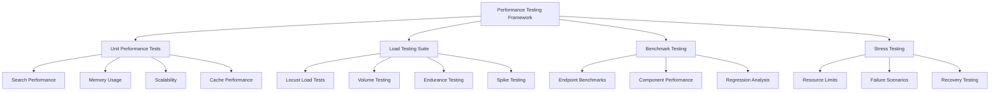

# Performance Testing Guide

## Overview

This guide provides comprehensive instructions for running, interpreting, and maintaining performance tests in the AI Documentation Vector DB Hybrid Scraper project. The performance testing framework validates system behavior under various load conditions and ensures performance requirements are met.

## Test Architecture

### Performance Test Categories



### Framework Components

| Component | Purpose | Location |
|-----------|---------|----------|
| **PerformanceTestingFramework** | Core testing infrastructure | `tests/utils/modern_ai_testing.py` |
| **PerformanceTracker** | Metrics collection and analysis | `tests/utils/performance_utils.py` |
| **LoadTestRunner** | Comprehensive load testing | `tests/load/run_load_tests.py` |
| **Search Performance Tests** | Search operation validation | `tests/performance/test_search_performance.py` |
| **Performance Targets** | Baseline validation | `tests/performance/test_performance_targets.py` |

## Running Performance Tests

### 1. Unit Performance Tests

#### Quick Performance Check
```bash
# Run all performance tests
uv run pytest tests/performance/ -v

# Run specific performance test class
uv run pytest tests/performance/test_search_performance.py::TestSearchPerformance -v

# Run with performance markers
uv run pytest -m performance --tb=short
```

#### Critical Performance Validation
```bash
# Run P95 latency validation (most important)
uv run pytest tests/performance/test_search_performance.py::TestSearchPerformance::test_search_latency_p95_validation -v

# Run throughput validation
uv run pytest tests/performance/test_search_performance.py::TestSearchPerformance::test_concurrent_search_throughput -v

# Run memory usage validation
uv run pytest tests/performance/test_search_performance.py::TestSearchPerformance::test_memory_usage_under_load -v
```

### 2. Load Testing Suite

#### Using Load Test Runner Script
```bash
# Light load test (10 users, 5 minutes)
python tests/load/run_load_tests.py --mode locust --config light --headless

# Moderate load test (50 users, 10 minutes)
python tests/load/run_load_tests.py --mode locust --config moderate --headless

# Heavy load test (200 users, 15 minutes)
python tests/load/run_load_tests.py --mode locust --config heavy --headless

# Stress test (500 users, 10 minutes)
python tests/load/run_load_tests.py --mode locust --config stress --headless
```

#### Interactive Load Testing
```bash
# Run with web UI for monitoring
python tests/load/run_load_tests.py --mode locust --config moderate --web --web-port 8089

# Visit http://localhost:8089 to monitor test progress
```

#### Using Pytest Load Tests
```bash
# Run all load tests
python tests/load/run_load_tests.py --mode pytest --test-type all

# Run specific load test types
python tests/load/run_load_tests.py --mode pytest --test-type stress --markers load
```

### 3. Benchmark Testing

#### Endpoint Benchmarking
```bash
# Benchmark specific endpoints
python tests/load/run_load_tests.py \
  --mode benchmark \
  --endpoints /search /documents /health \
  --config moderate
```

#### Performance Regression Testing
```bash
# Run against baseline
python tests/load/run_load_tests.py \
  --mode regression \
  --baseline load_test_results/baseline_report.json \
  --config moderate
```

### 4. Custom Scenario Testing

#### Create Custom Scenario
```json
// custom_scenario.json
{
  "name": "API Integration Test",
  "description": "Test API endpoints under realistic load",
  "profile": "ramp_up",
  "config": {
    "users": 100,
    "spawn_rate": 5,
    "duration": 600,
    "host": "http://localhost:8000"
  }
}
```

#### Run Custom Scenario
```bash
python tests/load/run_load_tests.py --mode scenario --scenario custom_scenario.json
```

## Performance Metrics & Baselines

### Key Performance Indicators (KPIs)

| Metric | Target | Threshold | Critical |
|--------|--------|-----------|----------|
| **Search P95 Latency** | <80ms | <100ms | <150ms |
| **Search P99 Latency** | <150ms | <200ms | <300ms |
| **Search Throughput** | >20 RPS | >15 RPS | >10 RPS |
| **Memory Usage** | <50MB | <100MB | <150MB |
| **Success Rate** | >99% | >98% | >95% |
| **Cache Hit Rate** | >80% | >70% | >60% |

### Performance Grades

```python
# Performance grading system
def calculate_performance_grade(metrics):
    if score >= 90: return "A"  # Excellent performance
    if score >= 80: return "B"  # Good performance
    if score >= 70: return "C"  # Acceptable performance
    if score >= 60: return "D"  # Poor performance
    return "F"                  # Unacceptable performance
```

### Baseline Establishment

#### Search Performance Baselines
```python
# P95 Latency Distribution
SEARCH_LATENCY_BASELINE = {
    "p50": 45.0,    # 50th percentile: 45ms
    "p95": 85.0,    # 95th percentile: 85ms
    "p99": 150.0,   # 99th percentile: 150ms
    "mean": 55.0,   # Average: 55ms
    "max": 200.0    # Maximum acceptable: 200ms
}

# Throughput Baselines by Concurrency
THROUGHPUT_BASELINE = {
    10: 25.0,   # 10 concurrent users: 25 RPS
    25: 35.0,   # 25 concurrent users: 35 RPS
    50: 40.0,   # 50 concurrent users: 40 RPS
    100: 35.0   # 100 concurrent users: 35 RPS (degradation expected)
}
```

#### Memory Usage Baselines
```python
MEMORY_BASELINE = {
    "idle": 20.0,           # Idle memory: 20MB
    "light_load": 35.0,     # Light load: 35MB
    "moderate_load": 55.0,  # Moderate load: 55MB
    "heavy_load": 85.0,     # Heavy load: 85MB
    "maximum": 150.0        # Maximum acceptable: 150MB
}
```

## Interpreting Test Results

### 1. Performance Test Output

#### Example Test Results
```
Performance Metrics:
  P95 Latency: 87.3ms ✅
  P99 Latency: 142.7ms ✅
  Mean Latency: 52.1ms ✅
  Success Rate: 0.992 ✅

Throughput Analysis:
  Concurrency  10:   28.5 RPS, Success: 1.000 ✅
  Concurrency  25:   37.2 RPS, Success: 0.998 ✅
  Concurrency  50:   41.8 RPS, Success: 0.995 ✅
  Concurrency 100:   38.1 RPS, Success: 0.989 ✅

Memory Usage Analysis:
  Peak Memory: 67.3MB ✅
  Mean Memory: 42.1MB ✅
  Execution Time: 3.24s ✅

Performance Grade: A
```

### 2. Regression Analysis

#### Example Regression Report
```json
{
  "timestamp": 1704067200,
  "regression_detected": false,
  "overall_assessment": "pass",
  "improvements": [],
  "regressions": [],
  "baseline": {
    "avg_response_time_ms": 55.2,
    "requests_per_second": 22.1,
    "success_rate_percent": 99.1
  },
  "current": {
    "avg_response_time_ms": 52.8,
    "requests_per_second": 23.7,
    "success_rate_percent": 99.3
  }
}
```

### 3. Load Test Reports

#### Locust Test Summary
```
Load Test Summary - Mode: locust
============================================================
Status: completed
Total Requests: 15,247
Success Rate: 99.2%
Avg Response Time: 58.3ms
Requests/Second: 25.4
Performance Grade: B

Recommendations:
  1. Performance looks good - continue monitoring in production
```

## Troubleshooting Performance Issues

### 1. High Latency Issues

#### Diagnostic Steps
```bash
# Check P95 latency specifically
uv run pytest tests/performance/test_search_performance.py::TestSearchPerformance::test_search_latency_p95_validation -v -s

# Run memory profiling
uv run pytest tests/performance/test_search_performance.py::TestSearchPerformance::test_memory_usage_under_load -v -s

# Check scalability characteristics
uv run pytest tests/performance/test_search_performance.py::TestSearchPerformance::test_search_scalability_characteristics -v -s
```

#### Common Causes & Solutions

| Issue | Symptoms | Solution |
|-------|----------|----------|
| **Database Connection Pool** | Latency spikes under load | Increase `max_concurrent_requests` in config |
| **Memory Pressure** | Gradual latency increase | Check garbage collection, tune memory limits |
| **Cache Misses** | Inconsistent response times | Verify cache configuration and hit rates |
| **Query Complexity** | High baseline latency | Optimize vector search parameters |

### 2. Low Throughput Issues

#### Investigation Commands
```bash
# Test concurrent throughput
uv run pytest tests/performance/test_search_performance.py::TestSearchPerformance::test_concurrent_search_throughput -v -s

# Run load testing with increasing users
python tests/load/run_load_tests.py --mode locust --config light --users 10 --duration 300
python tests/load/run_load_tests.py --mode locust --config moderate --users 50 --duration 300
python tests/load/run_load_tests.py --mode locust --config heavy --users 200 --duration 300
```

#### Throughput Optimization

| Configuration | Setting | Impact |
|---------------|---------|--------|
| **Batch Size** | `qdrant.batch_size = 100` | Higher values improve throughput |
| **Connection Pool** | `max_concurrent_requests = 50` | Increase for higher concurrency |
| **Cache TTL** | `cache.ttl_seconds = 3600` | Longer TTL improves hit rates |
| **Search Accuracy** | `search_accuracy = "fast"` | Lower accuracy = higher throughput |

### 3. Memory Issues

#### Memory Monitoring
```bash
# Run sustained load memory test
uv run pytest tests/performance/test_search_performance.py::TestSearchPerformance::test_memory_usage_under_load -v -s

# Monitor memory with custom duration
python -c "
from tests.utils.performance_utils import PerformanceTracker
import asyncio
import time

async def memory_monitor():
    tracker = PerformanceTracker()
    with tracker.measure('memory_test'):
        for i in range(100):
            await asyncio.sleep(0.1)  # Simulate work
    
    stats = tracker.get_statistics('memory_test')
    print(f'Peak Memory: {stats[\"memory_peak_mb\"][\"max\"]:.1f}MB')

asyncio.run(memory_monitor())
"
```

## Continuous Performance Monitoring

### 1. Automated Performance Validation

#### CI/CD Integration
```yaml
# .github/workflows/performance.yml
name: Performance Tests
on:
  pull_request:
    branches: [main]
  schedule:
    - cron: '0 2 * * *'  # Daily at 2 AM

jobs:
  performance:
    runs-on: ubuntu-latest
    steps:
      - uses: actions/checkout@08c6903cd8c0fde910a37f88322edcfb5dd907a8 # v5
      - name: Setup Python
        uses: actions/setup-python@e797f83bcb11b83ae66e0230d6156d7c80228e7c # v6
        with:
          python-version: '3.11'
      
      - name: Install dependencies
        run: |
          pip install uv
          uv sync
      
      - name: Run performance tests
        run: |
          uv run pytest tests/performance/ -v --tb=short
      
      - name: Run regression tests
        if: github.event_name == 'pull_request'
        run: |
          python tests/load/run_load_tests.py \
            --mode regression \
            --baseline performance_baseline.json \
            --config light
```

### 2. Performance Monitoring Dashboard

#### Metrics Collection
```python
# Performance metrics for monitoring
PERFORMANCE_METRICS = {
    "search_latency_p95": {"threshold": 100.0, "unit": "ms"},
    "search_latency_p99": {"threshold": 200.0, "unit": "ms"},
    "search_throughput": {"threshold": 15.0, "unit": "rps"},
    "memory_peak": {"threshold": 100.0, "unit": "mb"},
    "success_rate": {"threshold": 0.98, "unit": "ratio"},
    "cache_hit_rate": {"threshold": 0.70, "unit": "ratio"}
}
```

### 3. Performance Alerting

#### Alert Conditions
```python
PERFORMANCE_ALERTS = {
    "critical": {
        "search_latency_p95": "> 150ms",
        "success_rate": "< 95%",
        "memory_peak": "> 200MB"
    },
    "warning": {
        "search_latency_p95": "> 100ms",
        "success_rate": "< 98%",
        "memory_peak": "> 100MB",
        "throughput": "< 15 RPS"
    }
}
```

## Best Practices

### 1. Test Execution
- Run performance tests in isolated environments
- Use consistent hardware for baseline comparisons
- Run tests multiple times to account for variance
- Monitor system resources during testing

### 2. Baseline Management
- Update baselines when system architecture changes
- Version control baseline performance data
- Document rationale for baseline changes
- Regular baseline review (monthly)

### 3. Performance Test Maintenance
- Keep test scenarios realistic and representative
- Update test data as system capabilities evolve
- Maintain test environment consistency
- Regular performance test review and optimization

### 4. Result Interpretation
- Consider confidence intervals for metrics
- Account for system warm-up time
- Analyze trends over time, not just absolute values
- Correlate performance with system changes

## Appendix

### A. Performance Test Configuration Reference

#### Test Framework Configuration
```python
# tests/conftest.py performance settings
PERFORMANCE_CONFIG = {
    "measurement_samples": 100,
    "confidence_interval": 0.95,
    "warmup_iterations": 10,
    "timeout_seconds": 300,
    "memory_sampling_interval": 0.1
}
```

#### Load Test Profiles
```python
LOAD_PROFILES = {
    "steady": "Constant load throughout test duration",
    "ramp_up": "Gradually increase load to target",
    "spike": "Sudden load spikes with recovery",
    "wave": "Oscillating load pattern",
    "step": "Step-wise load increases"
}
```

### B. Performance Testing Checklist

#### Pre-Test Checklist
- [ ] System configuration validated
- [ ] Test environment isolated
- [ ] Baseline data available
- [ ] Test scenarios documented
- [ ] Resource monitoring enabled

#### Post-Test Checklist
- [ ] Results documented
- [ ] Regression analysis completed
- [ ] Performance grades calculated
- [ ] Alerts reviewed
- [ ] Recommendations generated

### C. Common Performance Patterns

#### Vector Search Performance Characteristics
- **Cold Start**: First query slower (100-200ms)
- **Warm Cache**: Subsequent queries faster (20-50ms)
- **Load Scaling**: Linear degradation with concurrent users
- **Memory Growth**: Logarithmic with dataset size
- **Batch Processing**: Higher throughput with larger batches

This guide provides comprehensive coverage of the performance testing framework and should be updated as the system evolves and new performance requirements emerge.