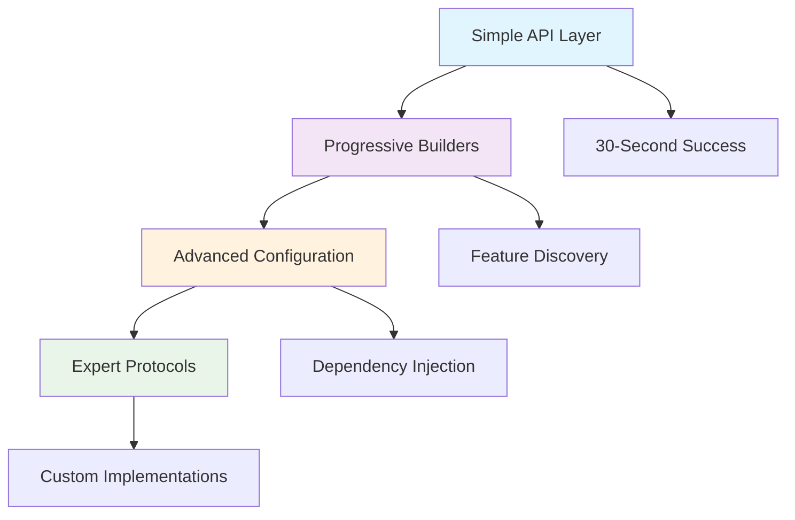

# Progressive API Design: Portfolio Showcase

> **A sophisticated API design that provides immediate value while progressively revealing advanced features**

## Design Philosophy

The Progressive API Design demonstrates enterprise-level API sophistication through a **progressive disclosure pattern** that:

- ✅ **Provides immediate value** with one-line setup patterns
- ✅ **Reveals features progressively** through natural usage evolution  
- ✅ **Maintains type safety** with sophisticated generic protocols
- ✅ **Enables expert customization** through dependency injection patterns
- ✅ **Demonstrates portfolio-worthy** architectural sophistication

## Architecture Overview



## Core Design Patterns

### 1. 30-Second Success Pattern

**Goal**: Immediate gratification with zero configuration

```python
# One line setup - everything works immediately
system = AIDocSystem.quick_start()

async with system:
    results = await system.search("machine learning")
    print(f"Found {len(results)} results!")
```

**Key Features**:
- Sensible defaults for all configuration
- Lazy initialization for performance
- Automatic resource management
- No configuration required

### 2. Progressive Builder Pattern

**Goal**: Reveal advanced features through natural progression

```python
# Start simple, add sophistication progressively
system = (AIDocSystem.builder()
    .with_embedding_provider("openai")      # Choose provider
    .with_quality_tier("best")              # Set quality
    .with_cache(enabled=True, ttl=3600)     # Add performance
    .with_monitoring(enabled=True)          # Add observability
    .build())
```

**Key Features**:
- Fluent interface for chaining
- Progressive feature revelation
- Type-safe configuration
- Intelligent defaults at each level

### 3. Sophisticated Type System

**Goal**: Enterprise-level type safety with flexibility

```python
from typing import Protocol, Generic, TypeVar

T = TypeVar('T')

@runtime_checkable
class SearchProtocol(Protocol):
    """Type-safe search interface for dependency injection."""
    
    async def search(
        self,
        query: str,
        *,
        limit: int = 10,
        options: Optional[SearchOptions] = None,
    ) -> List[SearchResult]:
        ...

class ProgressiveResponse(Generic[T]):
    """Response wrapper with progressive feature enhancement."""
    
    def with_metadata(self, metadata: Dict[str, Any]) -> "ProgressiveResponse[T]":
        """Add metadata (progressive feature)."""
        self.metadata = metadata
        return self
```

**Key Features**:
- Runtime-checkable protocols for dependency injection
- Generic response wrappers for flexibility
- Progressive enhancement patterns
- Full type safety with mypy compatibility

### 4. Feature Discovery System

**Goal**: Help users understand available capabilities

```python
# Programmatic feature discovery
discovery = discover_features()

# Basic features for immediate use
basic = discovery.get_basic_features()

# Progressive features for growth
progressive = discovery.get_progressive_features()

# Expert features for maximum control
expert = discovery.get_expert_features()

# Personalized learning paths
path = discovery.get_learning_path("intermediate")
```

**Key Features**:
- Programmatic capability introspection
- Personalized learning paths
- Provider discovery and comparison
- Usage examples and documentation links

## Advanced Configuration Patterns

### Expert-Level Configuration

```python
# Sophisticated configuration for expert users
system = (AIDocSystemBuilder()
    .with_advanced_config(
        lambda config: config
            .with_embedding_config(
                lambda emb: emb
                    .with_provider("openai")
                    .with_model("text-embedding-3-large")
                    .with_custom_preprocessing({
                        "clean_html": True,
                        "extract_code": True,
                        "normalize_whitespace": True
                    })
            )
            .with_search_config(
                lambda search: search
                    .with_strategy("semantic")
                    .with_custom_weights({
                        "semantic": 0.7,
                        "keyword": 0.2,
                        "freshness": 0.1
                    })
                    .with_fusion_algorithm("reciprocal_rank")
            )
            .with_monitoring_config(
                lambda mon: mon
                    .with_performance_tracking(
                        latency=True,
                        throughput=True,
                        errors=True
                    )
                    .with_cost_tracking(
                        enabled=True,
                        budget_limit=100.0
                    )
            )
            .with_experimental_features({
                "neural_reranking": True,
                "adaptive_chunking": True
            })
    )
    .build())
```

### Custom Protocol Implementation

```python
class CustomSearchProvider:
    """Example custom search implementation."""
    
    async def search(
        self,
        query: str,
        *,
        limit: int = 10,
        options: Optional[SearchOptions] = None,
    ) -> List[SearchResult]:
        """Custom search logic with full type safety."""
        # Implementation with sophisticated algorithms
        return await self._custom_search_algorithm(query, limit, options)
    
    async def add_document(
        self,
        content: str,
        *,
        metadata: Optional[Dict[str, Any]] = None,
    ) -> str:
        """Custom document processing pipeline."""
        return await self._custom_document_processor(content, metadata)

# Protocol compatibility ensures type safety
assert isinstance(CustomSearchProvider(), SearchProtocol)
```

## Sophisticated Testing Patterns

### Property-Based Testing

```python
from hypothesis import given, strategies as st

@given(
    content=st.text(min_size=1, max_size=1000),
    score=st.floats(min_value=0.0, max_value=1.0, allow_nan=False)
)
def test_search_result_properties(content, score):
    """Property-based test for SearchResult invariants."""
    result = SimpleSearchResult(content=content, score=score)
    
    # Properties should be preserved
    assert result.content == content
    assert result.score == score
    
    # Analysis should always work
    analysis = result.get_analysis()
    assert isinstance(analysis, dict)
    assert analysis["length"] == len(content)
```

### Protocol Testing

```python
def test_search_protocol_compliance():
    """Test that implementations comply with SearchProtocol."""
    from src.api.progressive.protocols import SearchProtocol
    
    # Runtime type checking
    provider = CustomSearchProvider()
    assert isinstance(provider, SearchProtocol)
    
    # Method signature validation
    import inspect
    search_sig = inspect.signature(provider.search)
    assert 'query' in search_sig.parameters
    assert 'limit' in search_sig.parameters
```

### Async Context Manager Testing

```python
@pytest.mark.asyncio
async def test_lifecycle_management():
    """Test sophisticated lifecycle management."""
    system = AIDocSystem.quick_start()
    
    # Should not be initialized initially
    assert not system._initialized
    
    # Context manager should handle lifecycle
    async with system:
        assert system._initialized
        
        # Operations should work
        results = await system.search("test")
        assert isinstance(results, list)
    
    # Should be cleaned up after context
    assert not system._initialized
```

## Portfolio Highlights

### 1. Enterprise-Level Type Safety

- **Runtime-checkable protocols** for clean dependency injection
- **Generic type parameters** for flexible, type-safe APIs
- **Progressive enhancement** without breaking existing code
- **Full mypy compatibility** with sophisticated type hints

### 2. Sophisticated Error Handling

```python
try:
    system = AIDocSystem()
    await system.search("query")
except RuntimeError as e:
    # Helpful error messages with solutions
    print(f"Error: {e}")
    # → "AIDocSystem not initialized. Use 'async with system:' or call 'await system.initialize()'"
```

### 3. Advanced Dependency Injection

```python
# Clean separation of concerns through protocols
class ProductionSystem:
    def __init__(
        self,
        search_provider: SearchProtocol,
        embedding_provider: EmbeddingProtocol,
        cache_provider: CacheProtocol,
    ):
        self.search = search_provider
        self.embeddings = embedding_provider
        self.cache = cache_provider

# Testable with mock implementations
def test_production_system():
    mock_search = Mock(spec=SearchProtocol)
    mock_embeddings = Mock(spec=EmbeddingProtocol)
    mock_cache = Mock(spec=CacheProtocol)
    
    system = ProductionSystem(mock_search, mock_embeddings, mock_cache)
    # Test with clean mocks...
```

### 4. Intelligent Feature Discovery

- **Programmatic introspection** of available capabilities
- **Contextual learning paths** based on user sophistication
- **Provider comparison** with performance and cost metrics
- **Usage examples** generated from actual code

## Performance Characteristics

### Lazy Initialization

```python
# Components initialized only when needed
system = AIDocSystem.quick_start()  # Instant
async with system:                  # Services initialized here
    results = await system.search("query")  # Actual work happens
```

### Progressive Resource Usage

- **Basic usage**: Minimal memory footprint
- **Progressive usage**: Resources allocated as features are used
- **Expert usage**: Full control over resource allocation
- **Caching strategies**: Sophisticated multi-tier caching

### Monitoring and Observability

```python
# Built-in sophisticated monitoring
stats = await system.get_stats()
print(f"""
System Statistics:
- Search latency: {stats['search']['avg_latency_ms']:.1f}ms
- Cache hit rate: {stats['cache']['hit_rate']:.1%}
- Total cost: ${stats['embeddings']['total_cost']:.2f}
- Error rate: {stats['errors']['rate']:.1%}
""")
```

## Real-World Usage Examples

### Startup MVP (30-second setup)

```python
# Perfect for rapid prototyping
system = AIDocSystem.quick_start()
async with system:
    results = await system.search("user query")
    return [{"title": r.title, "content": r.content} for r in results]
```

### Growing Company (Progressive features)

```python
# Add sophistication as you grow
system = (AIDocSystem.builder()
    .with_embedding_provider("openai")
    .with_cache(enabled=True, ttl=3600)
    .with_monitoring(enabled=True, track_costs=True)
    .build())
```

### Enterprise (Full control)

```python
# Complete control for enterprise needs
config = (AdvancedConfigBuilder()
    .with_custom_providers({"search": EnterpriseSearchProvider()})
    .with_monitoring_config(
        lambda m: m.with_detailed_tracing(True).with_metrics_export(True)
    )
    .with_experimental_features({"neural_reranking": True})
    .build())

system = AIDocSystem(config=config)
```

## Technical Innovation

### 1. Progressive Disclosure Pattern
- **Immediate value** without configuration burden
- **Natural feature revelation** through usage patterns
- **Backwards compatibility** as sophistication grows

### 2. Type-Safe Builder Pattern
- **Fluent interfaces** with full type checking
- **Composable configuration** builders
- **Validation at build time** rather than runtime

### 3. Protocol-Based Architecture
- **Clean dependency injection** without framework lock-in
- **Testable design** with easy mocking
- **Extensible architecture** for custom implementations

### 4. Intelligent Defaults
- **Context-aware configuration** based on usage patterns
- **Performance optimization** through automatic tuning
- **Cost optimization** through intelligent provider selection

## Conclusion

This Progressive API Design demonstrates sophisticated software architecture principles:

- ✅ **User Experience**: Immediate value with progressive sophistication
- ✅ **Type Safety**: Enterprise-level type system with protocols and generics
- ✅ **Dependency Injection**: Clean, testable architecture patterns
- ✅ **Feature Discovery**: Intelligent capability introspection
- ✅ **Performance**: Lazy initialization and sophisticated caching
- ✅ **Monitoring**: Built-in observability and cost tracking
- ✅ **Extensibility**: Protocol-based architecture for customization

The design successfully balances **simplicity** for new users with **sophistication** for expert users, demonstrating advanced Python programming patterns and enterprise-level architectural thinking.

---

*This progressive API design showcases the ability to create sophisticated, user-friendly interfaces that scale from simple use cases to complex enterprise requirements while maintaining type safety and clean architecture principles.*