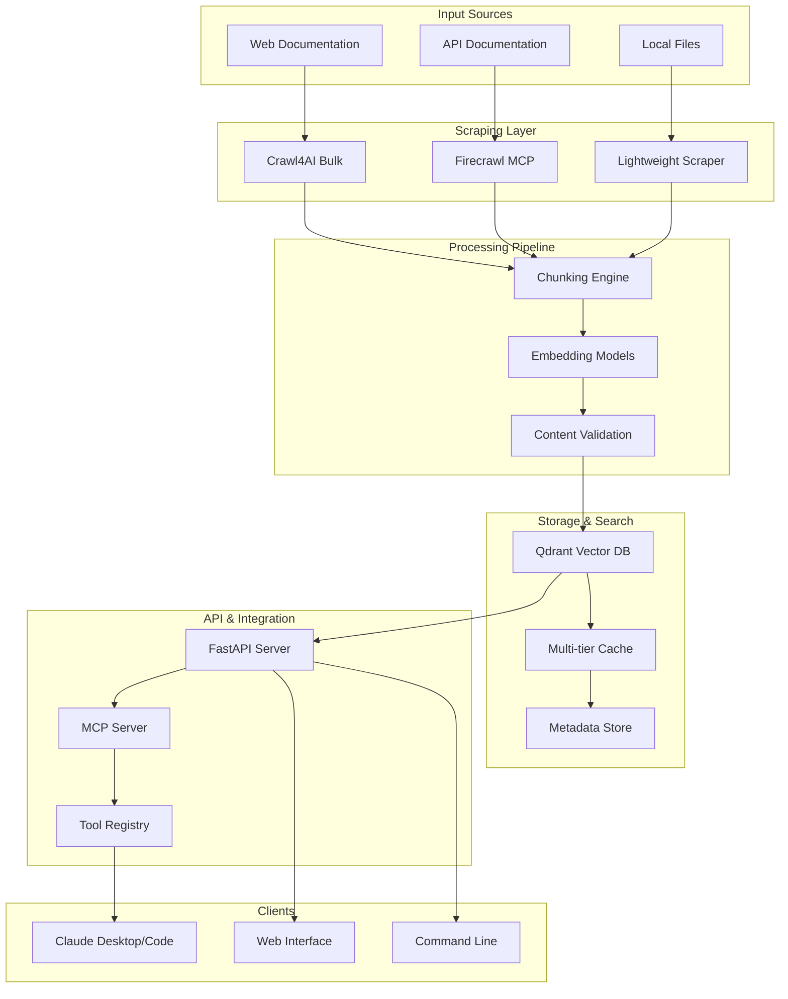

# AI Docs Vector DB Hybrid Scraper

A comprehensive documentation scraping system combining Crawl4AI (bulk) + Firecrawl MCP (on-demand) with Qdrant vector database for Claude Desktop/Code integration.

## Features

### 🔄 Hybrid Scraping Architecture
- **Bulk Processing**: Efficient large-scale documentation scraping with Crawl4AI
- **On-Demand Retrieval**: Real-time document fetching via Firecrawl MCP
- **Smart Caching**: Multi-tier caching for optimal performance

### 🔍 Vector Search & Intelligence
- **Qdrant Integration**: High-performance vector database for semantic search
- **Multiple Embedding Models**: Support for OpenAI, FastEmbed, and FlagEmbedding
- **Advanced Filtering**: Metadata-based filtering and ranking

### 🤖 Claude Integration
- **MCP Server**: Native Model Context Protocol server for Claude Desktop/Code
- **Tool Registry**: Comprehensive set of tools for document operations
- **Real-time Processing**: Live document analysis and retrieval

### 🚀 Production Ready
- **FastAPI Backend**: Modern async Python web framework
- **Monitoring Stack**: Prometheus metrics with Grafana dashboards
- **Container Support**: Docker and Docker Compose deployment
- **Security**: Authentication, rate limiting, and access controls

## Quick Navigation

=== "Users"
    
    New to the system? Start here!
    
    - [Quick Start Guide](users/quick-start.md) - Get up and running in minutes
    - [Configuration](users/configuration-management.md) - Customize your setup
    - [Examples](users/examples-and-recipes.md) - Common use cases and recipes
    - [Troubleshooting](users/troubleshooting.md) - Solve common issues

=== "Developers"
    
    Building with the API or contributing?
    
    - [Getting Started](developers/getting-started.md) - Development environment setup
    - [Architecture](developers/architecture.md) - System design and components
    - [API Reference](developers/api-reference.md) - Complete API documentation
    - [Contributing](developers/contributing.md) - How to contribute to the project

=== "Operators"
    
    Deploying and managing the system?
    
    - [Deployment Guide](operators/deployment.md) - Production deployment strategies
    - [Configuration](operators/configuration.md) - System configuration options
    - [Monitoring](operators/monitoring.md) - Observability and alerting
    - [Security](operators/security.md) - Security best practices

## Architecture Overview

## Getting Started

Choose your path based on your role:

### 👤 I want to use the system
[Start with the User Guide →](users/quick-start.md){ .md-button .md-button--primary }

### 👨‍💻 I want to develop or integrate
[Go to Developer Docs →](developers/getting-started.md){ .md-button }

### 🛠️ I want to deploy and operate
[Check Deployment Guide →](operators/deployment.md){ .md-button }

## Community and Support

- **GitHub**: [Issues and discussions](https://github.com/BjornMelin/ai-docs-vector-db-hybrid-scraper)
- **Documentation**: You're here! 📍
- **Contributing**: See our [contribution guide](developers/contributing.md)

---

*Built with ❤️ for the Claude ecosystem and the broader AI development community.*