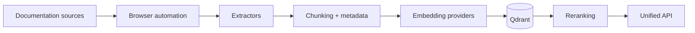

## AI Docs Vector DB Hybrid Scraper

The platform ingests documentation from the web, enriches it with browser
automation, stores hybrid embeddings in Qdrant, and exposes retrieval workflows
through a unified API surface. This page summarises the core capabilities and
points to the detailed guides for users, developers, and operators.

## Platform Highlights

- **Hybrid search pipeline** – Dense + sparse embeddings, HyDE augmentation, and
  reranking
- **Five-tier browser automation** – Selects the lightest tool that can load and
  extract a page
- **Unified configuration** – Single Pydantic settings module controls both simple
  and enterprise deployments
- **Observability and security** – Built-in metrics, logging, authentication, and
  rate limiting

## Architecture Snapshot

- **Ingestion** – A tiered browser manager fetches pages, extractors clean them,
  and chunking normalises structure.
- **Processing** – Dense and sparse embedding providers run in parallel; HyDE
  expansion and caching keep retrieval responsive.
- **Retrieval** – Qdrant stores vectors and payloads; the API orchestrates
  filtering, reranking, and response formatting (REST, MCP, browser integrations).

## Choose Your Guide

=== "Users"

    - [Quick Start](users/quick-start.md)
    - [Configuration Management](users/configuration-management.md)
    - [Search & Retrieval](users/search-and-retrieval.md)
    - [Troubleshooting](users/troubleshooting.md)

=== "Developers"

    - [Developer Hub](developers/index.md)
    - [System Architecture](developers/architecture-and-orchestration.md)
    - [API & Contracts](developers/api-and-contracts.md)
    - [Agentic Orchestration](developers/agentic-orchestration.md)
    - [FastMCP Integration](developers/mcp-integration.md)
    - [Contributing](developers/contributing.md)

=== "Operators"

    - [Operator Hub](operators/index.md)
    - [Deployment](operators/deployment.md)
    - [Operations Runbook](operators/operations.md)
    - [Monitoring](operators/monitoring.md)

## Additional Resources

- [Query Processing Metrics](observability/query_processing_metrics.md)
- [Evaluation Harness Playbook](testing/evaluation-harness.md)
- [Security Checklist](security/security-checklist.md)
- [Technical Debt Log](TECH_DEBT.md)

Questions or improvements? Open an issue or contribute a pull request so that
these docs stay up to date.
