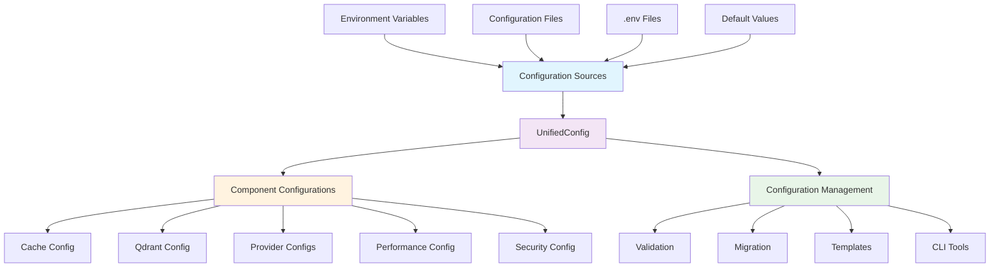

# Configuration Management Guide

> **Status**: Current  
> **Last Updated**: 2025-06-09  
> **Purpose**: Comprehensive configuration guide for operators  
> **Audience**: DevOps engineers, system administrators, and operators

This guide provides comprehensive configuration management for operators deploying and maintaining the AI Documentation Vector DB system across different environments.

## Table of Contents

- [Overview](#overview)
- [Configuration Architecture](#configuration-architecture)
- [Environment Management](#environment-management)
- [Production Configuration](#production-configuration)
- [Development Configuration](#development-configuration)
- [Security Configuration](#security-configuration)
- [Performance Tuning](#performance-tuning)
- [Configuration Validation](#configuration-validation)
- [Change Management](#change-management)
- [Troubleshooting](#troubleshooting)
- [Best Practices](#best-practices)
- [Monitoring and Alerting](#monitoring-and-alerting)

## Overview

The AI Documentation Vector DB uses a unified configuration system built with Pydantic v2 that provides:

- **Single Source of Truth**: All configuration in one `UnifiedConfig` class
- **Type Safety**: Full validation and type checking
- **Multiple Sources**: Support for files, environment variables, and code
- **Environment-Specific**: Templates for different deployment environments
- **Migration Tools**: Automatic migration between configuration versions
- **CLI Management**: Rich CLI for configuration operations

### Key Benefits for Operators

- **Standardized Deployment**: Consistent configuration across environments
- **Security**: Built-in validation and security checks
- **Monitoring**: Comprehensive configuration health monitoring
- **Automation**: CLI tools for configuration management tasks
- **Scalability**: Performance tuning based on environment requirements

## Configuration Architecture



### Configuration Hierarchy

1. **Environment Variables** (highest priority)
2. **Configuration Files** (JSON, YAML, TOML)
3. **`.env` Files**
4. **Default Values** (lowest priority)

## Environment Management

### Environment Templates

The system provides pre-configured templates for different environments:

| Template | Use Case | Key Features |
|----------|----------|--------------|
| `production.json` | Production deployment | High performance, security, monitoring |
| `development.json` | Local development | Debug features, local services |
| `local-only.json` | Privacy-focused | No cloud services, local-only |
| `testing.json` | Test execution | Optimized for test speed |
| `minimal.json` | Basic deployment | Minimal configuration with defaults |

### Environment-Specific Configuration

#### Production Environment

```bash
# Set environment
export AI_DOCS__ENVIRONMENT=production
export CONFIG_FILE=config/production.json

# Required environment variables
export AI_DOCS__OPENAI__API_KEY=${OPENAI_API_KEY}
export AI_DOCS__FIRECRAWL__API_KEY=${FIRECRAWL_API_KEY}
export AI_DOCS__CACHE__DRAGONFLY_URL="redis://dragonfly:6379"
export AI_DOCS__QDRANT__URL="http://qdrant:6333"
```

#### Staging Environment

```bash
# Set environment
export AI_DOCS__ENVIRONMENT=staging
export CONFIG_FILE=config/staging.json

# Staging-specific overrides
export AI_DOCS__DEBUG=false
export AI_DOCS__LOG_LEVEL=INFO
export AI_DOCS__PERFORMANCE__MAX_CONCURRENT_REQUESTS=10
```

#### Development Environment

```bash
# Set environment
export AI_DOCS__ENVIRONMENT=development
export CONFIG_FILE=config/development.json

# Development overrides
export AI_DOCS__DEBUG=true
export AI_DOCS__LOG_LEVEL=DEBUG
export AI_DOCS__EMBEDDING_PROVIDER=fastembed
export AI_DOCS__CACHE__ENABLE_DRAGONFLY_CACHE=false
```

## Production Configuration

### Complete Production Template

```json
{
  "environment": "production",
  "debug": false,
  "log_level": "INFO",
  "embedding_provider": "openai",
  "crawl_provider": "crawl4ai",
  
  "cache": {
    "enable_caching": true,
    "enable_local_cache": true,
    "enable_dragonfly_cache": true,
    "dragonfly_url": "redis://dragonfly:6379",
    "ttl_embeddings": 86400,
    "ttl_crawl": 3600,
    "ttl_queries": 7200,
    "local_max_size": 1000,
    "local_max_memory_mb": 100.0,
    "redis_pool_size": 20
  },
  
  "qdrant": {
    "url": "http://qdrant:6333",
    "collection_name": "documents",
    "batch_size": 100,
    "max_retries": 5,
    "hnsw_ef_construct": 200,
    "hnsw_m": 16,
    "quantization_enabled": true
  },
  
  "openai": {
    "model": "text-embedding-3-small",
    "dimensions": 1536,
    "batch_size": 100,
    "max_requests_per_minute": 3000,
    "cost_per_million_tokens": 0.02,
    "budget_limit": 100.0
  },
  
  "crawl4ai": {
    "enable_memory_adaptive_dispatcher": true,
    "memory_threshold_percent": 75.0,
    "max_session_permit": 25,
    "dispatcher_check_interval": 1.0,
    "headless": true,
    "max_concurrent_crawls": 10,
    "page_timeout": 30.0,
    "viewport": {"width": 1920, "height": 1080},
    "remove_scripts": true,
    "remove_styles": true,
    "enable_streaming": true,
    "rate_limit_base_delay_min": 1.0,
    "rate_limit_base_delay_max": 2.0,
    "rate_limit_max_delay": 30.0,
    "rate_limit_max_retries": 2
  },
  
  "chunking": {
    "strategy": "enhanced",
    "chunk_size": 1600,
    "chunk_overlap": 200,
    "preserve_function_boundaries": true
  },
  
  "performance": {
    "max_concurrent_requests": 20,
    "request_timeout": 30.0,
    "max_retries": 3,
    "retry_base_delay": 1.0,
    "retry_max_delay": 60.0,
    "max_memory_usage_mb": 2000.0,
    "gc_threshold": 0.8,
    "default_rate_limits": {
      "openai": {"max_calls": 500, "time_window": 60},
      "firecrawl": {"max_calls": 100, "time_window": 60},
      "crawl4ai": {"max_calls": 50, "time_window": 1},
      "qdrant": {"max_calls": 100, "time_window": 1}
    }
  },
  
  "security": {
    "require_api_keys": true,
    "enable_rate_limiting": true,
    "rate_limit_requests": 100,
    "allowed_domains": ["docs.python.org", "fastapi.tiangolo.com"],
    "blocked_domains": ["malicious.example.com"]
  }
}
```

### High-Performance Production Configuration

For systems with 16GB+ RAM and high throughput requirements:

```json
{
  "crawl4ai": {
    "enable_memory_adaptive_dispatcher": true,
    "memory_threshold_percent": 80.0,
    "max_session_permit": 50,
    "dispatcher_check_interval": 0.5,
    "enable_streaming": true,
    "rate_limit_base_delay_min": 0.1,
    "rate_limit_base_delay_max": 0.5,
    "rate_limit_max_delay": 10.0,
    "rate_limit_max_retries": 3
  },
  
  "performance": {
    "max_concurrent_requests": 50,
    "max_memory_usage_mb": 4000.0,
    "default_rate_limits": {
      "openai": {"max_calls": 1000, "time_window": 60},
      "crawl4ai": {"max_calls": 100, "time_window": 1}
    }
  },
  
  "cache": {
    "redis_pool_size": 50,
    "local_max_size": 2000,
    "local_max_memory_mb": 200.0
  }
}
```

### Memory-Constrained Production Configuration

For systems with 8GB or less RAM:

```json
{
  "crawl4ai": {
    "enable_memory_adaptive_dispatcher": true,
    "memory_threshold_percent": 60.0,
    "max_session_permit": 5,
    "dispatcher_check_interval": 2.0,
    "enable_streaming": false
  },
  
  "performance": {
    "max_concurrent_requests": 5,
    "max_memory_usage_mb": 1000.0,
    "default_rate_limits": {
      "crawl4ai": {"max_calls": 10, "time_window": 1}
    }
  },
  
  "cache": {
    "local_max_size": 100,
    "local_max_memory_mb": 25.0,
    "redis_pool_size": 5
  }
}
```

## Development Configuration

### Local Development Setup

```json
{
  "environment": "development",
  "debug": true,
  "log_level": "DEBUG",
  "embedding_provider": "fastembed",
  "crawl_provider": "crawl4ai",
  
  "cache": {
    "enable_caching": true,
    "enable_local_cache": true,
    "enable_dragonfly_cache": false,
    "local_max_size": 500,
    "local_max_memory_mb": 50.0
  },
  
  "qdrant": {
    "url": "http://localhost:6333",
    "collection_name": "dev_documents",
    "batch_size": 50
  },
  
  "fastembed": {
    "model": "BAAI/bge-small-en-v1.5",
    "batch_size": 16
  },
  
  "crawl4ai": {
    "headless": false,
    "max_concurrent_crawls": 5,
    "page_timeout": 60.0,
    "enable_memory_adaptive_dispatcher": true,
    "memory_threshold_percent": 70.0,
    "max_session_permit": 10
  },
  
  "performance": {
    "max_concurrent_requests": 5,
    "request_timeout": 60.0,
    "max_memory_usage_mb": 500.0
  },
  
  "security": {
    "require_api_keys": false,
    "enable_rate_limiting": false
  }
}
```

## Security Configuration

### API Key Management

```bash
# Production secrets (never commit to version control)
export AI_DOCS__OPENAI__API_KEY="sk-your-production-key"
export AI_DOCS__FIRECRAWL__API_KEY="fc-your-production-key"

# Use different keys for different environments
export AI_DOCS__OPENAI__API_KEY="${OPENAI_API_KEY_PROD}"
export AI_DOCS__FIRECRAWL__API_KEY="${FIRECRAWL_API_KEY_PROD}"
```

### Security Hardening Configuration

```json
{
  "security": {
    "require_api_keys": true,
    "enable_rate_limiting": true,
    "rate_limit_requests": 100,
    "rate_limit_window": 60,
    "allowed_domains": [
      "docs.python.org",
      "fastapi.tiangolo.com",
      "docs.pydantic.dev"
    ],
    "blocked_domains": [
      "malicious.com",
      "spam.example.org"
    ],
    "max_content_length": 10485760,
    "enable_cors": true,
    "cors_origins": ["https://yourdomain.com"],
    "enable_ssl": true,
    "ssl_verify": true
  }
}
```

### Environment-Specific Security

#### Production Security

```json
{
  "security": {
    "require_api_keys": true,
    "enable_rate_limiting": true,
    "rate_limit_requests": 100,
    "enable_ssl": true,
    "ssl_verify": true,
    "enable_cors": false,
    "log_security_events": true
  }
}
```

#### Development Security

```json
{
  "security": {
    "require_api_keys": false,
    "enable_rate_limiting": false,
    "enable_ssl": false,
    "ssl_verify": false,
    "enable_cors": true,
    "cors_origins": ["http://localhost:3000"]
  }
}
```

## Performance Tuning

### CPU-Optimized Configuration

```json
{
  "performance": {
    "max_concurrent_requests": 50,
    "request_timeout": 15.0,
    "max_retries": 2,
    "retry_base_delay": 0.5,
    "retry_max_delay": 30.0,
    "gc_threshold": 0.9,
    "default_rate_limits": {
      "openai": {"max_calls": 1000, "time_window": 60},
      "crawl4ai": {"max_calls": 100, "time_window": 1}
    }
  },
  
  "crawl4ai": {
    "max_concurrent_crawls": 20,
    "page_timeout": 15.0,
    "enable_memory_adaptive_dispatcher": true,
    "memory_threshold_percent": 85.0,
    "max_session_permit": 100
  }
}
```

### Memory-Optimized Configuration

```json
{
  "performance": {
    "max_concurrent_requests": 10,
    "max_memory_usage_mb": 1000.0,
    "gc_threshold": 0.7,
    "enable_memory_monitoring": true,
    "memory_check_interval": 30.0
  },
  
  "cache": {
    "local_max_size": 100,
    "local_max_memory_mb": 50.0,
    "enable_memory_pressure_eviction": true
  },
  
  "crawl4ai": {
    "enable_memory_adaptive_dispatcher": true,
    "memory_threshold_percent": 60.0,
    "max_session_permit": 5,
    "enable_streaming": false
  }
}
```

### Network-Optimized Configuration

```json
{
  "performance": {
    "request_timeout": 10.0,
    "max_retries": 5,
    "retry_base_delay": 0.1,
    "connection_pool_size": 100,
    "keep_alive_timeout": 30.0
  },
  
  "cache": {
    "enable_caching": true,
    "ttl_embeddings": 86400,
    "ttl_crawl": 7200,
    "enable_compression": true
  }
}
```

## Configuration Validation

### Pre-Deployment Validation

```bash
# Validate configuration file
python -m src.manage_config validate -c config/production.json

# Comprehensive validation with connection checks
python -m src.manage_config validate -c config/production.json --comprehensive

# Check specific environment variables
python -m src.manage_config check-env-vars

# Validate connections to external services
python -m src.manage_config check-connections
```

### Automated Validation Script

```bash
#!/bin/bash
# validate-config.sh

set -e

CONFIG_FILE=${1:-config.json}
ENVIRONMENT=${2:-production}

echo "Validating configuration for $ENVIRONMENT environment..."

# 1. Validate configuration file syntax
echo "Checking configuration syntax..."
python -m src.manage_config validate -c "$CONFIG_FILE"

# 2. Check required environment variables
echo "Checking environment variables..."
python -m src.manage_config check-env-vars

# 3. Test service connections
echo "Testing service connections..."
python -m src.manage_config check-connections

# 4. Run configuration-specific tests
echo "Running configuration tests..."
uv run pytest tests/unit/config/ -v

# 5. Generate validation report
echo "Generating validation report..."
python -m src.manage_config generate-validation-report -c "$CONFIG_FILE" -o "validation-report-$(date +%Y%m%d-%H%M%S).json"

echo "Configuration validation completed successfully!"
```

### Health Check Configuration

```json
{
  "health_checks": {
    "enabled": true,
    "interval": 30,
    "timeout": 10,
    "checks": [
      {
        "name": "qdrant",
        "type": "http",
        "url": "http://qdrant:6333/health",
        "critical": true
      },
      {
        "name": "dragonfly",
        "type": "redis",
        "url": "redis://dragonfly:6379",
        "critical": false
      },
      {
        "name": "openai",
        "type": "api",
        "endpoint": "https://api.openai.com/v1/models",
        "critical": true
      }
    ]
  }
}
```

## Change Management

### Configuration Version Control

```bash
# Track configuration changes
git add config/
git commit -m "feat(config): update production rate limits"

# Tag configuration versions
git tag -a config-v1.2.0 -m "Configuration version 1.2.0"

# Create configuration branches for major changes
git checkout -b config/memory-optimization
```

### Configuration Migration

```bash
# Migrate configuration to latest version
python -m src.manage_config migrate config.json

# Dry run to preview changes
python -m src.manage_config migrate config.json --dry-run

# Migrate to specific version
python -m src.manage_config migrate config.json --target-version 0.3.0

# Show migration path
python -m src.manage_config show-migration-path
```

### Backup and Restore

```bash
#!/bin/bash
# backup-config.sh

DATE=$(date +%Y%m%d-%H%M%S)
BACKUP_DIR="config/backups/$DATE"

mkdir -p "$BACKUP_DIR"

# Backup configuration files
cp config/*.json "$BACKUP_DIR/"
cp .env "$BACKUP_DIR/" 2>/dev/null || true

# Backup environment variables
env | grep "AI_DOCS__" > "$BACKUP_DIR/environment-variables.txt"

# Create backup archive
tar -czf "config-backup-$DATE.tar.gz" -C config/backups "$DATE"

echo "Configuration backed up to config-backup-$DATE.tar.gz"
```

### Rolling Updates

```bash
#!/bin/bash
# rolling-config-update.sh

NEW_CONFIG=${1:-config/production-new.json}
CURRENT_CONFIG=${2:-config/production.json}

echo "Performing rolling configuration update..."

# 1. Validate new configuration
python -m src.manage_config validate -c "$NEW_CONFIG"

# 2. Backup current configuration
cp "$CURRENT_CONFIG" "$CURRENT_CONFIG.backup"

# 3. Apply new configuration gradually
echo "Applying new configuration..."
cp "$NEW_CONFIG" "$CURRENT_CONFIG"

# 4. Test with new configuration
sleep 10
python -m src.manage_config check-connections

# 5. Monitor for issues
echo "Monitoring system health..."
for i in {1..6}; do
    sleep 10
    if ! python -m src.manage_config check-connections > /dev/null 2>&1; then
        echo "Health check failed, rolling back..."
        cp "$CURRENT_CONFIG.backup" "$CURRENT_CONFIG"
        exit 1
    fi
    echo "Health check $i/6 passed"
done

echo "Rolling update completed successfully!"
rm "$CURRENT_CONFIG.backup"
```

## Troubleshooting

### Common Configuration Issues

#### 1. Missing API Keys

**Symptoms:**

```text
Error: OpenAI API key required when using OpenAI embedding provider
```

**Solution:**

```bash
# Check if API key is set
echo $AI_DOCS__OPENAI__API_KEY

# Set the API key
export AI_DOCS__OPENAI__API_KEY="sk-your-api-key"

# Verify configuration
python -m src.manage_config validate -c config.json
```

#### 2. Service Connection Failures

**Symptoms:**

```text
Error: Qdrant connection failed: Connection refused
```

**Diagnosis:**

```bash
# Check service status
python -m src.manage_config check-connections

# Test individual connection
curl http://qdrant:6333/health

# Check network connectivity
ping qdrant
telnet qdrant 6333
```

**Solution:**

```bash
# Update service URL in configuration
export AI_DOCS__QDRANT__URL="http://localhost:6333"

# Or modify configuration file
{
  "qdrant": {
    "url": "http://localhost:6333"
  }
}
```

#### 3. Memory Issues

**Symptoms:**

```text
MemoryError: Unable to allocate array
```

**Diagnosis:**

```bash
# Check current memory usage
free -h
ps aux --sort=-%mem | head

# Check dispatcher stats
python -c "
from src.config import get_config
from src.services.crawling.crawl4ai_provider import Crawl4AIProvider
provider = Crawl4AIProvider(get_config().crawl4ai)
print(provider._get_dispatcher_stats())
"
```

**Solution:**

```json
{
  "crawl4ai": {
    "enable_memory_adaptive_dispatcher": true,
    "memory_threshold_percent": 60.0,
    "max_session_permit": 5,
    "enable_streaming": false
  },
  "performance": {
    "max_memory_usage_mb": 1000.0,
    "gc_threshold": 0.7
  }
}
```

#### 4. Rate Limiting Issues

**Symptoms:**

```text
RateLimitError: Rate limit exceeded
```

**Solution:**

```json
{
  "performance": {
    "default_rate_limits": {
      "openai": {
        "max_calls": 100,
        "time_window": 60
      }
    }
  },
  "crawl4ai": {
    "rate_limit_base_delay_min": 2.0,
    "rate_limit_base_delay_max": 5.0,
    "rate_limit_max_delay": 60.0,
    "rate_limit_max_retries": 3
  }
}
```

### Debug Mode Configuration

```json
{
  "debug": true,
  "log_level": "DEBUG",
  "logging": {
    "enable_file_logging": true,
    "log_file": "logs/debug.log",
    "log_rotation": "1 day",
    "log_retention": "7 days",
    "enable_performance_logging": true,
    "enable_memory_logging": true,
    "enable_configuration_logging": true
  }
}
```

### Configuration Diagnostics

```bash
# Generate comprehensive diagnostic report
python -m src.manage_config diagnose

# Check configuration completeness
python -m src.manage_config check-completeness

# Validate environment setup
python -m src.manage_config validate-environment

# Show active configuration
python -m src.manage_config show-config --format yaml
```

## Best Practices

### 1. Environment Separation

- Use separate configuration files for each environment
- Never share production secrets with development
- Use environment-specific resource limits
- Implement proper secret management

```bash
# Directory structure
config/
├── environments/
│   ├── production.json
│   ├── staging.json
│   ├── development.json
│   └── testing.json
├── secrets/
│   ├── production.env
│   ├── staging.env
│   └── development.env
└── templates/
    └── default.json
```

### 2. Secret Management

```bash
# Use external secret management
export AI_DOCS__OPENAI__API_KEY=$(vault kv get -field=api_key secret/openai)
export AI_DOCS__FIRECRAWL__API_KEY=$(vault kv get -field=api_key secret/firecrawl)

# Or use Kubernetes secrets
kubectl create secret generic ai-docs-secrets \
  --from-literal=openai-api-key="sk-your-key" \
  --from-literal=firecrawl-api-key="fc-your-key"
```

### 3. Configuration Testing

```bash
# Test configuration changes in isolation
./scripts/test-config.sh config/production-new.json

# Run configuration-specific tests
uv run pytest tests/unit/config/ -v -k "production"

# Validate with real services
python -m src.manage_config validate --comprehensive
```

### 4. Monitoring Configuration Changes

```python
# Configuration change detection
import hashlib
import json

def get_config_hash(config_file):
    with open(config_file, 'r') as f:
        config = json.load(f)
    return hashlib.sha256(json.dumps(config, sort_keys=True).encode()).hexdigest()

# Monitor for changes
current_hash = get_config_hash('config.json')
# Store hash and alert on changes
```

### 5. Performance Monitoring

```json
{
  "monitoring": {
    "enable_metrics": true,
    "metrics_port": 9090,
    "metrics_path": "/metrics",
    "enable_tracing": true,
    "tracing_endpoint": "http://jaeger:14268/api/traces",
    "enable_profiling": false,
    "profiling_port": 9091
  }
}
```

## Monitoring and Alerting

### Prometheus Configuration

```yaml
# prometheus.yml
global:
  scrape_interval: 15s

scrape_configs:
  - job_name: 'ai-docs-vector-db'
    static_configs:
      - targets: ['localhost:9090']
    metrics_path: '/metrics'
    scrape_interval: 30s
```

### Key Metrics to Monitor

```python
# Configuration-related metrics
from prometheus_client import Counter, Gauge, Histogram

# Configuration metrics
config_loads = Counter('config_loads_total', 'Total configuration loads')
config_errors = Counter('config_errors_total', 'Configuration errors')
config_validation_time = Histogram('config_validation_seconds', 'Configuration validation time')

# System metrics
memory_usage = Gauge('system_memory_usage_percent', 'System memory usage percentage')
active_sessions = Gauge('crawl4ai_active_sessions', 'Active Crawl4AI sessions')
cache_hit_rate = Gauge('cache_hit_rate', 'Cache hit rate')

# Service health
service_health = Gauge('service_health', 'Service health status', ['service'])
```

### Alerting Rules

```yaml
# alerts.yml
groups:
  - name: configuration
    rules:
      - alert: ConfigurationError
        expr: increase(config_errors_total[5m]) > 0
        for: 0m
        labels:
          severity: critical
        annotations:
          summary: "Configuration error detected"
          description: "Configuration validation failed"

      - alert: HighMemoryUsage
        expr: system_memory_usage_percent > 90
        for: 5m
        labels:
          severity: warning
        annotations:
          summary: "High memory usage detected"
          description: "System memory usage is above 90%"

      - alert: ServiceDown
        expr: service_health == 0
        for: 1m
        labels:
          severity: critical
        annotations:
          summary: "Service is down"
          description: "{{ $labels.service }} is not responding"
```

### Configuration Dashboard

```json
{
  "dashboard": {
    "title": "AI Docs Vector DB Configuration",
    "panels": [
      {
        "title": "Configuration Health",
        "type": "stat",
        "targets": [
          {
            "expr": "config_loads_total",
            "legendFormat": "Total Loads"
          },
          {
            "expr": "config_errors_total",
            "legendFormat": "Total Errors"
          }
        ]
      },
      {
        "title": "Memory Usage",
        "type": "graph",
        "targets": [
          {
            "expr": "system_memory_usage_percent",
            "legendFormat": "Memory Usage %"
          }
        ]
      },
      {
        "title": "Service Health",
        "type": "table",
        "targets": [
          {
            "expr": "service_health",
            "legendFormat": "{{ service }}"
          }
        ]
      }
    ]
  }
}
```

This comprehensive configuration guide provides operators with all the tools and knowledge needed to successfully deploy, manage, and maintain the AI Documentation Vector DB system across different environments. The guide emphasizes security, performance, and operational excellence while providing practical examples and troubleshooting guidance.
