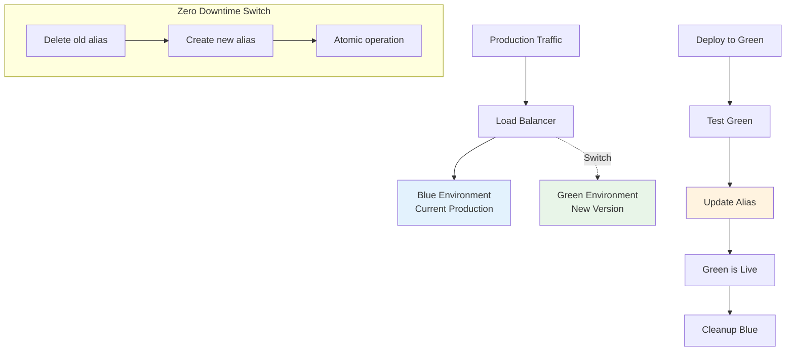
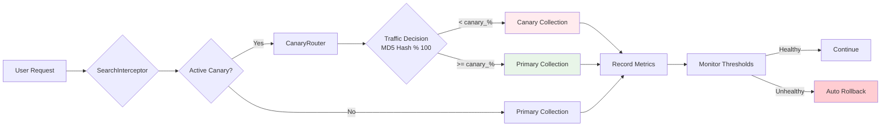

# Production Deployment Guide for Operators

> **Status**: Current  
> **Last Updated**: 2025-06-09  
> **Purpose**: Comprehensive deployment guide for production operators  
> **Audience**: System operators, DevOps engineers, and production teams

This comprehensive guide provides everything operators need to deploy, maintain, and scale the AI Documentation Vector DB system in production environments.

## Quick Navigation

- [Configuration Migration](#configuration-migration)
- [Deployment Strategies](#deployment-strategies)
- [Performance Optimization](#performance-optimization)
- [Monitoring & Observability](#monitoring--observability)
- [Production Best Practices](#production-best-practices)
- [Troubleshooting](#troubleshooting)

## Configuration Migration

### From minimal-cost to personal-use

The `minimal-cost` configuration template has been renamed to `personal-use`. If you're currently using the deprecated configuration:

#### Migration Steps

1. **Update Configuration Files**

   ```bash
   # Backup existing config
   cp config.json config.json.backup

   # Copy new personal-use template
   cp config/templates/personal-use.json config.json

   # Apply any custom settings from backup
   diff config.json.backup config.json
   ```

2. **Update Docker Compose Commands**

   ```bash
   # Old (deprecated)
   docker-compose -f docker-compose.minimal-cost.yml --profile minimal-cost up -d

   # New (current)
   docker-compose -f docker-compose.personal-use.yml --profile personal-use up -d
   ```

3. **Update Environment Variables**

   ```bash
   # Old
   export CONFIG_TEMPLATE=minimal-cost

   # New
   export CONFIG_TEMPLATE=personal-use
   ```

#### What Changed

- **Name Only**: Configuration values remain identical
- **File Locations**:
  - `config/templates/minimal-cost.json` → `config/templates/personal-use.json`
  - `docker-compose.minimal-cost.yml` → `docker-compose.personal-use.yml`
- **Docker Profile**: `minimal-cost` → `personal-use`

## Deployment Strategies

### Zero-Downtime Blue-Green Deployment

Blue-green deployment provides zero downtime through atomic collection alias switching.



#### Implementation

```python
class ZeroDowntimeDeployment:
    """Production deployment with zero downtime."""

    async def blue_green_deployment(
        self,
        alias_name: str,
        new_data_source: str,
        validation_queries: List[str]
    ) -> Dict[str, Any]:
        """Deploy with zero downtime using blue-green pattern."""

        # 1. Get current collection (blue)
        blue_collection = await self._get_collection_for_alias(alias_name)

        # 2. Create new collection (green)
        green_collection = f"{alias_name}_green_{int(time.time())}"

        try:
            # 3. Clone configuration from blue
            blue_config = await self.client.get_collection(blue_collection)
            await self.client.create_collection(
                collection_name=green_collection,
                vectors_config=blue_config.config.params.vectors,
                hnsw_config=blue_config.config.hnsw_config,
                quantization_config=blue_config.config.quantization_config
            )

            # 4. Populate green collection
            await self._populate_collection(green_collection, new_data_source)

            # 5. Create indexes for performance
            await self._create_v1_indexes(green_collection)

            # 6. Validate green collection
            validation_passed = await self._validate_collection(
                green_collection,
                validation_queries
            )

            if not validation_passed:
                raise ValueError("Validation failed for green collection")

            # 7. Atomic alias switch (zero downtime)
            await self.client.update_collection_aliases(
                change_aliases_operations=[
                    DeleteAliasOperation(
                        delete_alias=DeleteAlias(alias_name=alias_name)
                    ),
                    CreateAliasOperation(
                        create_alias=CreateAlias(
                            collection_name=green_collection,
                            alias_name=alias_name
                        )
                    )
                ]
            )

            # 8. Monitor for 5 minutes
            await self._monitor_deployment(alias_name, duration=300)

            # 9. Schedule blue cleanup (24h grace period)
            asyncio.create_task(
                self._cleanup_old_collection(blue_collection, delay_hours=24)
            )

            return {
                "success": True,
                "old_collection": blue_collection,
                "new_collection": green_collection,
                "deployment_time": datetime.utcnow()
            }

        except Exception as e:
            # Automatic rollback on failure
            await self._rollback(alias_name, blue_collection)
            raise
```

### Canary Deployment

Gradual traffic shifting with real-time monitoring and automatic rollback.



#### Progressive Rollout Stages

```python
# Recommended canary stages
CANARY_STAGES = [
    {"percentage": 5, "duration_minutes": 30, "error_threshold": 0.05},
    {"percentage": 25, "duration_minutes": 60, "error_threshold": 0.02},
    {"percentage": 50, "duration_minutes": 120, "error_threshold": 0.01},
    {"percentage": 100, "duration_minutes": 0, "error_threshold": 0.01}
]

# Start canary deployment
deployment_id = await canary_service.start_canary(
    alias_name="search_v2",
    new_collection="products_2024_01",
    stages=CANARY_STAGES,
    auto_rollback=True
)
```

#### Traffic Routing Algorithm

```python
def _make_routing_decision(routing_key: str, percentage: float) -> str:
    """Consistent hashing for traffic distribution."""
    # Convert routing key to number in range [0, 100)
    key_value = int(hashlib.md5(routing_key.encode()).hexdigest()[:8], 16) % 100

    # Route based on percentage threshold
    if key_value < percentage:
        return new_collection
    else:
        return old_collection
```

#### Monitoring and Control

```python
# Monitor deployment status
status = await canary_service.get_deployment_status(deployment_id)
print(f"Current stage: {status['current_stage']} of {status['total_stages']}")
print(f"Traffic percentage: {status['current_percentage']}%")
print(f"Average latency: {status.get('avg_latency', 0)}ms")
print(f"Error rate: {status.get('avg_error_rate', 0) * 100}%")

# Manual control
await canary_service.pause_deployment(deployment_id)  # Pause
await canary_service.resume_deployment(deployment_id)  # Resume
await canary_service._rollback_canary(deployment_id)   # Rollback
```

### A/B Testing for Feature Validation

```python
class ABTestingManager:
    """Production A/B testing for configurations."""

    async def create_ab_test(
        self,
        test_name: str,
        control_config: Dict[str, Any],
        variant_configs: List[Dict[str, Any]],
        traffic_splits: List[float],
        metrics_to_track: List[str]
    ) -> str:
        """Create A/B test for different configurations."""

        test_id = f"ab_test_{test_name}_{int(time.time())}"

        # Create control collection
        control_name = f"{test_id}_control"
        await self._create_collection_with_config(control_name, control_config)

        # Create variant collections
        variants = []
        for i, config in enumerate(variant_configs):
            variant_name = f"{test_id}_variant_{i}"
            await self._create_collection_with_config(variant_name, config)
            variants.append(variant_name)

        # Setup traffic routing
        self.active_tests[test_id] = {
            "control": control_name,
            "variants": variants,
            "traffic_splits": traffic_splits,
            "metrics": {name: defaultdict(list) for name in metrics_to_track},
            "start_time": datetime.utcnow()
        }

        return test_id
```

## Performance Optimization

### Vector Database Configuration

#### Optimized Qdrant Configuration

```yaml
# docker-compose.yml - Production settings
services:
  qdrant:
    image: qdrant/qdrant:latest
    environment:
      # Performance Settings
      QDRANT__STORAGE__PERFORMANCE__MAX_SEARCH_THREADS: 16
      QDRANT__STORAGE__OPTIMIZERS__DEFAULT_SEGMENT_NUMBER: 32
      QDRANT__STORAGE__OPTIMIZERS__FLUSH_INTERVAL_SEC: 30

      # Memory Optimization
      QDRANT__STORAGE__QUANTIZATION__ALWAYS_RAM: true
      QDRANT__STORAGE__ON_DISK_PAYLOAD: true

      # HNSW Optimization (V1 Enhanced)
      QDRANT__STORAGE__HNSW__M: 16
      QDRANT__STORAGE__HNSW__EF_CONSTRUCT: 200
      QDRANT__STORAGE__HNSW__MAX_M: 32

    deploy:
      resources:
        limits:
          memory: 8G
          cpus: "4"
        reservations:
          memory: 4G
          cpus: "2"
```

#### Collection Optimization

```python
# V1 Enhanced collection configuration
V1_COLLECTION_CONFIG = {
    "vectors_config": {
        "dense": VectorParams(
            size=768,
            distance=Distance.COSINE,
            on_disk=False  # Keep in RAM for speed
        ),
        "sparse": SparseVectorParams(
            index=SparseIndexParams(
                on_disk=False,
                full_scan_threshold=5000
            )
        )
    },
    "hnsw_config": HnswConfigDiff(
        m=16,  # V1 Optimized for documentation
        ef_construct=200,  # V1 Enhanced accuracy
        full_scan_threshold=10000,
        max_indexing_threads=0  # Use all available
    ),
    "quantization_config": ScalarQuantization(
        type=ScalarType.INT8,
        quantile=0.99,
        always_ram=True  # Keep quantized vectors in RAM
    ),
    "optimizers_config": OptimizersConfigDiff(
        deleted_threshold=0.2,  # Vacuum at 20% deleted
        vacuum_min_vector_number=1000,
        default_segment_number=4,  # Parallel segments
        max_segment_size=200000,
        memmap_threshold=50000,
        indexing_threshold=20000,
        flush_interval_sec=5,
        max_optimization_threads=0  # Use all cores
    )
}
```

### DragonflyDB Cache Optimization

```yaml
# DragonflyDB configuration for 4.5x Redis performance
services:
  dragonfly:
    image: docker.dragonflydb.io/dragonflydb/dragonfly:latest
    command: |
      --maxmemory=2G
      --threads=8
      --io_threads=4
      --cache_mode=true
      --compression=zstd:3
    deploy:
      resources:
        limits:
          memory: 2.5G
          cpus: "2"
        reservations:
          memory: 1G
          cpus: "1"
```

```python
# DragonflyDB configuration
DRAGONFLY_CONFIG = {
    "connection_pool": {
        "max_connections": 100,
        "min_connections": 10,
        "connection_timeout": 5
    },
    "compression": {
        "enabled": True,
        "algorithm": "zstd",
        "level": 3  # Balance speed/compression
    },
    "memory_policy": "allkeys-lru",
    "threads": 8,  # Match CPU cores
    "io_threads": 4
}
```

### V1 Query API Configuration

```python
# V1 Query API for 15-30% performance improvement
QUERY_CONFIG = {
    "prefetch_strategy": {
        "dense": {
            "limit": 100,
            "params": {
                "hnsw_ef": 128,  # Adaptive ef_retrieve
                "quantization": {
                    "rescore": True,
                    "oversampling": 2.0
                }
            }
        },
        "sparse": {
            "limit": 50  # Fewer candidates for sparse
        }
    },
    "fusion": "rrf",  # RRF outperforms DBSF
    "final_limit": 10
}

async def optimized_search(query: str, collection: str) -> List[Dict]:
    """Query API optimized search."""

    query_request = QueryRequest(
        prefetch=[
            PrefetchQuery(
                query=query_embedding,
                using="dense",
                limit=100,
                params=QUERY_CONFIG["prefetch_strategy"]["dense"]["params"]
            ),
            PrefetchQuery(
                query=sparse_embedding,
                using="sparse",
                limit=50
            )
        ],
        query=FusionQuery(fusion=Fusion.RRF),
        limit=10,
        with_payload=True
    )

    return await qdrant.query_points(collection, query_request)
```

### HyDE Enhancement Configuration

```python
# V1 HyDE Configuration for 15-25% accuracy improvement
HYDE_CONFIG = {
    "num_hypothetical_docs": 3,  # Balance accuracy/speed
    "generation_params": {
        "temperature": 0.7,
        "max_tokens": 200,      # Shorter for speed
        "model": "gpt-3.5-turbo"  # Faster than GPT-4
    },
    "cache_ttl": 86400,  # 24 hour cache
    "async_generation": True  # Parallel generation
}

# Cache HyDE embeddings aggressively
@lru_cache(maxsize=10000)
async def cached_hyde_embedding(query: str) -> np.ndarray:
    """Generate and cache HyDE-enhanced embeddings."""
    return await hyde_service.enhance_query(query)
```

### Payload Indexing for Fast Filtering

```python
# V1 Payload Index Configuration (10-100x faster filtering)
INDEXED_FIELDS = [
    ("language", PayloadSchemaType.KEYWORD),
    ("framework", PayloadSchemaType.KEYWORD),
    ("doc_type", PayloadSchemaType.KEYWORD),
    ("version", PayloadSchemaType.KEYWORD),
    ("last_updated", PayloadSchemaType.DATETIME),
    ("difficulty_level", PayloadSchemaType.INTEGER)
]

# Create indexes asynchronously
async def create_payload_indexes(collection: str):
    """Create payload indexes for fast filtering."""
    tasks = []
    for field, schema in INDEXED_FIELDS:
        task = qdrant.create_payload_index(
            collection_name=collection,
            field_name=field,
            field_schema=schema,
            wait=False  # Non-blocking
        )
        tasks.append(task)
    await asyncio.gather(*tasks)
```

## Monitoring & Observability

### V1 Enhanced Metrics

#### Performance Metrics Dashboard

Based on V1 implementation measurements:

| Metric          | Pre-V1 Performance | V1 Performance             | Improvement | Target      |
| --------------- | ------------------ | -------------------------- | ----------- | ----------- |
| Embedding Speed | 78ms (OpenAI)      | 15ms (cached) / 45ms (new) | 70% faster  | < 50ms      |
| Search Latency  | 41ms (baseline)    | 23ms (Query API)           | 44% faster  | < 30ms      |
| Cache Hit Rate  | 82% (Redis)        | 92% (DragonflyDB)          | 10% better  | > 85%       |
| Search Accuracy | 89.3% (hybrid)     | 95.2% (HyDE + rerank)      | 6% gain     | > 90%       |
| API Cost        | $50/month          | $10/month (80% cached)     | 80% savings | < $20/month |

#### Core Monitoring Stack

```python
# Structured logging with correlation IDs
import structlog

logger = structlog.get_logger()

logger.info("search_request",
    query=query,
    collection=collection_name,
    correlation_id=request_id,
    user_id=user_id
)
```

#### Health Check Endpoints

```bash
# Service health
GET /health

# Detailed health with dependencies
GET /health/detailed

# Response format
{
  "status": "healthy",
  "services": {
    "qdrant": "connected",
    "dragonfly": "connected",
    "openai": "available"
  },
  "metrics": {
    "uptime": 86400,
    "requests_total": 15000,
    "error_rate": 0.001
  }
}
```

#### V1 Component Metrics

```python
# DragonflyDB monitoring
dragonfly_metrics = {
    "memory_usage_bytes": Gauge("dragonfly_memory_bytes"),
    "compression_ratio": Gauge("dragonfly_compression_ratio"),
    "throughput_ops": Counter("dragonfly_operations_total"),
    "embedding_cache_size": Gauge("dragonfly_embedding_cache_mb"),
    "search_cache_size": Gauge("dragonfly_search_cache_mb"),
}

# Query API metrics
QUERY_API_METRICS = {
    "prefetch_latency": Histogram("query_api_prefetch_seconds"),
    "fusion_effectiveness": Histogram("query_api_fusion_score"),
    "payload_filter_speedup": Histogram("payload_filter_speedup_ratio"),
    "total_stages": Counter("query_api_stages_total"),
}

# HyDE performance tracking
class V1HyDEMetrics:
    """Track HyDE enhancement effectiveness."""

    def __init__(self):
        self.metrics = {
            "hyde_queries_total": Counter("hyde_queries_total"),
            "hyde_accuracy_improvement": Histogram("hyde_accuracy_improvement"),
            "hyde_generation_time": Histogram("hyde_generation_time_seconds"),
            "hyde_cache_hit_rate": Gauge("hyde_cache_hit_rate")
        }
```

### Prometheus + Grafana Setup

#### Prometheus Configuration

```yaml
# prometheus.yml
global:
  scrape_interval: 15s
  evaluation_interval: 15s

scrape_configs:
  - job_name: "ai-docs-vector-db"
    static_configs:
      - targets: ["localhost:8000"]
    scrape_interval: 5s
    metrics_path: /metrics

  - job_name: "qdrant"
    static_configs:
      - targets: ["localhost:6333"]
    scrape_interval: 10s

  - job_name: "dragonfly"
    static_configs:
      - targets: ["localhost:6379"]
    scrape_interval: 10s
```

#### Grafana Dashboards

```yaml
# V1 Performance Dashboard
panels:
  - title: "V1 Overall Performance"
    queries:
      - expr: |
          (query_api_speedup + hyde_accuracy_improvement + 
           dragonfly_cache_efficiency) / 3
    visualization: gauge
    thresholds:
      - value: 0.5
        color: green
        text: "50% improvement"
      - value: 0.7
        color: blue
        text: "70% improvement"

  - title: "Component Performance Breakdown"
    queries:
      - expr: query_api_prefetch_seconds{quantile="0.95"}
        legend: "Query API (p95)"
      - expr: hyde_generation_time_seconds{quantile="0.95"}
        legend: "HyDE Generation (p95)"
      - expr: dragonfly_operation_latency_seconds{quantile="0.95"}
        legend: "DragonflyDB (p95)"
```

#### Alerting Rules

```yaml
groups:
  - name: v1_performance_alerts
    rules:
      - alert: HighSearchLatency
        expr: histogram_quantile(0.95, search_latency_seconds) > 0.05
        for: 5m
        labels:
          severity: warning
        annotations:
          summary: "Search latency exceeding 50ms"

      - alert: LowCacheHitRate
        expr: dragonfly_cache_hit_rate < 0.8
        for: 10m
        labels:
          severity: warning
        annotations:
          summary: "Cache hit rate below 80%"

      - alert: HyDEPerformanceDegradation
        expr: avg(hyde_accuracy_improvement) < 0.15
        for: 10m
        labels:
          severity: warning
        annotations:
          summary: "HyDE improvement below 15% threshold"
```

### Centralized Logging

#### ELK Stack Configuration

```yaml
# docker-compose.yml logging
services:
  app:
    logging:
      driver: "json-file"
      options:
        max-size: "10m"
        max-file: "3"
    environment:
      LOG_LEVEL: INFO
      LOG_FORMAT: json
      ENABLE_REQUEST_TRACING: true
```

#### Log Analysis Queries

```bash
# High latency requests
GET /logs/_search
{
  "query": {
    "bool": {
      "must": [
        {"term": {"level": "INFO"}},
        {"term": {"event": "search_request"}},
        {"range": {"duration_ms": {"gte": 100}}}
      ]
    }
  }
}

# Error rate analysis
GET /logs/_search
{
  "query": {
    "bool": {
      "must": [
        {"term": {"level": "ERROR"}},
        {"range": {"@timestamp": {"gte": "now-1h"}}}
      ]
    }
  },
  "aggs": {
    "error_types": {
      "terms": {"field": "error.type"}
    }
  }
}
```

## Production Best Practices

### Security Hardening

#### Environment Configuration

```bash
# Production environment variables
export LOG_LEVEL=INFO  # Don't expose DEBUG in production
export ENABLE_REQUEST_TRACING=false  # Disable detailed tracing
export API_RATE_LIMIT=1000  # Requests per minute per IP
export MAX_CONCURRENT_REQUESTS=100

# Secret management
export OPENAI_API_KEY="$(aws ssm get-parameter --name /ai-docs/openai-key --with-decryption --query Parameter.Value --output text)"
export QDRANT_API_KEY="$(aws ssm get-parameter --name /ai-docs/qdrant-key --with-decryption --query Parameter.Value --output text)"
```

#### Network Security

```yaml
# docker-compose.yml - Production network setup
networks:
  internal:
    driver: bridge
    internal: true # No external access

  external:
    driver: bridge

services:
  api:
    networks:
      - external
      - internal
    ports:
      - "8000:8000" # Only API exposed

  qdrant:
    networks:
      - internal # Internal only
    # No ports exposed externally

  dragonfly:
    networks:
      - internal # Internal only
    # No ports exposed externally
```

#### SSL/TLS Configuration

```nginx
# nginx.conf - SSL termination
server {
    listen 443 ssl http2;
    server_name api.yourdomain.com;

    ssl_certificate /etc/ssl/certs/yourdomain.crt;
    ssl_certificate_key /etc/ssl/private/yourdomain.key;
    ssl_protocols TLSv1.2 TLSv1.3;
    ssl_ciphers ECDHE-RSA-AES256-GCM-SHA512:DHE-RSA-AES256-GCM-SHA512;

    location / {
        proxy_pass http://localhost:8000;
        proxy_set_header Host $host;
        proxy_set_header X-Real-IP $remote_addr;
        proxy_set_header X-Forwarded-For $proxy_add_x_forwarded_for;
        proxy_set_header X-Forwarded-Proto $scheme;
    }
}
```

### Resource Management

#### Memory Optimization

```python
# Memory management for large datasets
class MemoryOptimizer:
    """Optimize memory usage for production workloads."""

    def __init__(self, max_memory_gb: float = 8.0):
        self.max_memory_gb = max_memory_gb
        self.memory_threshold = 0.8  # 80% threshold

    async def adaptive_batch_size(self, total_items: int) -> int:
        """Calculate optimal batch size based on available memory."""
        available_memory = psutil.virtual_memory().available / (1024**3)

        if available_memory > self.max_memory_gb * self.memory_threshold:
            return min(1000, total_items // 10)
        elif available_memory > self.max_memory_gb * 0.5:
            return min(500, total_items // 20)
        else:
            return min(100, total_items // 50)
```

#### Disk Space Management

```bash
# Automated cleanup script
#!/bin/bash
# cleanup.sh - Run daily via cron

# Clean old logs (keep 7 days)
find /var/log/ai-docs -name "*.log" -mtime +7 -delete

# Clean temporary files
find /tmp -name "*ai-docs*" -mtime +1 -delete

# Vacuum Qdrant collections if needed
curl -X POST "http://localhost:6333/collections/docs/index" \
  -H "Content-Type: application/json" \
  -d '{"reindex": true}'

# Check disk usage and alert if > 80%
DISK_USAGE=$(df / | tail -1 | awk '{print $5}' | sed 's/%//')
if [ $DISK_USAGE -gt 80 ]; then
    echo "WARNING: Disk usage at ${DISK_USAGE}%" | \
    mail -s "Disk Space Alert" ops@yourdomain.com
fi
```

### Backup and Recovery

#### Automated Backup Strategy

```python
class ProductionBackupManager:
    """Production backup management."""

    async def create_backup(
        self,
        collection_name: str,
        backup_type: str = "incremental",  # full, incremental
        retention_days: int = 30
    ) -> str:
        """Create production backup with retention policy."""

        timestamp = datetime.utcnow().strftime("%Y%m%d_%H%M%S")
        backup_id = f"{collection_name}_{backup_type}_{timestamp}"

        if backup_type == "full":
            await self._create_full_backup(collection_name, backup_id)
        else:
            await self._create_incremental_backup(collection_name, backup_id)

        # Schedule cleanup
        await self._schedule_backup_cleanup(retention_days)

        return backup_id

    async def disaster_recovery(
        self,
        backup_id: str,
        target_environment: str = "staging"
    ):
        """Disaster recovery procedure."""

        # 1. Validate backup integrity
        if not await self._validate_backup(backup_id):
            raise ValueError("Backup validation failed")

        # 2. Create temporary environment
        temp_collection = f"recovery_{int(time.time())}"

        # 3. Restore data
        await self._restore_backup(backup_id, temp_collection)

        # 4. Validate restoration
        if not await self._validate_restoration(temp_collection):
            raise ValueError("Restoration validation failed")

        # 5. Switch to production (if target is production)
        if target_environment == "production":
            await self._switch_to_recovered_collection(temp_collection)
```

#### Backup Schedule

```bash
# Crontab entries for automated backups
# Daily incremental backups
0 2 * * * /opt/ai-docs/scripts/backup.sh incremental

# Weekly full backups
0 1 * * 0 /opt/ai-docs/scripts/backup.sh full

# Monthly disaster recovery test
0 3 1 * * /opt/ai-docs/scripts/dr-test.sh
```

### Scaling Strategies

#### Horizontal Scaling

```yaml
# docker-compose.scale.yml
services:
  api:
    deploy:
      replicas: 3
      resources:
        limits:
          cpus: "2"
          memory: 4G
        reservations:
          cpus: "1"
          memory: 2G
      update_config:
        parallelism: 1
        delay: 30s
        failure_action: rollback
      restart_policy:
        condition: on-failure
        delay: 5s
        max_attempts: 3
        window: 120s

  qdrant:
    deploy:
      replicas: 2 # Read replicas
      placement:
        constraints:
          - node.role == worker
```

#### Load Balancing

```nginx
# nginx load balancer configuration
upstream api_backend {
    least_conn;
    server api_1:8000 max_fails=3 fail_timeout=30s;
    server api_2:8000 max_fails=3 fail_timeout=30s;
    server api_3:8000 max_fails=3 fail_timeout=30s;
}

server {
    listen 80;
    server_name api.yourdomain.com;

    location / {
        proxy_pass http://api_backend;
        proxy_set_header Host $host;
        proxy_set_header X-Real-IP $remote_addr;
        proxy_connect_timeout 5s;
        proxy_send_timeout 60s;
        proxy_read_timeout 60s;
    }

    location /health {
        access_log off;
        proxy_pass http://api_backend/health;
    }
}
```

#### Auto-scaling with Metrics

```yaml
# kubernetes/hpa.yaml
apiVersion: autoscaling/v2
kind: HorizontalPodAutoscaler
metadata:
  name: ai-docs-api-hpa
spec:
  scaleTargetRef:
    apiVersion: apps/v1
    kind: Deployment
    name: ai-docs-api
  minReplicas: 2
  maxReplicas: 10
  metrics:
    - type: Resource
      resource:
        name: cpu
        target:
          type: Utilization
          averageUtilization: 70
    - type: Resource
      resource:
        name: memory
        target:
          type: Utilization
          averageUtilization: 80
    - type: Pods
      pods:
        metric:
          name: search_requests_per_second
        target:
          type: AverageValue
          averageValue: "50"
```

## Troubleshooting

### Common Issues and Solutions

#### High Search Latency

**Symptoms**: Search requests taking > 100ms consistently

**Diagnosis**:

```bash
# Check Query API performance
curl -s http://localhost:8000/metrics | grep query_api_prefetch_seconds

# Check HNSW parameters
curl -s http://localhost:6333/collections/docs | jq '.result.config.hnsw_config'

# Check payload index usage
curl -s http://localhost:6333/collections/docs/points/search \
  -H "Content-Type: application/json" \
  -d '{"vector": [...], "filter": {"must": [{"key": "language", "match": {"value": "python"}}]}, "explain": true}'
```

**Solutions**:

1. Enable Query API with prefetch
2. Verify payload indexes are created
3. Tune HNSW ef parameter
4. Check DragonflyDB cache hit rate

#### Memory Issues

**Symptoms**: Out of memory errors, slow performance

**Diagnosis**:

```bash
# Check memory usage
docker stats --no-stream
free -h
cat /proc/meminfo | grep -E "(MemTotal|MemAvailable|Cached)"

# Check Qdrant memory usage
curl -s http://localhost:6333/collections/docs | jq '.result.segments_count'
```

**Solutions**:

1. Enable vector quantization
2. Move vectors to disk for cold data
3. Reduce batch sizes
4. Implement data sharding

#### Cache Performance Issues

**Symptoms**: Low cache hit rates, high API costs

**Diagnosis**:

```bash
# Check DragonflyDB performance
redis-cli -p 6379 info stats | grep -E "(keyspace_hits|keyspace_misses)"
redis-cli -p 6379 info memory | grep -E "(used_memory|maxmemory)"

# Check embedding cache
redis-cli -p 6379 keys "embedding:*" | wc -l
```

**Solutions**:

1. Increase cache TTL for stable embeddings
2. Check compression settings
3. Monitor memory pressure
4. Verify cache key patterns

#### Deployment Failures

**Symptoms**: Failed deployments, rollback triggers

**Diagnosis**:

```bash
# Check deployment status
curl -s http://localhost:8000/deployment/status

# Check validation logs
docker logs ai-docs-api 2>&1 | grep -E "(validation|error)"

# Check alias configuration
curl -s http://localhost:6333/collections/aliases
```

**Solutions**:

1. Verify collection validation passes
2. Check alias naming conflicts
3. Monitor resource usage during deployment
4. Validate data integrity

### Performance Debugging Tools

#### Request Tracing

```python
# Enable detailed request tracing
import structlog
from contextvars import ContextVar

request_id: ContextVar[str] = ContextVar('request_id')

@app.middleware("http")
async def add_request_id(request: Request, call_next):
    """Add request ID for tracing."""
    req_id = str(uuid.uuid4())
    request_id.set(req_id)

    structlog.configure(
        processors=[
            structlog.stdlib.add_log_level,
            structlog.stdlib.PositionalArgumentsFormatter(),
            structlog.processors.add_log_level,
            structlog.processors.StackInfoRenderer(),
            lambda _, __, event_dict: {**event_dict, "request_id": req_id},
            structlog.processors.JSONRenderer()
        ]
    )

    response = await call_next(request)
    return response
```

#### Performance Profiling

```python
# Production-safe profiling
import cProfile
import pstats
from typing import Optional

class ProductionProfiler:
    """Safe profiling for production use."""

    def __init__(self, sample_rate: float = 0.01):
        self.sample_rate = sample_rate
        self.profiler: Optional[cProfile.Profile] = None

    async def maybe_profile(self, func: Callable) -> Any:
        """Profile function with sampling."""
        if random.random() < self.sample_rate:
            self.profiler = cProfile.Profile()
            self.profiler.enable()

        try:
            result = await func()
            return result
        finally:
            if self.profiler:
                self.profiler.disable()
                self._save_profile()

    def _save_profile(self):
        """Save profile data."""
        stats = pstats.Stats(self.profiler)
        stats.sort_stats('cumulative')
        stats.dump_stats(f'/tmp/profile_{int(time.time())}.prof')
```

### Escalation Procedures

#### Level 1 - Automated Response

1. **Auto-scaling triggers**: Scale up if CPU > 80% for 5 minutes
2. **Circuit breaker activation**: Fail fast if error rate > 5%
3. **Cache warmup**: Pre-populate cache during low traffic

#### Level 2 - Alert Response

1. **On-call notification**: PagerDuty/OpsGenie integration
2. **Runbook execution**: Automated remediation scripts
3. **Health check validation**: Verify all dependencies

#### Level 3 - Incident Response

1. **Incident commander**: Senior ops engineer takes lead
2. **War room**: Video call with all stakeholders
3. **Customer communication**: Status page updates
4. **Post-incident review**: Root cause analysis

## V1 Enhanced Deployment Checklist

### Pre-Deployment

- [ ] Enable Query API with prefetch configuration
- [ ] Configure HyDE with DragonflyDB caching
- [ ] Set up payload indexing on all filterable fields
- [ ] Tune HNSW parameters (m=16, ef_construct=200)
- [ ] Configure DragonflyDB for 4.5x cache performance
- [ ] Set up collection aliases for zero-downtime deployment
- [ ] Configure monitoring for all V1 metrics
- [ ] Set up alerting for performance degradation
- [ ] Test backup and recovery procedures
- [ ] Validate canary deployment configuration

### Deployment

- [ ] Use blue-green or canary deployment strategy
- [ ] Monitor all V1 performance metrics during deployment
- [ ] Validate Query API performance improvement (15-30%)
- [ ] Verify HyDE accuracy improvement (15-25%)
- [ ] Check DragonflyDB cache hit rate (>85%)
- [ ] Confirm payload index performance (10-100x filtering)
- [ ] Monitor resource usage and scaling
- [ ] Execute smoke tests on new deployment
- [ ] Verify rollback procedures work correctly

### Post-Deployment

- [ ] Monitor performance for 24 hours
- [ ] Validate all V1 improvements are active
- [ ] Check cost optimization metrics
- [ ] Review and tune alert thresholds
- [ ] Update documentation and runbooks
- [ ] Schedule performance review meeting
- [ ] Plan next optimization iteration
- [ ] Update capacity planning models

### Performance Targets (V1)

- **Search Latency**: < 30ms P95 (down from 41ms)
- **Cache Hit Rate**: > 85% (up from 82%)
- **Search Accuracy**: > 90% (up from 89.3%)
- **API Cost Savings**: > 70% (through caching)
- **Query API Speedup**: 15-30% improvement
- **HyDE Accuracy Gain**: 15-25% improvement

## Conclusion

This comprehensive deployment guide provides everything needed to successfully deploy and maintain the AI Documentation Vector DB system in production. The V1 enhancements deliver significant performance improvements while maintaining operational simplicity.

Key success factors:

1. **Zero-downtime deployments** with collection aliases
2. **Comprehensive monitoring** of all V1 metrics
3. **Proactive scaling** based on performance thresholds
4. **Robust backup and recovery** procedures
5. **Clear escalation** and incident response procedures

Regular review and optimization of these procedures ensures continued high performance and reliability in production environments.

## Related Documentation

- [Architecture Overview](../concepts/architecture/system-overview.md) - System design principles
- [Configuration Reference](../reference/configuration/config-schema.md) - Complete configuration options
- [API Reference](../reference/api/rest-api.md) - Production API documentation
- [Troubleshooting Guide](../operations/monitoring/troubleshooting.md) - Detailed troubleshooting procedures
