# 🔒 Enhanced Security Architecture for Operators

> **Status**: Production Ready  
> **Last Updated**: 2025-06-10  
> **Purpose**: Comprehensive security architecture focused on operational security boundaries  
> **Audience**: System operators, security engineers, and infrastructure teams

## 📋 Overview

This document provides detailed security architecture diagrams specifically designed for operational teams responsible for deploying, securing, and maintaining the AI Documentation Vector DB system. Special attention is given to the enhanced database connection pool security and operational security boundaries.

## 🛡️ Security Architecture Overview

### Multi-Layer Security Model

```mermaid
graph TB
    subgraph "Internet - Threat Landscape"
        THREATS[External Threats<br/>• DDoS Attacks<br/>• SQL Injection<br/>• Data Exfiltration<br/>• Bot Traffic<br/>• API Abuse]
        USERS[Legitimate Users<br/>• Claude Desktop<br/>• API Clients<br/>• Development Teams]
    end
    
    subgraph "Security Perimeter - DMZ Zone"
        direction TB
        
        subgraph "Edge Security Stack"
            CLOUDFLARE[Cloudflare WAF<br/>• DDoS Protection<br/>• Bot Management<br/>• Rate Limiting<br/>• Geo-blocking]
            
            NGINX[Nginx Reverse Proxy<br/>• SSL Termination<br/>• Request Filtering<br/>• Header Validation<br/>• Access Logging]
            
            RATE_LIMIT[Rate Limiting<br/>• IP-based Throttling<br/>• API Quotas<br/>• Circuit Breakers<br/>• Backpressure Control]
        end
        
        subgraph "Authentication & Authorization"
            AUTH_SVC[Auth Service<br/>• JWT Validation<br/>• OAuth2 Integration<br/>• MFA Support<br/>• Session Management]
            
            RBAC[RBAC Engine<br/>• Role Management<br/>• Permission Checks<br/>• Policy Enforcement<br/>• Audit Logging]
            
            IAM[Identity Management<br/>• User Provisioning<br/>• Access Reviews<br/>• Token Rotation<br/>• Lifecycle Management]
        end
    end
    
    subgraph "Application Security Zone - Private Network"
        direction TB
        
        subgraph "Input Validation & Sanitization"
            VALIDATOR[Input Validator<br/>• Schema Validation<br/>• Type Checking<br/>• Size Limits<br/>• Format Verification]
            
            SANITIZER[Data Sanitizer<br/>• XSS Prevention<br/>• SQL Injection Blocks<br/>• Command Injection Blocks<br/>• Path Traversal Prevention]
            
            ENCODER[Output Encoder<br/>• Response Encoding<br/>• Header Injection Prevention<br/>• Content Type Validation<br/>• Safe Serialization]
        end
        
        subgraph "Enhanced Database Security Layer"
            direction LR
            
            POOL_SECURITY[Connection Pool Security<br/>• TLS 1.3 Encryption<br/>• Certificate Pinning<br/>• Connection Validation<br/>• Idle Timeout Enforcement]
            
            CREDENTIAL_VAULT[Credential Management<br/>• HashiCorp Vault Integration<br/>• Automatic Rotation<br/>• Encrypted Storage<br/>• Audit Trail]
            
            CONNECTION_AUDIT[Connection Auditing<br/>• Query Logging<br/>• Access Pattern Analysis<br/>• Anomaly Detection<br/>• Forensic Capabilities]
            
            QUERY_FILTER[Query Security Filter<br/>• SQL Injection Prevention<br/>• Dangerous Function Blocking<br/>• DDL Statement Control<br/>• Query Complexity Limits]
        end
        
        subgraph "Application Services Security"
            MCP_ISOLATION[MCP Server Isolation<br/>• Process Sandboxing<br/>• Resource Limits<br/>• Capability Restrictions<br/>• Tool Validation]
            
            API_SECURITY[API Security<br/>• Request Signing<br/>• Content Validation<br/>• CORS Configuration<br/>• Security Headers]
            
            TASK_SECURITY[Task Queue Security<br/>• Message Encryption<br/>• Worker Isolation<br/>• Resource Quotas<br/>• Priority Management]
        end
    end
    
    subgraph "Data Security Zone - Highly Restricted"
        direction TB
        
        subgraph "Database Security Controls"
            DB_ENCRYPTION[Database Encryption<br/>• TLS 1.3 In-Transit<br/>• AES-256 At-Rest<br/>• Field-Level Encryption<br/>• Key Management]
            
            DB_ACCESS_CONTROL[Access Control<br/>• Service Account Auth<br/>• Network Segmentation<br/>• IP Whitelisting<br/>• Connection Limits]
            
            DB_MONITORING[Database Monitoring<br/>• Query Performance<br/>• Access Pattern Analysis<br/>• Privilege Escalation Detection<br/>• Data Exfiltration Alerts]
        end
        
        subgraph "Vector Database Security"
            QDRANT_SECURITY[Qdrant Security<br/>• API Key Authentication<br/>• Collection-level Access<br/>• Network Isolation<br/>• Backup Encryption]
            
            VECTOR_ENCRYPTION[Vector Data Protection<br/>• Embedding Encryption<br/>• Metadata Sanitization<br/>• Index Access Control<br/>• Query Result Filtering]
        end
        
        subgraph "Cache Security"
            CACHE_ENCRYPTION[Cache Encryption<br/>• Redis AUTH<br/>• TLS Encryption<br/>• Memory Protection<br/>• Automatic Expiry]
            
            DATA_CLASSIFICATION[Data Classification<br/>• PII Detection<br/>• Sensitive Data Masking<br/>• Classification Labels<br/>• Retention Policies]
        end
    end
    
    subgraph "Security Operations Center"
        direction TB
        
        subgraph "Monitoring & Detection"
            SIEM[SIEM Platform<br/>• Log Aggregation<br/>• Correlation Rules<br/>• Threat Intelligence<br/>• Incident Detection]
            
            SOC[24/7 Security Operations<br/>• Alert Triage<br/>• Incident Response<br/>• Threat Hunting<br/>• Forensic Analysis]
            
            THREAT_INTEL[Threat Intelligence<br/>• IOC Feeds<br/>• Attack Pattern Recognition<br/>• Vulnerability Scanning<br/>• Risk Assessment]
        end
        
        subgraph "Compliance & Audit"
            COMPLIANCE[Compliance Framework<br/>• GDPR Compliance<br/>• SOC 2 Controls<br/>• ISO 27001<br/>• NIST Framework]
            
            AUDIT_LOG[Immutable Audit Logs<br/>• Tamper-proof Storage<br/>• Digital Signatures<br/>• Chain of Custody<br/>• Long-term Retention]
            
            REPORTING[Security Reporting<br/>• Compliance Reports<br/>• Risk Dashboards<br/>• Incident Metrics<br/>• Executive Summaries]
        end
    end
    
    %% Traffic flow through security layers
    USERS --> CLOUDFLARE
    THREATS -.-> CLOUDFLARE
    CLOUDFLARE --> NGINX
    NGINX --> RATE_LIMIT
    RATE_LIMIT --> AUTH_SVC
    AUTH_SVC --> RBAC
    RBAC --> IAM
    
    %% Application security processing
    IAM --> VALIDATOR
    VALIDATOR --> SANITIZER
    SANITIZER --> ENCODER
    
    %% Enhanced database security integration
    ENCODER --> POOL_SECURITY
    POOL_SECURITY --> CREDENTIAL_VAULT
    CREDENTIAL_VAULT --> CONNECTION_AUDIT
    CONNECTION_AUDIT --> QUERY_FILTER
    
    %% Application services
    QUERY_FILTER --> MCP_ISOLATION
    QUERY_FILTER --> API_SECURITY
    QUERY_FILTER --> TASK_SECURITY
    
    %% Data layer security
    POOL_SECURITY --> DB_ENCRYPTION
    POOL_SECURITY --> QDRANT_SECURITY
    POOL_SECURITY --> CACHE_ENCRYPTION
    
    DB_ENCRYPTION --> DB_ACCESS_CONTROL
    DB_ACCESS_CONTROL --> DB_MONITORING
    
    QDRANT_SECURITY --> VECTOR_ENCRYPTION
    CACHE_ENCRYPTION --> DATA_CLASSIFICATION
    
    %% Security monitoring
    POOL_SECURITY --> SIEM
    CONNECTION_AUDIT --> SIEM
    DB_MONITORING --> SIEM
    VECTOR_ENCRYPTION --> SOC
    
    SIEM --> SOC
    SOC --> THREAT_INTEL
    
    %% Compliance monitoring
    CONNECTION_AUDIT --> AUDIT_LOG
    DB_MONITORING --> AUDIT_LOG
    AUDIT_LOG --> COMPLIANCE
    COMPLIANCE --> REPORTING
    
    %% Security zone styling
    classDef threat fill:#ffcdd2,stroke:#c62828,stroke-width:3px
    classDef dmz fill:#fff3e0,stroke:#f57c00,stroke-width:2px
    classDef app fill:#e8f5e8,stroke:#2e7d32,stroke-width:2px
    classDef enhanced fill:#e1f5fe,stroke:#01579b,stroke-width:3px
    classDef data fill:#e3f2fd,stroke:#1565c0,stroke-width:2px
    classDef soc fill:#f3e5f5,stroke:#7b1fa2,stroke-width:2px
    
    class THREATS,USERS threat
    class CLOUDFLARE,NGINX,RATE_LIMIT,AUTH_SVC,RBAC,IAM dmz
    class VALIDATOR,SANITIZER,ENCODER,MCP_ISOLATION,API_SECURITY,TASK_SECURITY app
    class POOL_SECURITY,CREDENTIAL_VAULT,CONNECTION_AUDIT,QUERY_FILTER enhanced
    class DB_ENCRYPTION,DB_ACCESS_CONTROL,DB_MONITORING,QDRANT_SECURITY,VECTOR_ENCRYPTION,CACHE_ENCRYPTION,DATA_CLASSIFICATION data
    class SIEM,SOC,THREAT_INTEL,COMPLIANCE,AUDIT_LOG,REPORTING soc
```

## 🔐 Database Connection Pool Security Deep Dive

### Enhanced Security Controls

```mermaid
graph TB
    subgraph "Connection Pool Security Architecture"
        direction TB
        
        subgraph "Connection Establishment Security"
            TLS_CONFIG[TLS Configuration<br/>• TLS 1.3 Only<br/>• Perfect Forward Secrecy<br/>• Certificate Validation<br/>• Cipher Suite Restrictions]
            
            CERT_PIN[Certificate Pinning<br/>• Server Certificate Validation<br/>• CA Certificate Pinning<br/>• Certificate Rotation Handling<br/>• Pinning Failure Alerts]
            
            CONN_VAL[Connection Validation<br/>• Health Check Queries<br/>• Connection State Verification<br/>• Resource Leak Detection<br/>• Timeout Enforcement]
        end
        
        subgraph "Credential Security Management"
            VAULT_INT[Vault Integration<br/>• Dynamic Secrets<br/>• Automatic Rotation<br/>• Lease Management<br/>• Revocation Capability]
            
            CRED_ROTATION[Credential Rotation<br/>• Scheduled Rotation<br/>• Zero-downtime Updates<br/>• Rollback Capability<br/>• Rotation Verification]
            
            SECRET_ENC[Secret Encryption<br/>• Memory Encryption<br/>• Transit Encryption<br/>• Storage Encryption<br/>• Key Derivation]
        end
        
        subgraph "Connection Security Monitoring"
            CONN_AUDIT[Connection Auditing<br/>• Connection Lifecycle Logging<br/>• Query Execution Logging<br/>• Performance Metrics<br/>• Security Event Correlation]
            
            ANOMALY_DET[Anomaly Detection<br/>• Unusual Query Patterns<br/>• Access Time Anomalies<br/>• Connection Pattern Analysis<br/>• ML-based Detection]
            
            ALERT_SYS[Alert System<br/>• Real-time Notifications<br/>• Escalation Procedures<br/>• Automated Response<br/>• Incident Correlation]
        end
        
        subgraph "Query Security Controls"
            SQL_FILTER[SQL Query Filtering<br/>• Injection Prevention<br/>• DDL Statement Blocking<br/>• Function Blacklisting<br/>• Complex Query Limits]
            
            QUERY_PARSER[Query Parser<br/>• Syntax Validation<br/>• Semantic Analysis<br/>• Risk Assessment<br/>• Pattern Matching]
            
            RESULT_FILTER[Result Filtering<br/>• Data Classification<br/>• PII Redaction<br/>• Field-level Security<br/>• Output Validation]
        end
    end
    
    subgraph "Security Integration Points"
        direction LR
        
        AUTH_PROVIDER[Authentication Provider<br/>• Service Account Management<br/>• Multi-factor Authentication<br/>• Single Sign-On Integration<br/>• Token-based Authentication]
        
        AUTHZ_ENGINE[Authorization Engine<br/>• Role-based Access Control<br/>• Attribute-based Access Control<br/>• Policy Decision Point<br/>• Dynamic Permissions]
        
        SECURITY_LOGS[Security Logging<br/>• Centralized Log Collection<br/>• Log Integrity Protection<br/>• Real-time Streaming<br/>• Long-term Retention]
        
        INCIDENT_RESP[Incident Response<br/>• Automated Containment<br/>• Forensic Data Collection<br/>• Recovery Procedures<br/>• Lessons Learned]
    end
    
    %% Security flow connections
    TLS_CONFIG --> CERT_PIN
    CERT_PIN --> CONN_VAL
    
    VAULT_INT --> CRED_ROTATION
    CRED_ROTATION --> SECRET_ENC
    
    CONN_AUDIT --> ANOMALY_DET
    ANOMALY_DET --> ALERT_SYS
    
    SQL_FILTER --> QUERY_PARSER
    QUERY_PARSER --> RESULT_FILTER
    
    %% External integration
    VAULT_INT --> AUTH_PROVIDER
    CONN_AUDIT --> AUTHZ_ENGINE
    ALERT_SYS --> SECURITY_LOGS
    ANOMALY_DET --> INCIDENT_RESP
    
    %% Cross-component security
    TLS_CONFIG -.-> CONN_AUDIT
    CRED_ROTATION -.-> ALERT_SYS
    SQL_FILTER -.-> SECURITY_LOGS
    
    %% Styling
    classDef connection fill:#e8f5e8,stroke:#2e7d32,stroke-width:3px
    classDef credential fill:#e3f2fd,stroke:#1565c0,stroke-width:2px
    classDef monitoring fill:#fff3e0,stroke:#f57c00,stroke-width:2px
    classDef query fill:#f3e5f5,stroke:#7b1fa2,stroke-width:2px
    classDef integration fill:#fce4ec,stroke:#c2185b,stroke-width:2px
    
    class TLS_CONFIG,CERT_PIN,CONN_VAL connection
    class VAULT_INT,CRED_ROTATION,SECRET_ENC credential
    class CONN_AUDIT,ANOMALY_DET,ALERT_SYS monitoring
    class SQL_FILTER,QUERY_PARSER,RESULT_FILTER query
    class AUTH_PROVIDER,AUTHZ_ENGINE,SECURITY_LOGS,INCIDENT_RESP integration
```

## 🚨 Security Incident Response Flow

### Automated Security Response

## 🔍 Security Monitoring Dashboard

### Real-time Security Metrics

```mermaid
graph TB
    subgraph "Security Monitoring Overview"
        direction TB
        
        subgraph "Threat Detection Metrics"
            THREAT_VOLUME[Threat Volume<br/>• Blocked Requests/min<br/>• Attack Types<br/>• Geographic Distribution<br/>• Severity Levels]
            
            ATTACK_PATTERNS[Attack Patterns<br/>• SQL Injection Attempts<br/>• XSS Attempts<br/>• DDoS Patterns<br/>• Bot Activity]
            
            SECURITY_EVENTS[Security Events<br/>• Authentication Failures<br/>• Authorization Violations<br/>• Data Access Anomalies<br/>• System Intrusions]
        end
        
        subgraph "Connection Pool Security Metrics"
            CONN_SECURITY[Connection Security<br/>• TLS Negotiation Success<br/>• Certificate Validation<br/>• Connection Timeouts<br/>• Authentication Failures]
            
            QUERY_SECURITY[Query Security<br/>• Blocked Queries<br/>• Injection Attempts<br/>• Privilege Escalations<br/>• Data Exfiltration Alerts]
            
            ACCESS_PATTERNS[Access Patterns<br/>• Unusual Connection Times<br/>• Geographic Anomalies<br/>• Query Complexity Spikes<br/>• Data Volume Anomalies]
        end
        
        subgraph "Compliance & Audit Metrics"
            COMPLIANCE_STATUS[Compliance Status<br/>• GDPR Compliance Score<br/>• SOC 2 Controls<br/>• Data Retention Compliance<br/>• Privacy Controls]
            
            AUDIT_COVERAGE[Audit Coverage<br/>• Log Completeness<br/>• Audit Trail Integrity<br/>• Retention Compliance<br/>• Access Reviews]
            
            RISK_SCORE[Risk Assessment<br/>• Overall Risk Score<br/>• Vulnerability Exposure<br/>• Threat Landscape<br/>• Control Effectiveness]
        end
    end
    
    subgraph "Alerting & Response"
        direction LR
        
        CRITICAL_ALERTS[Critical Alerts<br/>• Data Breach Indicators<br/>• System Compromises<br/>• Service Disruptions<br/>• Compliance Violations]
        
        RESPONSE_METRICS[Response Metrics<br/>• Mean Time to Detection<br/>• Mean Time to Response<br/>• Incident Resolution Time<br/>• False Positive Rate]
        
        AUTOMATION_STATUS[Automation Status<br/>• Automated Responses<br/>• Manual Interventions<br/>• Response Effectiveness<br/>• Learning Feedback]
    end
    
    %% Metric relationships
    THREAT_VOLUME --> CRITICAL_ALERTS
    ATTACK_PATTERNS --> RESPONSE_METRICS
    SECURITY_EVENTS --> AUTOMATION_STATUS
    
    CONN_SECURITY --> CRITICAL_ALERTS
    QUERY_SECURITY --> RESPONSE_METRICS
    ACCESS_PATTERNS --> AUTOMATION_STATUS
    
    COMPLIANCE_STATUS --> CRITICAL_ALERTS
    AUDIT_COVERAGE --> RESPONSE_METRICS
    RISK_SCORE --> AUTOMATION_STATUS
    
    %% Styling
    classDef threat fill:#ffcdd2,stroke:#c62828,stroke-width:2px
    classDef connection fill:#e8f5e8,stroke:#2e7d32,stroke-width:3px
    classDef compliance fill:#e3f2fd,stroke:#1565c0,stroke-width:2px
    classDef response fill:#fff3e0,stroke:#f57c00,stroke-width:2px
    
    class THREAT_VOLUME,ATTACK_PATTERNS,SECURITY_EVENTS threat
    class CONN_SECURITY,QUERY_SECURITY,ACCESS_PATTERNS connection
    class COMPLIANCE_STATUS,AUDIT_COVERAGE,RISK_SCORE compliance
    class CRITICAL_ALERTS,RESPONSE_METRICS,AUTOMATION_STATUS response
```

## 🛠️ Security Configuration Management

### Security Hardening Checklist

```mermaid
graph TD
    subgraph "Infrastructure Security Hardening"
        direction TB
        
        NET_SEC[Network Security<br/>☑ Network Segmentation<br/>☑ VPC Configuration<br/>☑ Security Groups<br/>☑ NACLs<br/>☑ VPN Setup]
        
        HOST_SEC[Host Security<br/>☑ OS Hardening<br/>☑ Patch Management<br/>☑ User Account Control<br/>☑ Service Configuration<br/>☑ Log Configuration]
        
        CONTAINER_SEC[Container Security<br/>☑ Image Scanning<br/>☑ Runtime Security<br/>☑ Resource Limits<br/>☑ Secrets Management<br/>☑ Network Policies]
    end
    
    subgraph "Application Security Configuration"
        direction TB
        
        APP_CONFIG[Application Hardening<br/>☑ Security Headers<br/>☑ Input Validation<br/>☑ Output Encoding<br/>☑ Error Handling<br/>☑ Session Management]
        
        API_CONFIG[API Security<br/>☑ Authentication<br/>☑ Authorization<br/>☑ Rate Limiting<br/>☑ Request Validation<br/>☑ Response Filtering]
        
        DB_CONFIG[Database Security<br/>☑ Enhanced Connection Pool<br/>☑ Encryption Configuration<br/>☑ Access Controls<br/>☑ Audit Logging<br/>☑ Backup Encryption]
    end
    
    subgraph "Enhanced Connection Pool Configuration"
        direction TB
        
        POOL_CONFIG[Connection Pool Setup<br/>☑ TLS 1.3 Configuration<br/>☑ Certificate Pinning<br/>☑ Connection Validation<br/>☑ Timeout Settings<br/>☑ Pool Size Limits]
        
        SECURITY_CONFIG[Security Configuration<br/>☑ Credential Vault Integration<br/>☑ Rotation Policies<br/>☑ Audit Configuration<br/>☑ Query Filtering<br/>☑ Anomaly Detection]
        
        MONITORING_CONFIG[Monitoring Setup<br/>☑ Security Metrics<br/>☑ Alert Thresholds<br/>☑ Log Destinations<br/>☑ Incident Response<br/>☑ Compliance Reporting]
    end
    
    subgraph "Compliance & Governance"
        direction TB
        
        POLICY_CONFIG[Policy Configuration<br/>☑ Security Policies<br/>☑ Access Policies<br/>☑ Data Policies<br/>☑ Retention Policies<br/>☑ Privacy Policies]
        
        AUDIT_CONFIG[Audit Configuration<br/>☑ Log Collection<br/>☑ Audit Trails<br/>☑ Compliance Monitoring<br/>☑ Report Generation<br/>☑ Evidence Collection]
        
        TRAINING_CONFIG[Training & Awareness<br/>☑ Security Training<br/>☑ Incident Response Training<br/>☑ Compliance Training<br/>☑ Awareness Programs<br/>☑ Regular Updates]
    end
    
    %% Configuration flow
    NET_SEC --> HOST_SEC
    HOST_SEC --> CONTAINER_SEC
    CONTAINER_SEC --> APP_CONFIG
    
    APP_CONFIG --> API_CONFIG
    API_CONFIG --> DB_CONFIG
    DB_CONFIG --> POOL_CONFIG
    
    POOL_CONFIG --> SECURITY_CONFIG
    SECURITY_CONFIG --> MONITORING_CONFIG
    MONITORING_CONFIG --> POLICY_CONFIG
    
    POLICY_CONFIG --> AUDIT_CONFIG
    AUDIT_CONFIG --> TRAINING_CONFIG
    
    %% Styling
    classDef infrastructure fill:#e3f2fd,stroke:#1565c0,stroke-width:2px
    classDef application fill:#e8f5e8,stroke:#2e7d32,stroke-width:2px
    classDef enhanced fill:#e1f5fe,stroke:#01579b,stroke-width:3px
    classDef governance fill:#f3e5f5,stroke:#7b1fa2,stroke-width:2px
    
    class NET_SEC,HOST_SEC,CONTAINER_SEC infrastructure
    class APP_CONFIG,API_CONFIG,DB_CONFIG application
    class POOL_CONFIG,SECURITY_CONFIG,MONITORING_CONFIG enhanced
    class POLICY_CONFIG,AUDIT_CONFIG,TRAINING_CONFIG governance
```

## 📊 Security Metrics and KPIs

### Operational Security Metrics

| Security Domain | Key Metrics | Target Values | Alert Thresholds |
|-----------------|-------------|---------------|------------------|
| **Enhanced Connection Pool** | TLS Success Rate, Auth Failures, Query Blocks | >99.9%, <10/hour, Documented | <99%, >50/hour, Undocumented |
| **Threat Detection** | Blocked Threats, False Positives, Detection Time | >1000/day, <5%, <5 seconds | <100/day, >15%, >30 seconds |
| **Incident Response** | MTTR, MTTD, Resolution Rate | <15 minutes, <5 minutes, >95% | >60 minutes, >15 minutes, <90% |
| **Compliance** | Control Effectiveness, Audit Readiness | >98%, Ready | <95%, Not Ready |
| **Access Control** | Failed Authentications, Privilege Escalations | <1%, 0 events | >5%, Any event |

### Security Dashboard Layout

---

## 🔧 Operational Security Procedures

### Daily Security Operations

1. **Security Health Check**
   - Review overnight security alerts
   - Validate enhanced connection pool security status
   - Check compliance dashboard
   - Verify backup integrity

2. **Threat Assessment**
   - Analyze threat intelligence feeds
   - Review attack patterns
   - Update security rules
   - Assess risk posture

3. **Performance Monitoring**
   - Monitor security control performance
   - Validate alert thresholds
   - Review false positive rates
   - Optimize security configurations

### Weekly Security Tasks

1. **Security Review**
   - Conduct security control assessment
   - Review incident reports
   - Analyze security metrics
   - Update security documentation

2. **Vulnerability Management**
   - Run vulnerability scans
   - Review security patches
   - Plan remediation activities
   - Update risk register

3. **Compliance Monitoring**
   - Review compliance status
   - Prepare audit evidence
   - Update control documentation
   - Plan compliance activities

---

## 📞 Security Contact Information

### Emergency Response Contacts

| Role | Contact Method | Response Time |
|------|----------------|---------------|
| **Security Operations Center (SOC)** | security-soc@company.com | 24/7 - 15 minutes |
| **Incident Response Team** | incident-response@company.com | 24/7 - 30 minutes |
| **Database Security Team** | db-security@company.com | Business hours - 1 hour |
| **Compliance Officer** | compliance@company.com | Business hours - 4 hours |

### Escalation Procedures

1. **Critical Security Incident**: SOC → Incident Response → CISO
2. **Database Security Issue**: DB Security → SOC → Incident Response
3. **Compliance Violation**: Compliance Officer → Legal → Executive Team
4. **Privacy Breach**: Privacy Officer → Legal → Regulatory Bodies

---

*This enhanced security architecture documentation provides comprehensive operational guidance for maintaining security across all system components, with special emphasis on the enhanced database connection pool security controls and operational security boundaries.*