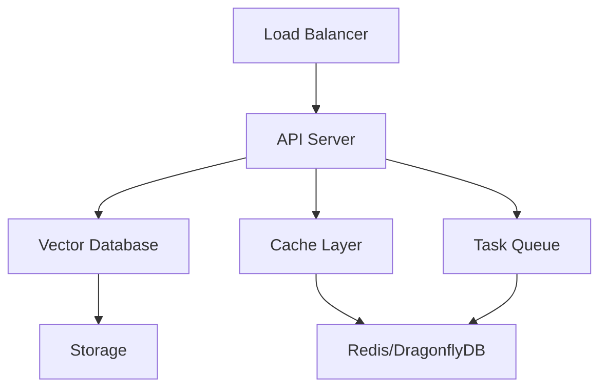

# Operations Guide

> **Purpose**: Comprehensive operational procedures and maintenance guide  
> **Audience**: System operators, administrators, and DevOps teams  
> **Last Updated**: 2025-06-09

This guide provides comprehensive operational procedures for maintaining, monitoring, and
administering the AI Documentation Vector Database system. It covers daily operations,
incident response, maintenance schedules, and best practices for system operators.

## Table of Contents

1. [Daily Operations](#daily-operations)
2. [System Administration](#system-administration)
3. [Maintenance Procedures](#maintenance-procedures)
4. [Backup and Recovery](#backup-and-recovery)
5. [User and Access Management](#user-and-access-management)
6. [Configuration Management](#configuration-management)
7. [Incident Response](#incident-response)
8. [Resource Management](#resource-management)
9. [Security Operations](#security-operations)
10. [Task Queue Operations](#task-queue-operations)
11. [Performance Management](#performance-management)
12. [Disaster Recovery](#disaster-recovery)
13. [Troubleshooting](#troubleshooting)

## Daily Operations

### Daily Checklist

Execute these tasks every day to ensure system health:

```bash
# Daily health verification script
#!/bin/bash
echo "=== Daily Health Check - $(date) ==="

# 1. Check service status
docker-compose ps
systemctl status ai-docs-vector-db

# 2. Verify database connectivity
curl -s http://localhost:6333/health | jq '.'

# 3. Check Redis/DragonflyDB
redis-cli ping

# 4. Monitor disk usage
df -h | grep -E "(/$|/var|/tmp)"

# 5. Check logs for errors
docker logs --since 24h qdrant | grep -i error
docker logs --since 24h dragonfly | grep -i error

# 6. Verify task queue health
redis-cli -n 1 info | grep -E "(connected_clients|used_memory_human)"

# 7. Check system resources
free -h
top -bn1 | head -15

echo "=== Daily Check Complete ==="
```

### Daily Tasks

**Morning Tasks (09:00)**:

- [ ] Run daily health check script
- [ ] Review overnight logs for errors or warnings
- [ ] Check backup completion status
- [ ] Verify cache hit rates and performance metrics
- [ ] Monitor resource utilization trends

**Midday Tasks (13:00)**:

- [ ] Check active user sessions and API usage
- [ ] Review task queue status and pending jobs
- [ ] Monitor search latency and throughput
- [ ] Verify embedding generation performance

**Evening Tasks (18:00)**:

- [ ] Clean up temporary files and logs
- [ ] Review daily performance metrics
- [ ] Check scheduled maintenance tasks
- [ ] Prepare daily status report

### Log Management

```bash
# Daily log rotation and cleanup
./scripts/daily-log-cleanup.sh

# Log retention policy
LOG_RETENTION_DAYS=30

# Clean application logs
find /var/log/ai-docs -name "*.log" -mtime +${LOG_RETENTION_DAYS} -delete

# Rotate Docker logs
docker system prune -f --volumes --filter "until=24h"

# Archive important logs
tar -czf /backup/logs/daily-logs-$(date +%Y%m%d).tar.gz /var/log/ai-docs/
```

## System Administration

### Service Management

```bash
# Start all services
python scripts/dev.py services start

# Stop services gracefully
docker-compose down --timeout 30

# Restart specific service
docker-compose restart qdrant
docker-compose restart dragonfly

# View service logs
docker-compose logs -f --tail=100 qdrant
docker-compose logs -f --tail=100 dragonfly

# Check service resource usage
docker stats --no-stream
```

### System Configuration

**Environment Variables**:

```bash
# Production environment settings
export AI_DOCS_ENV=production
export LOG_LEVEL=INFO
export METRICS_ENABLED=true
export BACKUP_SCHEDULE="0 2 * * *"  # Daily at 2 AM
export CLEANUP_SCHEDULE="0 4 * * *"  # Daily at 4 AM
```

**Service Limits**:

```yaml
# docker-compose.yml resource limits
services:
  qdrant:
    deploy:
      resources:
        limits:
          memory: 4G
          cpus: "2.0"
        reservations:
          memory: 2G
          cpus: "1.0"

  dragonfly:
    deploy:
      resources:
        limits:
          memory: 2G
          cpus: "1.0"
        reservations:
          memory: 1G
          cpus: "0.5"
```

### User Session Management

```bash
# View active sessions
redis-cli keys "session:*" | wc -l

# Clean expired sessions
redis-cli eval "
  local keys = redis.call('keys', 'session:*')
  local deleted = 0
  for i=1,#keys do
    local ttl = redis.call('ttl', keys[i])
    if ttl == -1 then
      redis.call('del', keys[i])
      deleted = deleted + 1
    end
  end
  return deleted
" 0

# Monitor session creation rate
redis-cli monitor | grep -E "session:(create|delete)"
```

## Maintenance Procedures

### Scheduled Maintenance

**Weekly Tasks (Sundays, 02:00)**:

```bash
#!/bin/bash
# Weekly maintenance script
echo "=== Weekly Maintenance - $(date) ==="

# 1. Database optimization
echo "Optimizing vector database..."
curl -X POST "http://localhost:6333/collections/documents/optimize"

# 2. Index rebuilding for large collections
echo "Rebuilding indexes..."
curl -X POST "http://localhost:6333/collections/documents/index"

# 3. Cache optimization
echo "Optimizing cache..."
redis-cli eval "
  local info = redis.call('info', 'memory')
  local used = string.match(info, 'used_memory:(%d+)')
  if tonumber(used) > 1073741824 then  -- 1GB
    redis.call('flushdb')
    return 'Cache cleared due to high memory usage'
  end
  return 'Cache within normal limits'
" 0

# 4. Vacuum unused space
echo "Vacuuming unused space..."
docker exec qdrant qdrant-cli collection vacuum documents

# 5. Update system packages (if needed)
apt update && apt list --upgradable

echo "=== Weekly Maintenance Complete ==="
```

**Monthly Tasks (First Sunday, 01:00)**:

```bash
#!/bin/bash
# Monthly maintenance script
echo "=== Monthly Maintenance - $(date) ==="

# 1. Full system backup
./scripts/full-system-backup.sh

# 2. Security updates
apt update && apt upgrade -y

# 3. Dependency updates
docker-compose pull
# Option 1: Update with uv (recommended)
uv sync --upgrade

# Option 2: Update with pip
pip install --upgrade -r requirements.txt

# 4. Performance analysis
./scripts/generate-performance-report.sh

# 5. Capacity planning review
./scripts/capacity-analysis.sh

# 6. Documentation updates
git pull origin main
./scripts/update-operational-docs.sh

echo "=== Monthly Maintenance Complete ==="
```

### Maintenance Windows

**Planned Maintenance Schedule**:

- **Daily**: 02:00-02:30 UTC (Log rotation, cleanup)
- **Weekly**: Sunday 02:00-03:00 UTC (Database optimization)
- **Monthly**: First Sunday 01:00-04:00 UTC (System updates)
- **Quarterly**: Security patches and major updates

**Emergency Maintenance**:

1. **Assessment**: Evaluate issue severity (Critical/High/Medium/Low)
2. **Communication**: Notify stakeholders within 15 minutes
3. **Implementation**: Apply fixes with minimal downtime
4. **Verification**: Confirm issue resolution
5. **Documentation**: Update procedures and lessons learned

## Backup and Recovery

### Backup Strategy

**Daily Incremental Backups**:

```bash
#!/bin/bash
# Daily backup script
BACKUP_DATE=$(date +%Y%m%d)
BACKUP_DIR="/backup/daily/${BACKUP_DATE}"

mkdir -p ${BACKUP_DIR}

# 1. Vector database backup
echo "Backing up Qdrant collections..."
curl -X POST "http://localhost:6333/snapshots" \
  -H "Content-Type: application/json" \
  -d '{"collection_name": "documents"}'

# 2. Configuration backup
echo "Backing up configurations..."
cp -r /app/config ${BACKUP_DIR}/
cp docker-compose.yml ${BACKUP_DIR}/
cp .env ${BACKUP_DIR}/env.backup

# 3. Cache state backup (critical data only)
echo "Backing up critical cache data..."
redis-cli save
cp /var/lib/redis/dump.rdb ${BACKUP_DIR}/redis-backup.rdb

# 4. Application state backup
echo "Backing up application state..."
tar -czf ${BACKUP_DIR}/app-state.tar.gz /app/data

# 5. Verify backup integrity
echo "Verifying backup integrity..."
./scripts/verify-backup.sh ${BACKUP_DIR}
```

**Weekly Full Backups**:

```bash
#!/bin/bash
# Weekly full backup script
BACKUP_DATE=$(date +%Y%m%d)
BACKUP_DIR="/backup/weekly/${BACKUP_DATE}"

mkdir -p ${BACKUP_DIR}

# 1. Complete system snapshot
echo "Creating full system backup..."
docker-compose down --timeout 30

# 2. Create volume snapshots
docker run --rm -v ai-docs_qdrant_data:/data -v ${BACKUP_DIR}:/backup \
  alpine tar czf /backup/qdrant-data.tar.gz -C /data .

docker run --rm -v ai-docs_dragonfly_data:/data -v ${BACKUP_DIR}:/backup \
  alpine tar czf /backup/dragonfly-data.tar.gz -C /data .

# 3. Configuration and code backup
tar -czf ${BACKUP_DIR}/application.tar.gz /app

# 4. Restart services
docker-compose up -d

echo "Weekly backup complete: ${BACKUP_DIR}"
```

### Recovery Procedures

**Point-in-Time Recovery**:

```bash
#!/bin/bash
# Recovery script
RECOVERY_DATE=$1
BACKUP_DIR="/backup/daily/${RECOVERY_DATE}"

if [ ! -d "${BACKUP_DIR}" ]; then
  echo "Backup directory not found: ${BACKUP_DIR}"
  exit 1
fi

echo "Starting recovery from ${RECOVERY_DATE}..."

# 1. Stop services
docker-compose down

# 2. Restore vector database
echo "Restoring Qdrant data..."
docker run --rm -v ai-docs_qdrant_data:/data -v ${BACKUP_DIR}:/backup \
  alpine sh -c "rm -rf /data/* && tar xzf /backup/qdrant-data.tar.gz -C /data"

# 3. Restore cache
echo "Restoring cache data..."
cp ${BACKUP_DIR}/redis-backup.rdb /var/lib/redis/dump.rdb

# 4. Restore configuration
echo "Restoring configuration..."
cp -r ${BACKUP_DIR}/config/* /app/config/

# 5. Start services
docker-compose up -d

# 6. Verify recovery
echo "Verifying recovery..."
sleep 30
curl http://localhost:6333/health
redis-cli ping

echo "Recovery completed successfully"
```

### Backup Verification

```bash
#!/bin/bash
# Backup verification script
BACKUP_DIR=$1

echo "Verifying backup: ${BACKUP_DIR}"

# 1. Check file integrity
md5sum ${BACKUP_DIR}/*.tar.gz > ${BACKUP_DIR}/checksums.md5
md5sum -c ${BACKUP_DIR}/checksums.md5

# 2. Test restore on staging
./scripts/test-restore-staging.sh ${BACKUP_DIR}

# 3. Verify data completeness
./scripts/verify-data-completeness.sh ${BACKUP_DIR}

echo "Backup verification complete"
```

## User and Access Management

### User Account Management

**Create New User**:

```bash
#!/bin/bash
# Create new user account
USERNAME=$1
ROLE=$2  # admin, operator, viewer

if [ -z "$USERNAME" ] || [ -z "$ROLE" ]; then
  echo "Usage: $0 <username> <role>"
  exit 1
fi

# Generate API key
API_KEY=$(openssl rand -hex 32)

# Store user credentials
redis-cli hset "user:${USERNAME}" \
  "api_key" "${API_KEY}" \
  "role" "${ROLE}" \
  "created_at" "$(date -Iseconds)" \
  "status" "active"

echo "User created: ${USERNAME}"
echo "API Key: ${API_KEY}"
echo "Role: ${ROLE}"
```

**User Access Control**:

```bash
# List all users
redis-cli keys "user:*" | sed 's/user://' | sort

# Check user permissions
redis-cli hgetall "user:username"

# Disable user account
redis-cli hset "user:username" "status" "disabled"

# Reset user API key
NEW_KEY=$(openssl rand -hex 32)
redis-cli hset "user:username" "api_key" "${NEW_KEY}"
```

### Role-Based Access Control

**Permission Matrix**:

```yaml
roles:
  admin:
    permissions:
      - read_collections
      - write_collections
      - delete_collections
      - manage_users
      - view_metrics
      - system_config

  operator:
    permissions:
      - read_collections
      - view_metrics
      - restart_services
      - backup_restore

  viewer:
    permissions:
      - read_collections
      - view_metrics
```

**Permission Enforcement**:

```python
# Middleware for permission checking
async def check_permissions(user_id: str, required_permission: str) -> bool:
    """Check if user has required permission."""

    user_data = await redis.hgetall(f"user:{user_id}")
    user_role = user_data.get("role")

    if not user_role:
        return False

    role_permissions = ROLE_PERMISSIONS.get(user_role, [])
    return required_permission in role_permissions
```

### API Key Management

```bash
# Rotate all API keys (emergency)
#!/bin/bash
echo "Rotating all API keys..."

for user in $(redis-cli keys "user:*" | sed 's/user://'); do
  new_key=$(openssl rand -hex 32)
  redis-cli hset "user:${user}" "api_key" "${new_key}"
  echo "Rotated key for: ${user}"
done

echo "All API keys rotated. Notify users of new keys."
```

## Configuration Management

### Configuration Versioning

```bash
# Configuration backup before changes
#!/bin/bash
CONFIG_VERSION=$(date +%Y%m%d_%H%M%S)
BACKUP_DIR="/backup/config/${CONFIG_VERSION}"

mkdir -p ${BACKUP_DIR}

# Backup current configuration
cp -r /app/config ${BACKUP_DIR}/
cp docker-compose.yml ${BACKUP_DIR}/
cp .env ${BACKUP_DIR}/

# Create version metadata
cat > ${BACKUP_DIR}/metadata.json << EOF
{
  "version": "${CONFIG_VERSION}",
  "timestamp": "$(date -Iseconds)",
  "operator": "$(whoami)",
  "description": "Configuration backup before changes"
}
EOF

echo "Configuration backed up to: ${BACKUP_DIR}"
```

### Configuration Validation

```bash
#!/bin/bash
# Validate configuration before deployment
echo "Validating configuration..."

# 1. YAML syntax validation
for config_file in config/*.yml config/*.yaml; do
  if [ -f "$config_file" ]; then
    python -c "import yaml; yaml.safe_load(open('$config_file'))" || {
      echo "Invalid YAML: $config_file"
      exit 1
    }
  fi
done

# 2. Environment variable validation
source .env
required_vars=(
  "QDRANT_URL"
  "REDIS_URL"
  "OPENAI_API_KEY"
  "EMBEDDING_MODEL"
)

for var in "${required_vars[@]}"; do
  if [ -z "${!var}" ]; then
    echo "Missing required variable: $var"
    exit 1
  fi
done

# 3. Service connectivity validation
./scripts/test-service-connectivity.sh

echo "Configuration validation passed"
```

### Configuration Deployment

```bash
#!/bin/bash
# Deploy configuration changes
echo "Deploying configuration changes..."

# 1. Validate new configuration
./scripts/validate-config.sh || exit 1

# 2. Create rollback point
./scripts/backup-config.sh

# 3. Apply configuration
docker-compose down --timeout 30
docker-compose up -d

# 4. Health check
sleep 30
./scripts/health-check.sh || {
  echo "Health check failed, rolling back..."
  ./scripts/rollback-config.sh
  exit 1
}

echo "Configuration deployed successfully"
```

## Incident Response

### Incident Classification

**Severity Levels**:

- **Critical (P1)**: System down, data loss, security breach
- **High (P2)**: Significant performance degradation, partial outage
- **Medium (P3)**: Minor performance issues, non-critical features affected
- **Low (P4)**: Cosmetic issues, enhancement requests

### Incident Response Procedures

**Critical Incident Response (P1)**:

```bash
#!/bin/bash
# Critical incident response script
echo "=== CRITICAL INCIDENT DETECTED ==="
echo "Timestamp: $(date -Iseconds)"

# 1. Immediate assessment
echo "1. Assessing system status..."
./scripts/rapid-health-check.sh

# 2. Notify stakeholders
echo "2. Sending notifications..."
./scripts/send-incident-alert.sh "CRITICAL" "$1"

# 3. Gather diagnostic information
echo "3. Gathering diagnostics..."
./scripts/collect-diagnostics.sh

# 4. Implement immediate fixes
echo "4. Applying immediate fixes..."
case "$1" in
  "database_down")
    docker-compose restart qdrant
    ;;
  "memory_exhausted")
    docker-compose restart dragonfly
    ./scripts/clear-cache.sh
    ;;
  "disk_full")
    ./scripts/emergency-cleanup.sh
    ;;
esac

# 5. Verify resolution
echo "5. Verifying resolution..."
./scripts/health-check.sh

echo "=== CRITICAL INCIDENT RESPONSE COMPLETE ==="
```

### Escalation Procedures

**Escalation Matrix**:

```yaml
escalation_levels:
  level_1:
    role: "On-call Operator"
    response_time: "15 minutes"
    responsibilities:
      - Initial assessment
      - Basic troubleshooting
      - Status updates

  level_2:
    role: "Senior Operator"
    response_time: "30 minutes"
    responsibilities:
      - Advanced troubleshooting
      - Configuration changes
      - Vendor coordination

  level_3:
    role: "System Architect"
    response_time: "1 hour"
    responsibilities:
      - Architectural decisions
      - Emergency changes
      - Post-incident review
```

### Communication Templates

**Incident Notification**:

```bash
# Send incident notification
INCIDENT_ID="INC-$(date +%Y%m%d-%H%M%S)"
SEVERITY=$1
DESCRIPTION=$2

curl -X POST "https://hooks.slack.com/services/..." \
  -H "Content-Type: application/json" \
  -d "{
    \"text\": \"🚨 INCIDENT ALERT - ${SEVERITY}\",
    \"blocks\": [
      {
        \"type\": \"section\",
        \"text\": {
          \"type\": \"mrkdwn\",
          \"text\": \"*Incident ID:* ${INCIDENT_ID}\\n*Severity:* ${SEVERITY}\\n*Description:* ${DESCRIPTION}\\n*Time:* $(date -Iseconds)\"
        }
      }
    ]
  }"
```

## Resource Management

### Capacity Planning

**Resource Monitoring**:

```bash
#!/bin/bash
# Resource utilization monitoring
echo "=== Resource Utilization Report ==="
echo "Timestamp: $(date -Iseconds)"

# CPU utilization
echo "CPU Usage:"
top -bn1 | grep "Cpu(s)" | awk '{print $2 $3}' | sed 's/%us,/% user,/' | sed 's/%sy,/% system/'

# Memory utilization
echo -e "\nMemory Usage:"
free -h | grep -E "(Mem|Swap)"

# Disk utilization
echo -e "\nDisk Usage:"
df -h | grep -vE "^(tmpfs|udev)"

# Docker container resources
echo -e "\nContainer Resources:"
docker stats --no-stream --format "table {{.Container}}\t{{.CPUPerc}}\t{{.MemUsage}}\t{{.MemPerc}}"

# Vector database metrics
echo -e "\nQdrant Metrics:"
curl -s "http://localhost:6333/metrics" | grep -E "(qdrant_collections_total|qdrant_points_total)"

# Cache metrics
echo -e "\nCache Metrics:"
redis-cli info memory | grep -E "(used_memory_human|used_memory_peak_human)"
```

**Capacity Thresholds**:

```yaml
thresholds:
  cpu_warning: 70
  cpu_critical: 85
  memory_warning: 75
  memory_critical: 90
  disk_warning: 80
  disk_critical: 95

alerts:
  cpu_high:
    condition: "cpu_usage > 85"
    action: "scale_up_workers"

  memory_high:
    condition: "memory_usage > 90"
    action: "restart_services"

  disk_full:
    condition: "disk_usage > 95"
    action: "emergency_cleanup"
```

### Auto-scaling Procedures

```bash
#!/bin/bash
# Auto-scaling script
METRIC=$1
CURRENT_VALUE=$2
THRESHOLD=$3

echo "Scaling trigger: ${METRIC} = ${CURRENT_VALUE}% (threshold: ${THRESHOLD}%)"

case "$METRIC" in
  "cpu")
    if [ "$CURRENT_VALUE" -gt "$THRESHOLD" ]; then
      echo "Scaling up worker processes..."
      docker-compose scale worker=3
    fi
    ;;
  "memory")
    if [ "$CURRENT_VALUE" -gt "$THRESHOLD" ]; then
      echo "Restarting services to free memory..."
      docker-compose restart dragonfly
    fi
    ;;
  "requests")
    if [ "$CURRENT_VALUE" -gt "$THRESHOLD" ]; then
      echo "Enabling additional cache layers..."
      redis-cli config set maxmemory-policy allkeys-lru
    fi
    ;;
esac
```

## Security Operations

### Security Monitoring

**Daily Security Checks**:

```bash
#!/bin/bash
# Daily security monitoring
echo "=== Security Check - $(date) ==="

# 1. Check for failed authentication attempts
echo "Failed Authentication Attempts:"
grep "authentication failed" /var/log/auth.log | tail -10

# 2. Monitor unusual API access patterns
echo "Unusual API Access:"
redis-cli eval "
  local keys = redis.call('keys', 'api_access:*')
  local suspicious = {}
  for i=1,#keys do
    local count = redis.call('get', keys[i])
    if tonumber(count) > 1000 then
      table.insert(suspicious, keys[i] .. ':' .. count)
    end
  end
  return suspicious
" 0

# 3. Check SSL certificate expiration
echo "SSL Certificate Status:"
openssl x509 -in /etc/ssl/certs/api.crt -checkend 2592000 -noout || \
  echo "WARNING: SSL certificate expires within 30 days"

# 4. Verify service configurations
echo "Service Security Configuration:"
./scripts/verify-security-config.sh

# 5. Check for system updates
echo "Security Updates Available:"
apt list --upgradable | grep -i security
```

### Access Log Analysis

```bash
#!/bin/bash
# Analyze access logs for security threats
LOG_FILE="/var/log/nginx/access.log"
ALERT_THRESHOLD=100

echo "=== Security Log Analysis ==="

# 1. Top IP addresses by request count
echo "Top IP Addresses:"
awk '{print $1}' $LOG_FILE | sort | uniq -c | sort -nr | head -10

# 2. Check for rate limiting triggers
echo "Rate Limiting Events:"
grep "rate_limit" $LOG_FILE | tail -20

# 3. Monitor for SQL injection attempts
echo "Potential SQL Injection:"
grep -E "(union|select|insert|update|delete|drop)" $LOG_FILE | tail -10

# 4. Check for API abuse
echo "High-frequency API calls:"
awk '$9 == 200 {print $1}' $LOG_FILE | sort | uniq -c | \
  awk -v threshold=$ALERT_THRESHOLD '$1 > threshold {print $2 " - " $1 " requests"}'
```

### Vulnerability Management

```bash
#!/bin/bash
# Weekly vulnerability scan
echo "=== Vulnerability Scan - $(date) ==="

# 1. Update vulnerability database
apt update

# 2. Check for known vulnerabilities
echo "System Vulnerabilities:"
apt list --upgradable | grep -E "(security|CVE)"

# 3. Docker image scanning
echo "Container Vulnerabilities:"
for image in $(docker images --format "{{.Repository}}:{{.Tag}}"); do
  echo "Scanning: $image"
  docker run --rm -v /var/run/docker.sock:/var/run/docker.sock \
    aquasec/trivy image --severity HIGH,CRITICAL $image
done

# 4. Configuration security check
echo "Configuration Security:"
./scripts/security-config-audit.sh
```

## Task Queue Operations

### Task Queue Management

The system uses ARQ (Async Redis Queue) for persistent background task execution.
This section covers operational procedures for managing the task queue system.

**Worker Health Monitoring**:

```bash
#!/bin/bash
# Monitor task queue worker health
echo "=== Task Queue Health Check ==="

# 1. Check worker process status
pgrep -f "arq.*worker" || echo "WARNING: No ARQ workers running"

# 2. Check Redis connectivity for task queue
redis-cli -n 1 ping || echo "ERROR: Task queue Redis unavailable"

# 3. Monitor queue statistics
echo "Queue Statistics:"
redis-cli -n 1 eval "
  local stats = {}
  stats.pending = redis.call('llen', 'arq:queue:default')
  stats.processing = redis.call('llen', 'arq:in_progress')
  stats.dead = redis.call('zcard', 'arq:dead')
  return cjson.encode(stats)
" 0

# 4. Check worker memory usage
ps aux | grep -E "(arq|worker)" | awk '{sum+=$6} END {print "Worker memory usage: " sum/1024 " MB"}'
```

**Task Queue Operations**:

```bash
# Start worker processes
./scripts/start-worker.sh

# Scale workers for high load
uv run task-worker --workers 4 --max-jobs 20

# Monitor job processing
redis-cli -n 1 monitor | grep -E "(enqueue|dequeue)"

# View failed jobs
redis-cli -n 1 zrange arq:dead 0 -1 withscores

# Retry failed jobs
redis-cli -n 1 eval "
  local failed_jobs = redis.call('zrange', 'arq:dead', 0, -1)
  for i=1,#failed_jobs do
    redis.call('lpush', 'arq:queue:default', failed_jobs[i])
    redis.call('zrem', 'arq:dead', failed_jobs[i])
  end
  return #failed_jobs
" 0
```

**Production Worker Management**:

```bash
# Systemd service for worker
sudo systemctl start ai-docs-task-worker
sudo systemctl enable ai-docs-task-worker
sudo systemctl status ai-docs-task-worker

# Docker worker management
docker-compose --profile worker up -d task-worker
docker-compose logs -f task-worker

# Worker graceful shutdown
docker-compose exec task-worker kill -TERM 1
```

### Background Task Types

**Collection Deletion Tasks**:

- Purpose: Safe collection deletion with grace period
- Schedule: 60-minute delay by default
- Monitoring: Track via `delete_collection` task status

**Cache Persistence Tasks**:

- Purpose: Write-behind cache pattern for reliability
- Schedule: 5-second delay for batching
- Monitoring: Track cache persistence metrics

**Deployment Tasks**:

- Purpose: Orchestrate canary and blue-green deployments
- Schedule: Based on deployment configuration
- Monitoring: Track deployment progress and rollback triggers

## Enhanced Database Connection Pool Management (BJO-134)

### Database Connection Pool Operations

#### 1. Connection Pool Health Monitoring

```bash
#!/bin/bash
# Enhanced database connection pool health check
echo "=== Enhanced Database Connection Pool Health Check ==="

# 1. Check connection pool status
POOL_STATUS=$(curl -s "http://localhost:8000/admin/db-stats" | jq -r '.connection_pool.status')
echo "Connection Pool Status: $POOL_STATUS"

# 2. Monitor connection utilization
POOL_UTILIZATION=$(curl -s "http://localhost:8000/metrics" | grep "db_connection_pool_checked_out" | awk '{print $2}')
POOL_SIZE=$(curl -s "http://localhost:8000/metrics" | grep "db_connection_pool_size" | awk '{print $2}')
UTILIZATION_PERCENT=$(echo "scale=2; $POOL_UTILIZATION / $POOL_SIZE * 100" | bc)

echo "Pool Utilization: $UTILIZATION_PERCENT% ($POOL_UTILIZATION/$POOL_SIZE)"

# Alert if utilization is high
if (( $(echo "$UTILIZATION_PERCENT > 80" | bc -l) )); then
    echo "⚠️  WARNING: High connection pool utilization detected"
    # Trigger alert
    ./scripts/alert-high-pool-utilization.sh
fi

# 3. Check ML model performance
ML_ACCURACY=$(curl -s "http://localhost:8000/metrics" | grep "db_connection_pool_ml_model_accuracy" | awk '{print $2}')
echo "ML Model Accuracy: $(echo "scale=1; $ML_ACCURACY * 100" | bc)%"

# 4. Monitor circuit breaker state
CIRCUIT_BREAKER_STATE=$(curl -s "http://localhost:8000/metrics" | grep "db_circuit_breaker_state")
echo "Circuit Breaker Status: $CIRCUIT_BREAKER_STATE"

# 5. Check connection affinity performance
AFFINITY_SCORE=$(curl -s "http://localhost:8000/metrics" | grep "db_connection_affinity_performance_score" | awk '{print $2}')
echo "Connection Affinity Score: $AFFINITY_SCORE"
```

#### 2. ML Model Retraining Procedures

```bash
#!/bin/bash
# ML model retraining for predictive load monitoring
echo "=== ML Model Retraining Procedure ==="

# 1. Check if retraining is needed
CURRENT_ACCURACY=$(curl -s "http://localhost:8000/api/admin/ml-model-stats" | jq -r '.accuracy')
TRAINING_SAMPLES=$(curl -s "http://localhost:8000/api/admin/ml-model-stats" | jq -r '.training_samples')

echo "Current model accuracy: $CURRENT_ACCURACY"
echo "Training samples available: $TRAINING_SAMPLES"

# 2. Trigger retraining if needed
if (( $(echo "$CURRENT_ACCURACY < 0.7" | bc -l) )) || [ "$TRAINING_SAMPLES" -gt 5000 ]; then
    echo "Triggering ML model retraining..."

    # Start retraining process
    curl -X POST "http://localhost:8000/api/admin/retrain-ml-model" \
        -H "Content-Type: application/json" \
        -d '{"force": false, "background": true}'

    # Monitor retraining progress
    echo "Monitoring retraining progress..."
    while true; do
        STATUS=$(curl -s "http://localhost:8000/api/admin/ml-model-training-status" | jq -r '.status')
        echo "Training status: $STATUS"

        if [ "$STATUS" = "completed" ]; then
            echo "✓ ML model retraining completed successfully"
            break
        elif [ "$STATUS" = "failed" ]; then
            echo "✗ ML model retraining failed"
            break
        fi

        sleep 30
    done
else
    echo "Model retraining not needed at this time"
fi
```

#### 3. Circuit Breaker Manual Interventions

```bash
#!/bin/bash
# Manual circuit breaker operations
echo "=== Circuit Breaker Manual Operations ==="

case "$1" in
    "status")
        echo "Checking circuit breaker status..."
        curl -s "http://localhost:8000/api/admin/circuit-breaker-status" | jq '.'
        ;;

    "reset")
        echo "Manually resetting circuit breaker..."
        curl -X POST "http://localhost:8000/api/admin/circuit-breaker-reset" \
            -H "Content-Type: application/json" \
            -d '{"failure_type": "all"}'
        echo "✓ Circuit breaker reset completed"
        ;;

    "test")
        echo "Testing circuit breaker functionality..."
        curl -X POST "http://localhost:8000/api/admin/circuit-breaker-test" \
            -H "Content-Type: application/json" \
            -d '{"test_type": "controlled_failure"}'
        ;;

    "configure")
        echo "Updating circuit breaker configuration..."
        curl -X PUT "http://localhost:8000/api/admin/circuit-breaker-config" \
            -H "Content-Type: application/json" \
            -d '{
                "failure_threshold": '$2',
                "recovery_timeout": '$3',
                "half_open_max_calls": '$4'
            }'
        echo "✓ Configuration updated"
        ;;

    *)
        echo "Usage: $0 {status|reset|test|configure <threshold> <timeout> <max_calls>}"
        exit 1
        ;;
esac
```

#### 4. Connection Affinity Management

```bash
#!/bin/bash
# Connection affinity management operations
echo "=== Connection Affinity Management ==="

# 1. View current query patterns
echo "Current query patterns:"
curl -s "http://localhost:8000/api/admin/connection-affinity-patterns" | jq '.patterns[] | {pattern: .normalized_query, executions: .execution_count, avg_time: .avg_execution_time_ms}'

# 2. Analyze connection performance
echo "Connection performance analysis:"
curl -s "http://localhost:8000/api/admin/connection-affinity-performance" | jq '.'

# 3. Clear low-performing patterns
echo "Clearing low-performing patterns..."
curl -X DELETE "http://localhost:8000/api/admin/connection-affinity-patterns" \
    -H "Content-Type: application/json" \
    -d '{"min_performance_score": 0.3}'

# 4. Optimize connection specializations
echo "Optimizing connection specializations..."
curl -X POST "http://localhost:8000/api/admin/optimize-connection-specializations" \
    -H "Content-Type: application/json"

echo "✓ Connection affinity optimization completed"
```

### Database Performance Troubleshooting

#### 1. Performance Regression Investigation

```bash
#!/bin/bash
# Investigate performance regressions in enhanced database features
echo "=== Database Performance Regression Investigation ==="

# 1. Compare current vs baseline performance
CURRENT_LATENCY=$(curl -s "http://localhost:9090/api/v1/query?query=histogram_quantile(0.95, rate(db_query_duration_seconds_bucket[5m]))" | jq -r '.data.result[0].value[1]')
BASELINE_LATENCY=0.25  # 250ms baseline

LATENCY_CHANGE=$(echo "scale=2; ($CURRENT_LATENCY - $BASELINE_LATENCY) / $BASELINE_LATENCY * 100" | bc)

echo "Current 95th percentile latency: ${CURRENT_LATENCY}s"
echo "Baseline latency: ${BASELINE_LATENCY}s"
echo "Performance change: $LATENCY_CHANGE%"

# 2. Check for specific issues
if (( $(echo "$LATENCY_CHANGE > 25" | bc -l) )); then
    echo "🚨 Performance regression detected!"

    # Check ML model performance
    ML_ACCURACY=$(curl -s "http://localhost:8000/metrics" | grep "db_connection_pool_ml_model_accuracy" | awk '{print $2}')
    if (( $(echo "$ML_ACCURACY < 0.7" | bc -l) )); then
        echo "Issue: ML model accuracy degraded ($ML_ACCURACY)"
        echo "Action: Schedule model retraining"
    fi

    # Check circuit breaker state
    CB_FAILURES=$(curl -s "http://localhost:8000/metrics" | grep "db_circuit_breaker_failures_total" | awk '{print $2}')
    if [ "$CB_FAILURES" -gt 100 ]; then
        echo "Issue: High circuit breaker failure rate ($CB_FAILURES)"
        echo "Action: Investigate underlying database issues"
    fi

    # Check connection affinity effectiveness
    AFFINITY_SCORE=$(curl -s "http://localhost:8000/metrics" | grep "db_connection_affinity_performance_score" | awk '{print $2}')
    if (( $(echo "$AFFINITY_SCORE < 0.5" | bc -l) )); then
        echo "Issue: Connection affinity performance poor ($AFFINITY_SCORE)"
        echo "Action: Clear affinity cache and rebuild patterns"
    fi
fi
```

#### 2. Emergency Database Scaling

```bash
#!/bin/bash
# Emergency database connection pool scaling
echo "=== Emergency Database Connection Pool Scaling ==="

CURRENT_LOAD=$(curl -s "http://localhost:8000/metrics" | grep "db_connection_pool_checked_out" | awk '{print $2}')
POOL_SIZE=$(curl -s "http://localhost:8000/metrics" | grep "db_connection_pool_size" | awk '{print $2}')

echo "Current pool usage: $CURRENT_LOAD/$POOL_SIZE"

# Emergency scaling if needed
if [ "$CURRENT_LOAD" -gt $((POOL_SIZE * 85 / 100)) ]; then
    echo "🚨 Emergency scaling required!"

    # Increase pool size temporarily
    NEW_POOL_SIZE=$((POOL_SIZE + 10))
    curl -X PUT "http://localhost:8000/api/admin/connection-pool-config" \
        -H "Content-Type: application/json" \
        -d '{"pool_size": '$NEW_POOL_SIZE', "temporary": true}'

    echo "Pool size increased to $NEW_POOL_SIZE (temporary)"

    # Set alert to review scaling in 1 hour
    echo "pool-scaling-review" | at now + 1 hour
fi
```

### Enhanced Database Maintenance Tasks

#### Weekly Database Health Review

```bash
#!/bin/bash
# Weekly enhanced database health review
echo "=== Weekly Enhanced Database Health Review ==="

# 1. ML model performance trends
echo "ML Model Performance (7 days):"
curl -s "http://localhost:9090/api/v1/query_range?query=db_connection_pool_ml_model_accuracy&start=$(date -d '7 days ago' +%s)&end=$(date +%s)&step=3600" | jq -r '.data.result[0].values[] | "\(.[0]) \(.[1])"' | tail -10

# 2. Circuit breaker incident summary
echo "Circuit Breaker Incidents (7 days):"
curl -s "http://localhost:9090/api/v1/query?query=increase(db_circuit_breaker_failures_total[7d])" | jq -r '.data.result[] | "\(.metric.failure_type): \(.[1]) failures"'

# 3. Connection affinity effectiveness
echo "Connection Affinity Effectiveness:"
curl -s "http://localhost:8000/api/admin/connection-affinity-weekly-report" | jq '.'

# 4. Performance improvements validation
echo "Performance Improvements Validation:"
CURRENT_P95=$(curl -s "http://localhost:9090/api/v1/query?query=histogram_quantile(0.95, rate(db_query_duration_seconds_bucket[7d]))" | jq -r '.data.result[0].value[1]')
THROUGHPUT=$(curl -s "http://localhost:9090/api/v1/query?query=rate(db_query_total[7d])" | jq -r '.data.result[0].value[1]')

echo "7-day average P95 latency: ${CURRENT_P95}s"
echo "7-day average throughput: $THROUGHPUT queries/sec"

# Generate weekly report
cat > /tmp/weekly-db-report.json <<EOF
{
  "week_ending": "$(date +%Y-%m-%d)",
  "p95_latency": "$CURRENT_P95",
  "throughput": "$THROUGHPUT",
  "ml_model_accuracy": "$(curl -s "http://localhost:8000/metrics" | grep "db_connection_pool_ml_model_accuracy" | awk '{print $2}')",
  "circuit_breaker_health": "$(curl -s "http://localhost:8000/api/admin/circuit-breaker-health-summary" | jq -c '.')"
}
EOF

echo "✓ Weekly database health report saved to /tmp/weekly-db-report.json"
```

## Performance Management

### Performance Monitoring

**Real-time Performance Metrics**:

```bash
#!/bin/bash
# Real-time performance monitoring
echo "=== Performance Metrics Dashboard ==="

# 1. Embedding generation performance
echo "Embedding Performance:"
curl -s "http://localhost:8000/metrics" | grep -E "(embedding_duration|embedding_requests)"

# 2. Search latency metrics
echo "Search Performance:"
curl -s "http://localhost:6333/metrics" | grep -E "(search_duration|search_requests)"

# 3. Cache performance
echo "Cache Performance:"
redis-cli info stats | grep -E "(hit_rate|miss_rate|ops_per_sec)"

# 4. System resource utilization
echo "Resource Utilization:"
./scripts/resource-monitor.sh

# 5. API response times
echo "API Response Times:"
tail -100 /var/log/nginx/access.log | awk '{sum+=$NF; count++} END {print "Average response time: " sum/count "ms"}'
```

### Performance Optimization

**Automatic Performance Tuning**:

```bash
#!/bin/bash
# Auto-tune performance based on current load
CURRENT_LOAD=$(uptime | awk -F'load average:' '{ print $2 }' | awk '{ print $1 }' | sed 's/,//')
CPU_COUNT=$(nproc)
LOAD_RATIO=$(echo "scale=2; $CURRENT_LOAD / $CPU_COUNT" | bc)

echo "Current load ratio: $LOAD_RATIO"

if (( $(echo "$LOAD_RATIO > 0.8" | bc -l) )); then
  echo "High load detected, optimizing..."

  # Reduce worker concurrency
  docker-compose scale worker=1

  # Enable aggressive caching
  redis-cli config set maxmemory-policy allkeys-lru

  # Optimize Qdrant settings
  curl -X PUT "http://localhost:6333/collections/documents" \
    -H "Content-Type: application/json" \
    -d '{"optimizers_config": {"max_segment_size": 200000}}'

elif (( $(echo "$LOAD_RATIO < 0.3" | bc -l) )); then
  echo "Low load detected, scaling back up..."

  # Increase worker concurrency
  docker-compose scale worker=3

  # Optimize for accuracy over speed
  curl -X PUT "http://localhost:6333/collections/documents" \
    -H "Content-Type: application/json" \
    -d '{"hnsw_config": {"ef": 256}}'
fi
```

**Performance Benchmarking**:

```bash
#!/bin/bash
# Run performance benchmarks
echo "=== Performance Benchmark Suite ==="

# 1. Embedding generation benchmark
echo "Embedding Benchmark:"
./scripts/benchmark_embeddings.py --iterations 100

# 2. Search performance benchmark
echo "Search Benchmark:"
./scripts/benchmark_search.py --queries 1000

# 3. Cache performance benchmark
echo "Cache Benchmark:"
./scripts/benchmark_cache.py --operations 10000

# 4. End-to-end workflow benchmark
echo "Workflow Benchmark:"
./scripts/benchmark_workflow.py --documents 100

# 5. Generate performance report
./scripts/generate_performance_report.py
```

## Disaster Recovery

### Disaster Recovery Planning

**Recovery Time Objectives (RTO)**:

- Critical services: 15 minutes
- Full system recovery: 2 hours
- Data recovery: 4 hours

**Recovery Point Objectives (RPO)**:

- Vector database: 1 hour (hourly snapshots)
- Configuration: 24 hours (daily backups)
- Logs: 1 hour (real-time replication)

**Disaster Scenarios**:

1. **Complete Data Center Failure**:

   ```bash
   # Emergency failover procedure
   ./scripts/disaster-recovery/failover-to-secondary.sh
   ```

2. **Database Corruption**:

   ```bash
   # Restore from last known good backup
   ./scripts/disaster-recovery/restore-database.sh --date 2025-06-08
   ```

3. **Security Breach**:

   ```bash
   # Emergency lockdown and recovery
   ./scripts/disaster-recovery/security-incident-response.sh
   ```

### Business Continuity

**Service Dependencies**:



**Failover Procedures**:

```bash
#!/bin/bash
# Automated failover script
FAILURE_TYPE=$1

case "$FAILURE_TYPE" in
  "primary_db")
    echo "Failing over to secondary database..."
    # Update connection strings
    sed -i 's/primary-db:6333/secondary-db:6333/g' docker-compose.yml
    docker-compose up -d
    ;;

  "cache_cluster")
    echo "Failing over to backup cache..."
    # Switch to backup Redis instance
    export REDIS_URL="redis://backup-redis:6379"
    docker-compose restart api
    ;;

  "complete_site")
    echo "Activating disaster recovery site..."
    ./scripts/activate-dr-site.sh
    ;;
esac
```

## Troubleshooting

### Common Issues and Solutions

**High Memory Usage**:

```bash
# Diagnose memory issues
echo "=== Memory Troubleshooting ==="

# 1. Identify memory consumers
ps aux --sort=-%mem | head -10

# 2. Check for memory leaks
valgrind --tool=memcheck --leak-check=full python app.py

# 3. Optimize cache usage
redis-cli config set maxmemory 2gb
redis-cli config set maxmemory-policy allkeys-lru

# 4. Clear unnecessary data
docker system prune -af
```

**Search Performance Degradation**:

```bash
# Diagnose search performance
echo "=== Search Performance Troubleshooting ==="

# 1. Check index status
curl "http://localhost:6333/collections/documents" | jq '.result.status'

# 2. Analyze slow queries
curl "http://localhost:6333/metrics" | grep search_duration

# 3. Optimize HNSW parameters
curl -X PATCH "http://localhost:6333/collections/documents" \
  -H "Content-Type: application/json" \
  -d '{
    "hnsw_config": {
      "ef": 128,
      "m": 16
    }
  }'
```

**Service Connectivity Issues**:

```bash
# Diagnose connectivity problems
echo "=== Connectivity Troubleshooting ==="

# 1. Test internal service communication
docker exec api ping qdrant
docker exec api ping dragonfly

# 2. Check port availability
netstat -tlnp | grep -E "(6333|6379|8000)"

# 3. Verify DNS resolution
nslookup qdrant
nslookup dragonfly

# 4. Test API endpoints
curl -v http://localhost:8000/health
curl -v http://localhost:6333/health
```

### Log Analysis

**Centralized Log Analysis**:

```bash
#!/bin/bash
# Comprehensive log analysis
echo "=== Log Analysis Report ==="

# 1. Error rate analysis
echo "Error Rates (last 24h):"
grep -c "ERROR" /var/log/ai-docs/*.log | sort -t: -k2 -nr

# 2. Performance warnings
echo "Performance Issues:"
grep -E "(timeout|slow|high_latency)" /var/log/ai-docs/*.log | tail -20

# 3. Security events
echo "Security Events:"
grep -E "(unauthorized|forbidden|attack)" /var/log/ai-docs/*.log | tail -10

# 4. System events
echo "System Events:"
journalctl --since "24 hours ago" --priority=err | tail -20
```

### Emergency Procedures

**Emergency System Restart**:

```bash
#!/bin/bash
# Emergency restart procedure
echo "=== EMERGENCY RESTART INITIATED ==="

# 1. Graceful shutdown attempt
timeout 60 docker-compose down

# 2. Force shutdown if necessary
docker kill $(docker ps -q)

# 3. Clean up resources
docker system prune -f

# 4. Restart services
docker-compose up -d

# 5. Verify system health
sleep 30
./scripts/health-check.sh
```

**Data Recovery Emergency**:

```bash
#!/bin/bash
# Emergency data recovery
echo "=== EMERGENCY DATA RECOVERY ==="

# 1. Stop all write operations
docker-compose stop api worker

# 2. Create emergency backup
./scripts/emergency-backup.sh

# 3. Attempt data recovery
./scripts/emergency-data-recovery.sh

# 4. Verify data integrity
./scripts/verify-data-integrity.sh

# 5. Resume operations
docker-compose start api worker
```

---

## Quick Reference

### Daily Commands

```bash
# Health check
./scripts/health-check.sh

# View logs
docker-compose logs -f --tail=100

# Monitor resources
docker stats --no-stream

# Check queue status
redis-cli -n 1 llen arq:queue:default
```

### Emergency Contacts

- **On-call Operator**: +1-xxx-xxx-xxxx
- **Senior Administrator**: +1-xxx-xxx-xxxx
- **System Architect**: +1-xxx-xxx-xxxx

### Critical Thresholds

- **CPU Usage**: >85% (critical)
- **Memory Usage**: >90% (critical)
- **Disk Usage**: >95% (critical)
- **Search Latency**: >100ms (warning)
- **Error Rate**: >1% (warning)

---

> **Remember**: This guide should be updated regularly based on operational experience and system changes.
> Always test procedures in a staging environment before applying to production.
