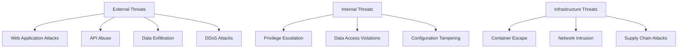
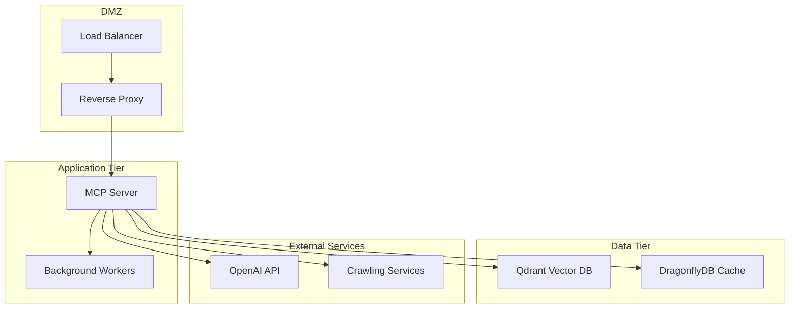
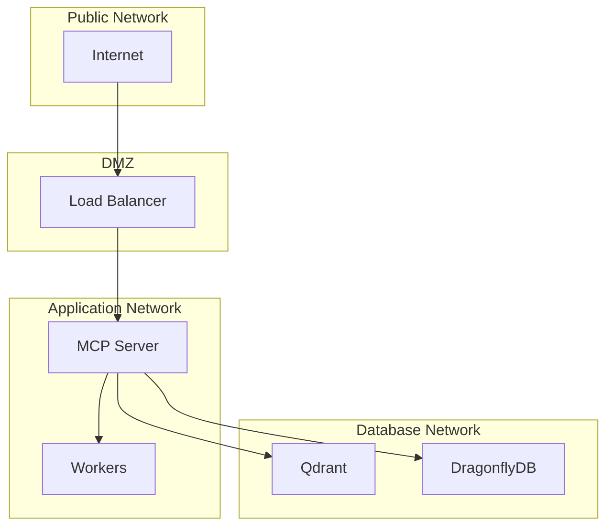

# Security Operations Guide

> **Status**: Current  
> **Last Updated**: 2025-06-09  
> **Purpose**: Comprehensive security guide for production deployment and operations  
> **Audience**: System administrators, DevOps engineers, security engineers  
> **Related**: [Configuration Guide](./configuration.md), [Deployment Guide](./deployment.md), [Monitoring Guide](./monitoring.md)

## Overview

This guide provides comprehensive security procedures for deploying, configuring, and operating the AI Documentation Vector DB system in production environments. It covers security architecture, access controls, monitoring, incident response, and compliance procedures.

## Table of Contents

- [Security Architecture](#security-architecture)
- [Authentication and Authorization](#authentication-and-authorization)
- [API Security and Access Control](#api-security-and-access-control)
- [Data Protection and Encryption](#data-protection-and-encryption)
- [Network Security](#network-security)
- [Security Configuration Management](#security-configuration-management)
- [Security Monitoring and Alerting](#security-monitoring-and-alerting)
- [Incident Response Procedures](#incident-response-procedures)
- [Vulnerability Management](#vulnerability-management)
- [Compliance and Audit Procedures](#compliance-and-audit-procedures)
- [Security Best Practices](#security-best-practices)
- [Security Checklists](#security-checklists)

## Security Architecture

### Threat Model

The AI Documentation Vector DB system faces several security threats:



### Security Components

The system implements defense-in-depth through multiple security layers:

1. **Application Security**: Input validation, authentication, authorization
2. **API Security**: Rate limiting, API key management, request validation
3. **Data Security**: Encryption at rest and in transit, access controls
4. **Infrastructure Security**: Container security, network isolation, service hardening
5. **Operational Security**: Monitoring, logging, incident response

### Security Zones



## Authentication and Authorization

### API Key Management

The system uses API keys for authentication with configurable requirements:

#### API Key Configuration

```json
{
  "security": {
    "require_api_keys": true,
    "api_key_header": "X-API-Key",
    "enable_rate_limiting": true,
    "rate_limit_requests": 100
  }
}
```

#### API Key Security Procedures

1. **Key Generation**:

   ```bash
   # Generate secure API keys
   openssl rand -hex 32
   # Store in secure key management system
   ```

2. **Key Rotation**:
   - Rotate API keys every 90 days
   - Implement zero-downtime key rotation
   - Maintain audit trail of key changes

3. **Key Storage**:
   - Store keys in encrypted key management systems
   - Never log or expose keys in plain text
   - Use environment variables for key injection

#### Key Validation Implementation

The system validates API keys through the SecurityValidator:

```python
from src.security import SecurityValidator, SecurityError

validator = SecurityValidator()
try:
    # API key validation is performed automatically
    # Keys are masked in logs for security
    masked_key = validator.mask_api_key(api_key)
    logger.info(f"API request authenticated: {masked_key}")
except SecurityError as e:
    logger.warning(f"Authentication failed: {e}")
```

### Access Control Matrix

| Resource | Public | API Key Required | Admin Only |
|----------|--------|------------------|------------|
| Health endpoints | ✅ | ❌ | ❌ |
| Search operations | ❌ | ✅ | ❌ |
| Document upload | ❌ | ✅ | ❌ |
| Collection management | ❌ | ❌ | ✅ |
| System configuration | ❌ | ❌ | ✅ |
| Metrics/monitoring | ❌ | ❌ | ✅ |

## API Security and Access Control

### Input Validation

The system implements comprehensive input validation through the SecurityValidator:

#### URL Validation

```python
# URL validation with domain restrictions
validator = SecurityValidator()

# Configure allowed domains
config.security.allowed_domains = [
    "docs.python.org",
    "golang.org", 
    "rust-lang.org"
]

# Configure blocked domains  
config.security.blocked_domains = [
    "localhost",
    "127.0.0.1",
    "internal.company.com"
]

try:
    safe_url = validator.validate_url(user_input_url)
except SecurityError as e:
    logger.error(f"Invalid URL blocked: {e}")
    return {"error": "Invalid URL"}
```

#### Query String Validation

```python
# Search query validation
try:
    safe_query = validator.validate_query_string(user_query)
except SecurityError as e:
    logger.error(f"Malicious query blocked: {e}")
    return {"error": "Invalid query"}
```

#### Collection Name Validation

```python
# Collection name sanitization
try:
    safe_name = validator.validate_collection_name(collection_name)
except SecurityError as e:
    logger.error(f"Invalid collection name: {e}")
    return {"error": "Invalid collection name"}
```

### Rate Limiting

Configure rate limiting to prevent API abuse:

#### Production Rate Limits

```json
{
  "performance": {
    "default_rate_limits": {
      "openai": {
        "max_calls": 500,
        "time_window": 60
      },
      "search": {
        "max_calls": 100,
        "time_window": 60
      },
      "upload": {
        "max_calls": 50,
        "time_window": 60
      }
    }
  }
}
```

#### Rate Limiting Implementation

The system uses tiered rate limiting:

1. **Global Rate Limits**: System-wide limits
2. **Per-API-Key Limits**: Individual client limits  
3. **Per-IP Limits**: Source IP-based limits
4. **Resource-Based Limits**: Specific endpoint limits

#### Rate Limit Monitoring

```bash
# Monitor rate limit violations
curl -H "X-API-Key: $API_KEY" \
     http://localhost:8000/health/rate-limits

# Check rate limit status
curl -H "X-API-Key: $API_KEY" \
     http://localhost:8000/health/quota
```

### CORS and Security Headers

Configure security headers for web applications:

```python
# Security headers configuration
SECURITY_HEADERS = {
    "X-Content-Type-Options": "nosniff",
    "X-Frame-Options": "DENY",
    "X-XSS-Protection": "1; mode=block",
    "Content-Security-Policy": "default-src 'self'",
    "Strict-Transport-Security": "max-age=31536000; includeSubDomains",
    "Referrer-Policy": "strict-origin-when-cross-origin"
}
```

## Enhanced Database Connection Pool Security (BJO-134)

### ML Model Security Considerations

#### 1. ML Model Data Protection

```python
# Security configuration for ML model data
ML_MODEL_SECURITY = {
    "data_encryption": {
        "training_data_encryption": True,
        "model_weights_encryption": True,
        "prediction_cache_encryption": True,
        "encryption_algorithm": "AES-256-GCM"
    },
    "access_control": {
        "model_training_rbac": True,
        "prediction_access_control": True,
        "model_versioning_audit": True
    },
    "privacy": {
        "differential_privacy": True,
        "privacy_budget": 1.0,
        "noise_scale": 0.1,
        "feature_anonymization": True
    }
}
```

#### 2. Training Data Security

```bash
#!/bin/bash
# Secure ML model training data handling
echo "=== ML Model Training Data Security ==="

# 1. Encrypt training data at rest
echo "Encrypting ML training data..."
uv run python -c "
from src.infrastructure.database.security import MLDataEncryption

encryptor = MLDataEncryption()
encryptor.encrypt_training_data('/data/ml_training/')
print('✓ Training data encrypted')
"

# 2. Validate data integrity
echo "Validating training data integrity..."
uv run python scripts/validate_ml_data_integrity.py

# 3. Apply differential privacy
echo "Applying differential privacy to training data..."
uv run python -c "
from src.infrastructure.database.privacy import DifferentialPrivacy

privacy_engine = DifferentialPrivacy(privacy_budget=1.0)
privacy_engine.apply_noise_to_training_data()
print('✓ Differential privacy applied')
"

# 4. Audit training data access
echo "Setting up training data access audit..."
uv run python scripts/setup_ml_data_audit.py
```

#### 3. Model Inference Security

```python
class SecureMLInference:
    """Secure ML model inference for connection pool optimization."""
    
    def __init__(self, config: Dict[str, Any]):
        self.config = config
        self.rate_limiter = self._setup_rate_limiting()
        self.access_control = self._setup_access_control()
        
    def secure_predict(self, features: Dict[str, float], 
                      user_context: Dict[str, str]) -> Dict[str, Any]:
        """Perform secure ML prediction with access controls."""
        
        # 1. Validate user permissions
        if not self.access_control.can_access_ml_predictions(user_context):
            raise SecurityError("Insufficient permissions for ML predictions")
            
        # 2. Apply rate limiting
        if not self.rate_limiter.allow_request(user_context['user_id']):
            raise SecurityError("ML prediction rate limit exceeded")
            
        # 3. Sanitize input features
        sanitized_features = self._sanitize_features(features)
        
        # 4. Perform prediction with audit logging
        prediction = self._predict_with_audit(sanitized_features, user_context)
        
        # 5. Apply output filtering
        filtered_prediction = self._filter_sensitive_outputs(prediction)
        
        return filtered_prediction
```

### Circuit Breaker Security

#### 1. Security-Aware Circuit Breaker Configuration

```json
{
  "circuit_breaker": {
    "security_features": {
      "failure_analysis": {
        "detect_security_failures": true,
        "security_failure_threshold": 2,
        "security_failure_types": [
          "authentication_failure",
          "authorization_failure", 
          "suspicious_query_pattern",
          "rate_limit_violation"
        ]
      },
      "isolation": {
        "isolate_suspicious_connections": true,
        "quarantine_duration_minutes": 30,
        "security_event_logging": true
      },
      "recovery": {
        "security_validation_on_recovery": true,
        "mandatory_security_scan": true,
        "recovery_approval_required": true
      }
    }
  }
}
```

#### 2. Security Event Integration

```python
class SecurityAwareCircuitBreaker:
    """Circuit breaker with security event integration."""
    
    def __init__(self, security_monitor):
        self.security_monitor = security_monitor
        self.security_metrics = SecurityMetrics()
        
    async def execute_with_security_checks(self, operation, context):
        """Execute operation with security monitoring."""
        
        # Pre-execution security check
        security_risk = await self.security_monitor.assess_risk(context)
        if security_risk.level == "HIGH":
            self.security_metrics.record_blocked_operation(context)
            raise SecurityError("Operation blocked due to high security risk")
            
        try:
            result = await operation()
            self.security_metrics.record_successful_operation(context)
            return result
            
        except SecurityException as e:
            self.security_metrics.record_security_failure(context, e)
            await self.security_monitor.report_security_event(e)
            raise
```

### Connection Affinity Security

#### 1. Query Pattern Security Analysis

```python
class SecureConnectionAffinity:
    """Connection affinity with security pattern analysis."""
    
    def __init__(self):
        self.pattern_analyzer = SecurityPatternAnalyzer()
        self.access_control = ConnectionAccessControl()
        
    async def analyze_query_security(self, query: str, 
                                   user_context: Dict[str, str]) -> Dict[str, Any]:
        """Analyze query for security patterns."""
        
        security_analysis = {
            "query_hash": self._hash_query(query),
            "security_score": 0.0,
            "risk_factors": [],
            "recommended_action": "allow"
        }
        
        # 1. SQL injection detection
        if self.pattern_analyzer.detect_sql_injection(query):
            security_analysis["risk_factors"].append("sql_injection_risk")
            security_analysis["security_score"] += 0.8
            
        # 2. Privilege escalation attempts
        if self.pattern_analyzer.detect_privilege_escalation(query):
            security_analysis["risk_factors"].append("privilege_escalation")
            security_analysis["security_score"] += 0.9
            
        # 3. Data exfiltration patterns
        if self.pattern_analyzer.detect_data_exfiltration(query):
            security_analysis["risk_factors"].append("data_exfiltration")
            security_analysis["security_score"] += 0.7
            
        # 4. Determine action based on security score
        if security_analysis["security_score"] > 0.5:
            security_analysis["recommended_action"] = "block"
            
        return security_analysis
```

#### 2. Connection Security Isolation

```bash
#!/bin/bash
# Secure connection isolation for affinity management
echo "=== Connection Security Isolation Setup ==="

# 1. Configure connection-level security
echo "Setting up connection-level security..."
uv run python -c "
from src.infrastructure.database.security import ConnectionSecurity

security = ConnectionSecurity()
security.configure_connection_isolation()
security.setup_query_sanitization()
security.enable_connection_monitoring()
print('✓ Connection security configured')
"

# 2. Setup query pattern monitoring
echo "Configuring query pattern security monitoring..."
uv run python scripts/setup_query_security_monitoring.py

# 3. Configure security-aware connection pooling
echo "Configuring security-aware connection pools..."
uv run python -c "
from src.infrastructure.database.connection_manager import SecureConnectionManager

manager = SecureConnectionManager()
manager.configure_security_policies()
manager.setup_threat_detection()
print('✓ Security-aware connection pooling configured')
"
```

### Adaptive Configuration Security

#### 1. Secure Configuration Changes

```python
class SecureAdaptiveConfig:
    """Secure adaptive configuration with change validation."""
    
    def __init__(self):
        self.change_validator = ConfigChangeValidator()
        self.audit_logger = SecurityAuditLogger()
        self.approval_system = ChangeApprovalSystem()
        
    async def apply_configuration_change(self, 
                                       change: Dict[str, Any],
                                       user_context: Dict[str, str]) -> bool:
        """Apply configuration change with security validation."""
        
        # 1. Validate change permissions
        if not self._validate_change_permissions(change, user_context):
            await self.audit_logger.log_unauthorized_change_attempt(
                change, user_context
            )
            raise SecurityError("Insufficient permissions for configuration change")
            
        # 2. Security impact assessment
        security_impact = await self.change_validator.assess_security_impact(change)
        if security_impact.risk_level == "HIGH":
            # Require approval for high-risk changes
            approval_required = True
            await self.approval_system.request_approval(change, security_impact)
            
        # 3. Validate configuration integrity
        if not self.change_validator.validate_integrity(change):
            raise SecurityError("Configuration change failed integrity validation")
            
        # 4. Apply change with audit logging
        try:
            await self._apply_change_with_rollback(change)
            await self.audit_logger.log_successful_change(change, user_context)
            return True
            
        except Exception as e:
            await self.audit_logger.log_failed_change(change, user_context, e)
            raise
```

#### 2. Configuration Security Monitoring

```bash
#!/bin/bash
# Monitor configuration changes for security implications
echo "=== Configuration Security Monitoring ==="

# 1. Monitor configuration file integrity
echo "Setting up configuration file integrity monitoring..."
uv run python -c "
from src.infrastructure.database.security import ConfigIntegrityMonitor

monitor = ConfigIntegrityMonitor()
monitor.setup_file_integrity_monitoring()
monitor.calculate_configuration_checksums()
print('✓ Configuration integrity monitoring enabled')
"

# 2. Setup configuration change alerts
echo "Configuring configuration change alerts..."
uv run python scripts/setup_config_change_alerts.py

# 3. Audit configuration access
echo "Setting up configuration access auditing..."
uv run python -c "
from src.infrastructure.database.audit import ConfigAccessAuditor

auditor = ConfigAccessAuditor()
auditor.enable_access_logging()
auditor.setup_suspicious_access_detection()
print('✓ Configuration access auditing enabled')
"
```

### Enhanced Database Security Monitoring

#### 1. Security Metrics Collection

```python
# Enhanced database security metrics
DATABASE_SECURITY_METRICS = {
    "ml_model_security": {
        "training_data_access_attempts": Counter("ml_training_data_access_total"),
        "model_inference_requests": Counter("ml_model_inference_total"),
        "differential_privacy_applications": Counter("ml_differential_privacy_total"),
        "model_security_violations": Counter("ml_security_violations_total")
    },
    "circuit_breaker_security": {
        "security_based_trips": Counter("circuit_breaker_security_trips_total"),
        "suspicious_pattern_detections": Counter("circuit_breaker_suspicious_patterns_total"),
        "security_recovery_attempts": Counter("circuit_breaker_security_recovery_total")
    },
    "connection_affinity_security": {
        "query_security_analysis": Histogram("connection_affinity_query_security_score"),
        "blocked_suspicious_queries": Counter("connection_affinity_blocked_queries_total"),
        "connection_isolation_events": Counter("connection_affinity_isolation_events_total")
    },
    "adaptive_config_security": {
        "configuration_change_requests": Counter("adaptive_config_change_requests_total"),
        "security_validated_changes": Counter("adaptive_config_security_validated_total"),
        "high_risk_changes_blocked": Counter("adaptive_config_high_risk_blocked_total")
    }
}
```

#### 2. Security Alert Configuration

```yaml
# Enhanced database security alerts
groups:
  - name: enhanced_database_security_alerts
    rules:
      - alert: MLModelSecurityViolation
        expr: increase(ml_security_violations_total[5m]) > 0
        for: 1m
        labels:
          severity: critical
        annotations:
          summary: "ML model security violation detected"
          description: "Security violation in ML model operations detected"

      - alert: SuspiciousQueryPatternDetected
        expr: increase(connection_affinity_blocked_queries_total[5m]) > 5
        for: 2m
        labels:
          severity: warning
        annotations:
          summary: "Suspicious query patterns detected"
          description: "Multiple suspicious queries blocked by connection affinity"

      - alert: HighRiskConfigurationChange
        expr: increase(adaptive_config_high_risk_blocked_total[5m]) > 0
        for: 1m
        labels:
          severity: warning
        annotations:
          summary: "High-risk configuration change blocked"
          description: "High-risk adaptive configuration change was blocked"

      - alert: CircuitBreakerSecurityTrip
        expr: increase(circuit_breaker_security_trips_total[5m]) > 2
        for: 1m
        labels:
          severity: critical
        annotations:
          summary: "Circuit breaker security-based trips"
          description: "Multiple security-based circuit breaker trips detected"
```

### Security Best Practices for Enhanced Database Features

#### 1. ML Model Security Checklist

- [ ] Training data is encrypted at rest and in transit
- [ ] Differential privacy is applied to training datasets
- [ ] Model inference is rate-limited and access-controlled
- [ ] Model weights and parameters are encrypted
- [ ] Training data access is audited and logged
- [ ] Model predictions are sanitized before output
- [ ] Regular security assessments of ML pipeline

#### 2. Circuit Breaker Security Checklist

- [ ] Security failure types are properly configured
- [ ] Security events trigger appropriate circuit breaker actions
- [ ] Suspicious connections are isolated and quarantined
- [ ] Security validation is required for recovery operations
- [ ] Security event logging is comprehensive and tamper-proof

#### 3. Connection Affinity Security Checklist

- [ ] Query patterns are analyzed for security risks
- [ ] SQL injection detection is active and tested
- [ ] Privilege escalation attempts are detected and blocked
- [ ] Data exfiltration patterns are monitored
- [ ] Connection isolation is implemented for suspicious activity

#### 4. Adaptive Configuration Security Checklist

- [ ] Configuration changes require appropriate authorization
- [ ] High-risk changes require approval workflows
- [ ] Configuration integrity monitoring is active
- [ ] Change audit logging is comprehensive
- [ ] Rollback procedures are secure and tested

## Data Protection and Encryption

### Data Classification

The system handles different types of sensitive data:

| Data Type | Classification | Encryption Required | Retention Period |
|-----------|---------------|-------------------|------------------|
| Vector embeddings | Internal | ✅ | 1 year |
| API keys | Secret | ✅ | N/A |
| Search queries | Internal | ✅ | 30 days |
| System logs | Internal | ✅ | 90 days |
| Configuration data | Internal | ✅ | N/A |

### Encryption at Rest

#### Vector Database Encryption

Configure Qdrant with encryption:

```yaml
# docker-compose.yml
services:
  qdrant:
    image: qdrant/qdrant:latest
    environment:
      - QDRANT__STORAGE__ENCRYPTION_KEY_FILE=/qdrant/encryption.key
    volumes:
      - ./encryption.key:/qdrant/encryption.key:ro
      - qdrant_data:/qdrant/storage
```

#### Cache Encryption

Configure DragonflyDB with TLS:

```yaml
services:
  dragonfly:
    image: docker.dragonflydb.io/dragonflydb/dragonfly:latest
    command: ["dragonfly", "--tls", "--requirepass=${REDIS_PASSWORD}"]
    environment:
      - REDIS_PASSWORD=${REDIS_PASSWORD}
```

### Encryption in Transit

#### TLS Configuration

```yaml
# nginx.conf
server {
    listen 443 ssl http2;
    ssl_certificate /etc/ssl/certs/server.crt;
    ssl_certificate_key /etc/ssl/private/server.key;
    ssl_protocols TLSv1.2 TLSv1.3;
    ssl_ciphers ECDHE-RSA-AES256-GCM-SHA512:DHE-RSA-AES256-GCM-SHA512;
    ssl_prefer_server_ciphers off;
    ssl_session_timeout 1d;
    ssl_session_cache shared:SSL:50m;
    ssl_stapling on;
    ssl_stapling_verify on;
}
```

#### API Client TLS

```python
# Configure TLS for external API calls
import httpx

async with httpx.AsyncClient(
    verify=True,  # Verify SSL certificates
    timeout=30.0,
    limits=httpx.Limits(max_connections=100)
) as client:
    response = await client.post(
        "https://api.openai.com/v1/embeddings",
        headers={"Authorization": f"Bearer {api_key}"},
        json=data
    )
```

### Secrets Management

#### Environment Variables

```bash
# Production secrets - use secure key management
export OPENAI_API_KEY=$(vault kv get -field=api_key secret/openai)
export QDRANT_API_KEY=$(vault kv get -field=api_key secret/qdrant)
export REDIS_PASSWORD=$(vault kv get -field=password secret/redis)
export JWT_SECRET_KEY=$(vault kv get -field=secret secret/jwt)
```

#### Docker Secrets

```yaml
# docker-compose.yml
services:
  mcp-server:
    secrets:
      - openai_api_key
      - qdrant_api_key
    environment:
      - OPENAI_API_KEY_FILE=/run/secrets/openai_api_key

secrets:
  openai_api_key:
    external: true
  qdrant_api_key:
    external: true
```

## Network Security

### Network Segmentation



### Firewall Rules

#### Docker Network Configuration

```yaml
# docker-compose.yml
networks:
  frontend:
    driver: bridge
    ipam:
      config:
        - subnet: 172.20.0.0/16
  backend:
    driver: bridge
    internal: true
    ipam:
      config:
        - subnet: 172.21.0.0/16
```

#### iptables Rules

```bash
#!/bin/bash
# Basic firewall rules

# Allow established connections
iptables -A INPUT -m state --state ESTABLISHED,RELATED -j ACCEPT

# Allow SSH (change port as needed)
iptables -A INPUT -p tcp --dport 22 -j ACCEPT

# Allow HTTP/HTTPS
iptables -A INPUT -p tcp --dport 80 -j ACCEPT
iptables -A INPUT -p tcp --dport 443 -j ACCEPT

# Allow health checks
iptables -A INPUT -p tcp --dport 8000 -s 172.20.0.0/16 -j ACCEPT

# Block internal networks from external access
iptables -A INPUT -s 10.0.0.0/8 -j DROP
iptables -A INPUT -s 172.16.0.0/12 -j DROP
iptables -A INPUT -s 192.168.0.0/16 -j DROP

# Default deny
iptables -P INPUT DROP
iptables -P FORWARD DROP
```

### Service Mesh Security

For Kubernetes deployments, implement service mesh security:

```yaml
# istio-security.yaml
apiVersion: security.istio.io/v1beta1
kind: PeerAuthentication
metadata:
  name: default
spec:
  mtls:
    mode: STRICT
---
apiVersion: security.istio.io/v1beta1
kind: AuthorizationPolicy
metadata:
  name: mcp-server-authz
spec:
  selector:
    matchLabels:
      app: mcp-server
  rules:
  - from:
    - source:
        principals: ["cluster.local/ns/istio-system/sa/istio-proxy"]
  - to:
    - operation:
        methods: ["GET", "POST"]
```

## Security Configuration Management

### Security Configuration Schema

The SecurityConfig provides comprehensive security settings:

```python
class SecurityConfig(BaseModel):
    # Domain access control
    allowed_domains: list[str] = Field(
        default_factory=list, 
        description="Allowed domains for crawling"
    )
    blocked_domains: list[str] = Field(
        default_factory=list, 
        description="Blocked domains"
    )
    
    # API security
    require_api_keys: bool = Field(
        default=True, 
        description="Require API keys for endpoints"
    )
    api_key_header: str = Field(
        default="X-API-Key", 
        description="API key header name"
    )
    
    # Rate limiting
    enable_rate_limiting: bool = Field(
        default=True, 
        description="Enable rate limiting"
    )
    rate_limit_requests: int = Field(
        default=100, 
        gt=0, 
        description="Requests per minute"
    )
```

### Configuration Validation

```bash
# Validate security configuration
python -m src.manage_config validate -c config.json --security-check

# Generate security configuration template
python -m src.manage_config create-example -o config.json --template=secure

# Check security compliance
python -m src.manage_config security-audit
```

### Environment-Specific Security

#### Development Environment

```json
{
  "security": {
    "require_api_keys": false,
    "enable_rate_limiting": true,
    "rate_limit_requests": 1000,
    "allowed_domains": ["*"],
    "blocked_domains": []
  }
}
```

#### Production Environment

```json
{
  "security": {
    "require_api_keys": true,
    "enable_rate_limiting": true,
    "rate_limit_requests": 100,
    "allowed_domains": [
      "docs.python.org",
      "golang.org",
      "rust-lang.org"
    ],
    "blocked_domains": [
      "localhost",
      "127.0.0.1",
      "*.internal",
      "metadata.google.internal"
    ]
  }
}
```

## Security Monitoring and Alerting

### Security Metrics

Monitor these security-related metrics:

#### API Security Metrics

```python
# Key security metrics to monitor
SECURITY_METRICS = {
    "failed_authentication_attempts": "counter",
    "rate_limit_violations": "counter", 
    "blocked_requests": "counter",
    "api_key_usage": "gauge",
    "suspicious_query_patterns": "counter",
    "data_access_violations": "counter"
}
```

#### Monitoring Implementation

```python
import prometheus_client as prom

# Security metric counters
failed_auth_counter = prom.Counter(
    'security_failed_auth_total',
    'Total failed authentication attempts',
    ['source_ip', 'user_agent']
)

rate_limit_counter = prom.Counter(
    'security_rate_limit_violations_total',
    'Total rate limit violations',
    ['api_key_hash', 'endpoint']
)

blocked_requests_counter = prom.Counter(
    'security_blocked_requests_total', 
    'Total blocked requests',
    ['reason', 'source_ip']
)
```

### Log Security Events

Configure structured security logging:

```python
import structlog

# Security event logging
security_logger = structlog.get_logger("security")

# Log authentication events
security_logger.info(
    "authentication_success",
    api_key_hash=hash(api_key),
    source_ip=request.remote_addr,
    endpoint=request.path,
    timestamp=datetime.utcnow().isoformat()
)

# Log security violations
security_logger.warning(
    "security_violation",
    violation_type="rate_limit_exceeded",
    api_key_hash=hash(api_key),
    source_ip=request.remote_addr,
    requests_per_minute=rpm,
    limit=rate_limit
)
```

### Security Alerting Rules

#### Prometheus Alerting Rules

```yaml
# security-alerts.yml
groups:
- name: security
  rules:
  - alert: HighFailedAuthRate
    expr: rate(security_failed_auth_total[5m]) > 10
    for: 2m
    labels:
      severity: warning
    annotations:
      summary: "High failed authentication rate detected"
      
  - alert: RateLimitViolations
    expr: rate(security_rate_limit_violations_total[1m]) > 5
    for: 1m
    labels:
      severity: critical
    annotations:
      summary: "High rate of rate limit violations"
      
  - alert: SuspiciousQueryPattern
    expr: rate(security_blocked_requests_total{reason="malicious_query"}[5m]) > 1
    for: 1m
    labels:
      severity: warning
    annotations:
      summary: "Suspicious query patterns detected"
```

#### Log-Based Alerts

```bash
# Configure log-based alerting with fluentd/fluent-bit
<filter security.**>
  @type grep
  <regexp>
    key violation_type
    pattern ^(sql_injection|xss_attempt|path_traversal)$
  </regexp>
</filter>

<match security.**>
  @type forward
  <server>
    host alertmanager.local
    port 24224
  </server>
</match>
```

## Incident Response Procedures

### Security Incident Classification

| Severity | Description | Response Time | Escalation |
|----------|-------------|---------------|------------|
| P0 - Critical | Active attack, data breach | 15 minutes | Immediate |
| P1 - High | Security vulnerability, auth bypass | 1 hour | 2 hours |
| P2 - Medium | Suspicious activity, policy violation | 4 hours | 8 hours |
| P3 - Low | Security configuration issue | 24 hours | 48 hours |

### Incident Response Playbooks

#### Data Breach Response

1. **Immediate Actions** (0-15 minutes):

   ```bash
   # Isolate affected systems
   docker-compose down affected-service
   
   # Block suspicious IP addresses
   iptables -A INPUT -s $SUSPICIOUS_IP -j DROP
   
   # Rotate all API keys
   python scripts/rotate_api_keys.py --emergency
   ```

2. **Investigation** (15-60 minutes):

   ```bash
   # Collect logs
   docker logs mcp-server > incident-logs.txt
   docker logs qdrant >> incident-logs.txt
   
   # Check access patterns
   grep "api_key_hash" /var/log/mcp-server.log | tail -1000
   
   # Analyze vector database queries
   curl -X GET "http://localhost:6333/collections/documents/points/scroll" \
        -H "Content-Type: application/json"
   ```

3. **Containment** (1-4 hours):

   ```bash
   # Update firewall rules
   bash scripts/emergency_firewall.sh
   
   # Deploy security patches
   docker-compose pull && docker-compose up -d
   
   # Reset all user credentials
   python scripts/reset_credentials.py
   ```

#### Authentication Bypass Response

1. **Immediate**: Disable affected authentication mechanisms
2. **Short-term**: Implement additional authentication layers
3. **Long-term**: Review and update authentication logic

#### API Abuse Response

1. **Rate limiting**: Implement emergency rate limits
2. **Blocking**: Block abusive IP addresses/API keys
3. **Analysis**: Investigate attack patterns

### Communication Templates

#### Security Incident Notification

```text
Subject: [SECURITY INCIDENT] P${SEVERITY} - ${INCIDENT_TYPE}

Incident ID: ${INCIDENT_ID}
Severity: P${SEVERITY}
Start Time: ${START_TIME}
Affected Systems: ${AFFECTED_SYSTEMS}

Summary:
${INCIDENT_SUMMARY}

Current Status:
${STATUS_UPDATE}

Actions Taken:
- ${ACTION_1}
- ${ACTION_2}

Next Steps:
- ${NEXT_STEP_1}
- ${NEXT_STEP_2}

Contact: security@company.com
```

## Vulnerability Management

### Security Scanning

#### Container Security Scanning

```bash
# Scan container images for vulnerabilities
docker run --rm -v /var/run/docker.sock:/var/run/docker.sock \
  -v $HOME/.cache/trivy:/root/.cache/ \
  aquasec/trivy image qdrant/qdrant:latest

# Scan for secrets in code
docker run --rm -v $(pwd):/src \
  trufflesecurity/trufflehog:latest filesystem /src
```

#### Dependency Scanning

```bash
# Python dependency scanning
pip-audit --requirement requirements.txt

# Alternative: safety check
safety check -r requirements.txt

# Generate vulnerability report
pip-audit --requirement requirements.txt --format=json > vulnerability-report.json
```

#### Code Security Analysis

```bash
# Static code analysis with bandit
bandit -r src/ -f json -o security-report.json

# SAST with semgrep
semgrep --config=python.security src/
```

### Patch Management

#### Security Update Process

1. **Vulnerability Assessment**:

   ```bash
   # Check for security updates
   python scripts/check_security_updates.py
   
   # Assess impact
   python scripts/vulnerability_assessment.py
   ```

2. **Testing**:

   ```bash
   # Deploy to staging environment
   docker-compose -f docker-compose.staging.yml up -d
   
   # Run security tests
   pytest tests/security/ -v
   
   # Run integration tests
   pytest tests/integration/ -v
   ```

3. **Deployment**:

   ```bash
   # Rolling update
   docker-compose pull
   docker-compose up -d --no-deps service-name
   
   # Verify deployment
   curl -f http://localhost:8000/health
   ```

### Security Testing

#### Automated Security Tests

```python
# tests/security/test_api_security.py
import pytest
from fastapi.testclient import TestClient

def test_api_requires_authentication():
    """Test that API endpoints require authentication."""
    client = TestClient(app)
    response = client.get("/search")
    assert response.status_code == 401

def test_rate_limiting():
    """Test rate limiting enforcement."""
    client = TestClient(app)
    headers = {"X-API-Key": "test-key"}
    
    # Send requests up to rate limit
    for _ in range(101):
        response = client.get("/search", headers=headers)
    
    assert response.status_code == 429

def test_input_validation():
    """Test malicious input validation."""
    client = TestClient(app)
    headers = {"X-API-Key": "test-key"}
    
    # Test SQL injection
    malicious_query = "'; DROP TABLE documents; --"
    response = client.post(
        "/search", 
        json={"query": malicious_query},
        headers=headers
    )
    assert response.status_code == 400
```

#### Penetration Testing

```bash
# API penetration testing with OWASP ZAP
docker run -t owasp/zap2docker-stable zap-api-scan.py \
  -t http://localhost:8000/openapi.json \
  -f openapi

# Web application testing
docker run -t owasp/zap2docker-stable zap-baseline.py \
  -t http://localhost:8000
```

## Compliance and Audit Procedures

### Compliance Frameworks

The system supports compliance with:

- **SOC 2 Type II**: Security and availability controls
- **ISO 27001**: Information security management
- **GDPR**: Data protection and privacy
- **CCPA**: California consumer privacy
- **HIPAA**: Healthcare data protection (when applicable)

### Audit Logging

#### Comprehensive Audit Trail

```python
# Audit logging implementation
import structlog

audit_logger = structlog.get_logger("audit")

def log_data_access(operation, user_id, resource_id, result):
    """Log data access for audit purposes."""
    audit_logger.info(
        "data_access",
        operation=operation,
        user_id=user_id,
        resource_id=resource_id,
        result=result,
        timestamp=datetime.utcnow().isoformat(),
        source_ip=get_client_ip(),
        user_agent=get_user_agent()
    )

def log_configuration_change(component, old_value, new_value, user_id):
    """Log configuration changes."""
    audit_logger.info(
        "configuration_change",
        component=component,
        old_value=mask_sensitive_data(old_value),
        new_value=mask_sensitive_data(new_value),
        user_id=user_id,
        timestamp=datetime.utcnow().isoformat()
    )
```

#### Audit Log Retention

```bash
# Configure log retention with logrotate
/var/log/mcp-server/audit.log {
    daily
    rotate 2555  # 7 years
    compress
    delaycompress
    missingok
    notifempty
    create 644 mcp-server mcp-server
}
```

### Data Protection Impact Assessment

#### GDPR Compliance

1. **Data Minimization**: Only collect necessary data
2. **Purpose Limitation**: Use data only for stated purposes
3. **Retention Limits**: Delete data when no longer needed
4. **Data Subject Rights**: Support access, rectification, erasure

```python
# GDPR compliance utilities
class GDPRManager:
    def export_user_data(self, user_id: str) -> dict:
        """Export all user data for GDPR access requests."""
        return {
            "search_history": self.get_search_history(user_id),
            "api_usage": self.get_api_usage(user_id),
            "account_data": self.get_account_data(user_id)
        }
    
    def delete_user_data(self, user_id: str) -> bool:
        """Delete all user data for GDPR erasure requests."""
        self.delete_search_history(user_id)
        self.delete_api_usage(user_id)
        self.anonymize_audit_logs(user_id)
        return True
```

### Regular Security Assessments

#### Monthly Security Reviews

```bash
#!/bin/bash
# monthly-security-review.sh

echo "=== Monthly Security Review ==="
echo "Date: $(date)"

# Check for security updates
echo "Checking for security updates..."
python scripts/check_security_updates.py

# Review access logs
echo "Analyzing access patterns..."
python scripts/analyze_access_logs.py --days=30

# Check certificate expiration
echo "Checking certificate expiration..."
python scripts/check_certificates.py

# Generate security metrics report
echo "Generating security metrics..."
python scripts/generate_security_report.py --month=$(date +%m)
```

#### Quarterly Compliance Audits

1. **Access Control Review**: Verify user permissions
2. **Configuration Audit**: Check security settings
3. **Incident Review**: Analyze security incidents
4. **Policy Updates**: Update security policies
5. **Training Assessment**: Evaluate security awareness

## Security Best Practices

### Development Security

#### Secure Coding Practices

1. **Input Validation**: Validate all inputs at application boundaries
2. **Output Encoding**: Encode outputs to prevent injection
3. **Error Handling**: Don't expose sensitive information in errors
4. **Secure Defaults**: Use secure configuration defaults
5. **Principle of Least Privilege**: Grant minimum necessary permissions

#### Security Testing in CI/CD

```yaml
# .github/workflows/security.yml
name: Security Tests

on: [push, pull_request]

jobs:
  security:
    runs-on: ubuntu-latest
    steps:
    - uses: actions/checkout@v2
    
    - name: Run security tests
      run: |
        pip install bandit safety
        bandit -r src/
        safety check -r requirements.txt
        
    - name: Container security scan
      run: |
        docker build -t app:test .
        docker run --rm -v /var/run/docker.sock:/var/run/docker.sock \
          aquasec/trivy image app:test
```

### Operational Security

#### Environment Hardening

1. **Remove unnecessary packages**: Minimize attack surface
2. **Disable unused services**: Reduce exposed interfaces
3. **Configure strong passwords**: Enforce password policies
4. **Enable audit logging**: Monitor all administrative actions
5. **Regular updates**: Keep systems patched

#### Backup Security

```bash
# Secure backup procedures
#!/bin/bash

# Encrypt backups
gpg --cipher-algo AES256 --compress-algo 1 --s2k-mode 3 \
    --s2k-digest-algo SHA512 --s2k-count 65536 --symmetric \
    --output backup-$(date +%Y%m%d).gpg backup.tar

# Verify backup integrity
sha256sum backup-$(date +%Y%m%d).gpg > backup-$(date +%Y%m%d).sha256

# Store backup securely
aws s3 cp backup-$(date +%Y%m%d).gpg s3://secure-backups/ --sse
```

### Third-Party Security

#### Vendor Security Assessment

1. **Security Questionnaires**: Assess vendor security posture
2. **Penetration Testing**: Verify security claims
3. **Compliance Verification**: Check certifications
4. **Incident Response**: Coordinate response procedures
5. **Contract Security**: Include security requirements

#### API Security for External Services

```python
# Secure external API integration
import httpx
import time
import hashlib

class SecureAPIClient:
    def __init__(self, base_url: str, api_key: str):
        self.base_url = base_url
        self.api_key = api_key
        self.session = httpx.AsyncClient(
            verify=True,  # Verify SSL certificates
            timeout=30.0,
            limits=httpx.Limits(max_connections=10)
        )
    
    async def make_request(self, endpoint: str, data: dict):
        """Make secure API request with authentication and validation."""
        # Add request signing
        timestamp = str(int(time.time()))
        signature = self._sign_request(data, timestamp)
        
        headers = {
            "Authorization": f"Bearer {self.api_key}",
            "X-Timestamp": timestamp,
            "X-Signature": signature,
            "Content-Type": "application/json"
        }
        
        response = await self.session.post(
            f"{self.base_url}/{endpoint}",
            json=data,
            headers=headers
        )
        
        # Validate response
        if not self._validate_response(response):
            raise SecurityError("Invalid response signature")
            
        return response.json()
    
    def _sign_request(self, data: dict, timestamp: str) -> str:
        """Sign request for integrity verification."""
        message = f"{timestamp}{json.dumps(data, sort_keys=True)}"
        return hashlib.sha256(
            f"{self.api_key}{message}".encode()
        ).hexdigest()
```

## Security Checklists

### Pre-Deployment Security Checklist

- [ ] **Configuration Security**
  - [ ] All default passwords changed
  - [ ] API keys properly configured
  - [ ] Rate limiting enabled
  - [ ] Domain restrictions configured
  - [ ] Security headers configured

- [ ] **Infrastructure Security**
  - [ ] TLS certificates installed and valid
  - [ ] Firewall rules configured
  - [ ] Network segmentation implemented
  - [ ] Container security scanning passed
  - [ ] Dependency vulnerabilities addressed

- [ ] **Application Security**
  - [ ] Input validation implemented
  - [ ] Authentication mechanisms tested
  - [ ] Authorization controls verified
  - [ ] Error handling secure
  - [ ] Logging configured

- [ ] **Monitoring Security**
  - [ ] Security event logging enabled
  - [ ] Alerting rules configured
  - [ ] Monitoring dashboards created
  - [ ] Incident response procedures documented

### Production Security Checklist

- [ ] **Daily Operations**
  - [ ] Monitor security alerts
  - [ ] Review access logs
  - [ ] Check system health
  - [ ] Verify backup integrity

- [ ] **Weekly Operations**
  - [ ] Review security metrics
  - [ ] Update threat intelligence
  - [ ] Check for security updates
  - [ ] Validate monitoring systems

- [ ] **Monthly Operations**
  - [ ] Conduct security assessment
  - [ ] Review access controls
  - [ ] Update security documentation
  - [ ] Test incident response procedures

- [ ] **Quarterly Operations**
  - [ ] Perform penetration testing
  - [ ] Review security policies
  - [ ] Conduct compliance audit
  - [ ] Update risk assessment

### Incident Response Checklist

- [ ] **Initial Response** (0-15 minutes)
  - [ ] Confirm incident severity
  - [ ] Notify security team
  - [ ] Begin initial containment
  - [ ] Start incident log

- [ ] **Investigation** (15-60 minutes)
  - [ ] Collect and preserve evidence
  - [ ] Identify attack vectors
  - [ ] Assess impact and scope
  - [ ] Update stakeholders

- [ ] **Containment** (1-4 hours)
  - [ ] Implement containment measures
  - [ ] Preserve evidence
  - [ ] Begin eradication planning
  - [ ] Communication updates

- [ ] **Recovery** (4-24 hours)
  - [ ] Remove threats
  - [ ] Restore systems
  - [ ] Verify system integrity
  - [ ] Monitor for reoccurrence

- [ ] **Post-Incident** (1-7 days)
  - [ ] Conduct lessons learned
  - [ ] Update procedures
  - [ ] Implement improvements
  - [ ] Final documentation

---

## Related Documentation

- 🛠️ [Configuration Guide](./configuration.md) - System configuration details
- 🚀 [Deployment Guide](./deployment.md) - Production deployment procedures  
- 📊 [Monitoring Guide](./monitoring.md) - System monitoring and observability
- 🔧 [Operations Guide](./operations.md) - Day-to-day operational procedures

For security incident reporting, contact: <security@company.com>
