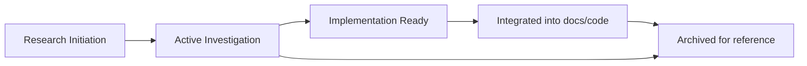

# Research Documentation

This directory holds research notes and project dossiers that inform upcoming platform
improvements. Use it to understand experimental work before it graduates into the core
architecture, operations, or user guides.

## Directory Overview

### `browser-use/` – Browser automation research
- Current focus: upgrading to browser-use v0.3.x and refining tier selection.
- Contents: proof-of-concept reports, enhancement PRDs, archived evaluations of prior versions.
- See [browser-use/README.md](./browser-use/README.md) for the active summary.

### `transformation/` – Architecture and performance transformation
- Captures the system modernization program that streamlined configuration and orchestration.
- Contains master plans, execution logs, and archived reports from each migration phase.
- See [transformation/README.md](./transformation/README.md) for details.

## Conventions

```
research/
├── <domain>/
│   ├── README.md              # Overview and status
│   ├── <active-docs>.md       # In-progress analyses
│   └── archive/               # Historical material
│       ├── v1-original/
│       ├── v2-enterprise/
│       └── detailed-reports/
```

- Use kebab-case file names (e.g., `browser-use-v3-plan.md`).
- Prefer one README per domain summarising status, timeline, and key findings.
- Archive superseded studies instead of deleting them so context remains accessible.

## Lifecycle



## Linking Back to Main Docs

- User-facing changes → update the relevant page under `docs/users/`.
- Developer-impacting work → reference in `docs/developers/` or draft an ADR.
- Operational guidance → coordinate with `docs/operators/`.

When a research item becomes canonical, move the stable content into the appropriate domain
section and leave a short note in the research README pointing to the new location.
