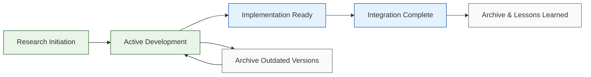

# Research Documentation

> **Purpose**: Comprehensive research documentation for system enhancements and transformations  
> **Last Updated**: January 28, 2025  
> **Maintainer**: Documentation Team

This directory contains all research documentation organized by domain and implementation status.

## 📁 Directory Structure

### Current Research Projects

#### `browser-use/` - Browser Automation Enhancement Research
- **Status**: Active development research
- **Timeline**: V3 Solo Developer approach (12-16 weeks)
- **Focus**: Browser-use v0.3.2 integration and optimization
- **Documents**:
  - Implementation guides, PRDs, and archived version research
  - See [browser-use/README.md](browser-use/README.md) for details

#### `transformation/` - Portfolio ULTRATHINK Transformation
- **Status**: 85% Complete - Ready for final implementation
- **Timeline**: 6 specialized subagents for completion
- **Focus**: System architecture modernization and performance optimization
- **Documents**:
  - Master transformation plan and subagent execution strategies
  - See [transformation/README.md](transformation/README.md) for details

### Research Documentation Standards

All research documentation in this directory follows these standards:

#### File Organization
```
research/
├── [domain]/
│   ├── README.md           # Overview and status
│   ├── [active-docs].md    # Current implementation docs
│   └── archive/           # Historical versions and analysis
│       ├── v1-original/   # Original research
│       ├── v2-enterprise/ # Enterprise variations
│       └── detailed-reports/ # Comprehensive analysis
```

#### Document Headers
All research documents should include:
```markdown
> **Status**: [Active|Complete|Archived]  
> **Last Updated**: YYYY-MM-DD  
> **Timeline**: [Duration and milestones]  
> **Focus**: [Primary objectives]
```

#### Naming Conventions
- Use kebab-case for filenames: `browser-use-v3-implementation.md`
- Include version numbers where relevant: `v3-solo-dev-guide.md`
- Prefix with domain for clarity: `transformation-master-plan.md`

### Integration with Main Documentation

Research findings integrate with the main documentation structure:

- **User Impact**: Research findings that affect users → `../users/`
- **Developer Impact**: Technical implementation details → `../developers/`
- **Operational Impact**: Deployment and configuration changes → `../operators/`

### Research Lifecycle



## 🔗 Quick Navigation

### By Status
- **Active Research**: [Browser-Use Enhancement](browser-use/README.md) | [Transformation Completion](transformation/README.md)
- **Implementation Ready**: [Portfolio ULTRATHINK Transformation](transformation/README.md)
- **Historical Archive**: Available in planning/ directory

### By Domain
- **Browser Automation**: [browser-use/](browser-use/README.md)
- **System Architecture**: [transformation/](transformation/README.md)
- **Performance Optimization**: Available in planning/archive/detailed-reports/

### Integration Points
- **User Documentation**: [../users/README.md](../users/README.md) - End-user impact of research
- **Developer Documentation**: [../developers/README.md](../developers/README.md) - Technical implementation details
- **Operator Documentation**: [../operators/README.md](../operators/README.md) - Deployment and operations

---

**Research contributes to our continuous improvement and innovation. Each project builds toward better system capabilities and user experience.**