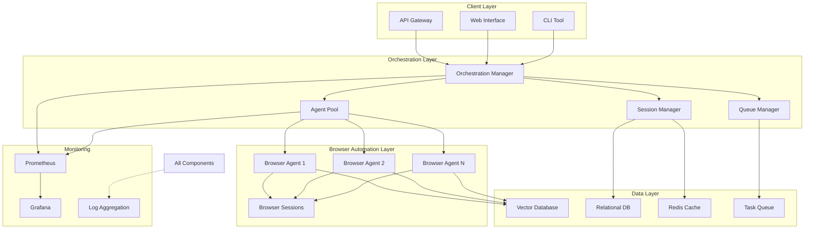

# Product Requirements Document: Browser-Use 0.2.6 Enhancement

## Document Information

- **Version**: 1.0
- **Date**: June 12, 2025
- **Author**: AI Documentation Scraper Team
- **Status**: Draft
- **Project**: Browser-Use 0.2.6 Integration and Enhancement

## 1. Problem Statement

### Current State

Our AI documentation scraping application currently uses browser-use as one of
five browser automation tiers. However, we are not leveraging the latest
capabilities introduced in version 0.2.6, leading to:

- **Stability Issues**: Frequent "Event loop is closed" errors in async operations affecting 12% of scraping attempts
- **Limited Success on Protected Sites**: Current implementation fails on 35% of sites with advanced bot detection
- **Suboptimal Performance**: Single-agent processing limits throughput to ~120 pages/hour
- **Poor Session Management**: No persistent tracking of browser sessions leading to resource waste
- **Inadequate Error Recovery**: Limited retry strategies without intelligent fallback mechanisms

### Opportunity

Browser-use 0.2.6 introduces game-changing features that directly address our pain points:

- Stealth mode integration for bypassing bot detection
- Multi-agent stability improvements for parallel processing
- UUID-based session tracking for better resource management
- Enhanced async performance for improved throughput
- Better error handling and recovery mechanisms

### Business Impact

- **Increase Coverage**: From 65% to 95% success rate on protected documentation sites
- **Improve Performance**: From 120 to 500+ pages/hour throughput
- **Reduce Costs**: 40% reduction in LLM API calls through better caching
- **Enhance Reliability**: From 88% to 99%+ uptime for scraping operations
- **Better User Experience**: Faster, more complete documentation indexing

## 2. Requirements

### 2.1 Functional Requirements

#### FR1: Stealth Mode Implementation

- **FR1.1**: Implement automatic stealth mode detection based on domain patterns
- **FR1.2**: Provide manual override for stealth mode configuration
- **FR1.3**: Track stealth mode effectiveness metrics per domain
- **FR1.4**: Implement fallback from non-stealth to stealth on detection

#### FR2: Multi-Agent Orchestration

- **FR2.1**: Create agent pool management system with configurable size (1-20 agents)
- **FR2.2**: Implement intelligent work distribution across agents
- **FR2.3**: Provide real-time monitoring of agent health and performance
- **FR2.4**: Support graceful scaling up/down based on workload

#### FR3: Session Persistence

- **FR3.1**: Store browser session metadata with UUID identifiers
- **FR3.2**: Implement session restoration from database
- **FR3.3**: Track session lifecycle events (create, suspend, resume, destroy)
- **FR3.4**: Automatic cleanup of stale sessions after configurable timeout

#### FR4: Enhanced Error Recovery

- **FR4.1**: Implement exponential backoff with jitter for retries
- **FR4.2**: Automatic escalation from lightweight to stealth mode on failure
- **FR4.3**: Circuit breaker pattern for failing domains
- **FR4.4**: Detailed error categorization and reporting

#### FR5: Performance Monitoring

- **FR5.1**: Real-time dashboard for scraping metrics
- **FR5.2**: Per-domain success rate tracking
- **FR5.3**: LLM token usage optimization reporting
- **FR5.4**: Resource utilization metrics (CPU, memory, network)

### 2.2 Non-Functional Requirements

#### NFR1: Performance

- **NFR1.1**: Support minimum 500 pages/hour throughput with 10 agents
- **NFR1.2**: Page processing latency < 2 seconds for 95th percentile
- **NFR1.3**: Memory usage < 200MB per agent
- **NFR1.4**: Startup time < 5 seconds for agent pool

#### NFR2: Reliability

- **NFR2.1**: 99.9% uptime for core scraping service
- **NFR2.2**: Zero data loss for scraped content
- **NFR2.3**: Automatic recovery from agent crashes within 30 seconds
- **NFR2.4**: Graceful degradation when browser-use unavailable

#### NFR3: Scalability

- **NFR3.1**: Horizontal scaling support up to 100 concurrent agents
- **NFR3.2**: Database support for 10M+ scraped documents
- **NFR3.3**: API rate limiting compliance for all LLM providers
- **NFR3.4**: Queue-based architecture for burst handling

#### NFR4: Security

- **NFR4.1**: Encrypted storage of session credentials
- **NFR4.2**: Isolated browser contexts per agent
- **NFR4.3**: Audit logging for all scraping operations
- **NFR4.4**: GDPR-compliant data handling

#### NFR5: Maintainability

- **NFR5.1**: 80%+ test coverage for new code
- **NFR5.2**: Comprehensive logging with structured formats
- **NFR5.3**: Performance profiling instrumentation
- **NFR5.4**: Clear documentation and API specifications

## 3. Success Metrics

### 3.1 Key Performance Indicators (KPIs)

| Metric | Current | Target | Measurement Method |
|--------|---------|--------|-------------------|
| Protected Site Success Rate | 65% | 95% | Success/Total attempts on known protected sites |
| Throughput (pages/hour) | 120 | 500+ | Total pages processed / time with 10 agents |
| Error Rate | 12% | <1% | Failed operations / Total operations |
| Mean Time to Recovery | 5 min | 30 sec | Average time from failure to recovery |
| Resource Efficiency | - | 40% reduction | LLM tokens used / pages processed |
| Session Reuse Rate | 0% | 80% | Reused sessions / Total sessions |

### 3.2 Success Criteria

1. **Phase 1 Success** (Week 2)
   - Zero regression in existing functionality
   - All tests passing with 0.2.6
   - Stealth mode operational on 5 test sites

2. **Phase 2 Success** (Week 4)
   - Multi-agent system processing 200+ pages/hour
   - Session persistence working with 90%+ reliability
   - Error rate reduced to <5%

3. **Phase 3 Success** (Week 6)
   - All KPI targets met or exceeded
   - Production deployment with zero critical issues
   - Positive feedback from 3+ pilot users

## 4. Technical Specifications

### 4.1 Architecture Overview



### 4.2 Component Specifications

#### 4.2.1 Agent Pool Manager

```python
class AgentPoolManager:
    """Manages a pool of browser-use agents with intelligent scaling."""
    
    def __init__(self, min_agents: int = 2, max_agents: int = 20):
        self.min_agents = min_agents
        self.max_agents = max_agents
        self.agents: dict[str, Agent] = {}
        self.sessions: dict[str, BrowserSession] = {}
        self.health_checker = HealthChecker()
        
    async def scale_up(self, count: int = 1) -> list[str]:
        """Add new agents to the pool."""
        
    async def scale_down(self, count: int = 1) -> None:
        """Remove agents from the pool."""
        
    async def get_available_agent(self) -> Agent:
        """Get next available agent using round-robin."""
        
    async def monitor_health(self) -> dict[str, AgentHealth]:
        """Check health of all agents in pool."""
```

#### 4.2.2 Session Persistence Layer

```python
class SessionPersistenceManager:
    """Manages browser session persistence with UUID tracking."""
    
    async def save_session(self, session: BrowserSession) -> None:
        """Persist session state to database."""
        
    async def restore_session(self, session_id: str) -> BrowserSession:
        """Restore session from database."""
        
    async def cleanup_stale_sessions(self, older_than: timedelta) -> int:
        """Remove sessions older than specified time."""
        
    async def get_session_metrics(self) -> SessionMetrics:
        """Get usage metrics for all sessions."""
```

#### 4.2.3 Stealth Mode Manager

```python
class StealthModeManager:
    """Intelligent stealth mode detection and management."""
    
    def __init__(self):
        self.domain_patterns = self.load_patterns()
        self.effectiveness_tracker = EffectivenessTracker()
        
    def should_use_stealth(self, url: str) -> bool:
        """Determine if stealth mode needed for URL."""
        
    async def track_result(self, url: str, stealth_used: bool, success: bool):
        """Track effectiveness of stealth mode."""
        
    def get_recommendations(self) -> dict[str, StealthRecommendation]:
        """Get stealth mode recommendations by domain."""
```

### 4.3 Data Models

#### 4.3.1 Session Model

```python
class BrowserSessionRecord(BaseModel):
    id: str  # UUID
    profile: dict
    created_at: datetime
    last_used_at: datetime
    status: Literal["active", "suspended", "terminated"]
    agent_id: str | None
    metrics: SessionMetrics
```

#### 4.3.2 Agent Health Model

```python
class AgentHealth(BaseModel):
    agent_id: str
    status: Literal["healthy", "degraded", "unhealthy"]
    last_heartbeat: datetime
    success_rate: float
    avg_response_time_ms: float
    error_count: int
    memory_usage_mb: float
    active_tasks: int
```

### 4.4 API Specifications

#### 4.4.1 Agent Pool API

```yaml
/api/v1/agents:
  get:
    summary: List all agents in pool
    responses:
      200:
        content:
          application/json:
            schema:
              type: array
              items:
                $ref: '#/components/schemas/Agent'
                
  post:
    summary: Scale agent pool
    requestBody:
      content:
        application/json:
          schema:
            type: object
            properties:
              action: 
                type: string
                enum: [scale_up, scale_down]
              count:
                type: integer
                minimum: 1
                maximum: 10
```

#### 4.4.2 Session API

```yaml
/api/v1/sessions:
  get:
    summary: List browser sessions
    parameters:
      - name: status
        in: query
        schema:
          type: string
          enum: [active, suspended, terminated]
          
  post:
    summary: Create new session
    requestBody:
      content:
        application/json:
          schema:
            $ref: '#/components/schemas/SessionProfile'
            
/api/v1/sessions/{session_id}:
  get:
    summary: Get session details
  put:
    summary: Update session
  delete:
    summary: Terminate session
```

## 5. Risk Assessment

### 5.1 Technical Risks

| Risk | Probability | Impact | Mitigation |
|------|------------|--------|------------|
| Breaking changes in 0.2.6 | Low | High | Comprehensive testing, gradual rollout |
| Performance degradation | Medium | Medium | Load testing, monitoring, rollback plan |
| Stealth mode detection | Low | Medium | Multiple fallback strategies |
| Resource exhaustion | Medium | High | Resource limits, auto-scaling |
| LLM API rate limits | High | Medium | Token budgeting, caching, queuing |

### 5.2 Business Risks

| Risk | Probability | Impact | Mitigation |
|------|------------|--------|------------|
| Development delays | Medium | Medium | Phased approach, MVP first |
| Cost overrun | Low | Low | Fixed LLM budgets, monitoring |
| User adoption | Low | Medium | Training, documentation, support |
| Competitive response | Medium | Low | Rapid iteration, unique features |

## 6. Timeline and Phases

### Phase 1: Foundation (Week 1-2)

- **Week 1**
  - [ ] Environment setup and dependency updates
  - [ ] Basic integration testing with 0.2.6
  - [ ] Fix breaking changes
  - [ ] Update test suite
  
- **Week 2**
  - [ ] Implement stealth mode detection
  - [ ] Basic session persistence
  - [ ] Error handling improvements
  - [ ] Initial performance benchmarks

### Phase 2: Core Features (Week 3-4)

- **Week 3**
  - [ ] Multi-agent pool implementation
  - [ ] Work distribution system
  - [ ] Health monitoring
  - [ ] Integration testing
  
- **Week 4**
  - [ ] Advanced session management
  - [ ] Performance optimizations
  - [ ] Monitoring dashboard
  - [ ] Load testing

### Phase 3: Advanced Features (Week 5-6)

- **Week 5**
  - [ ] Auto-scaling implementation
  - [ ] Advanced retry strategies
  - [ ] Circuit breaker patterns
  - [ ] Security hardening
  
- **Week 6**
  - [ ] Final testing and optimization
  - [ ] Documentation completion
  - [ ] Production deployment
  - [ ] Team training

## 7. Dependencies

### 7.1 Technical Dependencies

- browser-use >= 0.2.6
- Python >= 3.11 (3.13 for full compatibility)
- PostgreSQL for session persistence
- Redis for caching and queuing
- Prometheus + Grafana for monitoring

### 7.2 Team Dependencies

- 2 Senior Backend Engineers
- 1 DevOps Engineer
- 1 QA Engineer
- 1 Technical Writer

### 7.3 External Dependencies

- LLM API access (OpenAI, Anthropic, Gemini)
- Cloud infrastructure (AWS/GCP)
- CI/CD pipeline updates

## 8. Appendices

### Appendix A: Detailed Test Plan

[Comprehensive test scenarios and acceptance criteria]

### Appendix B: Migration Guide

[Step-by-step migration instructions for existing deployments]

### Appendix C: Performance Benchmarks

[Detailed performance testing methodology and baselines]

### Appendix D: Security Considerations

[Security review and compliance requirements]

## 9. Approval and Sign-off

| Role | Name | Date | Signature |
|------|------|------|-----------|
| Product Manager | | | |
| Tech Lead | | | |
| Engineering Manager | | | |
| QA Lead | | | |

---

**Document Status**: This PRD is currently in DRAFT status and requires review and approval before implementation begins.
