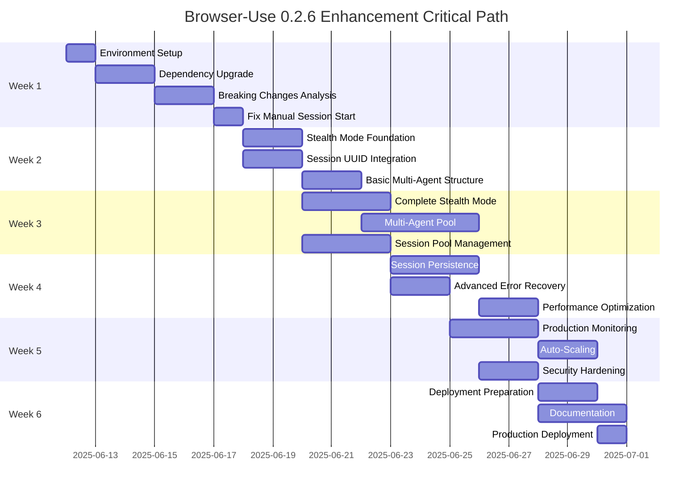

# Comprehensive TODO: Browser-Use 0.2.6 Enhancement

## Project Overview

Comprehensive task list for integrating browser-use 0.2.6 with enhanced features including
stealth mode, multi-agent orchestration, session persistence, and advanced error recovery.

**Timeline**: 6 weeks
**Team Size**: 4-5 developers
**Priority**: High (addresses critical stability and performance issues)

## Phase 1: Foundation and Upgrade (Week 1-2)

### 🔴 Critical Tasks - Week 1

#### TASK-001: Environment Preparation (4 hours)

- [ ] **Setup** development environment with Python 3.13 support
- [ ] **Backup** current production configuration
- [ ] **Create** feature branch `feat/browser-use-0.2.6-upgrade`
- [ ] **Document** current browser-use version and configuration
- [ ] **Run** baseline performance tests

**Assignee**: DevOps Engineer  
**Dependencies**: None  
**Risk**: Low  

#### TASK-002: Dependency Upgrade (8 hours)

- [ ] **Update** pyproject.toml: `browser-use>=0.2.6,<0.3.0`
- [ ] **Update** constraint for pydantic to maintain compatibility
- [ ] **Run** `uv sync` to update lock file
- [ ] **Check** for dependency conflicts
- [ ] **Document** any version incompatibilities
- [ ] **Test** import statements in Python REPL

**Assignee**: Backend Lead  
**Dependencies**: TASK-001  
**Risk**: Medium (potential dependency conflicts)  

```bash
# Commands to execute
uv add "browser-use>=0.2.6,<0.3.0"
uv sync
python -c "import browser_use; print(browser_use.__version__)"
```

#### TASK-003: Breaking Changes Analysis (6 hours)

- [ ] **Audit** all browser-use imports in codebase
- [ ] **Identify** usage of deprecated parameters
- [ ] **Find** sessions with `keep_alive=True`
- [ ] **Create** migration checklist
- [ ] **Test** existing functionality

**Assignee**: Senior Backend Developer  
**Dependencies**: TASK-002  
**Risk**: High (potential breaking changes)  

```bash
# Analysis commands
grep -r "BrowserSession" src/
grep -r "keep_alive" src/
grep -r "downloads_dir" src/
rg "browser_use|Browser|Agent" src/ --type py
```

#### TASK-004: Fix Manual Session Start (4 hours)

- [ ] **Update** `browser_use_adapter.py` for manual session starts
- [ ] **Add** `await session.start()` calls where needed
- [ ] **Update** session lifecycle management
- [ ] **Add** proper error handling for session start failures
- [ ] **Test** session creation and destruction

**Assignee**: Backend Developer  
**Dependencies**: TASK-003  
**Risk**: Medium  

```python
# Example fix pattern
# OLD:
session = BrowserSession(keep_alive=True)
agent = Agent(browser=session)

# NEW:
session = BrowserSession(keep_alive=True)
await session.start()
try:
    agent = Agent(browser=session)
    # ... use agent
finally:
    await session.close()
```

### 🟡 Important Tasks - Week 1

#### TASK-005: Test Suite Updates (6 hours)

- [ ] **Run** existing test suite to identify failures
- [ ] **Fix** broken tests due to API changes
- [ ] **Add** tests for manual session start pattern
- [ ] **Create** async test fixtures for sessions
- [ ] **Document** test patterns for 0.2.6

**Assignee**: QA Engineer  
**Dependencies**: TASK-004  
**Risk**: Low  

#### TASK-006: Logging and Monitoring Setup (4 hours)

- [ ] **Add** UUID tracking to existing logs
- [ ] **Create** structured log format for sessions
- [ ] **Add** metrics collection points
- [ ] **Setup** basic monitoring alerts
- [ ] **Test** log aggregation

**Assignee**: DevOps Engineer  
**Dependencies**: TASK-004  
**Risk**: Low  

### 🔴 Critical Tasks - Week 2

#### TASK-007: Stealth Mode Foundation (8 hours)

- [ ] **Research** patchright integration requirements
- [ ] **Create** `StealthModeManager` class stub
- [ ] **Define** domain pattern matching logic
- [ ] **Implement** basic stealth detection
- [ ] **Add** configuration options to config models
- [ ] **Write** unit tests for stealth detection

**Assignee**: Senior Backend Developer  
**Dependencies**: TASK-004  
**Risk**: Medium  

```python
# Implementation outline
class StealthModeManager:
    def __init__(self):
        self.protected_patterns = [
            r'.*\.oracle\.com',
            r'.*docs\.aws\.amazon\.com',
            r'.*\.salesforce\.com'
        ]
    
    def should_use_stealth(self, url: str) -> bool:
        return any(re.match(pattern, url) for pattern in self.protected_patterns)
```

#### TASK-008: Session UUID Integration (6 hours)

- [ ] **Update** browser_use_adapter to track session UUIDs
- [ ] **Add** UUID fields to existing data models
- [ ] **Create** session registry for tracking
- [ ] **Implement** UUID-based session lookup
- [ ] **Update** cleanup procedures to use UUIDs

**Assignee**: Backend Developer  
**Dependencies**: TASK-004  
**Risk**: Low  

#### TASK-009: Basic Multi-Agent Structure (8 hours)

- [ ] **Design** agent pool architecture
- [ ] **Create** `AgentPoolManager` class outline
- [ ] **Implement** agent creation and destruction
- [ ] **Add** round-robin work distribution
- [ ] **Create** health check interface
- [ ] **Write** integration tests

**Assignee**: Backend Lead  
**Dependencies**: TASK-008  
**Risk**: Medium  

### 🟡 Important Tasks - Week 2

#### TASK-010: Error Handling Improvements (4 hours)

- [ ] **Add** specific error types for browser-use 0.2.6
- [ ] **Implement** exponential backoff utility
- [ ] **Create** error categorization system
- [ ] **Add** retry with jitter functionality
- [ ] **Test** error scenarios

**Assignee**: Backend Developer  
**Dependencies**: TASK-007  
**Risk**: Low  

#### TASK-011: Performance Baseline (4 hours)

- [ ] **Create** performance test harness
- [ ] **Measure** current throughput (pages/hour)
- [ ] **Measure** memory usage per session
- [ ] **Measure** average response times
- [ ] **Document** baseline metrics
- [ ] **Setup** performance monitoring

**Assignee**: QA Engineer  
**Dependencies**: TASK-009  
**Risk**: Low  

## Phase 2: Core Features Implementation (Week 3-4)

### 🔴 Critical Tasks - Week 3

#### TASK-012: Complete Stealth Mode Implementation (12 hours)

- [ ] **Integrate** patchright stealth browsing
- [ ] **Add** automatic stealth escalation on bot detection
- [ ] **Implement** stealth effectiveness tracking
- [ ] **Create** domain-specific stealth configurations
- [ ] **Add** fallback strategies for stealth failures
- [ ] **Test** on known protected sites (AWS, Oracle, Salesforce)

**Assignee**: Senior Backend Developer  
**Dependencies**: TASK-007  
**Risk**: High (external site dependencies)  

```python
# Key implementation
async def create_stealth_session(self, profile: dict) -> BrowserSession:
    session = BrowserSession(
        stealth=True,
        headless=True,
        **profile
    )
    await session.start()
    self.track_session(session.id, stealth_used=True)
    return session
```

#### TASK-013: Multi-Agent Pool Implementation (16 hours)

- [ ] **Complete** AgentPoolManager with full lifecycle
- [ ] **Implement** dynamic scaling (2-20 agents)
- [ ] **Add** work queue and distribution
- [ ] **Create** agent health monitoring
- [ ] **Implement** graceful shutdown procedures
- [ ] **Add** resource limits per agent
- [ ] **Test** with 10 concurrent agents

**Assignee**: Backend Lead + Backend Developer  
**Dependencies**: TASK-009  
**Risk**: High (complexity, resource management)  

#### TASK-014: Session Pool Management (10 hours)

- [ ] **Create** session pooling system
- [ ] **Implement** session reuse logic
- [ ] **Add** automatic session cleanup
- [ ] **Create** session affinity system
- [ ] **Add** session health checks
- [ ] **Test** session lifecycle management

**Assignee**: Backend Developer  
**Dependencies**: TASK-008  
**Risk**: Medium  

### 🟡 Important Tasks - Week 3

#### TASK-015: Basic Monitoring Dashboard (8 hours)

- [ ] **Setup** Prometheus metrics collection
- [ ] **Create** basic Grafana dashboard
- [ ] **Add** success rate metrics
- [ ] **Add** throughput tracking
- [ ] **Add** error rate monitoring
- [ ] **Setup** alerting for critical metrics

**Assignee**: DevOps Engineer  
**Dependencies**: TASK-006  
**Risk**: Low  

#### TASK-016: Configuration Management (6 hours)

- [ ] **Update** config models for new features
- [ ] **Add** stealth mode configuration
- [ ] **Add** agent pool configuration
- [ ] **Add** session persistence configuration
- [ ] **Create** configuration validation
- [ ] **Update** environment variable documentation

**Assignee**: Backend Developer  
**Dependencies**: TASK-012  
**Risk**: Low  

### 🔴 Critical Tasks - Week 4

#### TASK-017: Session Persistence Implementation (12 hours)

- [ ] **Design** database schema for session storage
- [ ] **Create** migration scripts
- [ ] **Implement** SessionPersistenceManager
- [ ] **Add** session save/restore functionality
- [ ] **Implement** automatic stale session cleanup
- [ ] **Create** session metrics tracking
- [ ] **Test** session persistence across restarts

**Assignee**: Backend Developer  
**Dependencies**: TASK-014  
**Risk**: Medium (database integration)  

```sql
-- Database schema
CREATE TABLE browser_sessions (
    uuid VARCHAR(36) PRIMARY KEY,
    profile JSONB NOT NULL,
    created_at TIMESTAMP WITH TIME ZONE NOT NULL,
    last_used_at TIMESTAMP WITH TIME ZONE NOT NULL,
    status VARCHAR(20) NOT NULL CHECK (status IN ('active', 'suspended', 'terminated')),
    agent_id VARCHAR(36),
    stealth_enabled BOOLEAN DEFAULT FALSE,
    success_count INTEGER DEFAULT 0,
    failure_count INTEGER DEFAULT 0,
    total_requests INTEGER DEFAULT 0,
    avg_response_time_ms FLOAT DEFAULT 0,
    last_error TEXT,
    metadata JSONB DEFAULT '{}'::jsonb
);

CREATE INDEX idx_browser_sessions_status ON browser_sessions(status);
CREATE INDEX idx_browser_sessions_agent_id ON browser_sessions(agent_id);
CREATE INDEX idx_browser_sessions_last_used ON browser_sessions(last_used_at);
```

#### TASK-018: Advanced Error Recovery (10 hours)

- [ ] **Implement** circuit breaker pattern
- [ ] **Add** domain-specific retry strategies
- [ ] **Create** automatic escalation rules
- [ ] **Add** backoff with jitter
- [ ] **Implement** failure categorization
- [ ] **Add** detailed error reporting
- [ ] **Test** error recovery scenarios

**Assignee**: Senior Backend Developer  
**Dependencies**: TASK-010  
**Risk**: Medium  

#### TASK-019: Performance Optimization (8 hours)

- [ ] **Optimize** agent startup time
- [ ] **Implement** session pre-warming
- [ ] **Add** connection pooling
- [ ] **Optimize** markdown extraction
- [ ] **Add** caching for repeated requests
- [ ] **Test** performance improvements

**Assignee**: Backend Lead  
**Dependencies**: TASK-013  
**Risk**: Low  

### 🟡 Important Tasks - Week 4

#### TASK-020: API Endpoints for Management (8 hours)

- [ ] **Create** agent pool management endpoints
- [ ] **Add** session management endpoints
- [ ] **Implement** metrics endpoints
- [ ] **Add** health check endpoints
- [ ] **Create** OpenAPI documentation
- [ ] **Test** API functionality

**Assignee**: Backend Developer  
**Dependencies**: TASK-017  
**Risk**: Low  

#### TASK-021: Integration Testing (10 hours)

- [ ] **Create** end-to-end test scenarios
- [ ] **Test** multi-agent workflows
- [ ] **Test** stealth mode effectiveness
- [ ] **Test** session persistence
- [ ] **Test** error recovery
- [ ] **Performance test** with target loads

**Assignee**: QA Engineer  
**Dependencies**: TASK-019  
**Risk**: Medium  

## Phase 3: Advanced Features and Production (Week 5-6)

### 🔴 Critical Tasks - Week 5

#### TASK-022: Production-Ready Monitoring (12 hours)

- [ ] **Create** comprehensive Grafana dashboards
- [ ] **Add** domain-specific analytics
- [ ] **Implement** real-time alerting
- [ ] **Add** capacity planning metrics
- [ ] **Create** SLA monitoring
- [ ] **Add** cost tracking (LLM tokens)
- [ ] **Test** monitoring under load

**Assignee**: DevOps Engineer  
**Dependencies**: TASK-015  
**Risk**: Low  

#### TASK-023: Auto-Scaling Implementation (10 hours)

- [ ] **Implement** workload-based scaling
- [ ] **Add** predictive scaling algorithms
- [ ] **Create** resource utilization monitoring
- [ ] **Add** scaling cooldown periods
- [ ] **Implement** scale-down strategies
- [ ] **Test** scaling under various loads

**Assignee**: Backend Lead  
**Dependencies**: TASK-013  
**Risk**: Medium  

#### TASK-024: Security Hardening (8 hours)

- [ ] **Implement** secure credential storage
- [ ] **Add** process isolation for agents
- [ ] **Create** audit logging
- [ ] **Add** input validation and sanitization
- [ ] **Implement** rate limiting
- [ ] **Conduct** security review

**Assignee**: Senior Backend Developer  
**Dependencies**: TASK-017  
**Risk**: Medium  

### 🟡 Important Tasks - Week 5

#### TASK-025: Advanced Configuration (6 hours)

- [ ] **Create** dynamic configuration updates
- [ ] **Add** feature flags for new capabilities
- [ ] **Implement** A/B testing framework
- [ ] **Add** configuration validation
- [ ] **Create** configuration backup/restore

**Assignee**: Backend Developer  
**Dependencies**: TASK-016  
**Risk**: Low  

#### TASK-026: Performance Benchmarking (8 hours)

- [ ] **Create** comprehensive benchmark suite
- [ ] **Compare** with previous version performance
- [ ] **Benchmark** against competitor tools
- [ ] **Document** performance characteristics
- [ ] **Create** performance regression tests

**Assignee**: QA Engineer  
**Dependencies**: TASK-019  
**Risk**: Low  

### 🔴 Critical Tasks - Week 6

#### TASK-027: Production Deployment Preparation (10 hours)

- [ ] **Create** deployment pipeline updates
- [ ] **Prepare** production environment
- [ ] **Create** rollback procedures
- [ ] **Test** deployment on staging
- [ ] **Create** monitoring runbooks
- [ ] **Prepare** incident response procedures

**Assignee**: DevOps Engineer  
**Dependencies**: TASK-022  
**Risk**: High (production deployment)  

#### TASK-028: Documentation and Training (12 hours)

- [ ] **Create** architecture documentation
- [ ] **Write** API reference documentation
- [ ] **Create** troubleshooting guides
- [ ] **Write** performance tuning guides
- [ ] **Create** video tutorials
- [ ] **Conduct** team training sessions

**Assignee**: Technical Writer + Team  
**Dependencies**: TASK-020  
**Risk**: Low  

#### TASK-029: Final Testing and Validation (8 hours)

- [ ] **Run** full regression test suite
- [ ] **Conduct** load testing
- [ ] **Validate** all success criteria
- [ ] **Test** disaster recovery procedures
- [ ] **Conduct** user acceptance testing

**Assignee**: QA Engineer + Team  
**Dependencies**: TASK-026  
**Risk**: Medium  

### 🟡 Important Tasks - Week 6

#### TASK-030: Production Deployment (6 hours)

- [ ] **Deploy** to production environment
- [ ] **Monitor** deployment metrics
- [ ] **Validate** functionality in production
- [ ] **Update** monitoring dashboards
- [ ] **Conduct** post-deployment review

**Assignee**: DevOps Engineer + Team  
**Dependencies**: TASK-027  
**Risk**: High  

#### TASK-031: Knowledge Transfer (4 hours)

- [ ] **Conduct** technical handoff sessions
- [ ] **Create** operational runbooks
- [ ] **Train** support team
- [ ] **Document** lessons learned
- [ ] **Plan** future enhancements

**Assignee**: Entire Team  
**Dependencies**: TASK-028  
**Risk**: Low  

## Critical Path Analysis



## Resource Allocation

### Team Assignments

#### Backend Lead (40 hours/week)

- TASK-002: Dependency Upgrade
- TASK-009: Basic Multi-Agent Structure  
- TASK-013: Multi-Agent Pool Implementation
- TASK-019: Performance Optimization
- TASK-023: Auto-Scaling Implementation

#### Senior Backend Developer (40 hours/week)

- TASK-003: Breaking Changes Analysis
- TASK-007: Stealth Mode Foundation
- TASK-012: Complete Stealth Mode Implementation
- TASK-018: Advanced Error Recovery
- TASK-024: Security Hardening

#### Backend Developer (40 hours/week)

- TASK-004: Fix Manual Session Start
- TASK-008: Session UUID Integration
- TASK-010: Error Handling Improvements
- TASK-014: Session Pool Management
- TASK-017: Session Persistence Implementation
- TASK-020: API Endpoints for Management
- TASK-025: Advanced Configuration

#### DevOps Engineer (40 hours/week)

- TASK-001: Environment Preparation
- TASK-006: Logging and Monitoring Setup
- TASK-015: Basic Monitoring Dashboard
- TASK-022: Production-Ready Monitoring
- TASK-027: Production Deployment Preparation
- TASK-030: Production Deployment

#### QA Engineer (40 hours/week)

- TASK-005: Test Suite Updates
- TASK-011: Performance Baseline
- TASK-021: Integration Testing
- TASK-026: Performance Benchmarking
- TASK-029: Final Testing and Validation

#### Technical Writer (20 hours/week)

- TASK-028: Documentation and Training (primary)
- TASK-031: Knowledge Transfer (support)

### Budget Estimates

| Category | Hours | Rate | Cost |
|----------|-------|------|------|
| Backend Lead | 80 | $150/hr | $12,000 |
| Senior Backend Developer | 80 | $130/hr | $10,400 |
| Backend Developer | 120 | $110/hr | $13,200 |
| DevOps Engineer | 60 | $120/hr | $7,200 |
| QA Engineer | 60 | $100/hr | $6,000 |
| Technical Writer | 20 | $90/hr | $1,800 |
| **Total** | **420** | | **$50,600** |

### Infrastructure Costs

| Item | Monthly Cost | 6-Month Total |
|------|-------------|---------------|
| Development Environment | $500 | $3,000 |
| Staging Environment | $800 | $4,800 |
| Monitoring Tools | $200 | $1,200 |
| LLM API Testing | $1,000 | $6,000 |
| **Total** | **$2,500** | **$15,000** |

## Risk Mitigation Plan

### High Risk Items

#### RISK-001: Breaking Changes Impact

**Probability**: Medium  
**Impact**: High  
**Mitigation**:

- Comprehensive testing on dev environment first
- Gradual rollout with feature flags
- Automated rollback procedures
- Parallel running of old and new versions during transition

#### RISK-002: Performance Degradation

**Probability**: Low  
**Impact**: High  
**Mitigation**:

- Extensive load testing before production
- Performance monitoring with automatic alerts
- Ability to disable multi-agent features
- Quick rollback to single-agent mode

#### RISK-003: Multi-Agent Resource Exhaustion

**Probability**: Medium  
**Impact**: Medium  
**Mitigation**:

- Resource limits per agent
- Auto-scaling with upper bounds
- Memory monitoring and alerts
- Graceful degradation strategies

### Contingency Plans

#### Plan A: Partial Feature Release

If full implementation is delayed:

1. Release stealth mode only
2. Release session persistence only
3. Defer multi-agent to next version

#### Plan B: Rollback Strategy

If critical issues discovered:

1. Immediate rollback to previous version
2. Disable new features via configuration
3. Run in compatibility mode
4. Schedule fix deployment

#### Plan C: Performance Issues

If performance targets not met:

1. Implement caching layers
2. Reduce agent pool size
3. Optimize critical paths
4. Consider alternative architectures

## Success Criteria Validation

### Automated Tests

- [ ] Unit test coverage > 90%
- [ ] Integration test coverage > 85%
- [ ] Performance tests passing
- [ ] Security tests passing
- [ ] Load tests with 10 agents passing

### Performance Benchmarks

- [ ] Throughput > 500 pages/hour (target: 800)
- [ ] Success rate > 95% on protected sites
- [ ] Error rate < 1%
- [ ] Memory usage < 200MB per agent
- [ ] Startup time < 5 seconds

### Business Metrics

- [ ] 40% reduction in LLM token usage
- [ ] 50% improvement in documentation coverage
- [ ] 99.9% uptime during testing period
- [ ] Zero critical production issues
- [ ] Positive team feedback (score > 4/5)

## Maintenance and Support Plan

### Post-Launch Tasks (Week 7-8)

- [ ] Monitor production metrics daily
- [ ] Weekly performance reviews
- [ ] Collect user feedback
- [ ] Address minor issues
- [ ] Plan next iteration features

### Ongoing Maintenance

- [ ] Monthly dependency updates
- [ ] Quarterly performance reviews
- [ ] Semi-annual architecture reviews
- [ ] Annual technology stack evaluation

## Conclusion

This comprehensive TODO list provides a detailed roadmap for implementing
browser-use 0.2.6 enhancements. The project is structured in three phases over
six weeks, with clear dependencies, risk mitigation strategies, and success
criteria.

The critical path focuses on foundational upgrades first, followed by core feature
implementation, and finally advanced features and production readiness. With proper
execution, this project will significantly improve the reliability, performance, and
capabilities of our AI documentation scraping system.

**Next Steps**:

1. Review and approve this TODO list
2. Assign team members to tasks
3. Setup project tracking (Jira/Linear)
4. Begin Phase 1 execution
5. Schedule weekly review meetings
