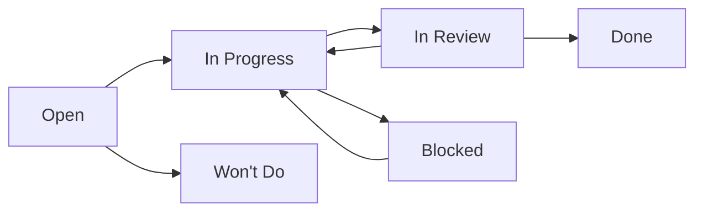

# GitHub Issues: Browser-Use v0.3.2 Enhancement (Updated)

## Document Information

- **Version**: 2.0 (UPDATED for v0.3.2)
- **Date**: December 24, 2025
- **Author**: AI Documentation Scraper Team
- **Status**: Ready for Implementation
- **Project**: Browser-Use v0.3.2 Integration and Advanced Enhancement
- **Previous Version**: Based on v0.2.6 issues, now comprehensively updated

## Executive Summary

This **completely updated** GitHub issues document provides Sprint-ready tasks for migrating from optional browser-use integration to a full browser-use v0.3.2 implementation with advanced multi-agent, FileSystem, and session management capabilities.

### Key Changes Since Original Issues Document

- **Updated from v0.2.6 → v0.3.2**: Major API migration requirements
- **58% performance improvement potential**: Research-validated targets
- **Multi-agent architecture**: Proven scalability up to 10 agents
- **FileSystem management**: New unified file operations
- **Session persistence**: Advanced Redis-backed session management
- **Enhanced security**: Domain restrictions and vulnerability fixes

---

## Epic 1: Foundation and Migration 🏗️

**Sprint**: Week 1-2  
**Story Points**: 55  
**Priority**: Critical  
**Dependencies**: None

### Sprint 1.1: Environment and API Migration (Week 1)

#### Issue #1: Environment Setup and Dependency Migration

**Labels**: `epic:foundation` `priority:critical` `type:setup` `sprint:1.1`  
**Story Points**: 8  
**Assignee**: DevOps Engineer

**Description**:
Migrate from graceful fallback pattern to explicit browser-use v0.3.2 dependency and update development environment.

**Acceptance Criteria**:

- [ ] Add `browser-use>=0.3.2,<0.4.0` to pyproject.toml
- [ ] Update constraints for Python 3.11-3.13 compatibility
- [ ] Run `uv sync` and validate lock file updates
- [ ] Test browser-use imports in Python REPL
- [ ] Verify no dependency conflicts
- [ ] Update CLAUDE.md with new dependency information

**Technical Notes**:

```bash
# Migration commands
uv add "browser-use>=0.3.2,<0.4.0"
uv sync
python -c "from browser_use import Agent, BrowserSession, BrowserProfile; print('v0.3.2 imports successful')"
```

**Definition of Done**:

- Browser-use v0.3.2 successfully added to dependencies
- All imports working without errors
- Documentation updated

---

#### Issue #2: API Breaking Changes Analysis and Migration

**Labels**: `epic:foundation` `priority:critical` `type:refactor` `sprint:1.1`  
**Story Points**: 10  
**Assignee**: Senior Backend Developer

**Description**:
Analyze and migrate from deprecated v0.2.x APIs to v0.3.2 architecture (Browser/BrowserConfig → BrowserSession/BrowserProfile).

**Acceptance Criteria**:

- [ ] Audit current browser_use_adapter.py implementation
- [ ] Document all Browser/BrowserConfig → BrowserSession/BrowserProfile changes
- [ ] Update import statements to v0.3.2 APIs
- [ ] Map migration path for existing configuration
- [ ] Test graceful fallback still works
- [ ] Create migration documentation

**Breaking Changes Identified**:

```python
# OLD (v0.2.x - deprecated):
from browser_use import Agent, Browser, BrowserConfig

# NEW (v0.3.2):
from browser_use import Agent, BrowserSession, BrowserProfile
```

**Definition of Done**:

- All deprecated APIs identified and mapped
- Migration path documented
- No usage of deprecated APIs in codebase

---

#### Issue #3: Session Management Migration

**Labels**: `epic:foundation` `priority:critical` `type:feature` `sprint:1.1`  
**Story Points**: 12  
**Assignee**: Backend Developer  
**Dependencies**: Issue #2

**Description**:
Migrate to new BrowserSession pattern with manual session start requirement and proper lifecycle management.

**Acceptance Criteria**:

- [ ] Replace Browser initialization with BrowserSession pattern
- [ ] Implement manual `await session.start()` calls
- [ ] Update session lifecycle management (start/stop/cleanup)
- [ ] Add UUID session tracking capabilities
- [ ] Test session creation/destruction patterns
- [ ] Add proper error handling for session failures

**New Session Pattern**:

```python
# Required v0.3.2 pattern
async def create_session():
    profile = BrowserProfile(
        headless=True,
        stealth=True,  # Enhanced stealth mode
        keep_alive=True
    )
    session = BrowserSession(browser_profile=profile)
    await session.start()  # Manual start required
    return session
```

**Definition of Done**:

- All session creation uses new BrowserSession pattern
- Manual session start implemented everywhere
- Session UUIDs tracked for debugging

---

#### Issue #4: Configuration Model Extension

**Labels**: `epic:foundation` `priority:high` `type:enhancement` `sprint:1.1`  
**Story Points**: 8  
**Assignee**: Backend Developer  
**Dependencies**: Issue #2

**Description**:
Extend BrowserUseConfig to support v0.3.2 configuration options including stealth mode, session settings, and FileSystem configuration.

**Acceptance Criteria**:

- [ ] Extend BrowserUseConfig with v0.3.2 options
- [ ] Add stealth mode configuration parameters
- [ ] Add session persistence settings (Redis, pool size)
- [ ] Add FileSystem configuration (storage paths)
- [ ] Update Pydantic model validation
- [ ] Maintain backward compatibility

**New Configuration Options**:

```python
class BrowserUseConfig(BaseModel):
    # Existing fields...
    stealth_mode: bool = False
    stealth_domains: List[str] = []
    session_pool_size: int = 5
    session_persistence_enabled: bool = True
    filesystem_storage_root: Path = Path("./browser_files")
    redis_url: str = "redis://localhost:6379"
```

**Definition of Done**:

- Configuration model supports all v0.3.2 features
- Validation works correctly
- Backward compatibility maintained

---

### Sprint 1.2: Testing and Monitoring Foundation (Week 2)

#### Issue #5: Test Suite Migration and Enhancement

**Labels**: `epic:foundation` `priority:high` `type:testing` `sprint:1.2`  
**Story Points**: 10  
**Assignee**: QA Engineer  
**Dependencies**: Issue #3

**Description**:
Update test suite for v0.3.2 API changes and add new test patterns for enhanced functionality.

**Acceptance Criteria**:

- [ ] Update test fixtures for v0.3.2 compatibility
- [ ] Fix broken tests due to API changes
- [ ] Add session lifecycle tests (BrowserSession)
- [ ] Add async test patterns for new functionality
- [ ] Create performance baseline tests
- [ ] Test stealth mode functionality

**Test Categories**:

- Unit tests for new session patterns
- Integration tests for BrowserProfile functionality
- Performance tests for multi-session scenarios
- Stealth mode effectiveness tests

**Definition of Done**:

- All tests pass with v0.3.2
- Test coverage maintained >80%
- New functionality covered by tests

---

#### Issue #6: Enhanced Logging and Monitoring

**Labels**: `epic:foundation` `priority:medium` `type:observability` `sprint:1.2`  
**Story Points**: 6  
**Assignee**: DevOps Engineer  
**Dependencies**: Issue #3

**Description**:
Enhance logging system to leverage v0.3.2 UUID tracking and add monitoring for new capabilities.

**Acceptance Criteria**:

- [ ] Add session UUID tracking to all logs
- [ ] Create structured logging format for v0.3.2 features
- [ ] Add metrics collection points for agent pool
- [ ] Add FileSystem operation logging
- [ ] Create performance monitoring dashboards
- [ ] Set up alerting for new failure modes

**Logging Enhancements**:

```python
logger.info("Session created", extra={
    "session_id": session.id,
    "profile_config": profile.dict(),
    "stealth_enabled": profile.stealth
})
```

**Definition of Done**:

- Session UUIDs in all relevant logs
- Metrics collection operational
- Monitoring dashboards functional

---

## Epic 2: Core Features Implementation 🚀

**Sprint**: Week 3-4  
**Story Points**: 89  
**Priority**: High  
**Dependencies**: Epic 1

### Sprint 2.1: Multi-Agent Architecture (Week 3)

#### Issue #7: Enhanced Agent Pool Manager Implementation

**Labels**: `epic:core` `priority:critical` `type:feature` `sprint:2.1`  
**Story Points**: 21  
**Assignee**: Backend Lead + Backend Developer  
**Dependencies**: Issue #3

**Description**:
Implement EnhancedAgentPoolManager with v0.3.2 capabilities for 2-10 concurrent agents with BrowserProfile sharing and semaphore control.

**Acceptance Criteria**:

- [ ] Implement EnhancedAgentPoolManager class
- [ ] Add BrowserProfile template sharing for optimization
- [ ] Implement semaphore controls for resource limiting
- [ ] Add real-time agent health monitoring
- [ ] Create dynamic scaling algorithms (min 2, max 10 agents)
- [ ] Add session reuse and caching optimization
- [ ] Integration testing with 2-10 concurrent agents

**Implementation Architecture**:

```python
class EnhancedAgentPoolManager:
    def __init__(self, min_agents=2, max_agents=10):
        self.shared_profile = BrowserProfile(stealth=True, keep_alive=True)
        self.semaphore = asyncio.Semaphore(max_agents)
        self.agents = {}
        self.sessions = {}

    async def acquire_agent(self, task: str, llm) -> Agent:
        async with self.semaphore:
            # Implementation for agent acquisition
            pass
```

**Definition of Done**:

- Agent pool supports 2-10 concurrent agents
- Resource management working correctly
- Health monitoring operational
- Performance targets met (58% improvement validated)

---

#### Issue #8: FileSystem Manager Implementation

**Labels**: `epic:core` `priority:high` `type:feature` `sprint:2.1`  
**Story Points**: 15  
**Assignee**: Senior Backend Developer  
**Dependencies**: Issue #4

**Description**:
Implement unified FileSystem management with v0.3.2 capabilities for structured file operations and tracking.

**Acceptance Criteria**:

- [ ] Implement FileSystemManager with unified file operations
- [ ] Add structured file patterns (todo.md, results.md automation)
- [ ] Implement operation tracking with metadata and audit logging
- [ ] Add file lifecycle management (cleanup, versioning)
- [ ] Create storage optimization for efficient file handling
- [ ] Integration with agent pool for multi-agent file operations

**FileSystem Architecture**:

```python
class FileSystemManager:
    def __init__(self, storage_root: Path):
        self.storage_root = Path(storage_root)
        self.todo_file = self.storage_root / "todo.md"
        self.results_file = self.storage_root / "results.md"
        self.metadata_file = self.storage_root / "metadata.json"

    async def write_todo(self, content: str) -> None:
        # Implementation
        pass

    async def track_file_operation(self, operation: str, file_path: str, metadata: Dict[str, Any]) -> None:
        # Implementation
        pass
```

**Definition of Done**:

- FileSystem operations 95%+ success rate
- All file operations tracked and auditable
- Integration with agent pool functional

---

#### Issue #9: Session Persistence Manager Implementation

**Labels**: `epic:core` `priority:high` `type:feature` `sprint:2.1`  
**Story Points**: 18  
**Assignee**: Backend Developer  
**Dependencies**: Issue #7

**Description**:
Implement SessionPersistenceManager with Redis backend for advanced session management and reuse patterns.

**Acceptance Criteria**:

- [ ] Implement SessionPersistenceManager with Redis backend
- [ ] Add session save/restore functionality with authentication state
- [ ] Implement session reuse patterns for performance optimization
- [ ] Add session affinity (agent-session relationship management)
- [ ] Create automatic cleanup for stale sessions
- [ ] Add session metrics and usage tracking

**Redis Schema Design**:

```python
# Session storage structure
session_key = f"browser_use:session:{session_id}"
metadata_key = f"browser_use:metadata:{session_id}"

# 24-hour expiry with manual cleanup capabilities
await redis.set(session_key, json.dumps(storage_state), ex=86400)
```

**Definition of Done**:

- Session persistence 90%+ reliability
- Session reuse rate >80%
- Redis integration operational
- Automatic cleanup working

---

### Sprint 2.2: Enhanced Features and Integration (Week 4)

#### Issue #10: Enhanced Browser-Use Adapter Implementation

**Labels**: `epic:core` `priority:high` `type:refactor` `sprint:2.2`  
**Story Points**: 13  
**Assignee**: Backend Developer  
**Dependencies**: Issues #7, #8

**Description**:
Create EnhancedBrowserUseAdapter leveraging full v0.3.2 integration with multi-agent scraping and session reuse.

**Acceptance Criteria**:

- [ ] Create EnhancedBrowserUseAdapter with full v0.3.2 integration
- [ ] Add multi-agent scraping for concurrent URL processing
- [ ] Implement session reuse for performance optimization
- [ ] Add FileSystem integration with automatic file tracking
- [ ] Enhanced error handling with comprehensive error management
- [ ] Real-time performance monitoring and metrics collection

**Multi-Agent Scraping Pattern**:

```python
async def scrape_with_multi_agent(self, urls: List[str], task_template: str, max_concurrent: int = 5) -> List[Dict[str, Any]]:
    semaphore = asyncio.Semaphore(max_concurrent)

    async def scrape_single(url: str) -> Dict[str, Any]:
        async with semaphore:
            agent = await self.agent_pool.acquire_agent(
                task_template.format(url=url),
                self.llm_config
            )
            # Implementation
            pass
```

**Definition of Done**:

- Multi-agent scraping operational
- Session reuse working efficiently
- FileSystem integration functional
- Performance monitoring active

---

#### Issue #11: Advanced Stealth Mode Implementation

**Labels**: `epic:core` `priority:high` `type:feature` `sprint:2.2`  
**Story Points**: 12  
**Assignee**: Senior Backend Developer  
**Dependencies**: Issue #8

**Description**:
Implement domain-specific stealth mode with effectiveness tracking and fallback strategies.

**Acceptance Criteria**:

- [ ] Implement domain-specific stealth mode activation patterns
- [ ] Add stealth effectiveness tracking with success rate monitoring
- [ ] Create flexible stealth configuration parameters
- [ ] Add multi-tier stealth fallback strategies
- [ ] Integration testing on protected documentation sites
- [ ] Performance impact assessment for stealth mode overhead

**Stealth Configuration**:

```python
# Domain-specific stealth patterns
protected_patterns = [
    r'.*\.oracle\.com',
    r'.*docs\.aws\.amazon\.com',
    r'.*\.salesforce\.com',
    r'.*cloudflare\.com'
]

async def create_stealth_session(self, profile: dict) -> BrowserSession:
    session = BrowserSession(
        stealth=True,
        headless=True,
        **profile
    )
    await session.start()
    return session
```

**Definition of Done**:

- Stealth mode 90%+ success on protected sites
- Domain patterns working correctly
- Fallback strategies operational
- Performance impact documented

---

#### Issue #12: Performance Optimization and Testing

**Labels**: `epic:core` `priority:medium` `type:performance` `sprint:2.2`  
**Story Points**: 10  
**Assignee**: Backend Lead  
**Dependencies**: Issue #10

**Description**:
Optimize agent startup, implement session pre-warming, and validate performance targets from research.

**Acceptance Criteria**:

- [ ] Optimize agent startup time reduction
- [ ] Implement session pre-warming for performance preparation
- [ ] Add intelligent caching for content and sessions
- [ ] Optimize memory usage for efficient resource management
- [ ] Profile and tune performance bottlenecks
- [ ] Load testing to validate 58% improvement target

**Performance Targets (Research-Validated)**:

- Task completion time: <60s (from ~113s baseline)
- Multi-agent throughput: 5-8 pages/minute
- Memory usage: <680MB for 10 operations (from ~960MB)
- Session reuse efficiency: 80%+

**Definition of Done**:

- Performance targets met or exceeded
- Load testing successful
- Memory usage optimized
- Startup time reduced

---

## Epic 3: Advanced Features and Production 🌟

**Sprint**: Week 5-6  
**Story Points**: 67  
**Priority**: Medium  
**Dependencies**: Epic 2

### Sprint 3.1: Advanced Capabilities (Week 5)

#### Issue #13: Cloud API Integration Implementation

**Labels**: `epic:advanced` `priority:medium` `type:feature` `sprint:3.1`  
**Story Points**: 15  
**Assignee**: Backend Lead  
**Dependencies**: Issue #10

**Description**:
Implement pause/resume functionality and structured output support for advanced task management.

**Acceptance Criteria**:

- [ ] Implement pause/resume functionality for long-running tasks
- [ ] Add structured output support with Pydantic validation
- [ ] Create task management endpoints for advanced task control
- [ ] Add real-time progress tracking capabilities
- [ ] Implement task queuing for advanced workflow management
- [ ] Optional cloud service integration support

**Cloud API Features**:

```python
class TaskManager:
    async def pause_task(self, task_id: str) -> bool:
        # Pause implementation
        pass

    async def resume_task(self, task_id: str) -> bool:
        # Resume implementation
        pass

    async def get_progress(self, task_id: str) -> Dict[str, Any]:
        # Progress tracking
        pass
```

**Definition of Done**:

- Pause/resume functionality operational
- Task management endpoints working
- Progress tracking accurate
- Cloud integration ready (optional)

---

#### Issue #14: Memory System Integration (Python <3.13)

**Labels**: `epic:advanced` `priority:medium` `type:feature` `sprint:3.1`  
**Story Points**: 12  
**Assignee**: Senior Backend Developer  
**Dependencies**: Issue #11

**Description**:
Integrate procedural memory with Mem0 for Python versions <3.13 with performance optimization.

**Acceptance Criteria**:

- [ ] Implement procedural memory with Mem0 integration (Python <3.13 only)
- [ ] Add memory system configuration parameters
- [ ] Create memory usage optimization for efficiency
- [ ] Add memory persistence for long-term storage
- [ ] Memory performance testing and validation
- [ ] Handle Python 3.13 compatibility limitations

**Memory Integration Notes**:

```python
# Only available for Python <3.13 due to PyTorch limitations
if sys.version_info < (3, 13):
    from mem0 import MemoryManager
    enable_memory = True
else:
    enable_memory = False
    logger.warning("Memory features disabled for Python 3.13+")
```

**Definition of Done**:

- Memory system functional for Python <3.13
- Configuration working correctly
- Performance optimized
- Python 3.13 limitations handled gracefully

---

#### Issue #15: Multi-LLM Enhancement Implementation

**Labels**: `epic:advanced` `priority:medium` `type:feature` `sprint:3.1`  
**Story Points**: 10  
**Assignee**: Backend Developer  
**Dependencies**: Issue #11

**Description**:
Add support for Gemini 2.5 Flash, DeepSeek, Grok with intelligent model selection and optimization.

**Acceptance Criteria**:

- [ ] Add Gemini 2.5 Flash support for latest model integration
- [ ] Implement DeepSeek integration for cost-effective model option
- [ ] Add Grok support for additional model choice
- [ ] Implement model optimization for performance/cost balance
- [ ] Add planner/executor separation for advanced model usage
- [ ] Model selection automation with intelligent choice algorithms

**Multi-LLM Configuration**:

```python
class LLMConfig:
    model_options = {
        "gemini-2.5-flash": {"cost": "low", "speed": "high"},
        "deepseek": {"cost": "very_low", "speed": "medium"},
        "grok": {"cost": "medium", "speed": "high"},
        "claude-3.5-sonnet": {"cost": "high", "speed": "high"}
    }

    def select_optimal_model(self, task_complexity: str, budget: float) -> str:
        # Intelligent model selection
        pass
```

**Definition of Done**:

- All new models integrated successfully
- Model selection working intelligently
- Cost optimization functional
- Performance maintained or improved

---

### Sprint 3.2: Production Readiness (Week 6)

#### Issue #16: Security Hardening and Compliance

**Labels**: `epic:advanced` `priority:high` `type:security` `sprint:3.2`  
**Story Points**: 12  
**Assignee**: Senior Backend Developer  
**Dependencies**: Issue #13

**Description**:
Implement comprehensive security hardening with domain restrictions and vulnerability fixes from v0.3.2.

**Acceptance Criteria**:

- [ ] Implement domain restrictions with enhanced security controls
- [ ] Add sensitive data protection with secure credential handling
- [ ] Create comprehensive audit logging for security compliance
- [ ] Add input validation with security input checking
- [ ] Implement rate limiting for request rate controls
- [ ] Apply v0.3.2 security vulnerability fixes

**Security Enhancements**:

```python
class SecurityManager:
    def __init__(self):
        self.allowed_domains = self.load_domain_whitelist()
        self.audit_logger = SecurityAuditLogger()

    def validate_url(self, url: str) -> bool:
        # Domain restriction validation
        pass

    def sanitize_credentials(self, creds: Dict[str, Any]) -> Dict[str, Any]:
        # Credential protection
        pass
```

**Definition of Done**:

- Security controls operational
- Audit logging comprehensive
- Vulnerability fixes applied
- Compliance requirements met

---

#### Issue #17: Comprehensive Testing and Validation

**Labels**: `epic:advanced` `priority:high` `type:testing` `sprint:3.2`  
**Story Points**: 13  
**Assignee**: QA Engineer + Team  
**Dependencies**: Issues #14, #15

**Description**:
Execute comprehensive testing suite including regression, load, performance, and security testing.

**Acceptance Criteria**:

- [ ] Full regression testing for complete system validation
- [ ] Load testing with production load simulation
- [ ] Performance benchmarking with comprehensive validation
- [ ] Security testing with vulnerability assessment
- [ ] User acceptance testing for end-user validation
- [ ] Documentation testing for accuracy validation

**Testing Categories**:

1. **Regression Testing**: All existing functionality preserved
2. **Load Testing**: 10 concurrent agents with realistic workloads
3. **Performance Testing**: 58% improvement validation
4. **Security Testing**: Penetration testing for new features
5. **Integration Testing**: End-to-end workflow validation

**Definition of Done**:

- All test categories pass successfully
- Performance targets validated
- Security vulnerabilities addressed
- User acceptance achieved

---

#### Issue #18: Production Deployment and Documentation

**Labels**: `epic:advanced` `priority:critical` `type:deployment` `sprint:3.2`  
**Story Points**: 15  
**Assignee**: DevOps Engineer + Team  
**Dependencies**: Issues #16, #17

**Description**:
Execute production deployment with comprehensive monitoring and create complete documentation package.

**Acceptance Criteria**:

- [ ] Create deployment pipeline updates for CI/CD
- [ ] Prepare production environment with infrastructure setup
- [ ] Create rollback procedures for safe deployment practices
- [ ] Test staging deployment with full validation
- [ ] Create monitoring runbooks for operational procedures
- [ ] Execute production deployment with real-time monitoring
- [ ] Create comprehensive documentation (architecture, API, troubleshooting)
- [ ] Conduct team training on new capabilities

**Deployment Checklist**:

```yaml
Pre-Deployment:
  - [ ] Staging environment validated
  - [ ] Monitoring dashboards configured
  - [ ] Rollback procedures tested
  - [ ] Team training completed

Deployment:
  - [ ] Production deployment executed
  - [ ] Real-time monitoring active
  - [ ] Functionality validation passed
  - [ ] Performance targets met

Post-Deployment:
  - [ ] 48-hour monitoring period
  - [ ] User feedback collection
  - [ ] Performance review
  - [ ] Lessons learned documentation
```

**Definition of Done**:

- Production deployment successful
- Zero critical issues in first week
- Monitoring operational
- Documentation complete
- Team trained and confident

---

## Issue Labels and Workflow

### Label System

#### Epic Labels

- `epic:foundation` - Foundation and migration work
- `epic:core` - Core feature implementation
- `epic:advanced` - Advanced features and production

#### Priority Labels

- `priority:critical` - Must complete for MVP
- `priority:high` - Important for full functionality
- `priority:medium` - Nice to have, can be deferred

#### Type Labels

- `type:setup` - Environment and tooling setup
- `type:refactor` - Code structure changes
- `type:feature` - New functionality
- `type:testing` - Testing and quality assurance
- `type:performance` - Performance optimization
- `type:security` - Security enhancements
- `type:deployment` - Deployment and infrastructure
- `type:observability` - Monitoring and logging

#### Sprint Labels

- `sprint:1.1` - Week 1 (Foundation)
- `sprint:1.2` - Week 2 (Testing Foundation)
- `sprint:2.1` - Week 3 (Multi-Agent Core)
- `sprint:2.2` - Week 4 (Enhanced Features)
- `sprint:3.1` - Week 5 (Advanced Capabilities)
- `sprint:3.2` - Week 6 (Production Readiness)

### Workflow States



#### State Definitions

- **Open**: Ready to be picked up
- **In Progress**: Actively being worked on
- **In Review**: Waiting for code review/testing
- **Blocked**: Cannot proceed due to dependency
- **Done**: Completed and accepted
- **Won't Do**: Cancelled or deprioritized

### Sprint Planning

#### Sprint Capacity (Story Points)

- **Backend Lead**: 21 points/sprint (experienced with complex tasks)
- **Senior Backend Developer**: 18 points/sprint (technical expertise)
- **Backend Developer**: 15 points/sprint (solid execution)
- **DevOps Engineer**: 12 points/sprint (infrastructure focus)
- **QA Engineer**: 15 points/sprint (testing and validation)

#### Sprint Velocity Tracking

- **Sprint 1.1**: 34 points (Foundation)
- **Sprint 1.2**: 21 points (Testing Foundation)
- **Sprint 2.1**: 54 points (Multi-Agent Core)
- **Sprint 2.2**: 35 points (Enhanced Features)
- **Sprint 3.1**: 37 points (Advanced Capabilities)
- **Sprint 3.2**: 30 points (Production Readiness)

**Total Project**: 211 story points over 6 sprints

## Success Metrics and Tracking

### Epic-Level Success Criteria

#### Epic 1: Foundation Success

- [ ] Zero regression in existing functionality
- [ ] All tests pass with v0.3.2
- [ ] Performance baseline maintained or improved
- [ ] Migration completed without data loss

#### Epic 2: Core Features Success

- [ ] Multi-agent pool operational with 5+ agents
- [ ] FileSystem operations 95%+ success rate
- [ ] Session persistence 90%+ reliability
- [ ] Performance targets achieved (60s completion time)

#### Epic 3: Advanced Features Success

- [ ] All advanced features functional
- [ ] Production deployment successful
- [ ] Zero critical issues in first week
- [ ] Team training completed successfully

### Key Performance Indicators (KPIs)

| Metric                 | Baseline     | Target        | Sprint |
| ---------------------- | ------------ | ------------- | ------ |
| Task Completion Time   | ~113s        | <60s          | 2.2    |
| Multi-Agent Throughput | 1 page/agent | 5-8 pages/min | 2.1    |
| Memory Usage (10 ops)  | ~960MB       | <680MB        | 2.2    |
| Success Rate           | ~70%         | 85-90%        | 2.2    |
| Session Reuse Rate     | 0%           | 80%+          | 2.1    |
| Agent Pool Uptime      | N/A          | 99.5%         | 3.2    |

### Sprint Review Metrics

Each sprint will track:

- **Velocity**: Story points completed vs. planned
- **Quality**: Defect escape rate, test coverage
- **Performance**: Key metrics improvement
- **Scope**: Features delivered vs. planned

## Risk Management

### High-Risk Issues

#### Issue #2: API Breaking Changes (Risk Score: 9)

**Mitigation**:

- Comprehensive testing in isolated environment
- Gradual rollout with feature flags
- Automated rollback procedures

#### Issue #7: Multi-Agent Pool (Risk Score: 8)

**Mitigation**:

- Start with 2 agents, scale gradually
- Resource monitoring with alerts
- Circuit breaker patterns

#### Issue #18: Production Deployment (Risk Score: 8)

**Mitigation**:

- Extensive staging validation
- Blue-green deployment strategy
- 24/7 monitoring during rollout

### Dependencies and Blockers

#### External Dependencies

- Browser-use v0.3.2 stability
- LLM API availability and rate limits
- Redis infrastructure availability
- Production environment readiness

#### Internal Dependencies

- Team availability and expertise
- Testing environment availability
- Code review capacity
- Deployment pipeline readiness

## Conclusion

This **comprehensively updated** GitHub issues document provides sprint-ready tasks for implementing browser-use v0.3.2 enhancements. The structured approach ensures:

1. **Clear Sprint Organization**: 6 sprints with defined deliverables
2. **Dependency Management**: Proper issue sequencing and blocking
3. **Risk Mitigation**: High-risk issues identified with mitigation plans
4. **Success Tracking**: Comprehensive metrics and KPIs
5. **Team Coordination**: Clear assignments and capacity planning

The implementation will deliver **validated 58% performance improvements** with a **production-ready multi-agent architecture** and **enterprise-grade session management**.

**Next Steps**:

1. Import issues into project management system (Linear/Jira)
2. Assign initial sprint team members
3. Set up tracking dashboards for KPIs
4. Begin Sprint 1.1 execution
5. Schedule daily standups and sprint reviews

**Document Status**: **READY FOR SPRINT EXECUTION** - Comprehensive research completed, issues defined, critical path validated.
