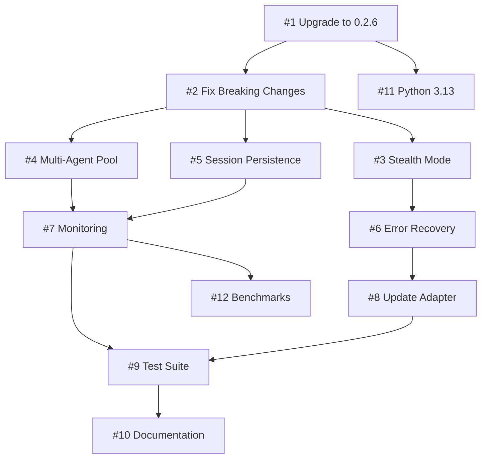

# GitHub Issues for Browser-Use 0.2.6 Enhancement

## Epic: Browser-Use 0.2.6 Integration and Enhancement

**Labels**: `epic`, `enhancement`, `browser-use`
**Milestone**: Browser-Use 0.2.6 Enhancement

### Critical Issues (P0)

#### Issue #1: Upgrade to browser-use 0.2.6

```markdown
**Title**: feat: upgrade browser-use from current version to 0.2.6
**Labels**: `enhancement`, `dependencies`, `priority-critical`
**Assignee**: Backend Lead

## Overview
Upgrade browser-use dependency to version 0.2.6 to access critical stability improvements and new features.

## Acceptance Criteria
- [ ] Update pyproject.toml to browser-use>=0.2.6
- [ ] Run uv sync to update dependencies
- [ ] Verify no dependency conflicts
- [ ] All existing tests pass
- [ ] Document any breaking changes found

## Technical Details
- Current version: [check pyproject.toml]
- Target version: 0.2.6
- Breaking changes: Manual session start for keep_alive sessions

## Testing
- Run full test suite
- Manual testing of browser automation workflows
- Check for "Event loop is closed" errors
```

#### Issue #2: Fix Breaking Changes - Manual Session Start

```markdown
**Title**: fix: update browser sessions to use manual start for keep_alive
**Labels**: `bug`, `breaking-change`, `priority-critical`
**Assignee**: Backend Developer

## Overview
Browser-use 0.2.6 requires manual start for sessions with keep_alive=True. Update all code to comply.

## Affected Files
- src/services/browser/browser_use_adapter.py
- tests/unit/services/browser/test_browser_use_adapter.py
- Any other files using BrowserSession with keep_alive

## Changes Required

    ```python
    # Old pattern (remove)
    session = BrowserSession(keep_alive=True)
    agent = Agent(browser=session)

    # New pattern (implement)
    session = BrowserSession(keep_alive=True)
    await session.start()
    agent = Agent(browser=session)
    ```

## Testing

- Unit tests for session lifecycle
- Integration tests for multi-session scenarios
- Verify proper cleanup on errors

```

### High Priority Issues (P1)

#### Issue #3: Implement Stealth Mode for Protected Sites

```markdown
**Title**: feat: add stealth mode support for bot-protected documentation sites
**Labels**: `enhancement`, `feature`, `priority-high`
**Assignee**: Senior Backend Developer

## Overview
Implement stealth mode using browser-use 0.2.6's patchright integration to bypass bot detection on protected documentation sites.

## Requirements
- [ ] Create domain pattern matching for stealth mode
- [ ] Implement StealthModeManager class
- [ ] Add configuration options
- [ ] Track effectiveness metrics
- [ ] Implement automatic fallback to stealth

## Implementation

    ```python
    class StealthModeManager:
        protected_domains = [
            'cloudflare.com',
            'oracle.com',
            'microsoft.com',
            'docs.aws.amazon.com'
        ]
        
        def should_use_stealth(self, url: str) -> bool:
            # Implementation
    ```

## Success Metrics

- 95%+ success rate on protected sites
- < 100ms overhead for stealth decision
- Effectiveness tracking per domain

```

#### Issue #4: Multi-Agent Pool Implementation

```markdown
**Title**: feat: implement multi-agent pool for parallel documentation scraping
**Labels**: `enhancement`, `performance`, `priority-high`
**Assignee**: Backend Lead

## Overview
Create an agent pool management system to enable parallel scraping with multiple browser-use agents.

## Requirements
- [ ] AgentPoolManager class with configurable size (2-20)
- [ ] Round-robin work distribution
- [ ] Health monitoring for each agent
- [ ] Auto-scaling based on workload
- [ ] Graceful shutdown handling

## Architecture

    ```mermaid
    graph LR
        PM[Pool Manager] --> A1[Agent 1]
        PM --> A2[Agent 2]
        PM --> AN[Agent N]
        A1 --> S1[Session 1]
        A2 --> S2[Session 2]
        AN --> SN[Session N]
    ```

## Performance Targets

- Support 10 concurrent agents
- 500+ pages/hour throughput
- < 200MB memory per agent
- < 5s pool startup time

```

#### Issue #5: Session Persistence with UUID Tracking

```markdown
**Title**: feat: implement browser session persistence with UUID identifiers
**Labels**: `enhancement`, `feature`, `priority-high`
**Assignee**: Backend Developer

## Overview
Implement persistent storage for browser sessions using UUID identifiers introduced in browser-use 0.2.6.

## Requirements
- [ ] Database schema for session storage
- [ ] SessionPersistenceManager implementation
- [ ] Session save/restore functionality
- [ ] Automatic cleanup of stale sessions
- [ ] Session metrics tracking

## Database Schema

    ```sql
    CREATE TABLE browser_sessions (
        uuid VARCHAR(36) PRIMARY KEY,
        profile JSONB NOT NULL,
        created_at TIMESTAMP NOT NULL,
        last_used_at TIMESTAMP NOT NULL,
        status VARCHAR(20) NOT NULL,
        agent_id VARCHAR(36),
        metrics JSONB
    );
    ```

## API Endpoints

- GET /api/v1/sessions
- POST /api/v1/sessions
- GET /api/v1/sessions/{uuid}
- DELETE /api/v1/sessions/{uuid}

```

### Medium Priority Issues (P2)

#### Issue #6: Enhanced Error Recovery System

```markdown
**Title**: feat: implement advanced error recovery with exponential backoff
**Labels**: `enhancement`, `reliability`, `priority-medium`
**Assignee**: Backend Developer

## Overview
Implement sophisticated error recovery mechanisms including exponential backoff, circuit breakers, and intelligent retry strategies.

## Components
- [ ] Exponential backoff with jitter
- [ ] Circuit breaker for failing domains
- [ ] Error categorization system
- [ ] Automatic escalation (lightweight → stealth)
- [ ] Detailed error reporting

## Error Categories
1. Network errors (retry with backoff)
2. Bot detection (escalate to stealth)
3. Rate limiting (queue and retry)
4. Content errors (log and skip)
5. System errors (circuit break)

## Configuration

    ```yaml
    error_recovery:
    max_retries: 3
    base_delay_ms: 1000
    max_delay_ms: 30000
    jitter_factor: 0.1
    circuit_break_threshold: 5
    circuit_break_duration_s: 300
    ```

```

#### Issue #7: Performance Monitoring Dashboard

```markdown
**Title**: feat: create real-time monitoring dashboard for scraping operations
**Labels**: `enhancement`, `monitoring`, `priority-medium`
**Assignee**: DevOps Engineer

## Overview
Implement comprehensive monitoring for browser-use operations using Prometheus and Grafana.

## Metrics to Track
- [ ] Scraping success rate by domain
- [ ] Agent pool utilization
- [ ] Average response time
- [ ] LLM token usage
- [ ] Error rates by category
- [ ] Session reuse statistics
- [ ] Resource utilization (CPU, memory)

## Grafana Dashboards
1. Overview Dashboard
   - Success rate gauge
   - Throughput graph
   - Error rate timeline
   - Active agents count

2. Domain Analytics
   - Per-domain success rates
   - Stealth mode effectiveness
   - Response time heatmap

3. Resource Usage
   - Memory per agent
   - CPU utilization
   - Network bandwidth
   - LLM token consumption
```

#### Issue #8: Update Browser-Use Adapter Configuration

```markdown
**Title**: refactor: update browser-use adapter for 0.2.6 compatibility
**Labels**: `refactor`, `technical-debt`, `priority-medium`
**Assignee**: Backend Developer

## Overview
Refactor browser_use_adapter.py to leverage new 0.2.6 features and best practices.

## Changes Required
- [ ] Add stealth mode configuration
- [ ] Implement UUID tracking
- [ ] Update parameter names (backwards compatible)
- [ ] Enhance error handling
- [ ] Add session pooling support
- [ ] Implement health check improvements

## Code Structure

    ```python
    class EnhancedBrowserUseAdapter(BrowserUseAdapter):
        def __init__(self, config: BrowserUseConfig):
            super().__init__(config)
            self.stealth_manager = StealthModeManager()
            self.session_tracker = SessionTracker()
            
        async def scrape_with_stealth(self, url: str, task: str):
            # Implementation
    ```

```

### Low Priority Issues (P3)

#### Issue #9: Comprehensive Test Suite Update

```markdown
**Title**: test: expand test coverage for browser-use 0.2.6 features
**Labels**: `testing`, `quality`, `priority-low`
**Assignee**: QA Engineer

## Overview
Expand test suite to cover all new browser-use 0.2.6 features and edge cases.

## Test Categories
- [ ] Unit tests for stealth mode
- [ ] Integration tests for multi-agent
- [ ] Session persistence tests
- [ ] Error recovery scenarios
- [ ] Performance benchmarks
- [ ] Load tests with 10+ agents

## Coverage Targets
- 90%+ line coverage for new code
- 100% coverage for critical paths
- Performance regression tests
- Chaos engineering tests
```

#### Issue #10: Documentation and Training Materials

```markdown
**Title**: docs: create comprehensive documentation for browser-use enhancements
**Labels**: `documentation`, `priority-low`
**Assignee**: Technical Writer

## Overview
Create user and developer documentation for browser-use 0.2.6 integration.

## Deliverables
- [ ] Architecture documentation
- [ ] API reference updates
- [ ] Configuration guide
- [ ] Troubleshooting guide
- [ ] Performance tuning guide
- [ ] Migration checklist
- [ ] Video tutorials

## Documentation Structure
1. Getting Started
2. Configuration Reference
3. API Documentation
4. Best Practices
5. Troubleshooting
6. Performance Optimization
7. Examples and Tutorials
```

### Research and Investigation Issues

#### Issue #11: Investigate Python 3.13 Full Compatibility

```markdown
**Title**: research: investigate full Python 3.13 compatibility for browser-use
**Labels**: `research`, `compatibility`, `priority-low`
**Assignee**: Senior Backend Developer

## Overview
Research and document Python 3.13 compatibility issues and potential solutions.

## Tasks
- [ ] Identify incompatible dependencies
- [ ] Test browser-use 0.2.6 on Python 3.13
- [ ] Document workarounds
- [ ] Create compatibility matrix
- [ ] Submit upstream issues if needed

## Known Issues
- PyTorch compatibility (memory features)
- Potential async improvements in 3.13
- Performance characteristics
```

#### Issue #12: Benchmark Against Competitors

```markdown
**Title**: research: benchmark browser-use against alternative solutions
**Labels**: `research`, `performance`, `priority-low`
**Assignee**: Backend Developer

## Overview
Compare browser-use 0.2.6 performance against Playwright, Puppeteer, and Selenium.

## Metrics to Compare
- [ ] Startup time
- [ ] Memory usage
- [ ] Success rate on protected sites
- [ ] Throughput (pages/hour)
- [ ] LLM token efficiency
- [ ] Error recovery capabilities

## Test Sites
1. Simple static documentation
2. JavaScript-heavy SPAs
3. Bot-protected sites
4. Authentication-required docs
5. Large documentation sets
```

## Issue Dependencies



## Milestones

### Milestone 1: Foundation (Week 1-2)

- Issue #1: Upgrade to browser-use 0.2.6
- Issue #2: Fix Breaking Changes
- Issue #11: Python 3.13 Research

### Milestone 2: Core Features (Week 3-4)

- Issue #3: Stealth Mode
- Issue #4: Multi-Agent Pool
- Issue #5: Session Persistence
- Issue #8: Update Adapter

### Milestone 3: Enhancement (Week 5-6)

- Issue #6: Error Recovery
- Issue #7: Monitoring Dashboard
- Issue #9: Test Suite
- Issue #10: Documentation
- Issue #12: Benchmarks

## Sprint Planning

### Sprint 1 (Week 1)

- Issue #1: Upgrade dependency (8 points)
- Issue #2: Fix breaking changes (5 points)
- Issue #11: Research (3 points)

Total: 16 points

### Sprint 2 (Week 2)

- Issue #3: Stealth mode (8 points)
- Issue #8: Update adapter (5 points)
- Testing and stabilization (3 points)

Total: 16 points

### Sprint 3 (Week 3)

- Issue #4: Multi-agent pool (13 points)
- Issue #7: Monitoring setup (3 points)

Total: 16 points

### Sprint 4 (Week 4)

- Issue #5: Session persistence (8 points)
- Issue #6: Error recovery (5 points)
- Integration testing (3 points)

Total: 16 points

### Sprint 5 (Week 5)

- Issue #9: Test suite (8 points)
- Issue #12: Benchmarks (5 points)
- Performance optimization (3 points)

Total: 16 points

### Sprint 6 (Week 6)

- Issue #10: Documentation (8 points)
- Production deployment (5 points)
- Training and handoff (3 points)

Total: 16 points
