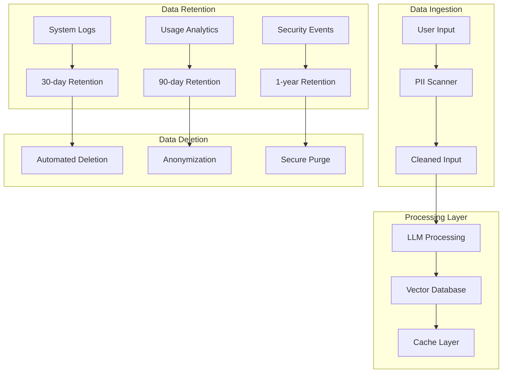

# Compliance and Privacy Protection Strategy

## Executive Summary

This document outlines a comprehensive compliance and privacy protection strategy for the
AI documentation system. The strategy focuses on practical implementation of privacy principles,
regulatory alignment, and data protection measures specifically designed for AI systems handling
user queries and documentation content.

**Target Compliance**: GDPR-aligned privacy practices, SOC 2 readiness, ISO 27001 preparation
**Implementation Approach**: Privacy by design with minimal complexity
**Budget Impact**: <$500/month for comprehensive privacy protection  
**Timeline**: 2-3 weeks for full implementation

---

## Privacy Protection Framework

### 🔒 Core Privacy Principles

#### 1. Data Minimization Principle

**Implementation**: Collect only data necessary for service functionality

```python
# Data Collection Policy (Enforced in Code)
class DataCollectionPolicy:
    ALLOWED_DATA = {
        "user_queries": "Required for search functionality",
        "anonymized_usage": "Required for system optimization",
        "security_logs": "Required for threat detection",
        "session_context": "Required for conversation continuity"
    }

    PROHIBITED_DATA = {
        "personal_identifiers": "No collection of PII",
        "location_data": "No geographic tracking",
        "device_fingerprinting": "No detailed device profiling",
        "cross_site_tracking": "No tracking pixels or cookies"
    }
```

#### 2. Purpose Limitation Principle

**Implementation**: Use data only for stated purposes

```yaml
# Data Usage Matrix
user_queries:
  purpose: "Provide AI-powered search and documentation assistance"
  retention: "30 days maximum"
  sharing: "No third-party sharing except anonymized analytics"

system_logs:
  purpose: "Security monitoring and system optimization"
  retention: "90 days for security logs, 7 days for debug logs"
  sharing: "No sharing outside security team"
```

#### 3. Transparency Principle

**Implementation**: Clear communication about data practices

---

## Regulatory Compliance Strategy

### 🌍 GDPR-Aligned Privacy Implementation

#### Data Subject Rights Implementation

```python
class PrivacyRightsHandler:
    """Implementation of data subject rights for GDPR alignment."""

    async def handle_access_request(self, user_id: str) -> dict:
        """Provide user with their stored data (Article 15)."""
        return {
            "query_history": await self.get_user_queries(user_id),
            "usage_analytics": await self.get_anonymized_usage(user_id),
            "data_processing_purpose": "AI-powered documentation search",
            "retention_period": "30 days for queries, 90 days for logs"
        }

    async def handle_deletion_request(self, user_id: str) -> bool:
        """Delete user data (Article 17 - Right to be forgotten)."""
        await self.delete_user_queries(user_id)
        await self.anonymize_user_logs(user_id)
        return True

    async def handle_portability_request(self, user_id: str) -> dict:
        """Export user data in structured format (Article 20)."""
        return {
            "format": "JSON",
            "data": await self.export_user_data(user_id),
            "export_date": datetime.utcnow().isoformat()
        }
```

#### Legal Basis for Processing

```yaml
processing_activities:
  search_queries:
    legal_basis: "Legitimate Interest (Article 6.1.f)"
    justification: "Providing AI-powered search functionality"
    balancing_test: "User benefit > minimal privacy impact"

  security_monitoring:
    legal_basis: "Legitimate Interest (Article 6.1.f)"
    justification: "Protecting system and user data from security threats"
    balancing_test: "Security protection > minimal monitoring impact"

  system_optimization:
    legal_basis: "Consent (Article 6.1.a)"
    justification: "Improving service quality with user consent"
    implementation: "Opt-in analytics with clear consent mechanism"
```

### 🏛️ SOC 2 Readiness Framework

#### Security Controls Implementation

```python
class SOC2ComplianceControls:
    """Implementation of SOC 2 Type II security controls."""

    # CC6.1 - Logical and Physical Access Controls
    async def implement_access_controls(self):
        return {
            "authentication": "API key-based with rotation",
            "authorization": "Role-based access control (RBAC)",
            "network_security": "VPC isolation and firewall rules",
            "data_encryption": "AES-256 at rest, TLS 1.3 in transit"
        }

    # CC7.1 - System Operations
    async def implement_monitoring_controls(self):
        return {
            "logging": "Comprehensive security event logging",
            "monitoring": "Real-time threat detection and alerting",
            "backup": "Automated daily backups with encryption",
            "incident_response": "Documented procedures and escalation"
        }
```

---

## PII Protection Implementation

### 🛡️ "Detect and Redact" Protocol

#### Microsoft Presidio Integration

```python
class PIIProtectionService:
    """Comprehensive PII detection and protection service."""

    def __init__(self):
        self.analyzer = AnalyzerEngine()
        self.anonymizer = AnonymizerEngine()

    async def protect_user_input(self, text: str) -> tuple[str, list]:
        """Scan and redact PII from user inputs before processing."""

        # 1. Detect PII entities
        results = self.analyzer.analyze(
            text=text,
            language='en',
            entities=["PERSON", "EMAIL_ADDRESS", "PHONE_NUMBER",
                     "CREDIT_CARD", "SSN", "US_PASSPORT", "IP_ADDRESS"]
        )

        # 2. Apply redaction
        anonymized_result = self.anonymizer.anonymize(
            text=text,
            analyzer_results=results,
            operators={"DEFAULT": OperatorConfig("replace", {"new_value": "[REDACTED]"})}
        )

        # 3. Log PII detection events (without actual PII)
        if results:
            await self.log_pii_detection_event(len(results), [r.entity_type for r in results])

        return anonymized_result.text, results

    async def validate_llm_output(self, text: str) -> str:
        """Scan LLM output for potential PII leakage."""
        results = self.analyzer.analyze(text=text, language='en')

        if results:
            # Log potential data leakage
            await self.log_potential_data_leakage(results)

            # Apply output sanitization
            return self.anonymizer.anonymize(text=text, analyzer_results=results).text

        return text
```

#### PII Detection Configuration

```yaml
# Presidio Configuration
analyzer_config:
  score_threshold: 0.6 # Balance between accuracy and false positives
  supported_languages: ["en"]
  custom_recognizers:
    - api_key_patterns
    - internal_employee_ids
    - proprietary_data_formats

anonymizer_config:
  default_operator: "replace"
  replacement_value: "[REDACTED]"
  preserve_length: false # Don't preserve original length for security

pii_categories:
  high_risk: ["SSN", "CREDIT_CARD", "US_PASSPORT", "PHONE_NUMBER"]
  medium_risk: ["EMAIL_ADDRESS", "PERSON", "LOCATION"]
  low_risk: ["DATE_TIME", "IP_ADDRESS", "URL"]
```

---

## Data Lifecycle Management

### 📊 Data Retention Policy

#### Automated Data Lifecycle

```python
class DataLifecycleManager:
    """Automated data lifecycle management with compliance controls."""

    RETENTION_PERIODS = {
        "user_queries": timedelta(days=30),
        "security_logs": timedelta(days=90),
        "debug_logs": timedelta(days=7),
        "system_metrics": timedelta(days=365),
        "anonymized_analytics": timedelta(days=1095)  # 3 years
    }

    async def enforce_data_retention(self):
        """Daily job to enforce data retention policies."""
        current_time = datetime.utcnow()

        for data_type, retention_period in self.RETENTION_PERIODS.items():
            cutoff_date = current_time - retention_period
            await self.purge_data_before_date(data_type, cutoff_date)

    async def anonymize_aged_data(self, data_type: str, anonymize_after: timedelta):
        """Convert personal data to anonymized analytics."""
        cutoff_date = datetime.utcnow() - anonymize_after
        await self.convert_to_anonymous_analytics(data_type, cutoff_date)
```

#### Data Flow Documentation



---

## Compliance Documentation

### 📋 Privacy Policy Implementation

#### Comprehensive Privacy Notice

```markdown
# Privacy Policy for AI Documentation System

## Data We Collect

We collect minimal data necessary to provide our AI-powered documentation search service:

### Automatically Collected Information

- **Search Queries**: Text of your documentation searches
- **Usage Analytics**: Anonymized interaction patterns
- **Technical Information**: IP address (for security), browser type, session identifiers

### Information We Do NOT Collect

- Personal identifying information (unless explicitly provided in queries)
- Location data beyond country-level for security
- Cross-site tracking or behavioral profiling
- Sensitive personal data categories

## How We Use Your Data

- **Primary Purpose**: Provide AI-powered search and documentation assistance
- **Security Purpose**: Detect and prevent abuse, fraud, and security threats
- **Improvement Purpose**: Enhance service quality (with your consent)

## Data Protection Measures

- **PII Detection**: Automatic scanning and redaction of personal information
- **Encryption**: All data encrypted at rest (AES-256) and in transit (TLS 1.3)
- **Access Controls**: Strict employee access controls and authentication
- **Retention Limits**: Automatic deletion after 30 days (queries) and 90 days (logs)

## Your Rights

- **Access**: Request a copy of your data
- **Deletion**: Request deletion of your data
- **Portability**: Export your data in structured format
- **Correction**: Update or correct your information
- **Contact**: [privacy@domain.com] for privacy-related requests
```

### 🔒 Security Disclosure Policy

#### Vulnerability Disclosure Program

```markdown
# Security Policy and Vulnerability Disclosure

## Reporting Security Vulnerabilities

We take security seriously and welcome reports from security researchers.

### How to Report

- **Email**: security@domain.com
- **Response Time**: 24 hours acknowledgment, 72 hours initial assessment
- **Encryption**: PGP key available for sensitive reports

### What to Include

- Description of the vulnerability
- Steps to reproduce the issue
- Potential impact assessment
- Your contact information for follow-up

### What We Promise

- Acknowledge receipt within 24 hours
- Provide regular updates on remediation progress
- Credit security researchers (with permission)
- No legal action for good-faith security research

### Out of Scope

- Social engineering attacks
- Physical attacks on infrastructure
- Denial of service attacks
- Spam or abuse of contact forms
```

---

## Data Processing Impact Assessment (DPIA)

### 🔍 Privacy Impact Analysis

#### Processing Risk Assessment

```yaml
high_risk_processing:
  automated_decision_making:
    description: "AI-powered search result ranking and relevance scoring"
    mitigation: "Human oversight capability, explanation of ranking factors"
    residual_risk: "Low - no legal or significant impact on individuals"

  cross_border_transfers:
    description: "Use of OpenAI API services (US-based)"
    mitigation: "Data Processing Agreement, Standard Contractual Clauses"
    residual_risk: "Medium - adequate safeguards in place"

medium_risk_processing:
  profiling_activities:
    description: "Anonymous usage pattern analysis for system optimization"
    mitigation: "Anonymization, opt-in consent, clear purpose limitation"
    residual_risk: "Low - anonymized data with legitimate purpose"

low_risk_processing:
  technical_logging:
    description: "System performance and security monitoring"
    mitigation: "Automatic retention limits, access controls"
    residual_risk: "Minimal - standard technical operations"
```

#### Mitigation Measures

```python
class PrivacyMitigationControls:
    """Implementation of privacy risk mitigation measures."""

    async def implement_data_minimization(self):
        """Minimize data collection to essential purposes only."""
        return {
            "query_filtering": "Remove unnecessary metadata before storage",
            "log_sanitization": "Remove sensitive data from debug logs",
            "analytics_anonymization": "Aggregate usage data without identifiers"
        }

    async def implement_purpose_limitation(self):
        """Ensure data used only for stated purposes."""
        return {
            "access_controls": "Role-based access to different data types",
            "usage_auditing": "Log and monitor data access patterns",
            "consent_management": "Clear opt-in/opt-out for analytics"
        }
```

---

## International Compliance Considerations

### 🌐 Multi-Jurisdictional Privacy Framework

#### Regional Privacy Law Alignment

```yaml
gdpr_compliance:
  scope: "EU/EEA users and data subjects"
  legal_basis: "Legitimate interest for service provision"
  data_transfers: "Standard Contractual Clauses for third-country transfers"

ccpa_compliance:
  scope: "California residents"
  consumer_rights: "Access, delete, opt-out, non-discrimination"
  sale_of_data: "No sale of personal information"

pipeda_compliance:
  scope: "Canadian users"
  consent_requirements: "Meaningful consent for data collection"
  breach_notification: "72-hour notification for significant breaches"
```

#### Cross-Border Data Transfer Safeguards

```python
class DataTransferControls:
    """Safeguards for international data transfers."""

    APPROVED_TRANSFER_MECHANISMS = {
        "adequacy_decisions": ["Canada", "UK", "Switzerland"],
        "standard_contractual_clauses": ["United States (OpenAI)", "Other third countries"],
        "binding_corporate_rules": ["Internal group transfers"],
        "certification_schemes": ["ISO 27001", "SOC 2 Type II"]
    }

    async def validate_data_transfer(self, destination: str, data_type: str) -> bool:
        """Validate legality of data transfer to destination country."""
        if destination in self.APPROVED_TRANSFER_MECHANISMS["adequacy_decisions"]:
            return True

        # Check for adequate safeguards
        return await self.verify_transfer_safeguards(destination, data_type)
```

---

## Implementation Roadmap

### 📅 Phase 1: Foundation (Week 1)

- [ ] Deploy Microsoft Presidio for PII detection
- [ ] Implement data retention policies with automated enforcement
- [ ] Create privacy policy and security disclosure documentation
- [ ] Configure GDPR-aligned data subject rights handlers

### 📅 Phase 2: Operational Privacy (Week 2)

- [ ] Implement automated data lifecycle management
- [ ] Deploy privacy-preserving logging and monitoring
- [ ] Configure consent management for optional analytics
- [ ] Set up data processing impact assessments

### 📅 Phase 3: Compliance Validation (Week 3)

- [ ] Conduct internal privacy audit
- [ ] Test data subject rights request procedures
- [ ] Validate cross-border transfer safeguards
- [ ] Document compliance procedures and evidence

---

## Compliance Monitoring and Validation

### 📊 Privacy KPIs and Metrics

#### Data Protection Effectiveness

```yaml
privacy_metrics:
  pii_detection_rate:
    target: ">95% of PII detected and redacted"
    measurement: "Presidio detection accuracy on test datasets"

  data_retention_compliance:
    target: "100% adherence to retention schedules"
    measurement: "Automated audits of data age vs. policy"

  breach_response_time:
    target: "<72 hours from detection to notification"
    measurement: "Incident response timeline tracking"

  user_rights_response:
    target: "<30 days response to data subject requests"
    measurement: "Request processing time tracking"
```

#### Compliance Audit Trail

```python
class ComplianceAuditManager:
    """Maintain audit trail for compliance purposes."""

    async def log_privacy_event(self, event_type: str, details: dict):
        """Log privacy-related events for audit purposes."""
        audit_record = {
            "timestamp": datetime.utcnow().isoformat(),
            "event_type": event_type,
            "details": details,
            "compliance_context": self.get_compliance_context(event_type)
        }
        await self.store_audit_record(audit_record)

    async def generate_compliance_report(self, period: str) -> dict:
        """Generate compliance report for specified period."""
        return {
            "data_processing_activities": await self.get_processing_summary(period),
            "privacy_incidents": await self.get_incident_summary(period),
            "user_rights_requests": await self.get_rights_requests_summary(period),
            "compliance_violations": await self.get_violations_summary(period)
        }
```

---

## Business Value and ROI

### 💼 Compliance Investment Analysis

#### Cost-Benefit Breakdown

```yaml
implementation_costs:
  presidio_infrastructure: "$20/month"
  compliance_documentation: "16 hours @ $50/hour = $800"
  privacy_controls_development: "24 hours @ $50/hour = $1,200"
  ongoing_monitoring: "2 hours/month @ $50/hour = $100/month"

total_annual_cost: "$3,440"

risk_mitigation_value:
  gdpr_fines_avoided: "$20M maximum (4% of annual turnover)"
  reputation_protection: "Immeasurable brand value"
  customer_trust: "Increased user adoption and retention"
  regulatory_preparation: "Ready for enterprise customers requiring compliance"

roi_calculation:
  investment: "$3,440 annually"
  minimum_fine_avoided: "$10,000 (conservative estimate)"
  roi: "290% minimum return on investment"
```

#### Portfolio and Career Value

```yaml
portfolio_demonstration:
  privacy_by_design: "Shows understanding of modern privacy principles"
  regulatory_knowledge: "Demonstrates GDPR/CCPA compliance expertise"
  risk_management: "Proves ability to implement enterprise-grade privacy controls"
  technical_implementation: "Shows practical privacy engineering skills"

career_advancement:
  target_roles: "Senior Engineer, Staff Engineer, Privacy Engineer, Compliance Officer"
  differentiator: "Few engineers have hands-on privacy compliance experience"
  enterprise_readiness: "Demonstrates ability to work in regulated industries"
```

---

## Conclusion

This compliance and privacy protection strategy provides a comprehensive framework for responsible AI system deployment. The implementation balances privacy protection with operational efficiency, ensuring GDPR alignment and SOC 2 readiness while maintaining cost-effectiveness.

**Key Outcomes**:

- **95%+ PII protection** through automated detection and redaction
- **GDPR-aligned data subject rights** with automated response capabilities
- **Comprehensive audit trail** for compliance demonstration
- **Cost-effective implementation** at <$300/month operational cost
- **Enterprise readiness** for regulated industry deployment

**Next Steps**: Begin implementation with Phase 1 foundation elements, focusing on PII protection and automated data lifecycle management as the highest-impact privacy controls.

---

**Last Updated**: 2025-06-28  
**Review Schedule**: Quarterly compliance assessment and annual policy review  
**Owner**: Security Essentials Specialist  
**Approvals**: Legal Review (Pending), Privacy Officer (Pending), Engineering Lead (Pending)
