# Security Testing Playbook

## Overview

This comprehensive security testing playbook provides systematic guidance for validating the security posture of the AI Documentation Vector DB Hybrid Scraper system. The playbook covers security testing methodologies, baseline metrics, vulnerability assessment procedures, and remediation workflows.

## Security Testing Framework

### Security Test Categories

```mermaid
graph TB
    A[Security Testing Framework] --> B[Authentication Security]
    A --> C[Authorization & Access Control]
    A --> D[Input Validation & Injection Prevention]
    A --> E[Infrastructure Security]
    A --> F[API Security]
    A --> G[Data Protection]
    
    B --> B1[JWT Security Testing]
    B --> B2[Session Management]
    B --> B3[Multi-Factor Authentication]
    B --> B4[Password Security]
    
    C --> C1[RBAC Testing]
    C --> C2[Privilege Escalation Prevention]
    C --> C3[Context-Based Access Control]
    C --> C4[Resource Permissions]
    
    D --> D1[XSS Prevention]
    D --> D2[SQL Injection Prevention]
    D --> D3[Command Injection Prevention]
    D --> D4[LDAP/NoSQL Injection Prevention]
    
    E --> E1[Rate Limiting]
    E --> E2[TLS/SSL Configuration]
    E --> E3[Network Security]
    E --> E4[Container Security]
    
    F --> F1[API Endpoint Security]
    F --> F2[Request/Response Validation]
    F --> F3[API Authentication]
    F --> F4[CORS Configuration]
    
    G --> G1[Encryption at Rest]
    G --> G2[Encryption in Transit]
    G --> G3[Sensitive Data Handling]
    G --> G4[Key Management]
```



## Security Testing Execution

### 1. Quick Security Validation

#### Essential Security Checks
```bash
# Run critical security tests
uv run pytest tests/security/compliance/test_owasp_top10.py -v

# Validate authentication mechanisms
uv run pytest tests/security/authentication/ -v

# Check authorization controls
uv run pytest tests/security/authorization/ -v

# Test input validation
uv run pytest tests/security/input_validation/ -v
```

#### Security Framework Validation
```bash
# Run comprehensive security framework validation
python tests/security/validate_security_framework.py

# Run security test structure validation
python tests/security/validate_security_tests.py

# Test Redis rate limiting with real containers
uv run pytest tests/security/test_redis_rate_limiting.py -v
```

### 2. Comprehensive Security Audit

#### Full Security Test Suite
```bash
# Run all security tests (WARNING: Takes 30+ seconds)
uv run pytest tests/security/ -v --tb=short

# Run with security markers only
uv run pytest -m security --tb=short

# Run penetration tests
uv run pytest tests/security/penetration/ -v
```

#### OWASP Top 10 Compliance Testing
```bash
# Test A01: Broken Access Control
uv run pytest tests/security/compliance/test_owasp_top10.py::TestOWASPTop10::test_a01_broken_access_control -v

# Test A02: Cryptographic Failures
uv run pytest tests/security/compliance/test_owasp_top10.py::TestOWASPTop10::test_a02_cryptographic_failures -v

# Test A03: Injection Vulnerabilities
uv run pytest tests/security/compliance/test_owasp_top10.py::TestOWASPTop10::test_a03_injection -v

# Test A08: Software and Data Integrity Failures
uv run pytest tests/security/compliance/test_owasp_top10.py::TestOWASPTop10::test_a08_software_data_integrity_failures -v
```

### 3. Real-World Security Testing

#### Containerized Security Testing
```bash
# Test with real Redis containers
uv run pytest tests/security/test_redis_rate_limiting.py::TestRealRedisRateLimiting -v

# Test with real network conditions
uv run pytest tests/security/test_redis_rate_limiting.py::TestRealRedisRateLimiting::test_real_redis_failure_simulation -v
```

#### API Penetration Testing
```bash
# Run API security penetration tests
uv run pytest tests/security/penetration/test_api_security.py::TestAPIPenetrationTesting -v

# Test command injection scenarios
uv run pytest tests/security/penetration/test_api_security.py::TestSubprocessSecurity -v

# Test enhanced input validation
uv run pytest tests/security/penetration/test_api_security.py::TestInputValidationEnhanced -v
```

## Security Baselines & Metrics

### Critical Security Metrics

| Security Domain | Baseline | Target | Critical Threshold |
|-----------------|----------|--------|-------------------|
| **Authentication Pass Rate** | >95% | >99% | <90% |
| **Authorization Test Coverage** | >90% | >95% | <85% |
| **Injection Prevention Rate** | >98% | >99.5% | <95% |
| **Rate Limiting Effectiveness** | >95% | >99% | <90% |
| **Security Test Success Rate** | >85% | >95% | <80% |

### Security Test Baseline Results

```python
# Expected baseline test results
SECURITY_TEST_BASELINES = {
    "authentication": {
        "jwt_security_tests": {"pass_rate": 0.95, "critical_failures": 0},
        "session_management": {"pass_rate": 0.92, "critical_failures": 0},
        "token_validation": {"pass_rate": 0.98, "critical_failures": 0}
    },
    "authorization": {
        "rbac_tests": {"pass_rate": 0.96, "critical_failures": 0},
        "privilege_escalation": {"pass_rate": 1.0, "critical_failures": 0},
        "access_control": {"pass_rate": 0.94, "critical_failures": 0}
    },
    "input_validation": {
        "xss_prevention": {"pass_rate": 0.90, "critical_failures": 2},
        "command_injection": {"pass_rate": 0.85, "critical_failures": 3},
        "sql_injection": {"pass_rate": 0.92, "critical_failures": 1}
    },
    "infrastructure": {
        "rate_limiting": {"pass_rate": 0.98, "critical_failures": 0},
        "tls_configuration": {"pass_rate": 0.95, "critical_failures": 0},
        "container_security": {"pass_rate": 0.88, "critical_failures": 1}
    }
}
```

### Security Grading System

```python
def calculate_security_grade(metrics):
    """Calculate overall security grade based on test results."""
    if metrics["pass_rate"] >= 0.95 and metrics["critical_failures"] == 0:
        return "A"  # Excellent security posture
    elif metrics["pass_rate"] >= 0.90 and metrics["critical_failures"] <= 1:
        return "B"  # Good security posture
    elif metrics["pass_rate"] >= 0.85 and metrics["critical_failures"] <= 2:
        return "C"  # Acceptable security posture
    elif metrics["pass_rate"] >= 0.80 and metrics["critical_failures"] <= 3:
        return "D"  # Poor security posture - requires attention
    else:
        return "F"  # Critical security issues - immediate action required
```

## Current Security Assessment

### Security Framework Analysis

Based on comprehensive security validation, the current security status is:

#### ✅ **Security Strengths**
- **Comprehensive Security Middleware**: `SecurityMiddleware` with robust input validation, XSS prevention, and command injection protection
- **Advanced Rate Limiting**: Redis-backed distributed rate limiting with proper fallback to in-memory storage
- **Extensive Testing Infrastructure**: 98 security tests across 7 categories with real container-based validation
- **Sophisticated RBAC System**: Role hierarchy testing from guest to admin with context-based access control
- **Real Security Validation**: TestContainers integration for realistic Redis testing scenarios
- **Command Injection Prevention**: Validated protection against shell injection attacks

#### ❌ **Critical Security Vulnerabilities**

**CRITICAL FINDING: Security Middleware Not Integrated**
```
Issue: SecurityMiddleware exists but is NOT integrated with FastAPI endpoints
Impact: ALL security protections are bypassed
Risk Level: CRITICAL
Status: Immediate remediation required
```

**HIGH PRIORITY: Missing Production Authentication**
```
Issue: JWT authentication infrastructure exists in tests but not in production
Impact: No authentication enforcement on API endpoints  
Risk Level: HIGH
Status: Implementation required
```

### Security Test Results Summary

```
Security Test Execution Summary
=================================
Total Security Tests: 98
Categories Covered: 7
Test Framework Status: COMPREHENSIVE
Container Integration: ENABLED (Redis TestContainers)

Test Results by Category:
- Authentication Tests: 15/15 PASS (100%)
- Authorization Tests: 18/18 PASS (100%) 
- Input Validation: 12/15 PASS (80%) - 3 EXPECTED FAILURES
- Penetration Tests: 8/17 PASS (47%) - 9 EXPECTED FAILURES  
- Compliance Tests: 9/10 PASS (90%) - 1 EXPECTED FAILURE
- Infrastructure Tests: 12/12 PASS (100%)
- Integration Tests: 11/11 PASS (100%)

Overall Security Grade: D (POOR)
Primary Issue: Security controls exist but are not integrated
```

## Security Remediation Roadmap

### Phase 1: Critical Security Integration (Immediate - Week 1)

#### 1.1 Integrate SecurityMiddleware with FastAPI
```python
# Required: Add SecurityMiddleware to FastAPI application
from src.services.fastapi.middleware.security import SecurityMiddleware

app = FastAPI()

# CRITICAL: Add this middleware integration
app.add_middleware(
    SecurityMiddleware,
    config=security_config,
    redis_url=redis_url
)
```

#### 1.2 Enable Production Authentication
```python
# Required: Implement JWT authentication middleware
from src.services.authentication import JWTAuthenticationMiddleware

app.add_middleware(JWTAuthenticationMiddleware)
```

### Phase 2: Security Monitoring (Week 2)

#### 2.1 Enable Security Logging
```python
# Implement comprehensive security event logging
SECURITY_EVENTS = [
    "authentication_failure",
    "authorization_denied", 
    "rate_limit_exceeded",
    "injection_attempt_blocked",
    "suspicious_request_pattern"
]
```

#### 2.2 Security Alerting System
```python
# Configure security alerts for critical events
SECURITY_ALERTS = {
    "critical": {
        "authentication_bypass_attempt": "immediate",
        "privilege_escalation_detected": "immediate",
        "injection_attack_detected": "immediate"
    },
    "warning": {
        "rate_limit_exceeded": "5_minute_window",
        "suspicious_user_agent": "hourly",
        "invalid_token_frequency": "15_minute_window"
    }
}
```

### Phase 3: Enhanced Security (Week 3-4)

#### 3.1 Advanced Security Features
- Enable CORS configuration
- Implement API key authentication for service-to-service calls
- Add request/response encryption for sensitive endpoints
- Configure security headers middleware

#### 3.2 Security Monitoring Dashboard
- Real-time security metrics visualization
- Attack pattern detection and analysis
- Security baseline trend monitoring
- Automated vulnerability scanning integration

## Security Testing Automation

### Continuous Security Integration

#### GitHub Actions Security Workflow
```yaml
name: Security Tests
on:
  pull_request:
    branches: [main]
  schedule:
    - cron: '0 6 * * *'  # Daily security scan

jobs:
  security:
    runs-on: ubuntu-latest
    steps:
      - uses: actions/checkout@v4
      - name: Setup Python
        uses: actions/setup-python@v4
        with:
          python-version: '3.11'
      
      - name: Install dependencies
        run: |
          pip install uv
          uv sync
      
      - name: Run security tests
        run: |
          uv run pytest tests/security/ -v --tb=short
      
      - name: Validate security framework
        run: |
          python tests/security/validate_security_framework.py
      
      - name: Check OWASP compliance
        run: |
          uv run pytest tests/security/compliance/test_owasp_top10.py -v
```

### Security Regression Prevention

#### Pre-commit Security Hooks
```yaml
# .pre-commit-config.yaml
repos:
  - repo: local
    hooks:
      - id: security-tests
        name: Security Tests
        entry: uv run pytest tests/security/compliance/ -x
        language: system
        pass_filenames: false
        
      - id: security-framework-validation
        name: Security Framework Validation
        entry: python tests/security/validate_security_framework.py
        language: system
        pass_filenames: false
```

## Security Troubleshooting

### Common Security Issues

#### 1. SecurityMiddleware Not Working
**Symptoms**: Security tests pass but API endpoints are unprotected
**Root Cause**: SecurityMiddleware not added to FastAPI application
**Solution**: Add middleware integration to FastAPI app initialization

#### 2. Rate Limiting Not Enforced
**Symptoms**: Requests not being rate limited despite configuration
**Root Cause**: Redis connection failure or middleware not integrated
**Solution**: Check Redis connectivity and middleware registration

#### 3. Authentication Tests Pass but No Auth Required
**Symptoms**: JWT tests pass but API accessible without tokens
**Root Cause**: Authentication middleware not integrated with endpoints
**Solution**: Add authentication dependency to protected endpoints

### Security Debugging Commands

```bash
# Test SecurityMiddleware initialization
python -c "
from src.services.fastapi.middleware.security import SecurityMiddleware
from src.config.security import SecurityConfig
config = SecurityConfig(enabled=True)
print('SecurityMiddleware can be imported and initialized')
"

# Test Redis rate limiting connectivity
python -c "
import asyncio
from tests.security.test_redis_rate_limiting import RealRedisFixture
async def test():
    fixture = RealRedisFixture()
    client, url = await fixture.start_redis_container()
    print(f'Redis test container: {url}')
    await fixture.stop_redis_container()
asyncio.run(test())
"

# Validate security test structure
python tests/security/validate_security_tests.py
```

## Security Best Practices

### Development Security Guidelines

1. **Input Validation**: Always validate and sanitize user inputs at API boundaries
2. **Authentication**: Require authentication for all non-public endpoints
3. **Authorization**: Implement role-based access control with least privilege principle
4. **Rate Limiting**: Apply rate limiting to prevent abuse and DoS attacks
5. **Security Headers**: Include security headers in all API responses
6. **Logging**: Log all security events for monitoring and incident response

### Security Review Checklist

#### Pre-Release Security Checklist
- [ ] SecurityMiddleware integrated with FastAPI application
- [ ] Authentication middleware configured for protected endpoints
- [ ] Rate limiting enabled and tested with Redis backend
- [ ] Input validation implemented for all user inputs
- [ ] Security tests pass with >95% success rate
- [ ] OWASP Top 10 compliance verified
- [ ] Security monitoring and alerting configured
- [ ] Penetration testing completed with acceptable results

#### Security Monitoring Checklist
- [ ] Security event logging enabled
- [ ] Real-time security metrics collection
- [ ] Automated security alerting configured
- [ ] Regular security baseline validation
- [ ] Incident response procedures documented

## Conclusion

This security testing playbook provides comprehensive guidance for validating and maintaining the security posture of the AI Documentation Vector DB Hybrid Scraper system. The current assessment reveals excellent security infrastructure that requires critical integration work to become effective.

**Immediate Action Required**: The #1 priority is integrating the existing SecurityMiddleware with the FastAPI application to activate the comprehensive security protections that are already implemented and tested.

Regular execution of this playbook ensures ongoing security validation and helps maintain a strong security posture as the system evolves.

---

**Last Updated**: 2024-12-30  
**Next Review**: 2025-01-30  
**Document Version**: 1.0  
**Security Assessment Grade**: D (POOR) - Requires immediate remediation