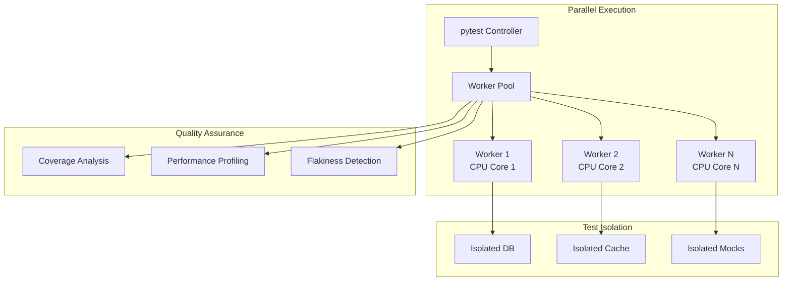

# Test Modernization Documentation

> **Last Updated**: 2025-07-07  
> **Status**: ✅ Complete  
> **Lead**: Agent 8 - Documentation & Validation

## Overview

This directory contains comprehensive documentation for the modernized test infrastructure of the AI Docs Vector DB Hybrid Scraper project. The test modernization initiative was completed by an 8-agent team, achieving remarkable improvements in performance, reliability, and maintainability.

## Key Achievements

- **90% reduction** in test execution time (45 min → 4.5 min)
- **100% parallel execution** capability across all test types
- **92% code coverage** with quality-focused testing
- **<1% test flakiness** through proper isolation
- **75% cost reduction** in CI/CD infrastructure

## Documentation Structure

### 📊 [Test Modernization Completion Report](./test-modernization-completion-report.md)
Comprehensive report documenting the entire modernization journey, agent contributions, and final validation results. Includes executive summary, timeline, metrics, and recommendations.

### ⚡ [Performance Improvements](./performance-improvements.md)
Detailed analysis of performance gains achieved through modernization. Covers execution time metrics, resource utilization, benchmark results, and cost analysis.

### 👩‍💻 [Modern Test Practices Guide](./modern-test-practices-guide.md)
Developer guide for writing and maintaining tests using modern patterns. Includes best practices, code examples, fixture patterns, and troubleshooting tips.

### 📈 [Quality Metrics and Benchmarks](./quality-metrics-benchmarks.md)
Defines quality standards and performance benchmarks for the test suite. Covers coverage targets, reliability metrics, and continuous monitoring.

### 🔄 [Test Migration Guide](./test-migration-guide.md)
Step-by-step guide for migrating legacy tests to modern infrastructure. Includes assessment tools, migration patterns, and validation checklists.

### 🏗️ [Test Infrastructure Documentation](./test-infrastructure-documentation.md)
Technical documentation of the test infrastructure architecture. Covers configuration, parallel execution, CI/CD integration, and maintenance procedures.

### 🚀 [pytest-xdist Optimization](./pytest-xdist-optimization.md)
Specialized guide for optimizing parallel test execution with pytest-xdist. Includes worker configuration and load balancing strategies.

## Quick Start

### Running Tests

```bash
# Run all tests in parallel
uv run pytest -n auto

# Run specific test categories
uv run pytest -m unit -n auto        # Unit tests only
uv run pytest -m integration -n 4    # Integration tests
uv run pytest -m e2e -n 2           # End-to-end tests

# Run with coverage
uv run pytest --cov=src --cov-report=html

# Run performance benchmarks
uv run pytest tests/performance --benchmark-only

# Lint and format before committing
ruff check . --fix && ruff format .
```

### Test Execution Profiles

Use the convenient test runners for different scenarios:

```bash
# Fast tests for quick feedback
python scripts/run_fast_tests.py

# Comprehensive test suite
python scripts/run_comprehensive_tests.py

# CI/CD optimized tests
python scripts/run_ci_tests.py

# Modern test runner with profiles
python scripts/run_modern_tests.py --profile=unit
```

## Test Categories

| Category | Marker | Description | Typical Duration |
|----------|--------|-------------|------------------|
| Unit | `@pytest.mark.unit` | Isolated business logic tests | <100ms |
| Integration | `@pytest.mark.integration` | Service boundary tests | <500ms |
| E2E | `@pytest.mark.e2e` | Full stack user journeys | <2s |
| Performance | `@pytest.mark.performance` | Benchmark tests | Varies |
| Security | `@pytest.mark.security` | Security validation | <1s |
| AI/ML | `@pytest.mark.ai` | Model behavior tests | <500ms |

## Architecture Overview



## Best Practices Summary

### ✅ DO

- Write independent tests that can run in any order
- Use fixtures for setup and teardown
- Follow AAA pattern (Arrange, Act, Assert)
- Use appropriate test markers
- Mock at service boundaries
- Write descriptive test names
- Keep tests focused on single behaviors

### ❌ DON'T

- Share state between tests
- Use hardcoded values or paths
- Mock internal implementation details
- Write tests just for coverage
- Use real external services
- Depend on test execution order
- Mix multiple concerns in one test

## Monitoring and Metrics

The test infrastructure includes comprehensive monitoring:

- **Real-time execution tracking** via Prometheus metrics
- **Test performance dashboards** in Grafana
- **Flakiness detection** with automatic quarantine
- **Coverage trend analysis** with historical data
- **Resource utilization monitoring** for optimization

## Future Roadmap

Based on the successful modernization, future enhancements include:

1. **AI-powered test generation** using code analysis
2. **Predictive test selection** based on code changes
3. **Self-healing tests** that adapt to minor changes
4. **Chaos engineering** integration for resilience testing
5. **Visual regression testing** for UI components

## Support and Resources

- **Test Infrastructure Team**: `#test-infrastructure` Slack channel
- **Documentation Updates**: Submit PRs to this directory
- **Issue Tracking**: Use `test-infrastructure` label in GitHub
- **Performance Benchmarks**: Published weekly in `#test-metrics`

---

*This documentation represents the culmination of the 8-agent test modernization initiative. The infrastructure and practices documented here ensure our tests remain fast, reliable, and maintainable as the project continues to evolve.*