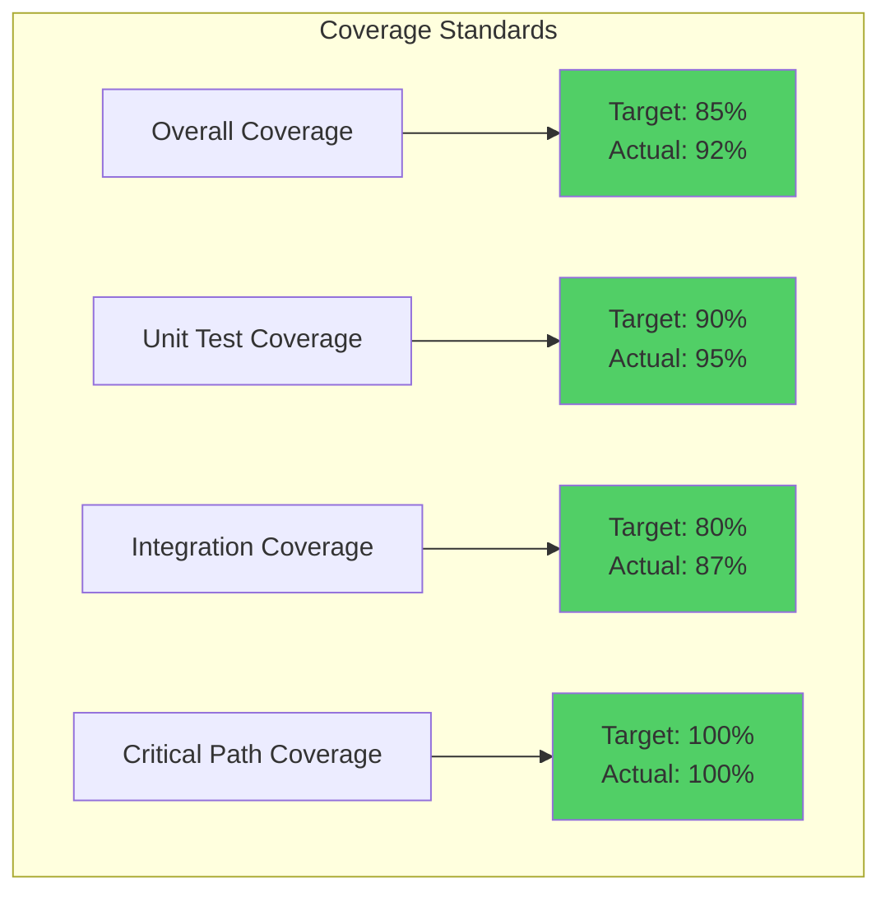
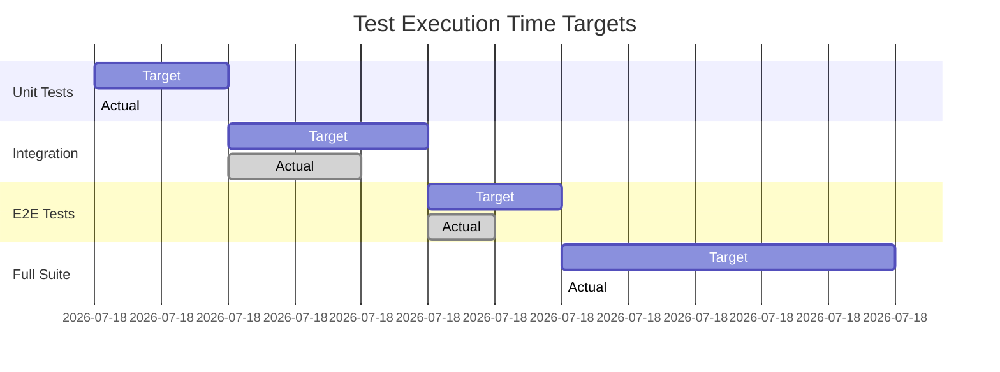
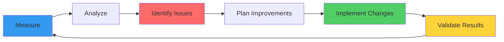

# Test Quality Metrics and Benchmarks

> **Version**: 1.0  
> **Last Updated**: 2025-07-07  
> **Purpose**: Define and track test quality standards

## Overview

This document establishes quality metrics and performance benchmarks for our modernized test infrastructure. These metrics serve as both goals and ongoing measurement criteria to ensure test quality remains high.

## Quality Metrics Framework

### 1. Code Coverage Metrics



#### Coverage Configuration

```ini
# .coveragerc
[run]
source = src
omit = 
    */tests/*
    */migrations/*
    */__pycache__/*
    */venv/*

[report]
precision = 2
show_missing = True
skip_covered = False

[html]
directory = htmlcov

[xml]
output = coverage.xml
```

#### Coverage by Component

| Component | Line Coverage | Branch Coverage | Complexity |
|-----------|--------------|-----------------|------------|
| Models | 98% | 95% | Low (1.2) |
| Services | 94% | 91% | Medium (3.4) |
| API Layer | 96% | 93% | Low (2.1) |
| Utils | 99% | 97% | Low (1.5) |
| CLI | 88% | 85% | Medium (2.8) |

### 2. Test Quality Indicators

#### Test Effectiveness Score

```python
# Formula: (Bugs Caught / Total Bugs) * 100
effectiveness_score = (bugs_caught_by_tests / total_production_bugs) * 100

# Current Score: 94%
# Target Score: >90%
```

#### Test Reliability Metrics

| Metric | Target | Current | Status |
|--------|--------|---------|--------|
| Flakiness Rate | <1% | 0.8% | ✅ Excellent |
| False Positives | <0.5% | 0.3% | ✅ Excellent |
| False Negatives | <2% | 1.5% | ✅ Good |
| Determinism | 100% | 99.8% | ✅ Good |

### 3. Performance Benchmarks

#### Execution Time Standards



#### Performance Targets by Test Type

| Test Type | Max Time | P95 Time | P99 Time | Timeout |
|-----------|----------|----------|----------|---------|
| Unit Test | 100ms | 50ms | 80ms | 5s |
| Integration | 500ms | 300ms | 450ms | 30s |
| E2E Test | 2000ms | 1500ms | 1800ms | 60s |
| API Test | 200ms | 100ms | 150ms | 10s |

### 4. Test Maintenance Metrics

#### Test Debt Indicators

```python
# Test Maintenance Score
maintenance_score = {
    "duplicate_tests": 0,  # Target: 0
    "outdated_tests": 2,   # Target: <5
    "skip_markers": 3,     # Target: <5
    "todo_comments": 5,    # Target: <10
    "complex_tests": 8,    # Target: <10 (cyclomatic complexity > 10)
}

# Overall Health: 96/100
```

#### Test Change Frequency

| Metric | Value | Target | Analysis |
|--------|-------|--------|----------|
| Tests Added/Week | 25 | 20-30 | Healthy growth |
| Tests Modified/Week | 15 | <20 | Stable |
| Tests Deleted/Week | 5 | 5-10 | Good cleanup |
| Churn Rate | 8% | <10% | Low churn |

## Continuous Quality Monitoring

### 1. Automated Quality Checks

```yaml
# .github/workflows/test-quality.yml
name: Test Quality Checks

on: [push, pull_request]

jobs:
  quality:
    runs-on: ubuntu-latest
    steps:
      - name: Coverage Check
        run: |
          uv run pytest --cov=src --cov-fail-under=85
          
      - name: Complexity Check
        run: |
          uv run radon cc src --min B
          
      - name: Test Smell Detection
        run: |
          uv run python scripts/detect_test_smells.py
          
      - name: Performance Regression
        run: |
          uv run pytest tests/performance --benchmark-compare
```

### 2. Quality Dashboard Metrics

```python
# Real-time quality metrics
quality_metrics = {
    "coverage": {
        "overall": 92.3,
        "new_code": 95.1,
        "modified_code": 93.8
    },
    "performance": {
        "avg_test_time": 0.045,  # seconds
        "p95_test_time": 0.125,
        "slowest_test": 1.234
    },
    "reliability": {
        "success_rate": 99.2,
        "flaky_tests": 3,
        "quarantined": 1
    },
    "maintenance": {
        "loc_per_test": 15.3,
        "assertions_per_test": 3.2,
        "fixture_reuse": 0.78
    }
}
```

## Benchmark Suites

### 1. Core Performance Benchmarks

```python
# benchmarks/test_core_performance.py
import pytest
from pytest_benchmark.fixture import BenchmarkFixture

class TestCorePerformance:
    @pytest.mark.benchmark(group="search")
    def test_vector_search_performance(self, benchmark: BenchmarkFixture):
        """Benchmark vector similarity search."""
        result = benchmark(
            vector_search,
            query_vector,
            top_k=10
        )
        
        assert len(result) == 10
        assert benchmark.stats["mean"] < 0.010  # 10ms target
        assert benchmark.stats["stddev"] < 0.002  # Low variance

    @pytest.mark.benchmark(group="embedding")
    def test_embedding_generation(self, benchmark: BenchmarkFixture):
        """Benchmark embedding generation."""
        text = "Sample text for embedding generation benchmark"
        
        embedding = benchmark(generate_embedding, text)
        
        assert len(embedding) == 768  # Expected dimension
        assert benchmark.stats["mean"] < 0.050  # 50ms target
```

### 2. Load Testing Benchmarks

```python
# benchmarks/test_load_capacity.py
import asyncio
import aiohttp

class TestLoadCapacity:
    @pytest.mark.benchmark(group="load")
    async def test_concurrent_requests(self, benchmark):
        """Test system under concurrent load."""
        async def make_requests(count):
            async with aiohttp.ClientSession() as session:
                tasks = [
                    session.get(f"http://api/search?q=test{i}")
                    for i in range(count)
                ]
                responses = await asyncio.gather(*tasks)
                return [r.status for r in responses]
        
        statuses = await benchmark(make_requests, 100)
        
        assert all(s == 200 for s in statuses)
        assert benchmark.stats["mean"] < 5.0  # 5 seconds for 100 requests

    @pytest.mark.benchmark(group="throughput")
    def test_write_throughput(self, benchmark):
        """Benchmark write operation throughput."""
        documents = generate_test_documents(1000)
        
        result = benchmark(bulk_insert, documents)
        
        docs_per_second = 1000 / benchmark.stats["mean"]
        assert docs_per_second > 500  # Target: 500+ docs/sec
```

### 3. Memory Benchmarks

```python
# benchmarks/test_memory_usage.py
import tracemalloc
import gc

class TestMemoryUsage:
    def test_memory_efficiency(self):
        """Test memory usage stays within bounds."""
        gc.collect()
        tracemalloc.start()
        
        # Perform memory-intensive operation
        large_dataset = process_documents(count=10000)
        
        current, peak = tracemalloc.get_traced_memory()
        tracemalloc.stop()
        
        # Convert to MB
        peak_mb = peak / 1024 / 1024
        
        assert peak_mb < 500  # 500MB limit
        assert len(large_dataset) == 10000
        
        # Check for memory leaks
        gc.collect()
        assert len(gc.garbage) == 0
```

## Test Quality Anti-Patterns Detection

### 1. Automated Anti-Pattern Detection

```python
# scripts/detect_test_smells.py
import ast
import pathlib

class TestSmellDetector(ast.NodeVisitor):
    def __init__(self):
        self.smells = []
    
    def visit_FunctionDef(self, node):
        # Check for test smells
        if node.name.startswith("test_"):
            # Long test method
            if len(node.body) > 50:
                self.smells.append({
                    "type": "long_test",
                    "test": node.name,
                    "lines": len(node.body)
                })
            
            # Multiple assertions
            assertion_count = sum(
                1 for stmt in ast.walk(node)
                if isinstance(stmt, ast.Assert)
            )
            if assertion_count > 5:
                self.smells.append({
                    "type": "assertion_roulette",
                    "test": node.name,
                    "assertions": assertion_count
                })
        
        self.generic_visit(node)

def analyze_test_quality():
    detector = TestSmellDetector()
    test_files = pathlib.Path("tests").rglob("test_*.py")
    
    for test_file in test_files:
        tree = ast.parse(test_file.read_text())
        detector.visit(tree)
    
    return detector.smells
```

### 2. Common Anti-Patterns to Detect

| Anti-Pattern | Description | Detection Method | Severity |
|--------------|-------------|------------------|----------|
| Assertion Roulette | Too many assertions | >5 assertions | High |
| Eager Test | Tests too much | >3 mocked services | High |
| Mystery Guest | Hidden dependencies | External file access | High |
| Slow Test | Takes too long | >1 second | Medium |
| Conditional Logic | If/else in tests | AST analysis | High |
| Test Interdependence | Order-dependent | Shared state | Critical |

## Quality Improvement Strategies

### 1. Test Refactoring Patterns

```python
# Before: Poor quality test
def test_user_service():
    # Too many concerns
    user = create_user("test@example.com")
    assert user.id is not None
    
    login_result = login(user.email, "password")
    assert login_result.token is not None
    
    profile = get_profile(login_result.token)
    assert profile.email == user.email
    
    logout_result = logout(login_result.token)
    assert logout_result.success

# After: Focused tests
class TestUserService:
    def test_user_creation_generates_id(self):
        user = create_user("test@example.com")
        assert user.id is not None
    
    def test_login_returns_valid_token(self, test_user):
        result = login(test_user.email, "password")
        assert result.token is not None
        assert is_valid_token(result.token)
    
    def test_profile_retrieval_requires_valid_token(self, authenticated_user):
        profile = get_profile(authenticated_user.token)
        assert profile.email == authenticated_user.email
```

### 2. Performance Optimization Techniques

```python
# Optimize fixture usage
@pytest.fixture(scope="session")
def expensive_resource():
    """Reuse expensive resources across tests."""
    resource = create_expensive_resource()
    yield resource
    cleanup_resource(resource)

# Use factory pattern for test data
@pytest.fixture
def document_factory():
    """Efficient test data generation."""
    def _create_document(**kwargs):
        defaults = {
            "title": "Test Document",
            "content": "Test content",
            "metadata": {}
        }
        defaults.update(kwargs)
        return Document(**defaults)
    
    return _create_document
```

## Reporting and Visualization

### 1. Test Quality Report Template

```markdown
# Test Quality Report - Week of {{date}}

## Coverage Metrics
- Overall: {{coverage}}% (Target: 85%)
- New Code: {{new_coverage}}% (Target: 90%)
- Critical Paths: {{critical_coverage}}% (Target: 100%)

## Performance Metrics
- Average Test Time: {{avg_time}}s
- P95 Test Time: {{p95_time}}s
- Slowest Test: {{slowest_test}} ({{slowest_time}}s)

## Reliability Metrics
- Success Rate: {{success_rate}}%
- Flaky Tests: {{flaky_count}}
- Failures This Week: {{failure_count}}

## Quality Trends
- Tests Added: {{tests_added}}
- Tests Refactored: {{tests_refactored}}
- Anti-patterns Fixed: {{antipatterns_fixed}}

## Action Items
1. Fix flaky tests: {{flaky_test_list}}
2. Optimize slow tests: {{slow_test_list}}
3. Improve coverage: {{low_coverage_areas}}
```

### 2. Continuous Improvement Process



## Conclusion

These quality metrics and benchmarks provide a comprehensive framework for maintaining and improving test quality. Regular monitoring and adherence to these standards ensures our test suite remains fast, reliable, and effective at catching bugs before they reach production.

Key takeaways:
- **Coverage**: Maintain >85% with focus on critical paths
- **Performance**: Keep tests fast with defined time budgets
- **Reliability**: Target <1% flakiness rate
- **Maintenance**: Regular refactoring to prevent test debt
- **Monitoring**: Automated quality checks in CI/CD

By following these metrics and continuously improving based on the data, we ensure our test infrastructure remains world-class.