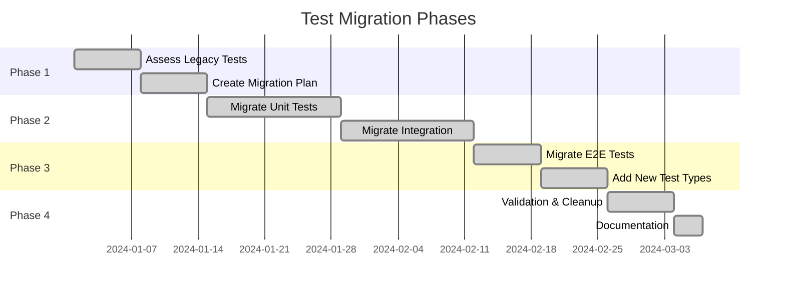

# Test Migration Guide

> **Version**: 1.0  
> **Last Updated**: 2025-07-07  
> **Purpose**: Guide for migrating legacy tests and writing new tests

## Introduction

This guide provides step-by-step instructions for migrating existing tests to our modern test infrastructure and writing new tests that follow current best practices.

## Table of Contents

1. [Migration Overview](#migration-overview)
2. [Legacy Test Assessment](#legacy-test-assessment)
3. [Migration Process](#migration-process)
4. [Writing New Tests](#writing-new-tests)
5. [Common Migration Patterns](#common-migration-patterns)
6. [Tools and Scripts](#tools-and-scripts)
7. [Validation Checklist](#validation-checklist)

## Migration Overview

### Migration Goals

- **Parallel Execution**: All tests must support parallel execution
- **Modern Patterns**: Use async/await, fixtures, and proper mocking
- **Performance**: Tests should complete within defined time budgets
- **Isolation**: Complete test independence with no shared state
- **Clarity**: Clear test names and AAA pattern

### Migration Timeline



## Legacy Test Assessment

### 1. Identify Legacy Patterns

```python
# Legacy patterns to identify
legacy_patterns = {
    "class_based": "unittest.TestCase inheritance",
    "setup_teardown": "setUp/tearDown methods",
    "sync_only": "No async support",
    "global_state": "Shared mutable state",
    "time_dependent": "sleep() or time-based logic",
    "file_dependent": "Hard-coded file paths",
    "order_dependent": "Tests that must run in sequence"
}
```

### 2. Assessment Script

```python
# scripts/assess_legacy_tests.py
import ast
import pathlib
from typing import List, Dict

class LegacyTestAnalyzer(ast.NodeVisitor):
    def __init__(self):
        self.legacy_patterns = []
        self.test_count = 0
    
    def visit_ClassDef(self, node):
        # Check for unittest.TestCase
        if any(base.id == "TestCase" for base in node.bases 
               if hasattr(base, "id")):
            self.legacy_patterns.append({
                "file": self.current_file,
                "class": node.name,
                "pattern": "unittest_testcase",
                "line": node.lineno
            })
        
        self.generic_visit(node)
    
    def visit_FunctionDef(self, node):
        if node.name.startswith("test_"):
            self.test_count += 1
            
            # Check for sync tests that should be async
            if self._uses_io(node) and not node.decorator_list:
                self.legacy_patterns.append({
                    "file": self.current_file,
                    "function": node.name,
                    "pattern": "sync_io_operation",
                    "line": node.lineno
                })
        
        self.generic_visit(node)
    
    def _uses_io(self, node):
        # Detect I/O operations
        io_indicators = ["open", "requests", "urllib", "db", "cache"]
        for child in ast.walk(node):
            if isinstance(child, ast.Name) and child.id in io_indicators:
                return True
        return False

def analyze_test_directory(test_dir: str) -> Dict:
    analyzer = LegacyTestAnalyzer()
    test_files = pathlib.Path(test_dir).rglob("test_*.py")
    
    for test_file in test_files:
        analyzer.current_file = str(test_file)
        tree = ast.parse(test_file.read_text())
        analyzer.visit(tree)
    
    return {
        "total_tests": analyzer.test_count,
        "legacy_patterns": analyzer.legacy_patterns,
        "migration_needed": len(analyzer.legacy_patterns)
    }
```

### 3. Assessment Report Template

```markdown
# Legacy Test Assessment Report

## Summary
- Total Test Files: {{total_files}}
- Total Test Functions: {{total_tests}}
- Tests Requiring Migration: {{migration_count}}
- Estimated Migration Effort: {{effort_days}} days

## Legacy Pattern Distribution
| Pattern | Count | Priority |
|---------|-------|----------|
| unittest.TestCase | {{unittest_count}} | High |
| Sync I/O Operations | {{sync_io_count}} | High |
| Global State | {{global_state_count}} | Critical |
| Time Dependencies | {{time_deps_count}} | Medium |
| File Dependencies | {{file_deps_count}} | Low |

## High Priority Migrations
1. Tests with global state (blocking parallel execution)
2. Tests with order dependencies
3. Tests using unittest.TestCase
4. Tests with sync I/O operations
```

## Migration Process

### Step 1: Prepare Migration Environment

```bash
# Create migration branch
git checkout -b test-migration/module-name

# Set up migration tools
uv pip install pytest-migrate pytest-asyncio respx hypothesis

# Run initial test assessment
uv run python scripts/assess_legacy_tests.py tests/
```

### Step 2: Migrate Test Structure

#### From unittest to pytest

```python
# BEFORE: unittest style
import unittest

class TestUserService(unittest.TestCase):
    def setUp(self):
        self.db = create_test_db()
        self.user_service = UserService(self.db)
    
    def tearDown(self):
        cleanup_db(self.db)
    
    def test_create_user(self):
        user = self.user_service.create_user("test@example.com")
        self.assertIsNotNone(user.id)
        self.assertEqual(user.email, "test@example.com")

# AFTER: pytest style
import pytest

@pytest.fixture
async def db_fixture():
    async with create_test_db() as db:
        yield db

@pytest.fixture
async def user_service(db_fixture):
    return UserService(db_fixture)

async def test_create_user(user_service):
    user = await user_service.create_user("test@example.com")
    assert user.id is not None
    assert user.email == "test@example.com"
```

### Step 3: Add Async Support

```python
# BEFORE: Synchronous test
def test_fetch_data():
    response = requests.get("https://api.example.com/data")
    data = response.json()
    assert data["status"] == "success"

# AFTER: Asynchronous test with mocking
import pytest
import respx

@pytest.mark.asyncio
@respx.mock
async def test_fetch_data():
    # Mock the external API
    respx.get("https://api.example.com/data").mock(
        return_value=httpx.Response(200, json={"status": "success"})
    )
    
    # Test with async client
    async with httpx.AsyncClient() as client:
        response = await client.get("https://api.example.com/data")
        data = response.json()
    
    assert data["status"] == "success"
```

### Step 4: Remove Global State

```python
# BEFORE: Global state
test_cache = {}

def test_cache_set():
    test_cache["key"] = "value"
    assert test_cache["key"] == "value"

def test_cache_get():
    value = test_cache.get("key")
    assert value == "value"  # Depends on previous test

# AFTER: Isolated fixtures
@pytest.fixture
def cache_fixture():
    return {}

def test_cache_set(cache_fixture):
    cache_fixture["key"] = "value"
    assert cache_fixture["key"] == "value"

def test_cache_get():
    cache = {"key": "value"}  # Independent test data
    value = cache.get("key")
    assert value == "value"
```

### Step 5: Add Proper Markers

```python
# Add appropriate markers to categorize tests
@pytest.mark.unit
async def test_calculate_price():
    price = calculate_price(100, 0.1)
    assert price == 90

@pytest.mark.integration
@pytest.mark.asyncio
async def test_payment_integration(payment_gateway_mock):
    result = await process_payment(100, "card")
    assert result.status == "success"

@pytest.mark.e2e
@pytest.mark.slow
async def test_complete_purchase_flow(test_client):
    # Full user journey test
    pass
```

## Writing New Tests

### 1. New Test Template

```python
"""Test module for {{feature_name}} functionality.

This module contains tests for the {{feature_name}} feature including
unit tests, integration tests, and edge cases.
"""
import pytest
from hypothesis import given, strategies as st
import respx

from src.services.{{module}} import {{ServiceClass}}


class Test{{FeatureName}}:
    """Test suite for {{FeatureName}} functionality."""
    
    @pytest.fixture
    async def service(self, db_fixture, cache_fixture):
        """Create service instance with test dependencies."""
        return {{ServiceClass}}(db=db_fixture, cache=cache_fixture)
    
    @pytest.mark.unit
    async def test_{{action}}_with_valid_input_returns_expected_result(self, service):
        """Test that {{action}} returns expected result with valid input."""
        # Arrange
        input_data = {"key": "value"}
        expected_result = {"result": "success"}
        
        # Act
        result = await service.{{action}}(input_data)
        
        # Assert
        assert result == expected_result
    
    @pytest.mark.unit
    @pytest.mark.parametrize("invalid_input,expected_error", [
        (None, ValueError),
        ({}, KeyError),
        ({"wrong_key": "value"}, ValidationError),
    ])
    async def test_{{action}}_with_invalid_input_raises_error(
        self, service, invalid_input, expected_error
    ):
        """Test that {{action}} raises appropriate error with invalid input."""
        with pytest.raises(expected_error):
            await service.{{action}}(invalid_input)
    
    @pytest.mark.integration
    @respx.mock
    async def test_{{action}}_integrates_with_external_service(self, service):
        """Test {{action}} integration with external service."""
        # Mock external service
        respx.post("https://api.external.com/endpoint").mock(
            return_value=httpx.Response(200, json={"status": "ok"})
        )
        
        # Execute integration
        result = await service.{{action}}_with_external()
        
        # Verify integration
        assert result.external_status == "ok"
        assert respx.calls.call_count == 1
```

### 2. Test Structure Guidelines

```python
# tests/unit/services/test_new_feature.py

# Imports grouped and ordered
import asyncio
from datetime import datetime
from unittest.mock import AsyncMock, Mock

import pytest
from hypothesis import given, strategies as st

from src.models import User, Document
from src.services.new_feature import NewFeatureService
from src.exceptions import ValidationError, NotFoundError


# Fixtures at module level
@pytest.fixture
async def feature_service(db_session, cache, settings):
    """Provide configured feature service."""
    return NewFeatureService(
        db=db_session,
        cache=cache,
        config=settings.feature_config
    )


# Test classes for organization
class TestNewFeatureCreation:
    """Tests for feature creation functionality."""
    
    async def test_create_feature_with_defaults(self, feature_service):
        """Test creating feature with default values."""
        feature = await feature_service.create()
        
        assert feature.id is not None
        assert feature.status == "active"
        assert feature.created_at <= datetime.utcnow()
    
    @given(
        name=st.text(min_size=1, max_size=100),
        description=st.text(max_size=500)
    )
    async def test_create_feature_with_properties(
        self, feature_service, name, description
    ):
        """Property-based test for feature creation."""
        feature = await feature_service.create(
            name=name,
            description=description
        )
        
        assert feature.name == name
        assert feature.description == description
        assert len(feature.id) == 36  # UUID length
```

### 3. Performance Test Template

```python
@pytest.mark.performance
class TestFeaturePerformance:
    """Performance benchmarks for feature."""
    
    @pytest.mark.benchmark(group="creation")
    def test_feature_creation_performance(self, benchmark, feature_service):
        """Benchmark feature creation."""
        result = benchmark(
            feature_service.create_sync,
            name="Performance Test"
        )
        
        assert result.id is not None
        assert benchmark.stats["mean"] < 0.1  # 100ms budget
    
    @pytest.mark.benchmark(group="search")
    async def test_feature_search_performance(self, benchmark, populated_db):
        """Benchmark feature search with large dataset."""
        async def search_operation():
            return await feature_service.search("test", limit=100)
        
        results = await benchmark(search_operation)
        
        assert len(results) <= 100
        assert benchmark.stats["mean"] < 0.5  # 500ms budget
```

## Common Migration Patterns

### 1. Database Test Migration

```python
# BEFORE: Direct database manipulation
def test_user_creation():
    conn = psycopg2.connect(DATABASE_URL)
    cursor = conn.cursor()
    
    cursor.execute(
        "INSERT INTO users (email) VALUES (%s)",
        ("test@example.com",)
    )
    conn.commit()
    
    cursor.execute("SELECT * FROM users WHERE email = %s", ("test@example.com",))
    user = cursor.fetchone()
    
    assert user is not None
    
    cursor.close()
    conn.close()

# AFTER: Using fixtures and ORM
@pytest.fixture
async def db_session():
    async with get_test_session() as session:
        yield session
        await session.rollback()

async def test_user_creation(db_session):
    # Use ORM for clarity and safety
    user = User(email="test@example.com")
    db_session.add(user)
    await db_session.commit()
    
    # Query using ORM
    result = await db_session.execute(
        select(User).where(User.email == "test@example.com")
    )
    saved_user = result.scalar_one()
    
    assert saved_user.id is not None
    assert saved_user.email == "test@example.com"
```

### 2. API Test Migration

```python
# BEFORE: Real HTTP calls
def test_api_endpoint():
    response = requests.post(
        "http://localhost:8000/api/users",
        json={"email": "test@example.com"}
    )
    assert response.status_code == 201

# AFTER: Test client with proper isolation
@pytest.fixture
async def test_app():
    from src.main import create_app
    app = create_app(testing=True)
    return app

@pytest.fixture
async def test_client(test_app):
    async with AsyncClient(app=test_app, base_url="http://test") as client:
        yield client

async def test_api_endpoint(test_client, db_session):
    response = await test_client.post(
        "/api/users",
        json={"email": "test@example.com"}
    )
    
    assert response.status_code == 201
    assert response.json()["email"] == "test@example.com"
    
    # Verify in database
    user = await db_session.get(User, response.json()["id"])
    assert user is not None
```

### 3. Mock Migration

```python
# BEFORE: Partial mocking
def test_email_sending():
    with patch("smtplib.SMTP") as mock_smtp:
        send_email("test@example.com", "Subject", "Body")
        mock_smtp.assert_called()

# AFTER: Complete service mocking
@pytest.fixture
def email_service_mock():
    mock = AsyncMock()
    mock.send.return_value = {"message_id": "123", "status": "sent"}
    return mock

async def test_email_sending(email_service_mock):
    # Inject mock service
    notification_service = NotificationService(email_service=email_service_mock)
    
    result = await notification_service.send_welcome_email("test@example.com")
    
    # Verify behavior
    email_service_mock.send.assert_called_once_with(
        to="test@example.com",
        subject="Welcome!",
        template="welcome",
        context={"email": "test@example.com"}
    )
    assert result.message_id == "123"
```

## Tools and Scripts

### 1. Automated Migration Script

```python
#!/usr/bin/env python3
# scripts/migrate_test.py
import ast
import click
import pathlib

class TestMigrator(ast.NodeTransformer):
    """Automatically migrate common test patterns."""
    
    def visit_FunctionDef(self, node):
        # Add async to I/O operations
        if self._uses_io(node) and "async" not in node.name:
            node.name = f"async_{node.name}"
            node.decorator_list.append(
                ast.Name(id="pytest.mark.asyncio", ctx=ast.Load())
            )
        
        # Transform assertions
        for child in ast.walk(node):
            if isinstance(child, ast.Call) and hasattr(child.func, "attr"):
                if child.func.attr.startswith("assert"):
                    # Convert unittest assertions to pytest
                    self._convert_assertion(child)
        
        return node
    
    def _uses_io(self, node):
        io_patterns = ["open", "request", "query", "fetch"]
        return any(
            pattern in ast.dump(node)
            for pattern in io_patterns
        )
    
    def _convert_assertion(self, node):
        # Convert self.assertEqual(a, b) to assert a == b
        if node.func.attr == "assertEqual":
            return ast.Assert(
                test=ast.Compare(
                    left=node.args[0],
                    ops=[ast.Eq()],
                    comparators=[node.args[1]]
                )
            )

@click.command()
@click.argument("test_file", type=click.Path(exists=True))
@click.option("--dry-run", is_flag=True, help="Show changes without applying")
def migrate_test(test_file, dry_run):
    """Migrate a test file to modern patterns."""
    path = pathlib.Path(test_file)
    tree = ast.parse(path.read_text())
    
    migrator = TestMigrator()
    new_tree = migrator.visit(tree)
    
    new_code = ast.unparse(new_tree)
    
    if dry_run:
        print(f"Would migrate {test_file}:")
        print(new_code)
    else:
        path.write_text(new_code)
        print(f"Migrated {test_file}")

if __name__ == "__main__":
    migrate_test()
```

### 2. Migration Validation Script

```python
#!/usr/bin/env python3
# scripts/validate_migration.py

def validate_migrated_tests(test_dir):
    """Validate that migrated tests meet standards."""
    validations = {
        "parallel_safe": check_parallel_safety,
        "proper_markers": check_test_markers,
        "async_patterns": check_async_patterns,
        "no_global_state": check_global_state,
        "fixture_usage": check_fixture_usage
    }
    
    results = {}
    for name, validator in validations.items():
        results[name] = validator(test_dir)
    
    return results

def check_parallel_safety(test_dir):
    """Ensure tests can run in parallel."""
    issues = []
    
    # Check for shared resources
    shared_patterns = [
        r"global\s+\w+",
        r"cls\.\w+\s*=",  # Class variables
        r"__file__",       # File path dependencies
    ]
    
    for pattern in shared_patterns:
        matches = find_pattern_in_tests(test_dir, pattern)
        if matches:
            issues.extend(matches)
    
    return {"passed": len(issues) == 0, "issues": issues}
```

## Validation Checklist

### Pre-Migration Checklist

- [ ] Run existing tests to establish baseline
- [ ] Document current test execution time
- [ ] Identify dependencies and external services
- [ ] Create migration branch
- [ ] Set up modern test infrastructure

### Migration Checklist

- [ ] Convert test structure (unittest → pytest)
- [ ] Add async support where needed
- [ ] Replace direct I/O with fixtures
- [ ] Add proper test markers
- [ ] Implement proper mocking
- [ ] Remove global state
- [ ] Add docstrings

### Post-Migration Checklist

- [ ] All tests pass
- [ ] Tests run in parallel successfully
- [ ] No flaky tests
- [ ] Performance improved or maintained
- [ ] Code coverage maintained or improved
- [ ] Documentation updated
- [ ] CI/CD configuration updated

### Quality Checklist

- [ ] Tests follow AAA pattern
- [ ] Test names are descriptive
- [ ] No test interdependencies
- [ ] Proper fixture scoping
- [ ] Appropriate markers used
- [ ] Error cases covered
- [ ] Performance benchmarks added

## Migration Metrics

Track these metrics during migration:

```python
migration_metrics = {
    "tests_migrated": 0,
    "execution_time_before": 0,
    "execution_time_after": 0,
    "parallel_compatible": 0,
    "coverage_before": 0,
    "coverage_after": 0,
    "lines_of_code_reduced": 0,
    "fixtures_created": 0,
    "mocks_improved": 0
}
```

## Troubleshooting

### Common Migration Issues

1. **Import Errors**
   ```python
   # Add proper imports for pytest
   import pytest
   from pytest import fixture, mark, raises
   ```

2. **Async Test Failures**
   ```python
   # Ensure pytest-asyncio is installed and configured
   # pytest.ini
   [tool:pytest]
   asyncio_mode = auto
   ```

3. **Fixture Scope Issues**
   ```python
   # Be explicit about fixture scope
   @pytest.fixture(scope="function")  # Default
   @pytest.fixture(scope="module")     # Shared in module
   @pytest.fixture(scope="session")    # Shared globally
   ```

## Conclusion

Following this migration guide ensures a smooth transition from legacy tests to our modern test infrastructure. The key principles are:

1. **Gradual Migration**: Migrate module by module
2. **Maintain Coverage**: Never reduce test coverage
3. **Improve Performance**: Target 10x speed improvement
4. **Ensure Quality**: Follow all best practices
5. **Document Changes**: Update documentation

For additional support, consult the testing team or refer to the modern test practices guide.