# Browser Automation User Guide

> **Status**: Current  
> **Last Updated**: 2025-06-09  
> **Purpose**: Browser Automation tutorial  
> **Audience**: Users who learn by doing

> **Quick Links**: [Advanced Search](../features/ADVANCED_SEARCH_IMPLEMENTATION.md) | [Enhanced Chunking](../features/ENHANCED_CHUNKING_GUIDE.md) | [Vector DB Practices](../features/VECTOR_DB_BEST_PRACTICES.md) | [System Overview](../architecture/SYSTEM_OVERVIEW.md)

This guide provides comprehensive information about the 5-tier browser automation system, including implementation, configuration, and troubleshooting.

## Table of Contents

1. [System Overview](#system-overview)
2. [5-Tier Architecture](#5-tier-architecture)
3. [Implementation Guide](#implementation-guide)
4. [Configuration](#configuration)
5. [Site-Specific Optimization](#site-specific-optimization)
6. [Performance & Monitoring](#performance--monitoring)
7. [Troubleshooting](#troubleshooting)
8. [Integration Examples](#integration-examples)

## System Overview

The browser automation system provides intelligent, multi-tier web scraping capabilities that automatically select the optimal tool for each task. It combines lightweight HTTP scraping, browser automation, and AI-powered interaction systems.

### Key Benefits

- **5-10x Performance**: Lightweight HTTP tier for static content
- **Zero Cost**: Free tools prioritized over paid APIs
- **High Success Rate**: 97%+ with intelligent fallbacks
- **AI-Powered**: Natural language task automation
- **Site-Specific**: Optimized configurations for known domains

## 5-Tier Architecture

The system uses a hierarchical approach, starting with the fastest/cheapest option and escalating as needed:

```mermaid
flowchart TD
    Start(["📄 Web Scraping Request"]) --> T0
    
    T0["⚡ Tier 0: Lightweight HTTP<br/>httpx + BeautifulSoup<br/>🎯 Static HTML, docs, raw files<br/>🚀 5-10x faster<br/>💰 $0"]
    T0 --> |"Success"| Success1(["✅ Content Extracted"])
    T0 --> |"Needs JS"| T1
    
    T1["🌐 Tier 1: Crawl4AI Basic<br/>Browser automation<br/>🎯 Dynamic content, basic JS<br/>🚀 4-6x faster<br/>💰 $0"]
    T1 --> |"Success"| Success2(["✅ Content Extracted"])
    T1 --> |"Complex interactions"| T2
    
    T2["🔧 Tier 2: Crawl4AI Enhanced<br/>Browser + Custom JavaScript<br/>🎯 Interactive content, forms<br/>🚀 Optimized interactions<br/>💰 $0"]
    T2 --> |"Success"| Success3(["✅ Content Extracted"])
    T2 --> |"AI reasoning needed"| T3
    
    T3["🤖 Tier 3: Browser-use AI<br/>Multi-LLM automation<br/>🎯 Complex reasoning tasks<br/>🚀 Natural language processing<br/>💰 $0.001-0.01 per request"]
    T3 --> |"Success"| Success4(["✅ Content Extracted"])
    T3 --> |"Max control needed"| T4
    
    T4["🎭 Tier 4: Playwright + Firecrawl<br/>Maximum control<br/>🎯 Complex auth, workflows<br/>🚀 Full programmatic control<br/>💰 $0.002-0.01 per request"]
    T4 --> |"Success"| Success5(["✅ Content Extracted"])
    T4 --> |"Failure"| Failure(["❌ Extraction Failed"])
    
    classDef tier0 fill:#e1f5fe,stroke:#01579b,stroke-width:2px
    classDef tier1 fill:#f3e5f5,stroke:#4a148c,stroke-width:2px
    classDef tier2 fill:#fff3e0,stroke:#e65100,stroke-width:2px
    classDef tier3 fill:#e8f5e8,stroke:#1b5e20,stroke-width:2px
    classDef tier4 fill:#fce4ec,stroke:#880e4f,stroke-width:2px
    classDef success fill:#c8e6c9,stroke:#2e7d32,stroke-width:2px
    classDef failure fill:#ffcdd2,stroke:#c62828,stroke-width:2px
    
    class T0 tier0
    class T1 tier1
    class T2 tier2
    class T3 tier3
    class T4 tier4
    class Success1,Success2,Success3,Success4,Success5 success
    class Failure failure
```



### Intelligent Routing

The system automatically selects the optimal tier based on:

1. **URL Pattern Analysis** - Static file extensions → Tier 0
2. **Site-Specific Rules** - Known complex sites → Tier 3
3. **Content Complexity** - SPA detection → Tier 2+
4. **Performance Learning** - Success rate optimization

```mermaid
flowchart TD
    Start(["🌐 Incoming URL Request"]) --> ForceCheck{"🎯 Force Tool Specified?"}
    
    ForceCheck --> |"Yes"| ForceUseTool["🎭 Use Specified Tool"]
    ForceCheck --> |"No"| URLAnalysis["🔍 Analyze URL Pattern"]
    
    URLAnalysis --> StaticCheck{"📄 Static File?<br/>(.md, .txt, .json, /raw/)"}
    StaticCheck --> |"Yes"| UseTier0["⚡ Use Tier 0: HTTP"]
    
    StaticCheck --> |"No"| SiteRules["🏗️ Check Site-Specific Rules"]
    
    SiteRules --> BrowserUseCheck{"🤖 Browser-use Site?<br/>(vercel.com, react.dev,<br/>docs.anthropic.com)"}
    BrowserUseCheck --> |"Yes"| UseTier3["🤖 Use Tier 3: Browser-use AI"]
    
    BrowserUseCheck --> |"No"| PlaywrightCheck{"🎭 Playwright Site?<br/>(github.com, stackoverflow.com,<br/>notion.so)"}
    PlaywrightCheck --> |"Yes"| UseTier4["🎭 Use Tier 4: Playwright"]
    
    PlaywrightCheck --> |"No"| InteractionCheck{"🖱️ Interaction Required?<br/>(custom_actions provided)"}
    InteractionCheck --> |"Yes"| UseTier3
    
    InteractionCheck --> |"No"| DefaultTier["🌐 Use Tier 1: Crawl4AI Basic"]
    
    ForceUseTool --> Execute["⚙️ Execute Scraping"]
    UseTier0 --> Execute
    UseTier3 --> Execute
    UseTier4 --> Execute
    DefaultTier --> Execute
    
    Execute --> Success{"✅ Success?"}
    Success --> |"Yes"| Return(["📄 Return Content"])
    Success --> |"No"| Fallback["🔄 Activate Fallback Strategy"]
    
    classDef start fill:#e3f2fd,stroke:#1976d2,stroke-width:2px
    classDef decision fill:#fff3e0,stroke:#f57c00,stroke-width:2px
    classDef tier0 fill:#e1f5fe,stroke:#01579b,stroke-width:2px
    classDef tier1 fill:#f3e5f5,stroke:#4a148c,stroke-width:2px
    classDef tier3 fill:#e8f5e8,stroke:#1b5e20,stroke-width:2px
    classDef tier4 fill:#fce4ec,stroke:#880e4f,stroke-width:2px
    classDef process fill:#f1f8e9,stroke:#558b2f,stroke-width:2px
    classDef result fill:#c8e6c9,stroke:#2e7d32,stroke-width:2px
    
    class Start,URLAnalysis,SiteRules start
    class ForceCheck,StaticCheck,BrowserUseCheck,PlaywrightCheck,InteractionCheck,Success decision
    class UseTier0 tier0
    class DefaultTier tier1
    class UseTier3 tier3
    class UseTier4 tier4
    class ForceUseTool,Execute,Fallback process
    class Return result
```



### Fallback Strategy

```mermaid
flowchart TD
    Request(["🌐 Scraping Request"]) --> Attempt["🔄 Attempt Current Tier"]
    
    Attempt --> Check{"📊 Analyze Result"}
    
    Check --> |"✅ Success"| Success(["✅ Content Extracted"])
    
    Check --> |"🌐 Network Error"| NetworkError["🔄 Retry Same Tier<br/>(up to 3 attempts)"]
    NetworkError --> |"Still failing"| EscalateTier
    NetworkError --> |"Retry"| Attempt
    
    Check --> |"📄 Content Loading Issues"| EscalateTier["⬆️ Escalate to Higher Tier"]
    
    Check --> |"⚙️ JavaScript Execution Error"| EscalateBrowser["🌐 Escalate to Browser Automation<br/>(Tier 1+)"]
    EscalateBrowser --> NextTier
    
    Check --> |"🤖 Anti-bot Detection"| EscalateAI["🤖 Escalate to Browser-use AI<br/>(Tier 3+)"]
    EscalateAI --> NextTier
    
    EscalateTier --> NextTier{"🎯 Next Tier Available?"}
    
    NextTier --> |"Yes"| UpdateTier["📈 Increase Tier Level"]
    UpdateTier --> Attempt
    
    NextTier --> |"No (Tier 4)"| LastResort["🆘 Try Firecrawl API<br/>as Last Resort"]
    
    LastResort --> FinalCheck{"📊 Final Result"}
    FinalCheck --> |"✅ Success"| Success
    FinalCheck --> |"❌ Failure"| CompleteFailure(["❌ Complete Failure<br/>Return Error"])
    
    classDef process fill:#e3f2fd,stroke:#1976d2,stroke-width:2px
    classDef decision fill:#fff3e0,stroke:#f57c00,stroke-width:2px
    classDef success fill:#c8e6c9,stroke:#388e3c,stroke-width:2px
    classDef error fill:#ffcdd2,stroke:#d32f2f,stroke-width:2px
    classDef escalate fill:#f3e5f5,stroke:#7b1fa2,stroke-width:2px
    
    class Request,Attempt,UpdateTier,LastResort process
    class Check,NextTier,FinalCheck decision
    class Success success
    class CompleteFailure error
    class NetworkError,EscalateTier,EscalateBrowser,EscalateAI escalate
```



## Implementation Guide

### 1. AutomationRouter (Intelligent Routing)

```python
# src/services/browser/automation_router.py
from typing import Any, Optional, Literal
from urllib.parse import urlparse
import asyncio

from .crawl4ai_adapter import Crawl4AIAdapter
from .browser_use_adapter import BrowserUseAdapter
from .playwright_adapter import PlaywrightAdapter
from ..logging_config import get_logger

logger = get_logger(__name__)

class AutomationRouter:
    """Intelligently route scraping tasks to appropriate automation tool."""
    
    def __init__(self, config: dict[str, Any]):
        self.config = config
        
        # Initialize adapters
        self.crawl4ai = Crawl4AIAdapter(config.get("crawl4ai", {}))
        self.browser_use = BrowserUseAdapter(config.get("browser_use", {}))
        self.playwright = PlaywrightAdapter(config.get("playwright", {}))
        
        # Site-specific routing rules
        self.routing_rules = {
            # Sites that need browser-use (AI-powered interaction)
            "browser_use": [
                "vercel.com", "clerk.com", "supabase.com",
                "react.dev", "nextjs.org", "docs.anthropic.com",
            ],
            
            # Sites that need Playwright (specific automation)
            "playwright": [
                "github.com", "stackoverflow.com", "notion.so",
            ],
        }
        
        # Performance metrics
        self.metrics = {
            "crawl4ai": {"success": 0, "failed": 0, "avg_time": 0},
            "browser_use": {"success": 0, "failed": 0, "avg_time": 0},
            "playwright": {"success": 0, "failed": 0, "avg_time": 0},
        }
    
    async def scrape(
        self,
        url: str,
        interaction_required: bool = False,
        custom_actions: Optional[list[dict]] = None,
        force_tool: Optional[Literal["crawl4ai", "browser_use", "playwright"]] = None,
    ) -> dict[str, Any]:
        """Route scraping to appropriate tool based on URL and requirements."""
        
        # Determine which tool to use
        if force_tool:
            tool = force_tool
        else:
            tool = self._select_tool(url, interaction_required, custom_actions)
        
        logger.info(f"Using {tool} for {url}")
        
        # Execute with selected tool
        start_time = asyncio.get_event_loop().time()
        
        try:
            if tool == "crawl4ai":
                result = await self._try_crawl4ai(url, custom_actions)
            elif tool == "browser_use":
                result = await self._try_browser_use(url, custom_actions)
            else:
                result = await self._try_playwright(url, custom_actions)
            
            # Update metrics
            elapsed = asyncio.get_event_loop().time() - start_time
            self._update_metrics(tool, True, elapsed)
            
            return result
            
        except Exception as e:
            logger.error(f"{tool} failed for {url}: {e}")
            self._update_metrics(tool, False, 0)
            
            # Try fallback
            return await self._fallback_scrape(url, tool, custom_actions)
    
    def _select_tool(
        self,
        url: str,
        interaction_required: bool,
        custom_actions: Optional[list[dict]],
    ) -> str:
        """Select appropriate tool based on URL and requirements."""
        
        domain = urlparse(url).netloc
        
        # Check explicit routing rules
        for tool, domains in self.routing_rules.items():
            if any(d in domain for d in domains):
                return tool
        
        # Check if interaction is required
        if interaction_required or custom_actions:
            return "browser_use"  # AI can handle complex interactions
        
        # Default to fastest option
        return "crawl4ai"
```

### 2. BrowserUse Adapter (AI-Powered Automation)

```python
# src/services/browser/browser_use_adapter.py
from typing import Any, Optional
from browser_use import Agent
import asyncio
import os

from ..base import BaseService

class BrowserUseAdapter(BaseService):
    """AI-powered browser automation with browser-use."""
    
    def __init__(self, config: dict[str, Any]):
        super().__init__(config)
        
        # browser-use configuration
        self.llm_provider = config.get("llm_provider", "openai")
        self.model = config.get("model", "gpt-4o-mini")  # Cost-optimized
        self.headless = config.get("headless", True)
        self.timeout = config.get("timeout", 30000)
        self.max_retries = config.get("max_retries", 3)
        
        # Initialize LLM configuration
        self.llm_config = self._setup_llm_config()
        self.agent = None
    
    def _setup_llm_config(self) -> dict[str, Any]:
        """Setup LLM configuration based on provider."""
        
        providers = {
            "openai": {
                "provider": "openai",
                "model": self.model,
                "api_key": os.getenv("OPENAI_API_KEY"),
            },
            "anthropic": {
                "provider": "anthropic", 
                "model": self.model,
                "api_key": os.getenv("ANTHROPIC_API_KEY"),
            },
            "gemini": {
                "provider": "gemini",
                "model": self.model,
                "api_key": os.getenv("GEMINI_API_KEY"),
            },
        }
        
        return providers.get(self.llm_provider, {
            "provider": "local",
            "model": "llama3.2:3b",  # Lightweight local model
        })
    
    async def initialize(self):
        """Initialize browser-use agent."""
        
        self.agent = Agent(
            task="Web scraping and content extraction",
            llm_config=self.llm_config,
            browser_config={
                "headless": self.headless,
                "disable_security": False,
            },
        )
    
    async def scrape(
        self,
        url: str,
        task: str,
        timeout: int = None,
    ) -> dict[str, Any]:
        """Scrape using AI-powered automation with natural language tasks."""
        
        if not self.agent:
            await self.initialize()
        
        timeout = timeout or self.timeout
        retry_count = 0
        
        while retry_count < self.max_retries:
            try:
                self.logger.info(f"Executing browser-use task: {task[:100]}...")
                
                # Create comprehensive task with context
                full_task = f"""
                Navigate to {url} and {task}
                
                Please:
                1. Wait for the page to fully load
                2. Handle any cookie banners or popups
                3. Extract all relevant content including:
                   - Main text content
                   - Code examples
                   - Documentation sections
                   - Navigation elements
                4. Return structured content
                """
                
                # Execute with browser-use
                result = await self.agent.run(
                    task=full_task,
                    max_steps=20,  # Limit steps to prevent infinite loops
                )
                
                # Extract content from browser-use result
                if result and result.get("success"):
                    return {
                        "success": True,
                        "url": url,
                        "content": result.get("extracted_content", ""),
                        "html": result.get("html", ""),
                        "metadata": {
                            "steps_taken": result.get("steps", []),
                            "task_completion": result.get("completion_status", "completed"),
                            "model_used": self.model,
                            "provider": self.llm_provider,
                        },
                        "screenshots": result.get("screenshots", []),
                    }
                else:
                    raise Exception(f"browser-use failed: {result.get('error', 'Unknown error')}")
            
            except Exception as e:
                retry_count += 1
                self.logger.warning(f"browser-use attempt {retry_count} failed: {e}")
                
                if retry_count >= self.max_retries:
                    self.logger.error(f"browser-use failed after {self.max_retries} attempts: {e}")
                    raise
                
                # Exponential backoff
                await asyncio.sleep(2 ** retry_count)
        
        raise Exception(f"browser-use failed after {self.max_retries} retries")
```

### 3. Lightweight Scraper (Tier 0)

```python
# src/services/browser/lightweight_scraper.py
import httpx
from bs4 import BeautifulSoup
from typing import Dict, Any, List, Optional
import time
import re

class LightweightScraper:
    """Ultra-fast HTTP-only scraping for static content."""
    
    def __init__(self, config: Dict[str, Any] = None):
        self.config = config or {}
        self.timeout = self.config.get("timeout", 10)
        self.max_retries = self.config.get("max_retries", 3)
        
        # HTTP client configuration
        self.client = httpx.AsyncClient(
            timeout=self.timeout,
            headers={
                "User-Agent": "Mozilla/5.0 (compatible; AIDocs-Lightweight/1.0)",
                "Accept": "text/html,application/xhtml+xml,application/xml;q=0.9,*/*;q=0.8",
                "Accept-Language": "en-US,en;q=0.5",
                "Accept-Encoding": "gzip, deflate",
            }
        )
    
    async def scrape(
        self,
        url: str,
        formats: List[str] = None,
    ) -> Dict[str, Any]:
        """Scrape URL with lightweight HTTP approach."""
        
        if formats is None:
            formats = ["markdown"]
        
        start_time = time.time()
        
        try:
            # HEAD request to check content type
            head_response = await self.client.head(url)
            content_type = head_response.headers.get("content-type", "")
            
            # Check if content is suitable for lightweight scraping
            if not self._is_suitable_content(content_type, url):
                raise Exception(f"Content type {content_type} not suitable for lightweight scraping")
            
            # GET request for content
            response = await self.client.get(url)
            response.raise_for_status()
            
            # Process based on content type
            if "text/html" in content_type:
                result = await self._process_html(response.text, url, formats)
            elif "text/plain" in content_type or url.endswith(('.md', '.txt')):
                result = await self._process_text(response.text, url, formats)
            elif "application/json" in content_type:
                result = await self._process_json(response.text, url, formats)
            else:
                result = await self._process_raw(response.text, url, formats)
            
            # Add performance metrics
            result["performance"] = {
                "elapsed_ms": (time.time() - start_time) * 1000,
                "tier": 0,
                "provider": "lightweight_http"
            }
            
            return result
            
        except Exception as e:
            return {
                "success": False,
                "url": url,
                "error": str(e),
                "performance": {
                    "elapsed_ms": (time.time() - start_time) * 1000,
                    "tier": 0,
                    "provider": "lightweight_http"
                }
            }
    
    def _is_suitable_content(self, content_type: str, url: str) -> bool:
        """Check if content is suitable for lightweight scraping."""
        
        # Direct file types
        if url.endswith(('.md', '.txt', '.json', '.xml', '.html')):
            return True
        
        # GitHub raw content
        if 'githubusercontent.com' in url or '/raw/' in url:
            return True
        
        # Simple HTML content types
        suitable_types = [
            'text/html',
            'text/plain', 
            'application/json',
            'text/markdown',
            'application/xml',
            'text/xml'
        ]
        
        return any(ct in content_type for ct in suitable_types)
    
    async def _process_html(self, html: str, url: str, formats: List[str]) -> Dict[str, Any]:
        """Process HTML content."""
        
        soup = BeautifulSoup(html, 'html.parser')
        
        # Remove script and style elements
        for element in soup(["script", "style", "nav", "footer", "header"]):
            element.decompose()
        
        # Extract content from main content areas
        content_selectors = [
            'main', 'article', '.content', '.documentation', 
            '#content', '.markdown-body', '.doc-content'
        ]
        
        content_elem = None
        for selector in content_selectors:
            content_elem = soup.select_one(selector)
            if content_elem:
                break
        
        # Fallback to body if no specific content area found
        if not content_elem:
            content_elem = soup.find('body') or soup
        
        # Extract text content
        text_content = content_elem.get_text()
        
        # Clean up whitespace
        text_content = re.sub(r'\n\s*\n', '\n\n', text_content)
        text_content = re.sub(r' +', ' ', text_content)
        text_content = text_content.strip()
        
        # Extract metadata
        title = soup.find('title')
        title = title.get_text().strip() if title else ""
        
        description = soup.find('meta', attrs={'name': 'description'})
        description = description.get('content', '').strip() if description else ""
        
        # Prepare result
        result = {
            "success": True,
            "url": url,
            "content": {},
            "metadata": {
                "title": title,
                "description": description,
                "word_count": len(text_content.split()),
                "char_count": len(text_content)
            }
        }
        
        # Format content based on requested formats
        if "text" in formats:
            result["content"]["text"] = text_content
        
        if "markdown" in formats:
            # Simple HTML to markdown conversion for lightweight processing
            markdown_content = self._html_to_markdown(content_elem)
            result["content"]["markdown"] = markdown_content
        
        if "html" in formats:
            result["content"]["html"] = str(content_elem)
        
        return result
    
    def _html_to_markdown(self, element) -> str:
        """Simple HTML to markdown conversion."""
        
        # This is a basic conversion - for complex HTML, use a dedicated library
        text = element.get_text()
        
        # Basic markdown formatting
        text = re.sub(r'\n\s*\n', '\n\n', text)
        text = re.sub(r' +', ' ', text)
        
        return text.strip()
    
    async def _process_text(self, text: str, url: str, formats: List[str]) -> Dict[str, Any]:
        """Process plain text content."""
        
        result = {
            "success": True,
            "url": url,
            "content": {},
            "metadata": {
                "title": url.split('/')[-1],
                "word_count": len(text.split()),
                "char_count": len(text)
            }
        }
        
        if "text" in formats:
            result["content"]["text"] = text
        
        if "markdown" in formats:
            result["content"]["markdown"] = text
        
        return result
    
    async def _process_json(self, json_text: str, url: str, formats: List[str]) -> Dict[str, Any]:
        """Process JSON content."""
        
        import json
        
        try:
            data = json.loads(json_text)
            formatted_text = json.dumps(data, indent=2)
        except json.JSONDecodeError:
            formatted_text = json_text
        
        result = {
            "success": True,
            "url": url,
            "content": {},
            "metadata": {
                "title": url.split('/')[-1],
                "content_type": "json"
            }
        }
        
        if "text" in formats:
            result["content"]["text"] = formatted_text
        
        if "markdown" in formats:
            result["content"]["markdown"] = f"```json\n{formatted_text}\n```"
        
        return result
    
    async def _process_raw(self, content: str, url: str, formats: List[str]) -> Dict[str, Any]:
        """Process raw content."""
        
        result = {
            "success": True,
            "url": url,
            "content": {},
            "metadata": {
                "title": url.split('/')[-1],
            }
        }
        
        if "text" in formats:
            result["content"]["text"] = content
        
        if "markdown" in formats:
            result["content"]["markdown"] = content
        
        return result
    
    async def cleanup(self):
        """Cleanup HTTP client."""
        await self.client.aclose()
```

## Configuration

### Environment Variables

```bash
# Required for OpenAI (recommended for browser-use)
export OPENAI_API_KEY="sk-..."

# Optional for other providers
export ANTHROPIC_API_KEY="..."
export GEMINI_API_KEY="..."

# Optional for Firecrawl fallback
export FIRECRAWL_API_KEY="..."

# Browser automation configuration
export BROWSER_USE_LLM_PROVIDER="openai"  # openai, anthropic, gemini, local
export BROWSER_USE_MODEL="gpt-4o-mini"    # Cost-optimized model
export BROWSER_USE_HEADLESS="true"        # Headless browser mode
```

### Configuration File

```yaml
# config/browser-automation.yaml
browser_automation:
  tier_selection: "auto"  # auto, manual, performance_based
  fallback_enabled: true
  session_pooling: true
  
  providers:
    lightweight:
      enabled: true
      timeout: 5
      content_threshold: 100
      
    crawl4ai:
      enabled: true
      enhanced_mode: true
      browser_type: "chromium"
      headless: true
      max_concurrent: 10
      
    browser_use:
      enabled: true
      llm_provider: "openai"  # openai, anthropic, gemini
      model: "gpt-4o-mini"
      timeout: 30000
      max_retries: 3
      
    playwright:
      enabled: true
      browser_type: "chromium"
      headless: true
      
    firecrawl:
      enabled: false  # Optional fallback
      api_key: "${FIRECRAWL_API_KEY}"

routing_rules:
  lightweight_patterns:
    - ".*\\.md$"
    - ".*/raw/.*"
    - ".*\\.(txt|json|xml)$"
    
  browser_use_sites:
    - "vercel.com"
    - "clerk.com" 
    - "supabase.com"
    - "react.dev"
    - "docs.anthropic.com"
    
  playwright_sites:
    - "github.com"
    - "stackoverflow.com"
    - "discord.com"
    - "slack.com"
    - "notion.so"
```

## Site-Specific Optimization

### Site Configuration Examples

```python
# Site-specific configurations for optimal performance
site_configs = {
    "docs.python.org": {
        "tier": 1,  # Crawl4AI basic
        "wait_for": ".toctree-wrapper",
        "js_code": None  # Static content
    },
    
    "react.dev": {
        "tier": 3,  # browser-use AI
        "task": "Wait for React documentation to load, expand all code examples, click any 'Show more' buttons, and extract all content including interactive examples"
    },
    
    "github.com": {
        "tier": 4,  # Playwright
        "actions": [
            {"type": "wait_for_selector", "selector": ".markdown-body"},
            {"type": "evaluate", "script": "document.querySelectorAll('.d-none').forEach(e => e.classList.remove('d-none'))"}
        ]
    },
    
    "docs.anthropic.com": {
        "tier": 3,  # browser-use AI
        "task": "Navigate through the documentation, expand any collapsed sections, and extract all content including code examples and API references"
    }
}
```

### Custom JavaScript Patterns

```python
# Common JavaScript patterns for different site types
js_patterns = {
    "spa_navigation": """
        // Wait for SPA navigation
        await new Promise(resolve => {
            const observer = new MutationObserver(() => {
                if (document.querySelector('.content-loaded')) {
                    observer.disconnect();
                    resolve();
                }
            });
            observer.observe(document.body, {childList: true, subtree: true});
            setTimeout(resolve, 5000);  // Timeout fallback
        });
    """,
    
    "infinite_scroll": """
        // Load all content via infinite scroll
        let lastHeight = 0;
        while (true) {
            window.scrollTo(0, document.body.scrollHeight);
            await new Promise(r => setTimeout(r, 1000));
            let newHeight = document.body.scrollHeight;
            if (newHeight === lastHeight) break;
            lastHeight = newHeight;
        }
    """,
    
    "expand_sections": """
        // Expand all collapsible sections
        const buttons = document.querySelectorAll('[aria-expanded="false"]');
        for (const button of buttons) {
            button.click();
            await new Promise(r => setTimeout(r, 200));
        }
    """
}
```

## Performance & Monitoring

### Performance Characteristics


**Detailed Performance Metrics:**

| Tier | Technology | Speed Multiplier | Cost Range | Primary Capability | Success Rate | Best Use Case |
|------|------------|------------------|------------|-------------------|--------------|---------------|
| 0 | httpx + BeautifulSoup | 🚀 5-10x | 💰 $0 | Static HTML parsing | ✅ 95%+ | Documentation, raw files |
| 1 | Crawl4AI Basic | 🚀 4-6x | 💰 $0 | Basic JavaScript | ✅ 90%+ | Dynamic content |
| 2 | Crawl4AI Enhanced | 🚀 2-4x | 💰 $0 | Interactive elements | ✅ 85%+ | Forms, SPAs |
| 3 | browser-use AI | 🚀 1x | 💰 $0.001-0.01 | AI reasoning | ✅ 80%+ | Complex interactions |
| 4 | Playwright/Firecrawl | 🚀 Variable | 💰 $0.002-0.01 | Maximum control | ✅ 95%+ | Auth workflows |

### Tier Escalation Sequence

```mermaid
sequenceDiagram
    participant User as 👤 User Request
    participant Router as 🎯 AutomationRouter
    participant T0 as ⚡ Tier 0 (HTTP)
    participant T1 as 🌐 Tier 1 (Crawl4AI)
    participant T3 as 🤖 Tier 3 (Browser-use)
    participant T4 as 🎭 Tier 4 (Playwright)
    
    User->>Router: scrape(url="https://react.dev/learn")
    Note over Router: URL Analysis: react.dev → complex site
    
    Router->>T1: Try Crawl4AI Basic
    T1-->>Router: ❌ JavaScript execution failed
    Note over Router: Escalate due to JS errors
    
    Router->>T3: Try Browser-use AI
    Note over T3: LLM analyzes page<br/>Handles dynamic content
    T3-->>Router: ❌ Anti-bot detection
    Note over Router: Escalate due to bot detection
    
    Router->>T4: Try Playwright with stealth
    Note over T4: Full browser control<br/>Bypass protection
    T4-->>Router: ✅ Success + content
    
    Router->>User: 📄 Return extracted content
    
    Note over Router,T4: Performance metrics updated:<br/>• react.dev → prefer Tier 4<br/>• Success rate: 95%<br/>• Avg time: 12.3s
```



### Monitoring Metrics

```python
# Performance monitoring for browser automation
class AutomationMonitor:
    """Monitor browser automation performance across all tiers."""
    
    def __init__(self):
        self.metrics = defaultdict(lambda: {
            "attempts": 0,
            "successes": 0,
            "failures": 0,
            "total_time": 0,
            "errors": defaultdict(int),
        })
    
    def record_attempt(
        self,
        url: str,
        tier: int,
        success: bool,
        duration: float,
        error: Optional[str] = None,
    ):
        """Record automation attempt with tier information."""
        
        domain = urlparse(url).netloc
        metric_key = f"{domain}_tier_{tier}"
        metric = self.metrics[metric_key]
        
        metric["attempts"] += 1
        metric["total_time"] += duration
        
        if success:
            metric["successes"] += 1
        else:
            metric["failures"] += 1
            if error:
                metric["errors"][error] += 1
    
    def get_tier_performance(self) -> dict[int, dict]:
        """Get performance statistics by tier."""
        
        tier_stats = defaultdict(lambda: {
            "total_attempts": 0,
            "total_successes": 0,
            "avg_time": 0,
            "success_rate": 0
        })
        
        for metric_key, metrics in self.metrics.items():
            if "_tier_" in metric_key:
                tier = int(metric_key.split("_tier_")[1])
                stats = tier_stats[tier]
                
                stats["total_attempts"] += metrics["attempts"]
                stats["total_successes"] += metrics["successes"]
                
                if stats["total_attempts"] > 0:
                    stats["success_rate"] = stats["total_successes"] / stats["total_attempts"]
                    stats["avg_time"] = metrics["total_time"] / metrics["attempts"]
        
        return dict(tier_stats)
```

### Health Checks

```python
async def browser_automation_health_check() -> dict[str, Any]:
    """Comprehensive health check for all browser automation tiers."""
    
    health_status = {
        "overall_status": "healthy",
        "tiers": {},
        "timestamp": time.time()
    }
    
    # Test URLs for each tier
    test_urls = {
        0: "https://raw.githubusercontent.com/example/repo/main/README.md",
        1: "https://docs.python.org/3/library/asyncio.html",
        3: "https://react.dev/learn",
        4: "https://github.com/anthropics/claude-code"
    }
    
    for tier, test_url in test_urls.items():
        try:
            start_time = time.time()
            result = await scrape_with_tier(test_url, tier)
            elapsed = time.time() - start_time
            
            health_status["tiers"][tier] = {
                "status": "healthy" if result["success"] else "degraded",
                "response_time": elapsed,
                "last_check": time.time()
            }
            
        except Exception as e:
            health_status["tiers"][tier] = {
                "status": "unhealthy",
                "error": str(e),
                "last_check": time.time()
            }
            health_status["overall_status"] = "degraded"
    
    return health_status
```

## Troubleshooting

### Common Issues & Solutions

#### Issue: Browser fails to launch (Tier 1+)

**Symptoms**: "Failed to launch chromium" or browser crashes

**Solutions**:

1. Install browser dependencies:

   ```bash
   # Ubuntu/Debian
   sudo apt-get install -y libnss3 libnspr4 libatk1.0-0 libatk-bridge2.0-0
   
   # Or use Playwright installer
   uv run playwright install-deps
   ```

2. Add browser arguments for containerized environments:

   ```python
   browser_config = {
       "extra_args": [
           "--disable-dev-shm-usage",
           "--no-sandbox", 
           "--disable-setuid-sandbox",
           "--disable-gpu"
       ]
   }
   ```

#### Issue: Empty content extracted

**Symptoms**: Content field contains minimal text

**Solutions**:

1. Use appropriate tier for content type:

   ```python
   # For static content
   result = await lightweight_scraper.scrape(url)
   
   # For dynamic content
   result = await automation_router.scrape(url, interaction_required=True)
   ```

2. Add wait conditions:

   ```python
   result = await crawl4ai.scrape(
       url=url,
       wait_for=".main-content",
       js_code="await new Promise(r => setTimeout(r, 3000));"
   )
   ```

#### Issue: Anti-bot detection (Tier 3+)

**Symptoms**: "Access denied" or Cloudflare challenges

**Solutions**:

1. Use browser-use AI tier:

   ```python
   result = await automation_router.scrape(
       url=url,
       force_tool="browser_use"
   )
   ```

2. Add stealth techniques:

   ```python
   browser_config = {
       "extra_args": [
           "--disable-blink-features=AutomationControlled"
       ],
       "user_agent": "Mozilla/5.0 (Windows NT 10.0; Win64; x64) AppleWebKit/537.36"
   }
   ```

#### Issue: High memory usage

**Symptoms**: System memory usage increases over time

**Solutions**:

1. Reduce concurrency:

   ```python
   config = {
       "max_concurrent": 3,  # Lower concurrency
   }
   ```

2. Process in batches:

   ```python
   async def crawl_in_batches(urls: list[str], batch_size: int = 10):
       results = []
       for i in range(0, len(urls), batch_size):
           batch = urls[i:i + batch_size]
           batch_results = await provider.crawl_bulk(batch)
           results.extend(batch_results)
           
           # Force cleanup
           import gc
           gc.collect()
       
       return results
   ```

#### Issue: Timeout errors

**Symptoms**: "Timeout 30000ms exceeded"

**Solutions**:

1. Increase timeouts:

   ```python
   config = {
       "page_timeout": 60000,    # 60 seconds
       "fetch_timeout": 30000,
   }
   ```

2. Implement retry logic:

   ```python
   async def crawl_with_retry(url: str, max_retries: int = 3):
       for attempt in range(max_retries):
           try:
               result = await provider.scrape_url(url)
               if result["success"]:
                   return result
           except asyncio.TimeoutError:
               if attempt < max_retries - 1:
                   await asyncio.sleep(2 ** attempt)  # Exponential backoff
                   continue
               raise
   ```

### Debugging Techniques

1. **Enable verbose logging**:

   ```python
   import logging
   logging.basicConfig(level=logging.DEBUG)
   ```

2. **Use headful mode** for visual debugging:

   ```python
   browser_config = {
       "headless": False,  # See browser actions
       "slow_mo": 1000     # Slow down by 1 second
   }
   ```

3. **Take screenshots** on failure:

   ```python
   try:
       result = await provider.scrape_url(url)
   except Exception as e:
       await provider.screenshot(f"debug_{url.replace('/', '_')}.png")
       raise
   ```

## Integration Examples

### MCP Server Integration

```python
# src/unified_mcp_server.py
@server.tool()
async def browser_automation_scrape(
    url: str,
    tier: Optional[int] = None,
    interaction_required: bool = False,
    custom_actions: Optional[list[dict]] = None
) -> dict[str, Any]:
    """Scrape URL using intelligent browser automation."""
    
    automation_router = server.get_service("automation_router")
    
    if tier is not None:
        # Force specific tier
        tier_tools = {0: "lightweight", 1: "crawl4ai", 2: "crawl4ai", 3: "browser_use", 4: "playwright"}
        result = await automation_router.scrape(
            url=url,
            force_tool=tier_tools.get(tier, "crawl4ai"),
            interaction_required=interaction_required,
            custom_actions=custom_actions
        )
    else:
        # Automatic tier selection
        result = await automation_router.scrape(
            url=url,
            interaction_required=interaction_required,
            custom_actions=custom_actions
        )
    
    return result
```

### Bulk Processing

```python
async def bulk_documentation_crawl(urls: list[str]):
    """Crawl multiple documentation URLs with intelligent tier selection."""
    
    automation_router = AutomationRouter(config)
    
    # Categorize URLs by expected complexity
    static_urls = [url for url in urls if url.endswith(('.md', '.txt')) or '/raw/' in url]
    dynamic_urls = [url for url in urls if url not in static_urls]
    
    tasks = []
    
    # Process static content with lightweight scraper
    for url in static_urls:
        task = automation_router.scrape(url, force_tool="lightweight")
        tasks.append(task)
    
    # Process dynamic content with automatic selection
    for url in dynamic_urls:
        task = automation_router.scrape(url)
        tasks.append(task)
    
    # Execute all tasks concurrently
    results = await asyncio.gather(*tasks, return_exceptions=True)
    
    # Process results
    successful = []
    failed = []
    
    for url, result in zip(urls, results):
        if isinstance(result, Exception):
            failed.append({"url": url, "error": str(result)})
        else:
            successful.append(result)
    
    # Log statistics
    total_urls = len(urls)
    success_rate = len(successful) / total_urls * 100
    
    logger.info(f"Crawl complete: {len(successful)}/{total_urls} successful ({success_rate:.1f}%)")
    
    return successful, failed
```

### Performance Monitoring Integration

```python
async def monitored_scrape(url: str, **kwargs) -> dict[str, Any]:
    """Scrape with comprehensive monitoring."""
    
    start_time = time.time()
    
    try:
        result = await automation_router.scrape(url, **kwargs)
        
        # Record success metrics
        elapsed = time.time() - start_time
        tier_used = result.get("performance", {}).get("tier", "unknown")
        
        monitor.record_attempt(
            url=url,
            tier=tier_used,
            success=result["success"],
            duration=elapsed
        )
        
        return result
        
    except Exception as e:
        # Record failure metrics
        elapsed = time.time() - start_time
        monitor.record_attempt(
            url=url,
            tier=-1,  # Unknown tier
            success=False,
            duration=elapsed,
            error=str(e)
        )
        raise
```

---

## See Also

### Related Features

- **[Enhanced Chunking Guide](../features/ENHANCED_CHUNKING_GUIDE.md)** - Content processing pipeline that handles scraped content from browser automation
- **[Advanced Search Implementation](../features/ADVANCED_SEARCH_IMPLEMENTATION.md)** - Search system that indexes content acquired through browser automation
- **[Vector DB Best Practices](../features/VECTOR_DB_BEST_PRACTICES.md)** - Storage and retrieval of scraped content with metadata indexing
- **[Embedding Model Integration](../features/EMBEDDING_MODEL_INTEGRATION.md)** - Smart embedding generation for scraped documentation

### Architecture Documentation

- **[System Overview](../architecture/SYSTEM_OVERVIEW.md)** - Browser automation's role in the overall AI documentation system
- **[Unified Scraping Architecture](../architecture/UNIFIED_SCRAPING_ARCHITECTURE.md)** - Technical specifications for multi-tier scraping
- **[Performance Guide](../operations/PERFORMANCE_GUIDE.md)** - Monitor and optimize browser automation performance

### Implementation References

- **[Crawl4AI User Guide](../tutorials/crawl4ai-setup.md)** - Detailed Crawl4AI configuration and usage patterns
- **[API Reference](../api/browser_automation_api.md)** - Browser automation API endpoints and operations
- **[Development Workflow](../development/DEVELOPMENT_WORKFLOW.md)** - Testing and validating automation configurations

### Integration Flow

1. **Content Acquisition**: 5-tier browser automation → content extraction with metadata
2. **Content Processing**: Raw content → enhanced chunking → rich metadata extraction
3. **Storage**: Processed chunks → vector database with payload indexing
4. **Search**: User queries → advanced search with browser automation metadata filters

### Performance Benefits

- **5-10x Performance**: Lightweight HTTP tier for static content vs browser automation
- **97%+ Success Rate**: Intelligent fallbacks across automation tiers
- **Zero Cost**: Free tools (Crawl4AI, Playwright) prioritized over paid APIs
- **Site-Specific Optimization**: Custom configurations for 97%+ extraction accuracy

### Cost Optimization

- **Tier 0 (HTTP)**: $0 cost for documentation and static content
- **Tier 1-2 (Crawl4AI)**: $0 cost for dynamic content and interactions
- **Tier 3 (Browser-use)**: $0.001-0.01 per request for AI-powered automation
- **Tier 4 (Firecrawl)**: $0.002-0.01 per request for complex workflows

This guide represents the authoritative source for browser automation in the AI Documentation Vector DB system. All implementation, configuration, and troubleshooting information is consolidated here to maintain a single source of truth.
