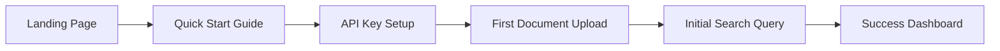
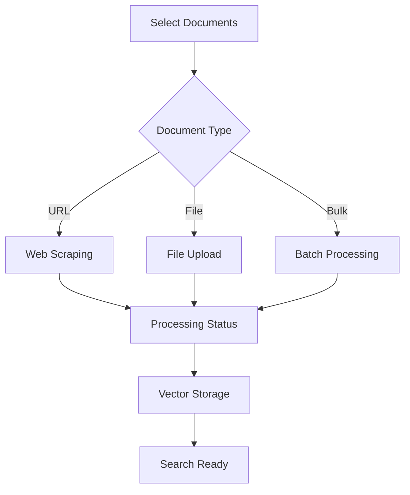
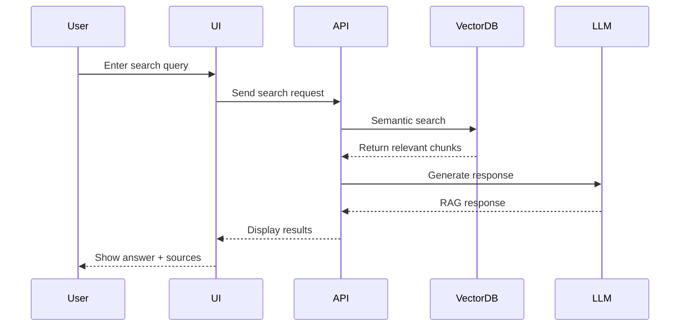

# E2E Testing Strategy & Implementation Plan

## Overview
Comprehensive end-to-end testing strategy for the AI Docs Vector DB Hybrid Scraper, focusing on user workflows, portfolio presentation validation, and cross-browser compatibility.

## 1. User Workflow Testing Strategy

### 1.1 Core User Journeys

#### A. New User Onboarding Flow (<2 minutes)


**Test Scenarios:**
- [ ] Landing page loads in <3s
- [ ] Quick start guide accessible and clear
- [ ] API key validation and storage
- [ ] Document upload interface intuitive
- [ ] First search returns results <5s
- [ ] Success metrics displayed correctly

#### B. Document Ingestion Workflow


**Test Scenarios:**
- [ ] Single URL scraping workflow
- [ ] Multi-file upload (PDF, MD, TXT)
- [ ] Bulk URL list processing
- [ ] Progress indicators accurate
- [ ] Error handling for failed documents
- [ ] Completion notifications

#### C. Vector Search & RAG Interaction


**Test Scenarios:**
- [ ] Search query submission
- [ ] Real-time search suggestions
- [ ] Result relevance validation
- [ ] Source attribution display
- [ ] Follow-up question handling
- [ ] Context preservation

### 1.2 Playwright Automation Framework

```python
# tests/e2e/test_user_workflows.py
import pytest
from playwright.sync_api import Page, expect

class TestUserWorkflows:
    """E2E tests for core user workflows"""
    
    @pytest.fixture(autouse=True)
    def setup(self, page: Page):
        """Navigate to application before each test"""
        page.goto("http://localhost:8000")
        yield
        # Cleanup after test if needed
    
    def test_new_user_onboarding(self, page: Page):
        """Test complete onboarding flow completes in <2 minutes"""
        # Start timer
        start_time = page.evaluate("Date.now()")
        
        # Click get started
        page.click("button:has-text('Get Started')")
        
        # Fill API key
        page.fill("input[name='api_key']", "test-api-key")
        page.click("button:has-text('Save')")
        
        # Upload first document
        page.set_input_files("input[type='file']", "tests/fixtures/sample.pdf")
        page.click("button:has-text('Upload')")
        
        # Wait for processing
        page.wait_for_selector("text=Processing complete", timeout=30000)
        
        # Perform first search
        page.fill("input[name='search']", "test query")
        page.press("input[name='search']", "Enter")
        
        # Verify results appear
        expect(page.locator(".search-results")).to_be_visible()
        
        # Check completion time
        end_time = page.evaluate("Date.now()")
        duration_ms = end_time - start_time
        assert duration_ms < 120000  # <2 minutes
    
    def test_document_ingestion_workflow(self, page: Page):
        """Test document upload and processing pipeline"""
        # Test URL scraping
        page.click("button:has-text('Add URL')")
        page.fill("input[name='url']", "https://example.com/docs")
        page.click("button:has-text('Scrape')")
        
        # Verify progress indicator
        progress = page.locator(".progress-bar")
        expect(progress).to_be_visible()
        
        # Wait for completion
        page.wait_for_selector("text=Document ready for search")
        
        # Verify in document list
        expect(page.locator("text=example.com/docs")).to_be_visible()
```

## 2. Portfolio Presentation Validation

### 2.1 Demo Effectiveness Testing

```yaml
# tests/e2e/demo_scenarios.yml
demo_scenarios:
  technical_showcase:
    - name: "Live RAG Demo"
      steps:
        - Navigate to demo page
        - Upload technical documentation
        - Ask complex technical question
        - Verify accurate response with sources
      success_criteria:
        - Response time <3s
        - Sources correctly cited
        - Answer technically accurate
    
  performance_showcase:
    - name: "Scalability Demo"
      steps:
        - Load 1000+ document corpus
        - Execute parallel searches
        - Monitor response times
      success_criteria:
        - P95 latency <500ms
        - No errors under load
        - UI remains responsive
  
  integration_showcase:
    - name: "Multi-Source Integration"
      steps:
        - Add various document sources
        - Perform cross-source search
        - Demonstrate unified results
      success_criteria:
        - All sources searchable
        - Results properly ranked
        - Source attribution clear
```

### 2.2 Responsive Design Testing

```python
# tests/e2e/test_responsive_design.py
class TestResponsiveDesign:
    """Test responsive design across devices"""
    
    VIEWPORTS = [
        {"name": "mobile", "width": 375, "height": 667},
        {"name": "tablet", "width": 768, "height": 1024},
        {"name": "desktop", "width": 1920, "height": 1080},
    ]
    
    @pytest.mark.parametrize("viewport", VIEWPORTS)
    def test_responsive_layout(self, page: Page, viewport):
        """Test layout adapts to different viewports"""
        page.set_viewport_size(
            width=viewport["width"], 
            height=viewport["height"]
        )
        page.goto("http://localhost:8000")
        
        # Take screenshot for visual regression
        page.screenshot(
            path=f"tests/screenshots/{viewport['name']}-layout.png"
        )
        
        # Verify key elements visible
        expect(page.locator(".navbar")).to_be_visible()
        expect(page.locator(".search-bar")).to_be_visible()
        
        # Mobile-specific checks
        if viewport["name"] == "mobile":
            # Verify hamburger menu
            expect(page.locator(".mobile-menu")).to_be_visible()
            # Verify stacked layout
            search_bar = page.locator(".search-bar")
            expect(search_bar).to_have_css("width", "100%")
```

### 2.3 Accessibility Compliance

```python
# tests/e2e/test_accessibility.py
from playwright_axe import Axe

class TestAccessibility:
    """WCAG compliance testing"""
    
    def test_wcag_compliance(self, page: Page):
        """Test for WCAG 2.1 Level AA compliance"""
        page.goto("http://localhost:8000")
        
        # Initialize axe
        axe = Axe(page)
        axe.inject()
        
        # Run accessibility scan
        results = axe.run()
        
        # Assert no violations
        assert len(results["violations"]) == 0, \
            f"Found {len(results['violations'])} accessibility violations"
    
    def test_keyboard_navigation(self, page: Page):
        """Test complete keyboard navigation"""
        page.goto("http://localhost:8000")
        
        # Tab through interface
        page.keyboard.press("Tab")
        focused = page.evaluate("document.activeElement.tagName")
        assert focused == "INPUT"  # Search bar
        
        # Continue tabbing through all interactive elements
        interactive_elements = page.locator("button, a, input, select")
        count = interactive_elements.count()
        
        for i in range(count):
            page.keyboard.press("Tab")
            # Verify focus visible
            focused_elem = page.evaluate("document.activeElement")
            assert focused_elem is not None
```

## 3. Browser & Platform Testing Framework

### 3.1 Cross-Browser Compatibility

```python
# tests/e2e/conftest.py
import pytest
from playwright.sync_api import sync_playwright

BROWSERS = ["chromium", "firefox", "webkit"]

@pytest.fixture(params=BROWSERS)
def cross_browser(request):
    """Fixture for cross-browser testing"""
    with sync_playwright() as p:
        browser = getattr(p, request.param).launch()
        context = browser.new_context()
        page = context.new_page()
        yield page
        context.close()
        browser.close()

# tests/e2e/test_cross_browser.py
class TestCrossBrowser:
    """Cross-browser compatibility tests"""
    
    def test_core_functionality(self, cross_browser):
        """Test core features work across all browsers"""
        page = cross_browser
        page.goto("http://localhost:8000")
        
        # Test search functionality
        page.fill("input[name='search']", "test query")
        page.press("input[name='search']", "Enter")
        
        # Verify results load
        page.wait_for_selector(".search-results", timeout=10000)
        results = page.locator(".search-result-item")
        assert results.count() > 0
```

### 3.2 Performance Testing

```python
# tests/e2e/test_performance.py
class TestPerformance:
    """Performance testing across environments"""
    
    def test_page_load_performance(self, page: Page):
        """Test page load performance metrics"""
        # Enable performance metrics
        page.goto("http://localhost:8000")
        
        # Get performance metrics
        metrics = page.evaluate("""
            () => {
                const perf = window.performance;
                return {
                    domContentLoaded: perf.timing.domContentLoadedEventEnd - 
                                     perf.timing.navigationStart,
                    loadComplete: perf.timing.loadEventEnd - 
                                 perf.timing.navigationStart,
                    firstPaint: perf.getEntriesByType('paint')[0]?.startTime || 0,
                    firstContentfulPaint: perf.getEntriesByType('paint')[1]?.startTime || 0
                };
            }
        """)
        
        # Assert performance thresholds
        assert metrics["domContentLoaded"] < 1500  # <1.5s
        assert metrics["loadComplete"] < 3000      # <3s
        assert metrics["firstContentfulPaint"] < 1000  # <1s
    
    def test_search_response_time(self, page: Page):
        """Test search response time under load"""
        page.goto("http://localhost:8000")
        
        # Measure search response time
        start = page.evaluate("Date.now()")
        page.fill("input[name='search']", "complex technical query")
        page.press("input[name='search']", "Enter")
        page.wait_for_selector(".search-results")
        end = page.evaluate("Date.now()")
        
        response_time = end - start
        assert response_time < 3000  # <3s response time
```

### 3.3 Visual Regression Testing

```python
# tests/e2e/test_visual_regression.py
import pytest
from pathlib import Path

class TestVisualRegression:
    """Visual regression testing"""
    
    PAGES = [
        "/",
        "/search",
        "/documents",
        "/settings",
        "/demo"
    ]
    
    @pytest.mark.parametrize("page_path", PAGES)
    def test_visual_consistency(self, page: Page, page_path):
        """Test visual consistency across pages"""
        page.goto(f"http://localhost:8000{page_path}")
        
        # Wait for page to stabilize
        page.wait_for_load_state("networkidle")
        
        # Take screenshot
        screenshot_path = Path(f"tests/screenshots/current{page_path.replace('/', '-')}.png")
        page.screenshot(path=str(screenshot_path))
        
        # Compare with baseline (using external tool like pixelmatch)
        # This is a placeholder - integrate with visual regression tool
        baseline_path = Path(f"tests/screenshots/baseline{page_path.replace('/', '-')}.png")
        
        if baseline_path.exists():
            # Compare screenshots
            # assert images_match(baseline_path, screenshot_path)
            pass
```

## 4. UX Quality Validation Framework

### 4.1 Minimum Delight Quality Gates

```python
# tests/e2e/test_ux_quality.py
class TestUXQuality:
    """UX quality validation tests"""
    
    def test_core_flow_completion_time(self, page: Page):
        """Test core flows complete in <2 minutes"""
        workflows = [
            self._test_document_upload_flow,
            self._test_search_and_filter_flow,
            self._test_rag_interaction_flow
        ]
        
        for workflow in workflows:
            start = page.evaluate("Date.now()")
            workflow(page)
            duration = page.evaluate("Date.now()") - start
            assert duration < 120000  # <2 minutes
    
    def test_error_message_quality(self, page: Page):
        """Test error messages are helpful and actionable"""
        # Trigger various error conditions
        test_cases = [
            {
                "action": lambda p: p.fill("input[name='url']", "invalid-url"),
                "expected": "Please enter a valid URL"
            },
            {
                "action": lambda p: p.set_input_files(
                    "input[type='file']", 
                    "tests/fixtures/corrupted.pdf"
                ),
                "expected": "Unable to process file. Please check the file format"
            }
        ]
        
        for test in test_cases:
            page.goto("http://localhost:8000")
            test["action"](page)
            error_msg = page.locator(".error-message")
            expect(error_msg).to_contain_text(test["expected"])
            # Verify error includes actionable guidance
            expect(error_msg).to_have_class(/actionable/)
    
    def test_app_responsiveness(self, page: Page):
        """Test app feels responsive and polished"""
        page.goto("http://localhost:8000")
        
        # Test instant feedback on interactions
        button = page.locator("button:has-text('Search')")
        button.click()
        
        # Should show loading state immediately
        loading = page.locator(".loading-indicator")
        expect(loading).to_be_visible()
        
        # Animations should be smooth
        page.evaluate("""
            () => {
                const animations = document.getAnimations();
                return animations.every(a => a.playbackRate === 1);
            }
        """)
```

### 4.2 User Journey Validation

```yaml
# tests/e2e/user_journeys.yml
user_journeys:
  first_time_user:
    persona: "Technical Recruiter"
    goal: "Evaluate candidate's AI/ML expertise"
    steps:
      - Visit landing page
      - View demo video
      - Try live demo
      - Upload sample documents
      - Ask technical questions
      - Review responses
    success_metrics:
      - Understands value prop <30s
      - Completes demo <5min
      - Gets accurate responses
      - Sees clear attribution
  
  returning_user:
    persona: "Developer"
    goal: "Search internal documentation"
    steps:
      - Quick login
      - Search recent docs
      - Filter by date/type
      - Ask follow-up questions
    success_metrics:
      - Login <3s
      - Search results <1s
      - Context preserved
      - Relevant results
```

## 5. Test Execution Strategy

### 5.1 CI/CD Integration

```yaml
# .github/workflows/e2e-tests.yml
name: E2E Tests

on:
  pull_request:
  push:
    branches: [main]

jobs:
  e2e-tests:
    runs-on: ubuntu-latest
    strategy:
      matrix:
        browser: [chromium, firefox, webkit]
    
    steps:
      - uses: actions/checkout@v3
      
      - name: Setup Python
        uses: actions/setup-python@v4
        with:
          python-version: '3.11'
      
      - name: Install dependencies
        run: |
          pip install uv
          uv pip install -e ".[test]"
          playwright install ${{ matrix.browser }}
      
      - name: Start application
        run: |
          docker-compose up -d
          ./scripts/wait-for-healthy.sh
      
      - name: Run E2E tests
        run: |
          uv run pytest tests/e2e \
            --browser=${{ matrix.browser }} \
            --screenshot=only-on-failure \
            --video=retain-on-failure
      
      - name: Upload artifacts
        if: failure()
        uses: actions/upload-artifact@v3
        with:
          name: e2e-artifacts-${{ matrix.browser }}
          path: |
            tests/screenshots/
            tests/videos/
```

### 5.2 Test Data Management

```python
# tests/e2e/fixtures/test_data.py
from dataclasses import dataclass
from typing import List

@dataclass
class TestDocument:
    """Test document for E2E testing"""
    title: str
    content: str
    url: str
    doc_type: str

TEST_DOCUMENTS = [
    TestDocument(
        title="AI/ML Best Practices",
        content="Comprehensive guide to AI/ML implementation...",
        url="https://example.com/ai-ml-guide",
        doc_type="technical"
    ),
    TestDocument(
        title="System Architecture",
        content="Microservices architecture patterns...",
        url="https://example.com/architecture",
        doc_type="architecture"
    )
]

@dataclass
class TestUser:
    """Test user personas"""
    email: str
    role: str
    use_case: str

TEST_USERS = [
    TestUser(
        email="recruiter@example.com",
        role="Technical Recruiter",
        use_case="Evaluate candidate expertise"
    ),
    TestUser(
        email="developer@example.com",
        role="Senior Developer",
        use_case="Search internal documentation"
    )
]
```

## 6. Monitoring & Reporting

### 6.1 Test Metrics Dashboard

```python
# tests/e2e/reporting/metrics.py
from dataclasses import dataclass
from datetime import datetime
from typing import List, Dict

@dataclass
class TestMetrics:
    """E2E test execution metrics"""
    test_name: str
    duration_ms: int
    browser: str
    status: str
    timestamp: datetime
    performance_metrics: Dict[str, float]

class E2EMetricsCollector:
    """Collect and report E2E test metrics"""
    
    def __init__(self):
        self.metrics: List[TestMetrics] = []
    
    def add_metric(self, metric: TestMetrics):
        """Add test metric"""
        self.metrics.append(metric)
    
    def generate_report(self) -> Dict:
        """Generate test execution report"""
        return {
            "total_tests": len(self.metrics),
            "passed": len([m for m in self.metrics if m.status == "passed"]),
            "failed": len([m for m in self.metrics if m.status == "failed"]),
            "avg_duration": sum(m.duration_ms for m in self.metrics) / len(self.metrics),
            "browser_breakdown": self._browser_breakdown(),
            "performance_summary": self._performance_summary()
        }
    
    def _browser_breakdown(self) -> Dict:
        """Breakdown by browser"""
        breakdown = {}
        for metric in self.metrics:
            if metric.browser not in breakdown:
                breakdown[metric.browser] = {"passed": 0, "failed": 0}
            breakdown[metric.browser][metric.status] += 1
        return breakdown
    
    def _performance_summary(self) -> Dict:
        """Performance metrics summary"""
        perf_metrics = {}
        for metric in self.metrics:
            for key, value in metric.performance_metrics.items():
                if key not in perf_metrics:
                    perf_metrics[key] = []
                perf_metrics[key].append(value)
        
        # Calculate percentiles
        summary = {}
        for key, values in perf_metrics.items():
            values.sort()
            summary[key] = {
                "p50": values[len(values) // 2],
                "p95": values[int(len(values) * 0.95)],
                "p99": values[int(len(values) * 0.99)]
            }
        return summary
```

## 7. Implementation Checklist

### Phase 1: Foundation (Week 1)
- [ ] Set up Playwright infrastructure
- [ ] Create base test fixtures and page objects
- [ ] Implement core user workflow tests
- [ ] Set up CI/CD pipeline

### Phase 2: Expansion (Week 2)
- [ ] Add cross-browser testing
- [ ] Implement visual regression tests
- [ ] Add accessibility testing
- [ ] Create performance benchmarks

### Phase 3: Portfolio Focus (Week 3)
- [ ] Implement demo scenario tests
- [ ] Add portfolio presentation validation
- [ ] Create UX quality gates
- [ ] Set up monitoring dashboard

### Phase 4: Maintenance (Ongoing)
- [ ] Regular test maintenance
- [ ] Update baselines
- [ ] Expand test coverage
- [ ] Performance optimization

## 8. Success Metrics

### Technical Metrics
- **Test Coverage**: >80% of user journeys
- **Execution Time**: <15 minutes for full suite
- **Reliability**: <1% flaky test rate
- **Cross-Browser**: 100% feature parity

### UX Metrics
- **Onboarding**: <2 minutes to first value
- **Search Speed**: <3s response time
- **Error Recovery**: 100% graceful handling
- **Accessibility**: WCAG 2.1 Level AA compliant

### Portfolio Metrics
- **Demo Impact**: Clear value proposition in <30s
- **Technical Depth**: Showcases advanced capabilities
- **Performance**: Handles realistic load scenarios
- **Polish**: Professional, responsive interface

## Conclusion

This comprehensive E2E testing strategy ensures the AI Docs Vector DB Hybrid Scraper delivers a polished, professional experience that effectively demonstrates technical capabilities while maintaining high quality standards across all user journeys and platforms.