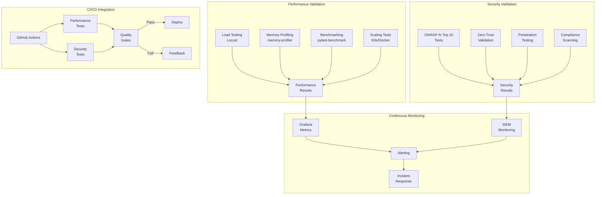
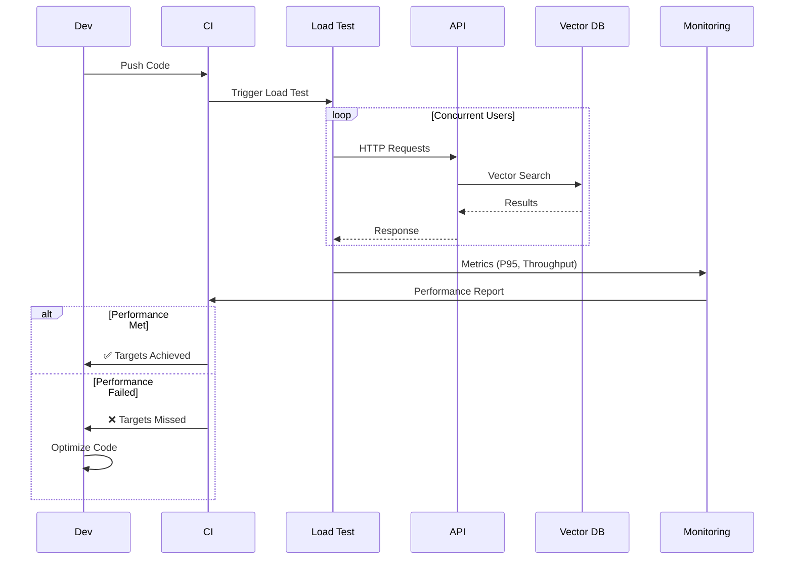
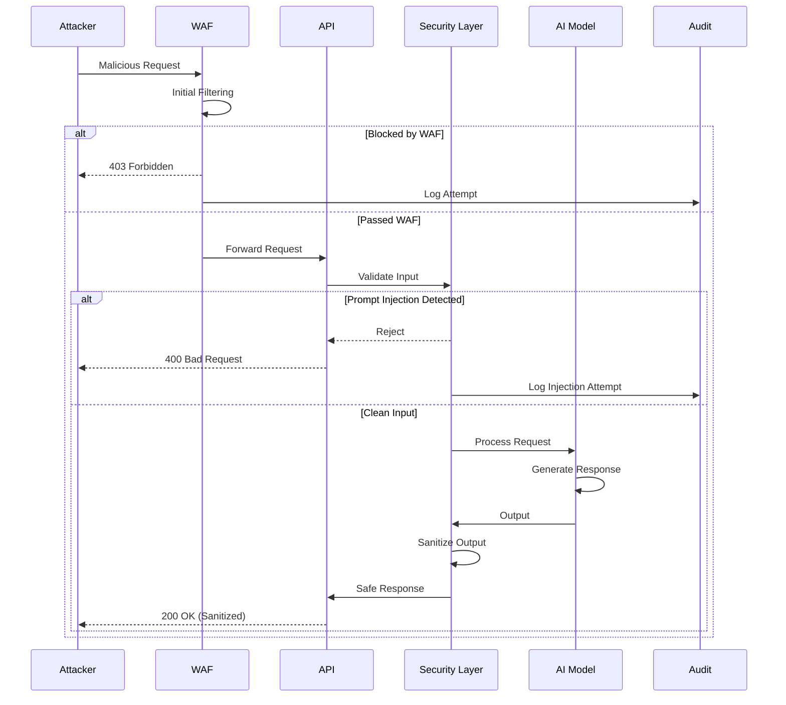
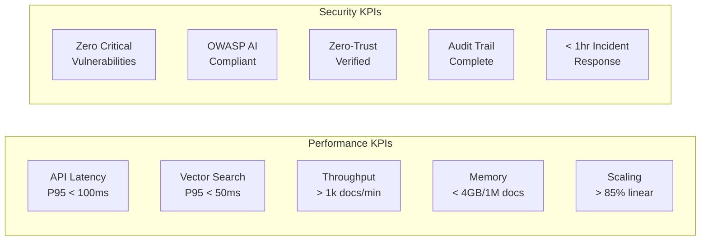
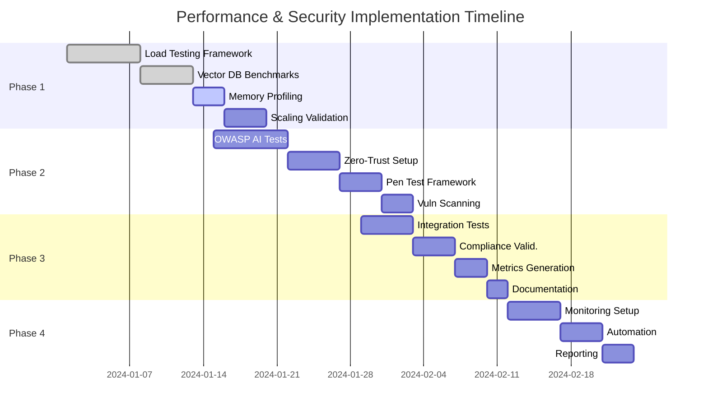
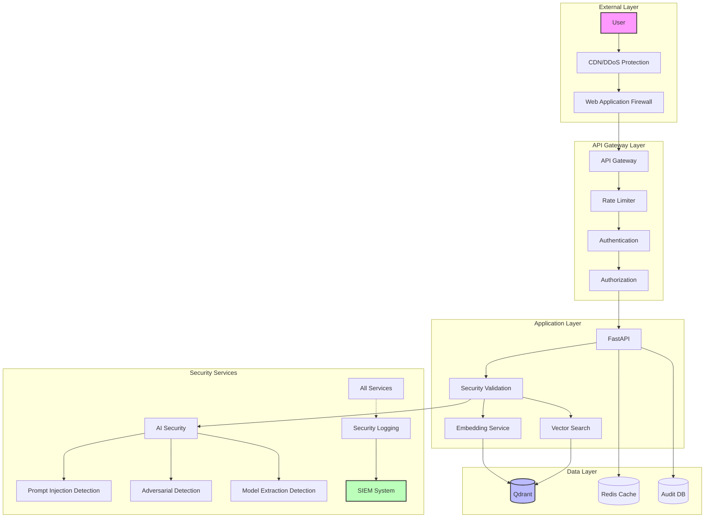
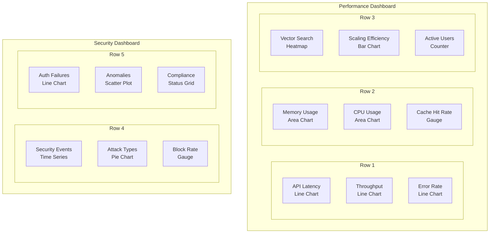
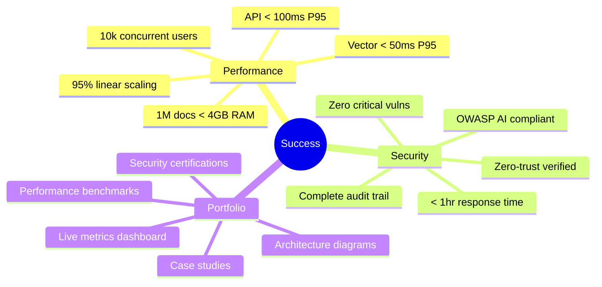

# Performance & Security Validation Architecture

## System Overview

## Performance Testing Flow

## Security Testing Flow

## Key Performance Indicators

## Implementation Phases

## Security Architecture

## Test Coverage Matrix

| Component | Unit Tests | Integration Tests | Performance Tests | Security Tests |
|-----------|------------|------------------|-------------------|----------------|
| API Endpoints | ✅ 95% | ✅ 90% | ✅ Load/Stress | ✅ OWASP/Fuzzing |
| Vector Search | ✅ 90% | ✅ 85% | ✅ Latency/Scale | ✅ Injection |
| Embeddings | ✅ 85% | ✅ 80% | ✅ Throughput | ✅ Adversarial |
| Authentication | ✅ 100% | ✅ 95% | ✅ Token Perf | ✅ Bypass Tests |
| Cache Layer | ✅ 90% | ✅ 85% | ✅ Hit Rate | ✅ Poisoning |
| Database | ✅ 80% | ✅ 90% | ✅ Query Perf | ✅ SQL Injection |

## Monitoring Dashboard Layout

## Success Criteria Summary

