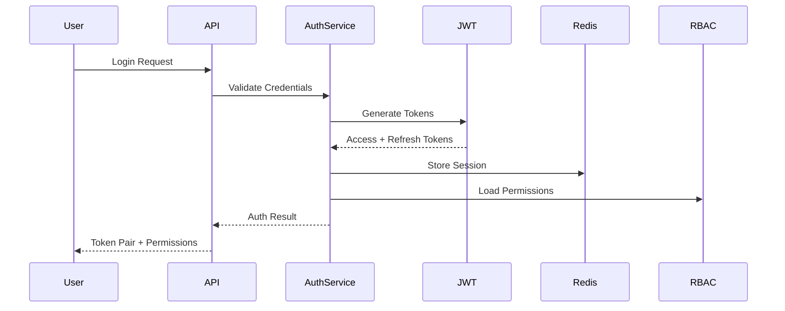

# Security Implementation Plan - Enterprise-Grade Security Framework

**Status:** In Progress  
**Phase:** P4 - Security Implementation  
**Target:** OWASP AI Top 10 Compliance with Zero-Trust Architecture

## Executive Summary

This document outlines the implementation of an enterprise-grade security framework for the AI Documentation Vector DB Hybrid Scraper. The implementation follows OWASP AI Top 10 compliance requirements while maintaining a library-first approach for minimal maintenance overhead.

## Current Security State Analysis

### Existing Security Infrastructure

1. **Security Middleware (SecurityMiddleware)**
   - Distributed rate limiting with Redis backend
   - Basic input validation and sanitization
   - Security headers management
   - Request/response logging
   - Attack detection patterns

2. **AI Security Validator (AISecurityValidator)**
   - Prompt injection detection with 50+ patterns
   - Content filtering and sanitization
   - Metadata security validation
   - Token limit enforcement
   - Threat level classification system

3. **Security Configuration (SecurityConfig)**
   - Pydantic-based configuration
   - Environment variable support
   - Rate limiting configuration
   - CORS settings
   - JWT placeholders (not implemented)

### Security Gaps Identified

1. **Authentication & Authorization**
   - No JWT implementation despite config placeholders
   - No RBAC system
   - No API key management
   - No session management

2. **Data Protection**
   - No encryption at rest implementation
   - No PII detection/masking
   - No key management system
   - No data retention policies

3. **AI/ML Security (OWASP AI Top 10)**
   - Limited prompt injection prevention (LLM01)
   - No output validation for XSS (LLM02)
   - No model access controls (LLM10)
   - No confidence scoring (LLM09)

4. **Security Monitoring**
   - Basic logging without centralized SIEM
   - No real-time threat detection
   - Limited audit trail capabilities

## Implementation Strategy

### Phase 1: Authentication & Authorization (Week 1)

#### 1.1 JWT-Based Authentication System

```python
# src/services/security/auth/jwt_manager.py
"""
JWT token management with refresh token support
- Access token generation (15 min expiry)
- Refresh token generation (7 day expiry)
- Token validation and decoding
- Token revocation support
- Secure key rotation
"""

# src/services/security/auth/models.py
"""
Authentication models:
- UserCredentials
- TokenPair (access + refresh)
- TokenClaims
- AuthenticationResult
"""
```

#### 1.2 Role-Based Access Control (RBAC)

```python
# src/services/security/rbac/roles.py
"""
Role definitions:
- ADMIN: Full system access
- OPERATOR: Operational access
- ANALYST: Read and query access
- API_USER: API-only access
"""

# src/services/security/rbac/permissions.py
"""
Permission matrix:
- Resource-based permissions
- Action-based permissions
- Dynamic permission evaluation
"""
```

#### 1.3 API Key Management

```python
# src/services/security/api_keys/manager.py
"""
API key lifecycle:
- Key generation with scoping
- Key rotation
- Usage tracking
- Rate limit per key
"""
```

#### 1.4 Session Management

```python
# src/services/security/sessions/redis_store.py
"""
Redis-backed session store:
- Session creation/validation
- Session timeout management
- Concurrent session limits
- Session activity tracking
"""
```

### Phase 2: Security Framework Enhancement (Week 2)

#### 2.1 Enhanced Security Middleware

```python
# src/services/security/middleware/enhanced.py
"""
Enhancements:
- JWT validation integration
- RBAC enforcement
- API key validation
- Session validation
- Request signing
"""
```

#### 2.2 Rate Limiting Enhancements

```python
# src/services/security/rate_limiting/advanced.py
"""
Advanced rate limiting:
- User-based limits
- API key-based limits
- Endpoint-specific limits
- Adaptive rate limiting
- DDoS protection
"""
```

#### 2.3 Input Validation Framework

```python
# src/services/security/validation/framework.py
"""
Comprehensive validation:
- Schema-based validation
- Content type validation
- File upload validation
- Query parameter sanitization
"""
```

#### 2.4 Audit Logging System

```python
# src/services/security/audit/logger.py
"""
Security audit logging:
- Authentication events
- Authorization decisions
- Data access logs
- Configuration changes
- Security violations
"""
```

### Phase 3: Data Protection (Week 3)

#### 3.1 Encryption at Rest

```python
# src/services/security/encryption/data_encryption.py
"""
Data encryption:
- AES-256-GCM encryption
- Field-level encryption
- Database encryption
- File encryption
"""
```

#### 3.2 PII Detection and Masking

```python
# src/services/security/pii/detector.py
"""
PII detection using:
- Regex patterns
- NER models
- Custom classifiers
"""

# src/services/security/pii/masker.py
"""
PII masking strategies:
- Redaction
- Tokenization
- Format-preserving encryption
"""
```

#### 3.3 Key Management System

```python
# src/services/security/kms/manager.py
"""
Key management:
- Master key generation
- Key derivation
- Key rotation schedule
- Hardware security module support
"""
```

#### 3.4 Data Retention Policies

```python
# src/services/security/retention/policy_engine.py
"""
Retention automation:
- Policy definition
- Automated deletion
- Compliance reporting
- Audit trail preservation
"""
```

### Phase 4: AI/ML Security - OWASP AI Top 10 (Week 4)

#### 4.1 Enhanced Prompt Injection Prevention (LLM01)

```python
# src/services/security/ai/prompt_guard.py
"""
Advanced prompt protection:
- Multi-layer validation
- Semantic analysis
- Context isolation
- Prompt sanitization
- Anomaly detection
"""
```

#### 4.2 Output Validation System (LLM02)

```python
# src/services/security/ai/output_validator.py
"""
Output security:
- XSS prevention
- Content filtering
- Response sanitization
- Format validation
"""
```

#### 4.3 Model Access Control (LLM10)

```python
# src/services/security/ai/model_access.py
"""
Model security:
- User-based access control
- Rate limiting per model
- Usage tracking
- Model versioning control
"""
```

#### 4.4 Confidence Scoring System (LLM09)

```python
# src/services/security/ai/confidence_scoring.py
"""
Output confidence:
- Uncertainty quantification
- Threshold-based filtering
- Confidence reporting
- Low-confidence alerts
"""
```

## Implementation Details

### Authentication Flow



### Security Middleware Stack

```python
# Middleware execution order
app.add_middleware(SecurityHeadersMiddleware)
app.add_middleware(RateLimitMiddleware)
app.add_middleware(AuthenticationMiddleware)
app.add_middleware(AuthorizationMiddleware)
app.add_middleware(InputValidationMiddleware)
app.add_middleware(AuditLoggingMiddleware)
app.add_middleware(AISecurityMiddleware)
```

### Database Schema Updates

```sql
-- Users table
CREATE TABLE users (
    id UUID PRIMARY KEY DEFAULT gen_random_uuid(),
    username VARCHAR(255) UNIQUE NOT NULL,
    email VARCHAR(255) UNIQUE NOT NULL,
    password_hash VARCHAR(255) NOT NULL,
    role_id UUID REFERENCES roles(id),
    is_active BOOLEAN DEFAULT true,
    created_at TIMESTAMP DEFAULT CURRENT_TIMESTAMP,
    updated_at TIMESTAMP DEFAULT CURRENT_TIMESTAMP
);

-- Roles table
CREATE TABLE roles (
    id UUID PRIMARY KEY DEFAULT gen_random_uuid(),
    name VARCHAR(50) UNIQUE NOT NULL,
    description TEXT,
    permissions JSONB NOT NULL,
    created_at TIMESTAMP DEFAULT CURRENT_TIMESTAMP
);

-- API Keys table
CREATE TABLE api_keys (
    id UUID PRIMARY KEY DEFAULT gen_random_uuid(),
    key_hash VARCHAR(255) UNIQUE NOT NULL,
    user_id UUID REFERENCES users(id),
    name VARCHAR(255),
    scopes JSONB,
    rate_limit INTEGER,
    expires_at TIMESTAMP,
    last_used_at TIMESTAMP,
    created_at TIMESTAMP DEFAULT CURRENT_TIMESTAMP
);

-- Audit Logs table
CREATE TABLE audit_logs (
    id UUID PRIMARY KEY DEFAULT gen_random_uuid(),
    user_id UUID REFERENCES users(id),
    action VARCHAR(100) NOT NULL,
    resource_type VARCHAR(100),
    resource_id VARCHAR(255),
    details JSONB,
    ip_address INET,
    user_agent TEXT,
    created_at TIMESTAMP DEFAULT CURRENT_TIMESTAMP
);

-- Sessions table (Redis-backed, schema for reference)
-- Key: session:{session_id}
-- Value: {
--   user_id: UUID,
--   created_at: timestamp,
--   expires_at: timestamp,
--   ip_address: string,
--   user_agent: string,
--   permissions: array
-- }
```

### Configuration Updates

```python
# src/config/security/enhanced_config.py

class EnhancedSecurityConfig(SecurityConfig):
    """Enhanced security configuration."""
    
    # JWT Configuration
    jwt_access_expiration: int = 900  # 15 minutes
    jwt_refresh_expiration: int = 604800  # 7 days
    jwt_algorithm: str = "RS256"  # Use RSA for better security
    jwt_public_key_path: str = "/secrets/jwt/public.pem"
    jwt_private_key_path: str = "/secrets/jwt/private.pem"
    
    # Session Configuration
    session_timeout: int = 3600  # 1 hour
    max_concurrent_sessions: int = 5
    session_extend_on_activity: bool = True
    
    # RBAC Configuration
    default_role: str = "API_USER"
    admin_emails: list[str] = []
    
    # API Key Configuration
    api_key_length: int = 32
    api_key_prefix: str = "sk_"
    api_key_hash_algorithm: str = "sha256"
    
    # PII Configuration
    pii_detection_enabled: bool = True
    pii_masking_enabled: bool = True
    pii_retention_days: int = 90
    
    # AI Security Configuration
    ai_confidence_threshold: float = 0.7
    ai_output_max_length: int = 10000
    ai_prompt_max_complexity: int = 100
    
    # Encryption Configuration
    encryption_algorithm: str = "AES-256-GCM"
    key_rotation_days: int = 90
    use_hsm: bool = False
    
    # Monitoring Configuration
    security_monitoring_enabled: bool = True
    alert_on_critical_threats: bool = True
    siem_endpoint: str | None = None
```

## Testing Strategy

### Security Test Suite

```python
# tests/security/test_authentication.py
"""
Test coverage:
- JWT generation/validation
- Token expiration
- Refresh token flow
- Invalid token handling
"""

# tests/security/test_authorization.py
"""
Test coverage:
- RBAC enforcement
- Permission evaluation
- Role inheritance
- Access denial scenarios
"""

# tests/security/test_ai_security.py
"""
Test coverage:
- Prompt injection prevention
- Output validation
- Confidence scoring
- Model access control
"""

# tests/security/test_data_protection.py
"""
Test coverage:
- Encryption/decryption
- PII detection accuracy
- Key rotation
- Data retention
"""
```

### Security Scanning Integration

```yaml
# .github/workflows/security.yml
name: Security Scanning
on: [push, pull_request]

jobs:
  security:
    runs-on: ubuntu-latest
    steps:
      - uses: actions/checkout@v3
      
      - name: Run Bandit
        run: |
          uv pip install bandit
          bandit -r src/ -f json -o bandit-report.json
          
      - name: Run Safety
        run: |
          uv pip install safety
          safety check --json > safety-report.json
          
      - name: OWASP Dependency Check
        uses: dependency-check/Dependency-Check_Action@main
        
      - name: AI Security Validation
        run: |
          uv run pytest tests/security/test_ai_security.py -v
```

## Monitoring & Alerting

### Security Metrics

```python
# src/services/security/metrics.py
"""
Key security metrics:
- Authentication success/failure rates
- Authorization denial rates
- Rate limit violations
- Prompt injection attempts
- PII detection counts
- Encryption operations
- Key rotation status
"""
```

### Alert Configuration

```yaml
# monitoring/alerts/security.yml
alerts:
  - name: HighAuthenticationFailureRate
    condition: auth_failure_rate > 0.1
    severity: warning
    
  - name: PromptInjectionDetected
    condition: prompt_injection_count > 0
    severity: critical
    
  - name: RateLimitViolation
    condition: rate_limit_violations > 100
    severity: warning
    
  - name: KeyRotationOverdue
    condition: days_since_rotation > 90
    severity: critical
```

## Deployment Considerations

### Environment Variables

```bash
# .env.production
# JWT Configuration
JWT_PRIVATE_KEY_PATH=/secrets/jwt/private.pem
JWT_PUBLIC_KEY_PATH=/secrets/jwt/public.pem

# Database Encryption
DB_ENCRYPTION_KEY=/secrets/db/master.key

# API Security
API_RATE_LIMIT=1000
API_BURST_FACTOR=1.5

# AI Security
AI_CONFIDENCE_THRESHOLD=0.7
AI_MAX_PROMPT_LENGTH=10000

# Monitoring
SIEM_ENDPOINT=https://siem.company.com/api/events
ALERT_WEBHOOK=https://alerts.company.com/security
```

### Secret Management

```yaml
# kubernetes/secrets.yaml
apiVersion: v1
kind: Secret
metadata:
  name: security-secrets
type: Opaque
data:
  jwt-private-key: <base64-encoded-private-key>
  jwt-public-key: <base64-encoded-public-key>
  db-encryption-key: <base64-encoded-key>
  api-master-key: <base64-encoded-key>
```

## Success Metrics

### Quantitative Metrics
- Zero security vulnerabilities in production
- 100% OWASP AI Top 10 compliance
- <100ms authentication latency
- >99.9% authentication service uptime
- <0.1% false positive rate for threat detection

### Qualitative Metrics
- All authentication flows operational
- Security monitoring dashboard active
- Audit trail complete and searchable
- Incident response procedures tested
- Security documentation complete

## Risk Mitigation

### Implementation Risks
1. **Complexity Risk**: Mitigated by phased implementation
2. **Performance Risk**: Mitigated by caching and optimization
3. **Integration Risk**: Mitigated by comprehensive testing
4. **Migration Risk**: Mitigated by backward compatibility

### Security Risks
1. **Zero-Day Vulnerabilities**: Mitigated by defense in depth
2. **Insider Threats**: Mitigated by audit logging
3. **Supply Chain**: Mitigated by dependency scanning
4. **AI-Specific**: Mitigated by OWASP AI compliance

## Next Steps

1. **Week 1**: Implement authentication & authorization
2. **Week 2**: Enhance security framework
3. **Week 3**: Implement data protection
4. **Week 4**: Complete AI/ML security
5. **Week 5**: Testing and validation
6. **Week 6**: Production deployment

## Conclusion

This security implementation plan provides a comprehensive roadmap for achieving enterprise-grade security with OWASP AI Top 10 compliance. The phased approach ensures manageable implementation while maintaining the project's library-first philosophy for minimal maintenance overhead.