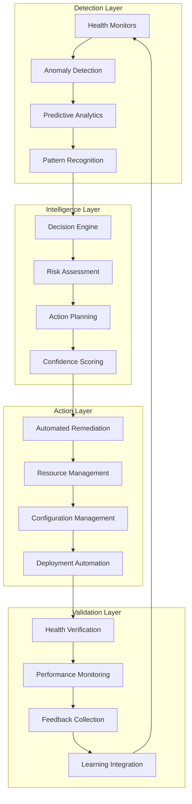

# Self-Healing Infrastructure Architecture Design

## Overview

This document provides a comprehensive architectural design for implementing self-healing infrastructure that achieves 90% manual intervention reduction through intelligent automation, predictive maintenance, and closed-loop remediation systems.

## Architecture Principles

### Core Design Principles
1. **Autonomous Operation**: Systems should operate independently with minimal human intervention
2. **Predictive Intelligence**: Proactive issue detection and prevention over reactive responses
3. **Graduated Automation**: Progressive automation with safety controls and human oversight
4. **Closed-Loop Feedback**: Continuous learning and improvement from system behavior
5. **Resilience by Design**: Built-in fault tolerance and graceful degradation
6. **Observable Everything**: Comprehensive monitoring and tracing for all system components

## High-Level Architecture



## Detailed Component Architecture

### 1. Detection Layer

#### Health Monitoring System
```python
class HealthMonitoringSystem:
    """Comprehensive health monitoring with multi-dimensional checks."""
    
    def __init__(self):
        self.monitors = {
            'infrastructure': InfrastructureMonitor(),
            'application': ApplicationMonitor(),
            'dependencies': DependencyMonitor(),
            'security': SecurityMonitor(),
            'performance': PerformanceMonitor()
        }
        
        self.aggregator = HealthAggregator()
        self.alerting = IntelligentAlerting()
    
    async def continuous_monitoring(self):
        """Run continuous health monitoring across all dimensions."""
        while True:
            health_data = {}
            
            for monitor_name, monitor in self.monitors.items():
                try:
                    health_data[monitor_name] = await monitor.check_health()
                except Exception as e:
                    logger.error(f"Monitor {monitor_name} failed: {e}")
                    health_data[monitor_name] = {'status': 'error', 'error': str(e)}
            
            # Aggregate and analyze health data
            aggregated_health = await self.aggregator.aggregate(health_data)
            
            # Generate intelligent alerts
            await self.alerting.process_health_data(aggregated_health)
            
            await asyncio.sleep(self.monitoring_interval)
```

#### Anomaly Detection Engine
```python
class AnomalyDetectionEngine:
    """ML-powered anomaly detection with adaptive thresholds."""
    
    def __init__(self):
        self.models = {
            'statistical': StatisticalAnomalyDetector(),
            'ml_based': MLAnomalyDetector(),
            'time_series': TimeSeriesAnomalyDetector(),
            'correlation': CorrelationAnomalyDetector()
        }
        
        self.ensemble = AnomalyEnsemble(self.models)
        self.threshold_adapter = AdaptiveThresholdManager()
    
    async def detect_anomalies(self, metrics_data):
        """Detect anomalies using ensemble of detection methods."""
        anomalies = []
        
        for detector_name, detector in self.models.items():
            detector_anomalies = await detector.detect(metrics_data)
            
            for anomaly in detector_anomalies:
                anomaly['detector'] = detector_name
                anomaly['confidence'] = detector.confidence_score(anomaly)
                anomalies.append(anomaly)
        
        # Use ensemble to reduce false positives
        consensus_anomalies = await self.ensemble.consensus_detection(anomalies)
        
        # Adapt thresholds based on historical accuracy
        await self.threshold_adapter.update_thresholds(consensus_anomalies)
        
        return consensus_anomalies
```

#### Predictive Analytics Engine
```python
class PredictiveAnalyticsEngine:
    """Advanced predictive analytics for failure prevention."""
    
    def __init__(self):
        self.models = {
            'failure_prediction': FailurePredictionModel(),
            'capacity_prediction': CapacityPredictionModel(),
            'performance_prediction': PerformancePredictionModel(),
            'security_risk_prediction': SecurityRiskModel()
        }
        
        self.feature_store = FeatureStore()
        self.model_manager = ModelManager()
    
    async def predict_issues(self, prediction_horizon_hours=24):
        """Predict potential issues within specified time horizon."""
        features = await self.feature_store.get_latest_features()
        predictions = {}
        
        for model_name, model in self.models.items():
            try:
                prediction = await model.predict(features, prediction_horizon_hours)
                predictions[model_name] = {
                    'probability': prediction.probability,
                    'confidence': prediction.confidence,
                    'time_to_event': prediction.time_to_event,
                    'contributing_factors': prediction.factors,
                    'recommended_actions': prediction.recommendations
                }
            except Exception as e:
                logger.error(f"Prediction model {model_name} failed: {e}")
                predictions[model_name] = {'error': str(e)}
        
        return predictions
```

### 2. Intelligence Layer

#### Decision Engine
```python
class IntelligentDecisionEngine:
    """AI-powered decision making for automated remediation."""
    
    def __init__(self):
        self.rule_engine = RuleBasedEngine()
        self.ml_engine = MachineLearningEngine()
        self.risk_assessor = RiskAssessment()
        self.action_planner = ActionPlanner()
        
        self.decision_history = DecisionHistory()
        self.learning_system = ContinuousLearning()
    
    async def make_decision(self, incident_data, context):
        """Make intelligent decision on remediation action."""
        # Get rule-based recommendation
        rule_recommendation = await self.rule_engine.evaluate(incident_data)
        
        # Get ML-based recommendation
        ml_recommendation = await self.ml_engine.predict_action(incident_data, context)
        
        # Assess risk of potential actions
        risk_assessment = await self.risk_assessor.assess_actions([
            rule_recommendation, ml_recommendation
        ])
        
        # Plan comprehensive action
        action_plan = await self.action_planner.create_plan(
            incident_data, [rule_recommendation, ml_recommendation], risk_assessment
        )
        
        # Calculate confidence and make final decision
        decision = await self._make_final_decision(action_plan)
        
        # Record decision for learning
        await self.decision_history.record(incident_data, decision)
        
        return decision
    
    async def _make_final_decision(self, action_plan):
        """Make final decision based on action plan and confidence."""
        if action_plan.confidence > 0.8 and action_plan.risk_score < 0.3:
            return Decision(
                action='auto_execute',
                plan=action_plan,
                confidence=action_plan.confidence,
                rationale=action_plan.rationale
            )
        elif action_plan.confidence > 0.6 and action_plan.risk_score < 0.5:
            return Decision(
                action='recommend_with_approval',
                plan=action_plan,
                confidence=action_plan.confidence,
                rationale=f"Moderate confidence: {action_plan.rationale}"
            )
        else:
            return Decision(
                action='escalate_to_human',
                plan=action_plan,
                confidence=action_plan.confidence,
                rationale=f"Low confidence or high risk: {action_plan.rationale}"
            )
```

#### Risk Assessment System
```python
class RiskAssessmentSystem:
    """Comprehensive risk assessment for automated actions."""
    
    def __init__(self):
        self.risk_calculators = {
            'blast_radius': BlastRadiusCalculator(),
            'business_impact': BusinessImpactCalculator(),
            'technical_risk': TechnicalRiskCalculator(),
            'compliance_risk': ComplianceRiskCalculator(),
            'rollback_risk': RollbackRiskCalculator()
        }
        
        self.risk_aggregator = RiskAggregator()
        self.risk_policy = RiskPolicy()
    
    async def assess_action_risk(self, action, context):
        """Assess comprehensive risk of proposed action."""
        risk_scores = {}
        
        for risk_type, calculator in self.risk_calculators.items():
            try:
                risk_score = await calculator.calculate(action, context)
                risk_scores[risk_type] = risk_score
            except Exception as e:
                logger.error(f"Risk calculator {risk_type} failed: {e}")
                risk_scores[risk_type] = {'score': 1.0, 'error': str(e)}
        
        # Aggregate all risk scores
        aggregated_risk = await self.risk_aggregator.aggregate(risk_scores)
        
        # Apply risk policy
        risk_decision = await self.risk_policy.evaluate(aggregated_risk)
        
        return RiskAssessment(
            overall_score=aggregated_risk.overall_score,
            category_scores=risk_scores,
            risk_level=aggregated_risk.risk_level,
            policy_decision=risk_decision,
            mitigation_strategies=aggregated_risk.mitigations
        )
```

### 3. Action Layer

#### Automated Remediation System
```python
class AutomatedRemediationSystem:
    """Intelligent automated remediation with safety controls."""
    
    def __init__(self):
        self.remediation_engines = {
            'infrastructure': InfrastructureRemediationEngine(),
            'application': ApplicationRemediationEngine(),
            'configuration': ConfigurationRemediationEngine(),
            'security': SecurityRemediationEngine(),
            'network': NetworkRemediationEngine()
        }
        
        self.safety_controls = SafetyControlSystem()
        self.rollback_manager = RollbackManager()
        self.execution_monitor = ExecutionMonitor()
    
    async def execute_remediation(self, decision, incident_data):
        """Execute remediation action with comprehensive safety controls."""
        # Pre-execution safety checks
        safety_check = await self.safety_controls.pre_execution_check(decision)
        if not safety_check.approved:
            return RemediationResult(
                status='blocked',
                reason=safety_check.reason,
                safety_check=safety_check
            )
        
        # Create rollback plan
        rollback_plan = await self.rollback_manager.create_rollback_plan(decision)
        
        # Execute remediation
        execution_id = generate_execution_id()
        
        try:
            # Start monitoring
            await self.execution_monitor.start_monitoring(execution_id)
            
            # Execute the remediation
            remediation_engine = self.remediation_engines[decision.category]
            result = await remediation_engine.execute(decision.action_plan)
            
            # Validate execution
            validation_result = await self._validate_execution(result, incident_data)
            
            if validation_result.success:
                return RemediationResult(
                    status='success',
                    execution_id=execution_id,
                    result=result,
                    validation=validation_result
                )
            else:
                # Execution failed validation, rollback
                await self.rollback_manager.execute_rollback(rollback_plan)
                return RemediationResult(
                    status='failed_validation',
                    execution_id=execution_id,
                    result=result,
                    validation=validation_result,
                    rollback_executed=True
                )
                
        except Exception as e:
            # Execution failed, attempt rollback
            await self.rollback_manager.execute_rollback(rollback_plan)
            return RemediationResult(
                status='execution_failed',
                execution_id=execution_id,
                error=str(e),
                rollback_executed=True
            )
        
        finally:
            await self.execution_monitor.stop_monitoring(execution_id)
```

#### Dynamic Resource Management
```python
class DynamicResourceManager:
    """Intelligent resource management with predictive scaling."""
    
    def __init__(self):
        self.resource_controllers = {
            'compute': ComputeResourceController(),
            'storage': StorageResourceController(),
            'network': NetworkResourceController(),
            'memory': MemoryResourceController()
        }
        
        self.predictor = ResourceUsagePredictor()
        self.optimizer = ResourceOptimizer()
        self.cost_analyzer = CostAnalyzer()
    
    async def optimize_resources(self):
        """Continuously optimize resource allocation based on predictions."""
        while True:
            try:
                # Predict resource needs
                predictions = await self.predictor.predict_usage(horizon_hours=4)
                
                # Get current resource state
                current_state = await self._get_current_resource_state()
                
                # Optimize resource allocation
                optimization_plan = await self.optimizer.optimize(
                    current_state, predictions
                )
                
                # Analyze cost impact
                cost_impact = await self.cost_analyzer.analyze_impact(optimization_plan)
                
                # Execute optimizations if beneficial
                if cost_impact.net_benefit > 0:
                    await self._execute_optimization(optimization_plan)
                
            except Exception as e:
                logger.error(f"Resource optimization failed: {e}")
            
            await asyncio.sleep(300)  # Run every 5 minutes
```

### 4. Validation Layer

#### Health Verification System
```python
class HealthVerificationSystem:
    """Post-action health verification and validation."""
    
    def __init__(self):
        self.health_checkers = {
            'functional': FunctionalHealthChecker(),
            'performance': PerformanceHealthChecker(),
            'security': SecurityHealthChecker(),
            'integration': IntegrationHealthChecker()
        }
        
        self.sla_monitor = SLAMonitor()
        self.regression_detector = RegressionDetector()
    
    async def verify_system_health(self, baseline_metrics, action_taken):
        """Comprehensive health verification after remediation action."""
        verification_results = {}
        
        # Run all health checks
        for checker_name, checker in self.health_checkers.items():
            verification_results[checker_name] = await checker.verify_health(
                baseline_metrics, action_taken
            )
        
        # Check SLA compliance
        sla_status = await self.sla_monitor.check_compliance()
        verification_results['sla_compliance'] = sla_status
        
        # Detect any regressions
        regressions = await self.regression_detector.detect_regressions(
            baseline_metrics, await self._get_current_metrics()
        )
        verification_results['regressions'] = regressions
        
        # Calculate overall health score
        overall_score = self._calculate_overall_health_score(verification_results)
        
        return HealthVerificationResult(
            overall_score=overall_score,
            detailed_results=verification_results,
            passed=overall_score > 0.8,
            issues=self._extract_issues(verification_results)
        )
```

#### Continuous Learning System
```python
class ContinuousLearningSystem:
    """Learn from system behavior and improve decision making."""
    
    def __init__(self):
        self.feedback_collector = FeedbackCollector()
        self.pattern_analyzer = PatternAnalyzer()
        self.model_updater = ModelUpdater()
        self.knowledge_base = KnowledgeBase()
    
    async def learn_from_incident(self, incident, actions_taken, outcomes):
        """Learn from incident resolution to improve future decisions."""
        # Collect detailed feedback
        feedback = await self.feedback_collector.collect_feedback(
            incident, actions_taken, outcomes
        )
        
        # Analyze patterns
        patterns = await self.pattern_analyzer.analyze_incident_patterns(
            incident, feedback
        )
        
        # Update models based on learning
        await self.model_updater.update_models(patterns, feedback)
        
        # Update knowledge base
        await self.knowledge_base.update_knowledge(
            incident, actions_taken, outcomes, patterns
        )
        
        # Generate insights for operational team
        insights = await self._generate_insights(patterns, feedback)
        
        return LearningResult(
            patterns_identified=patterns,
            models_updated=self.model_updater.updated_models,
            knowledge_added=self.knowledge_base.recent_additions,
            insights=insights
        )
```

## Integration Architecture

### Event-Driven Architecture
```python
class SelfHealingOrchestrator:
    """Main orchestrator for self-healing infrastructure."""
    
    def __init__(self):
        # Core components
        self.detection_layer = DetectionLayer()
        self.intelligence_layer = IntelligenceLayer()
        self.action_layer = ActionLayer()
        self.validation_layer = ValidationLayer()
        
        # Event system
        self.event_bus = EventBus()
        self.event_processors = {
            'health_issue': HealthIssueProcessor(),
            'anomaly_detected': AnomalyProcessor(),
            'prediction_alert': PredictionProcessor(),
            'remediation_complete': RemediationProcessor()
        }
        
        # State management
        self.state_manager = StateManager()
        self.coordination_engine = CoordinationEngine()
    
    async def start_self_healing_system(self):
        """Start the complete self-healing system."""
        # Initialize all layers
        await self.detection_layer.start()
        await self.intelligence_layer.start()
        await self.action_layer.start()
        await self.validation_layer.start()
        
        # Start event processing
        await self.event_bus.start()
        
        # Register event processors
        for event_type, processor in self.event_processors.items():
            await self.event_bus.register_processor(event_type, processor)
        
        # Start coordination engine
        await self.coordination_engine.start()
        
        logger.info("Self-healing infrastructure system started successfully")
    
    async def handle_incident(self, incident):
        """Main incident handling workflow."""
        try:
            # 1. Assess and classify incident
            classification = await self.intelligence_layer.classify_incident(incident)
            
            # 2. Make decision on remediation
            decision = await self.intelligence_layer.make_decision(incident, classification)
            
            # 3. Execute remediation if approved
            if decision.action in ['auto_execute', 'recommend_with_approval']:
                remediation_result = await self.action_layer.execute_remediation(
                    decision, incident
                )
                
                # 4. Validate results
                validation_result = await self.validation_layer.verify_remediation(
                    incident, decision, remediation_result
                )
                
                # 5. Learn from the experience
                await self.validation_layer.learn_from_incident(
                    incident, decision, remediation_result, validation_result
                )
                
                return SelfHealingResult(
                    incident=incident,
                    decision=decision,
                    remediation=remediation_result,
                    validation=validation_result,
                    status='completed'
                )
            
            else:
                # Escalate to human
                await self._escalate_to_human(incident, decision)
                return SelfHealingResult(
                    incident=incident,
                    decision=decision,
                    status='escalated'
                )
                
        except Exception as e:
            logger.error(f"Self-healing incident handling failed: {e}")
            await self._emergency_fallback(incident, str(e))
            return SelfHealingResult(
                incident=incident,
                status='failed',
                error=str(e)
            )
```

## Deployment Architecture

### Kubernetes-Native Implementation
```yaml
# Self-Healing Infrastructure Deployment
apiVersion: v1
kind: Namespace
metadata:
  name: self-healing-system
---
apiVersion: apps/v1
kind: Deployment
metadata:
  name: self-healing-orchestrator
  namespace: self-healing-system
spec:
  replicas: 3
  selector:
    matchLabels:
      app: self-healing-orchestrator
  template:
    metadata:
      labels:
        app: self-healing-orchestrator
    spec:
      containers:
      - name: orchestrator
        image: self-healing/orchestrator:latest
        resources:
          requests:
            memory: "512Mi"
            cpu: "250m"
          limits:
            memory: "1Gi"
            cpu: "500m"
        env:
        - name: DETECTION_INTERVAL
          value: "30"
        - name: CONFIDENCE_THRESHOLD
          value: "0.8"
        - name: RISK_THRESHOLD
          value: "0.3"
---
apiVersion: v1
kind: Service
metadata:
  name: self-healing-orchestrator
  namespace: self-healing-system
spec:
  selector:
    app: self-healing-orchestrator
  ports:
  - port: 8080
    targetPort: 8080
```

### Monitoring and Observability
```yaml
# Prometheus monitoring for self-healing system
apiVersion: monitoring.coreos.com/v1
kind: ServiceMonitor
metadata:
  name: self-healing-monitor
  namespace: self-healing-system
spec:
  selector:
    matchLabels:
      app: self-healing-orchestrator
  endpoints:
  - port: metrics
    interval: 30s
    path: /metrics
---
# Grafana dashboard for self-healing metrics
apiVersion: v1
kind: ConfigMap
metadata:
  name: self-healing-dashboard
  namespace: self-healing-system
data:
  dashboard.json: |
    {
      "dashboard": {
        "title": "Self-Healing Infrastructure",
        "panels": [
          {
            "title": "Incident Detection Rate",
            "type": "graph",
            "targets": [
              {
                "expr": "rate(incidents_detected_total[5m])"
              }
            ]
          },
          {
            "title": "Automated Remediation Success Rate",
            "type": "stat",
            "targets": [
              {
                "expr": "rate(remediations_successful_total[5m]) / rate(remediations_attempted_total[5m])"
              }
            ]
          },
          {
            "title": "Manual Intervention Reduction",
            "type": "gauge",
            "targets": [
              {
                "expr": "1 - (rate(manual_interventions_total[24h]) / rate(incidents_total[24h]))"
              }
            ]
          }
        ]
      }
    }
```

## Security Considerations

### Security-First Design
1. **Principle of Least Privilege**: All automated actions run with minimal required permissions
2. **Action Auditing**: Complete audit trail of all automated decisions and actions
3. **Secure Communication**: All inter-component communication encrypted
4. **Access Controls**: Role-based access control for system configuration
5. **Compliance**: Built-in compliance checking for automated actions

### Security Implementation
```python
class SecurityController:
    """Security controls for self-healing system."""
    
    def __init__(self):
        self.rbac = RoleBasedAccessControl()
        self.audit_logger = AuditLogger()
        self.compliance_checker = ComplianceChecker()
        self.crypto_manager = CryptographyManager()
    
    async def authorize_action(self, action, context):
        """Authorize automated action based on security policies."""
        # Check RBAC permissions
        if not await self.rbac.check_permission(action.actor, action.resource, action.operation):
            return AuthorizationResult(authorized=False, reason="Insufficient permissions")
        
        # Check compliance requirements
        compliance_result = await self.compliance_checker.check_action(action)
        if not compliance_result.compliant:
            return AuthorizationResult(authorized=False, reason=f"Compliance violation: {compliance_result.reason}")
        
        # Log authorization
        await self.audit_logger.log_authorization(action, context)
        
        return AuthorizationResult(authorized=True)
```

## Performance Characteristics

### Expected Performance Metrics
- **Detection Latency**: <30 seconds for critical issues
- **Decision Time**: <5 seconds for automated decisions
- **Remediation Time**: <2 minutes for common issues
- **Recovery Time**: <5 minutes for system recovery
- **Accuracy**: >95% for incident classification
- **False Positive Rate**: <5% for anomaly detection

### Scalability Design
- **Horizontal Scaling**: All components designed for horizontal scaling
- **Event-Driven**: Asynchronous, event-driven architecture for high throughput
- **Resource Efficiency**: Optimized resource usage with dynamic scaling
- **Multi-Tenant**: Support for multiple environments and applications

## Implementation Timeline

### Phase 1: Foundation (Months 1-3)
- Deploy basic monitoring and health checking
- Implement simple automated restarts and recovery
- Establish event-driven architecture
- Create basic decision engine with rule-based logic

### Phase 2: Intelligence (Months 4-6)
- Deploy ML-based anomaly detection
- Implement predictive failure detection
- Add risk assessment capabilities
- Begin automated remediation for low-risk scenarios

### Phase 3: Advanced Automation (Months 7-9)
- Full automated remediation system
- Dynamic resource management
- Advanced learning and adaptation
- Comprehensive security controls

### Phase 4: Optimization (Months 10-12)
- Performance optimization and tuning
- Advanced predictive capabilities
- Full closed-loop automation
- Achievement of 90% manual intervention reduction

## Success Criteria

### Technical Success Metrics
- ✅ 90% reduction in manual interventions
- ✅ <1 hour MTTR for 90% of incidents
- ✅ >99.9% system availability
- ✅ <5% false positive rate
- ✅ >95% automated remediation success rate

### Business Success Metrics
- ✅ 25% reduction in operational costs
- ✅ 50% improvement in deployment frequency
- ✅ 75% reduction in unplanned downtime
- ✅ 90% improvement in time-to-resolution

This architecture provides a comprehensive foundation for implementing self-healing infrastructure that achieves the goal of 90% manual intervention reduction while maintaining high reliability, security, and performance standards.